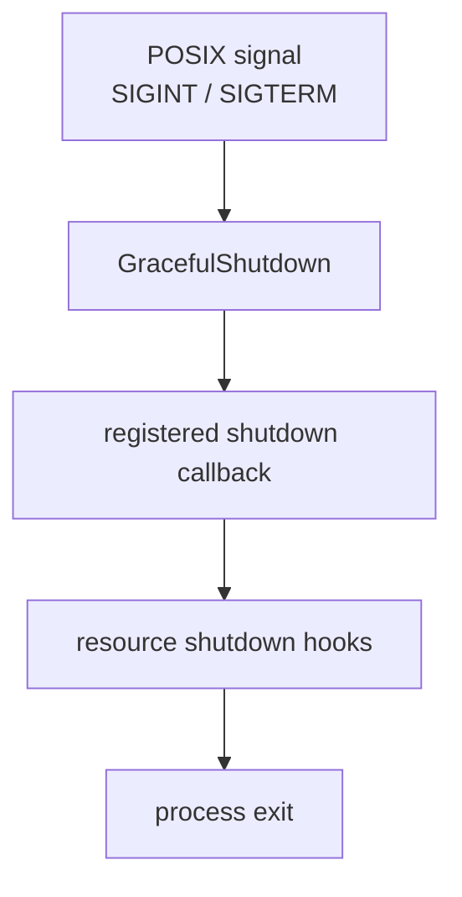
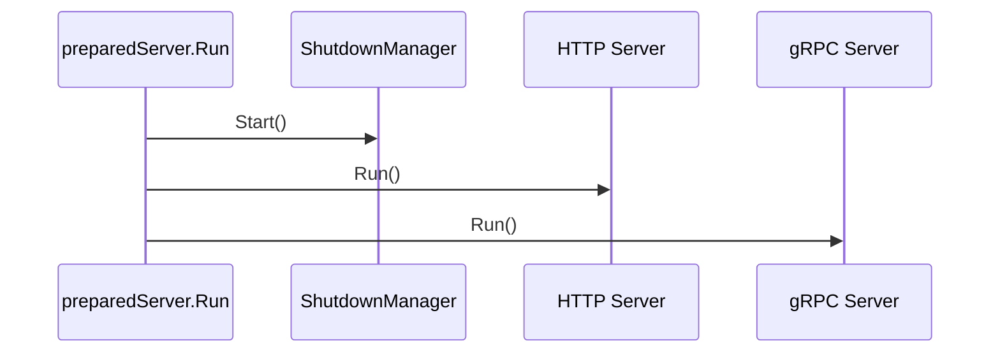
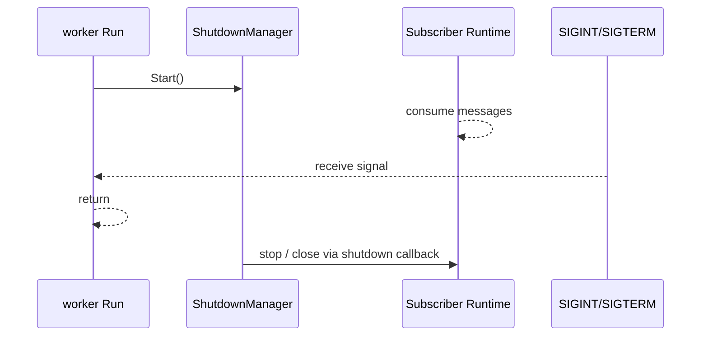

# 优雅关闭与资源释放

**本文回答**：`qs-server` 三个进程收到退出信号后如何停止，哪些资源由谁释放，scheduler、outbox relay、MQ subscriber、gRPC client、HTTP/gRPC server、IAM module、Redis runtime 等关闭顺序是什么。本文只讲运行时生命周期，不讨论业务状态迁移。

---

## 30 秒结论

| 维度 | 结论 |
| ---- | ---- |
| 信号入口 | 三个进程都会创建 `shutdown.GracefulShutdown` 并注册 `posixsignal` shutdown manager |
| apiserver | 先取消后台 runtime，再清理 container/IAM/DB，最后关闭 HTTP 和 gRPC |
| collection-server | 关闭 gRPC client manager、Redis/database、authz sync、IAM、container，最后关闭 HTTP |
| qs-worker | 停 subscriber、关 gRPC manager、关 Redis/database、停 metrics、清理 container |
| 后台任务停止 | apiserver scheduler/outbox relay 通过 `processruntime.Lifecycle` 中的 cancel hook 停止 |
| 关键边界 | worker 没有业务 HTTP 主服务；它的主阻塞点是等待退出信号，实际消费停止依赖 shutdown callback 中的 subscriber stop/close |
| 排障重点 | 退出卡住时按“subscriber / gRPC / DB / metrics / HTTP/gRPC server / background loop”顺序排查 |

---

## 1. 三进程共同机制

三进程都使用同一类运行时骨架：

```text
createServer(cfg)
  -> shutdown.New()
  -> AddShutdownManager(posixsignal.NewPosixSignalManager())
  -> PrepareRun()
  -> register shutdown callback
  -> Run()
```



代码锚点：

| 进程 | root / shutdown manager |
| ---- | ----------------------- |
| apiserver | [`internal/apiserver/process/root.go`](../../internal/apiserver/process/root.go) |
| collection | [`internal/collection-server/process/root.go`](../../internal/collection-server/process/root.go) |
| worker | [`internal/worker/process/root.go`](../../internal/worker/process/root.go) |

共同原则：

1. **PrepareRun 负责注册关闭回调**；
2. **Run 负责启动 shutdown manager 和服务主循环**；
3. **关闭回调负责释放被当前进程持有的资源**；
4. **业务对象不在 shutdown 里补偿状态**，业务补偿应靠 outbox、幂等、scheduler 或 retry 机制完成。

---

## 2. apiserver 关闭顺序

apiserver 的生命周期依赖在 `buildLifecycleDeps` 中从资源、container、integration、transport、runtime 阶段收集：

```text
runtime lifecycle
container cleanup
authz sync subscriber
database manager
HTTP server
gRPC server
```

代码锚点：

- [`internal/apiserver/process/lifecycle.go`](../../internal/apiserver/process/lifecycle.go)
- [`internal/apiserver/process/runtime_bootstrap.go`](../../internal/apiserver/process/runtime_bootstrap.go)
- [`internal/apiserver/process/runner.go`](../../internal/apiserver/process/runner.go)

### 2.1 Run 阶段

apiserver `preparedServer.Run()` 会：

1. 启动 shutdown manager；
2. 打印 HTTP / gRPC 启动日志；
3. 使用 `processruntime.RunGroup` 同时运行 HTTP 和 gRPC 服务。



如果 HTTP 或 gRPC 的 run 返回错误，RunGroup 会把错误向上返回。

### 2.2 后台 runtime 的停止

apiserver 后台 runtime 包括：

- scheduler manager；
- outbox relay loop；
- cache warmup goroutine。

`scheduler` 和 `relay` 在启动时向 `runtimeOutput.lifecycle` 添加 shutdown hook。shutdown 时会先执行：

```text
runPrepareRunShutdownHooks(runtime.lifecycle)
```

这些 hook 的核心是 cancel context。被 cancel 后：

| 后台任务 | 停止方式 |
| -------- | -------- |
| scheduler manager | cancel ctx，runner goroutine 在下一次 select / timer / loop 中退出 |
| outbox relay loop | cancel ctx，ticker loop 退出 |
| cache warmup | 当前实现是启动期 goroutine；失败只 warning，通常不作为长期 loop 管理 |

### 2.3 资源释放顺序

apiserver shutdown callback 当前执行顺序可概括为：

```text
1. 运行 runtime lifecycle hooks
2. container.Cleanup()
3. 停止 authz version sync subscriber
4. 关闭 database manager
5. 关闭 HTTP server
6. 关闭 gRPC server
```

注意这个顺序的含义：

- 先停 scheduler / relay，避免继续产生新后台动作；
- 再清理 container 和外部集成；
- 再关闭数据库连接；
- 最后关闭对外入口。

---

## 3. collection-server 关闭顺序

collection-server 的关闭逻辑在 `internal/collection-server/process/lifecycle.go`。

代码锚点：

- [`internal/collection-server/process/lifecycle.go`](../../internal/collection-server/process/lifecycle.go)
- [`internal/collection-server/process/runner.go`](../../internal/collection-server/process/runner.go)

### 3.1 Run 阶段

collection 只有 HTTP REST server，没有业务 gRPC server。`preparedServer.Run()` 会：

1. 启动 shutdown manager；
2. 启动 HTTP server；
3. 使用 `processruntime.RunGroup` 运行 HTTP。

```text
startShutdown()
  -> RunGroup(http)
```

### 3.2 关闭顺序

collection 的 shutdown hook 组装为：

```text
1. close grpc clients
2. close database
3. stop authz sync
4. close iam
5. cleanup container
6. close HTTP
```

资源解释：

| 资源 | 说明 |
| ---- | ---- |
| gRPC manager | collection 调 apiserver 的客户端连接池 |
| database manager | collection 的 Redis runtime / profiles |
| authz sync | IAM authz version subscriber |
| IAM module | TokenVerifier、ServiceAuthHelper、IAM client |
| container | 应用服务、handler 等运行时状态 |
| HTTP server | 对外 REST 服务 |

注意：collection 的 `SubmitQueue` 是进程内队列。关闭时当前文档不应宣称它具备 drain 能力；其状态快照里的生命周期边界是 `process_memory_no_drain`。也就是说，进程退出时不能把未完成请求写成“会自动转移给其他实例”。

---

## 4. qs-worker 关闭顺序

worker 的关闭逻辑在 `internal/worker/process/lifecycle.go`。

代码锚点：

- [`internal/worker/process/lifecycle.go`](../../internal/worker/process/lifecycle.go)
- [`internal/worker/process/runtime_bootstrap.go`](../../internal/worker/process/runtime_bootstrap.go)

### 4.1 Run 阶段

worker 不启动业务 HTTP server。`preparedServer.Run()` 的主逻辑是：

```text
startShutdown()
  -> 打印 worker started
  -> 等待 SIGINT / SIGTERM
  -> 返回
```

同时，真实的 MQ subscriber 已经在 `initialize runtime` 阶段启动并订阅 handler。



### 4.2 关闭顺序

worker shutdown callback 当前收集并执行：

```text
1. stop subscriber
2. close grpc manager
3. close database
4. shutdown metrics
5. cleanup container
```

| 资源 | 说明 |
| ---- | ---- |
| subscriber | MQ 消费者，先 Stop 再 Close |
| gRPC manager | worker 调 apiserver 的 gRPC client manager |
| database manager | Redis lock runtime/profiles |
| metrics server | worker metrics / governance HTTP |
| container | event dispatcher、handler dependencies 等 |

注意：如果 handler 正在执行，具体是否等待完成取决于底层 subscriber / MQ client 的 Stop/Close 语义。文档不能写成“所有进行中任务必然完成”，只能写成“发起 stop/close 并交给 subscriber runtime 处理”。

---

## 5. 资源所有权矩阵

| 资源 | apiserver | collection | worker | 关闭责任 |
| ---- | --------- | ---------- | ------ | -------- |
| HTTP server | 有 | 有 | 无业务 HTTP；可能有 metrics | 所属进程 |
| gRPC server | 有 | 无 | 无 | apiserver |
| gRPC client manager | 无常规下游 client manager | 有，调 apiserver | 有，调 apiserver | collection / worker |
| MQ publisher | 有 | 无 | 无 | apiserver / messaging runtime |
| MQ subscriber | authz sync 可选 | authz sync 可选 | worker event subscriber | 各自关闭自己的 subscriber |
| Redis runtime | 有 | 有 | 有 | 各自 database manager / runtime |
| MySQL / Mongo | 主业务持有 | 不持有主业务 DB | worker 当前主要持 Redis lock runtime | apiserver 主关闭；worker/collection 关闭自身 manager |
| IAM module | 有 | 有 | 无业务 IAM module | apiserver / collection |
| Scheduler | 有 | 无 | 无 | apiserver runtime lifecycle |
| Outbox relay | 有 | 无 | 无 | apiserver runtime lifecycle |
| SubmitQueue | 无 | 有 | 无 | collection container / 进程退出 |
| Metrics server | HTTP metrics | HTTP/governance | metrics server 可选 | 所属进程 |

---

## 6. 常见误区

### 6.1 “worker 退出会自动完成所有消息”

不准确。worker 会 stop/close subscriber。正在执行或已经 Nack/Ack 的处理语义由 MQ client、handler 幂等和事件重试共同决定。文档应强调幂等、重复抑制和 Ack/Nack，而不是承诺 shutdown 必然完成每条消息。

### 6.2 “collection SubmitQueue 是可持久化队列”

不准确。SubmitQueue 是 collection 进程内 memory channel，状态边界是 `process_memory_no_drain`。它的作用是入口削峰和 202 状态查询，不是 durable queue。

### 6.3 “apiserver 一停，后台任务一定立刻停止”

不准确。shutdown 会 cancel scheduler / relay context，但 goroutine 会在下一次 loop、ticker、timer 或 select 处退出。长时间外部调用可能仍受各自 timeout 控制。

### 6.4 “关闭数据库应该先于停止后台任务”

不应该。后台任务若还在运行就先关数据库，会放大错误。当前 apiserver 设计是先跑 runtime lifecycle hooks，再释放数据库等资源。

---

## 7. 排障路径

### 7.1 进程无法退出

先按进程看：

| 进程 | 重点检查 |
| ---- | -------- |
| apiserver | HTTP/gRPC RunGroup、scheduler goroutine、outbox relay、DB close、gRPC GracefulStop |
| collection | HTTP server、gRPC client close、Redis close、IAM close |
| worker | subscriber Stop/Close、handler 是否阻塞、gRPC client close、metrics shutdown |

### 7.2 退出后还有任务继续跑

优先检查：

1. 是否是另一个实例拿到了 leader lock；
2. 是否 outbox relay 在另一个 apiserver 实例继续补发；
3. 是否 MQ 重新投递给另一个 worker；
4. 是否本进程 goroutine 没有响应 context cancel；
5. 是否日志来自旧进程 PID。

### 7.3 关闭时大量 Nack 或失败日志

优先判断：

1. 是否正在 shutdown；
2. handler 是否被 context cancel；
3. gRPC client 是否已经关闭；
4. apiserver 是否先于 worker 停止导致 internal gRPC 不可达；
5. MQ 重投策略是否正常。

### 7.4 authz sync 关闭失败

apiserver 和 collection 都可能启用 authz version sync subscriber。关闭失败通常不会改变业务主状态，但会影响日志和资源释放。检查：

- IAM authz sync 配置；
- subscriber Stop/Close；
- shutdown 日志中的 hook 名称。

---

## 8. 修改生命周期时的规则

| 修改目标 | 应同步检查 |
| -------- | ---------- |
| 新增 apiserver 后台 loop | 必须注册 runtime lifecycle cancel hook |
| 新增 worker runtime 资源 | 必须加入 `buildLifecycleDeps` 并在 shutdown callback 中关闭 |
| 新增 collection gRPC client /外部 client | 必须放入 client bundle 或 container deps，并增加 close hook |
| 新增 IAM/JWKS/service auth 后台刷新 | 必须在 IAM module Close 中停止 |
| 修改 SubmitQueue | 明确是否仍是 `process_memory_no_drain`，不要误写 durable |
| 修改 metrics / governance server | 必须提供 Shutdown(ctx) 或等价关闭能力 |
| 修改 shutdown 顺序 | 同步更新本文和对应运行时文档 |

---

## 9. 代码锚点

| 类型 | 路径 |
| ---- | ---- |
| apiserver lifecycle | [`internal/apiserver/process/lifecycle.go`](../../internal/apiserver/process/lifecycle.go) |
| apiserver root | [`internal/apiserver/process/root.go`](../../internal/apiserver/process/root.go) |
| apiserver runtime bootstrap | [`internal/apiserver/process/runtime_bootstrap.go`](../../internal/apiserver/process/runtime_bootstrap.go) |
| collection lifecycle | [`internal/collection-server/process/lifecycle.go`](../../internal/collection-server/process/lifecycle.go) |
| collection root | [`internal/collection-server/process/root.go`](../../internal/collection-server/process/root.go) |
| worker lifecycle | [`internal/worker/process/lifecycle.go`](../../internal/worker/process/lifecycle.go) |
| worker root | [`internal/worker/process/root.go`](../../internal/worker/process/root.go) |
| worker runtime bootstrap | [`internal/worker/process/runtime_bootstrap.go`](../../internal/worker/process/runtime_bootstrap.go) |
| collection SubmitQueue | [`internal/collection-server/application/answersheet/submit_queue.go`](../../internal/collection-server/application/answersheet/submit_queue.go) |
| gRPC server close | [`internal/pkg/grpc/server.go`](../../internal/pkg/grpc/server.go) |

---

## 10. Verify

```bash
# process lifecycle / scheduler 相关测试
go test ./internal/apiserver/process/... ./internal/apiserver/runtime/scheduler/...

# collection process 与 submit queue
go test ./internal/collection-server/process/... ./internal/collection-server/application/answersheet

# worker process / messaging
go test ./internal/worker/process/... ./internal/worker/integration/...

# 全量
go test ./...
```

文档检查：

```bash
make docs-hygiene
```

---

## 11. 下一跳

| 继续阅读 | 用途 |
| -------- | ---- |
| [01-qs-apiserver启动与组合根](./01-qs-apiserver启动与组合根.md) | 看 apiserver 启动阶段和后台 runtime 如何挂载 |
| [02-collection-server运行时](./02-collection-server运行时.md) | 看 collection 的 gRPC client 与 SubmitQueue 生命周期 |
| [03-qs-worker运行时](./03-qs-worker运行时.md) | 看 worker subscriber、handler、metrics 的启动与关闭 |
| [06-后台任务与调度](./06-后台任务与调度.md) | 看 scheduler、outbox relay、worker MQ 消费的关系 |
| [03-基础设施/event](../03-基础设施/event/) | 看事件、outbox、Ack/Nack 的基础设施细节 |
