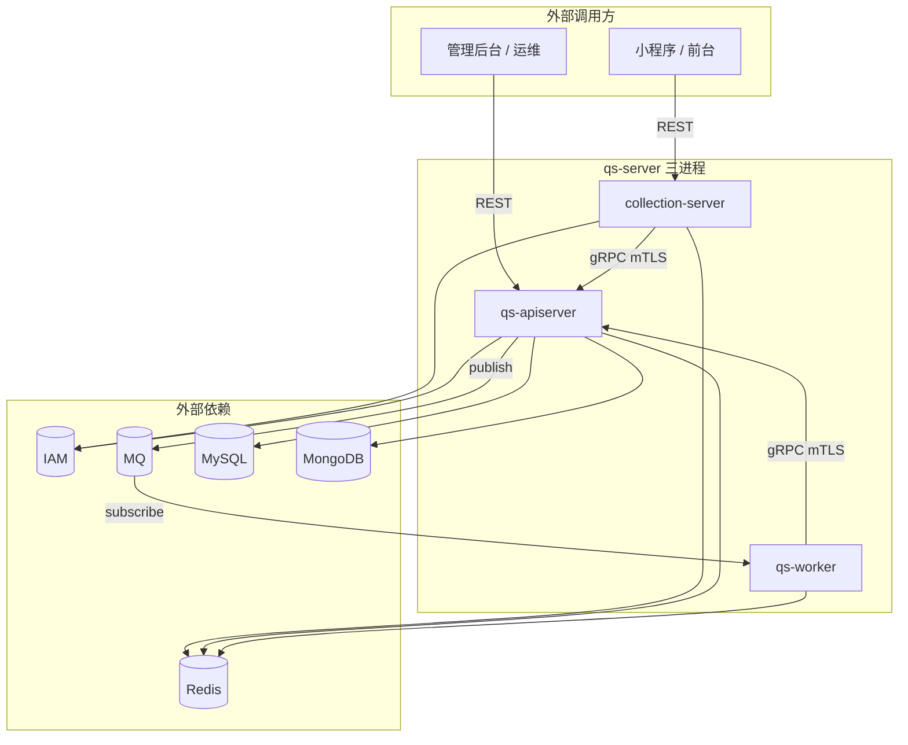
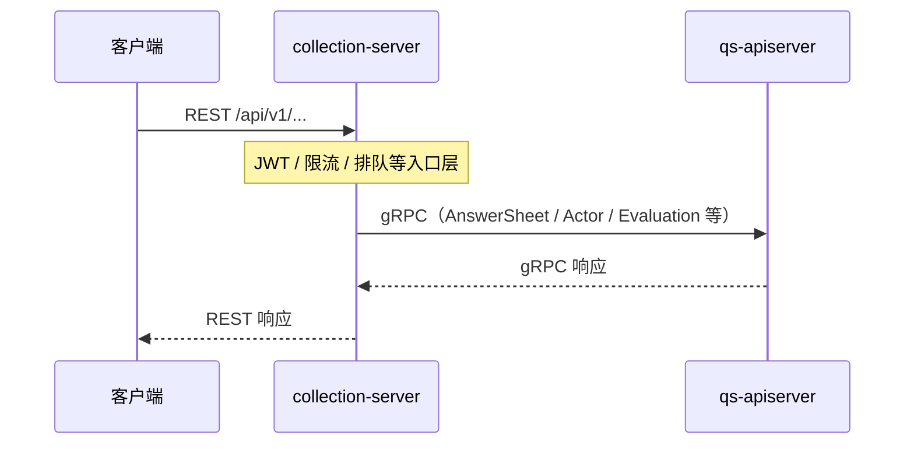
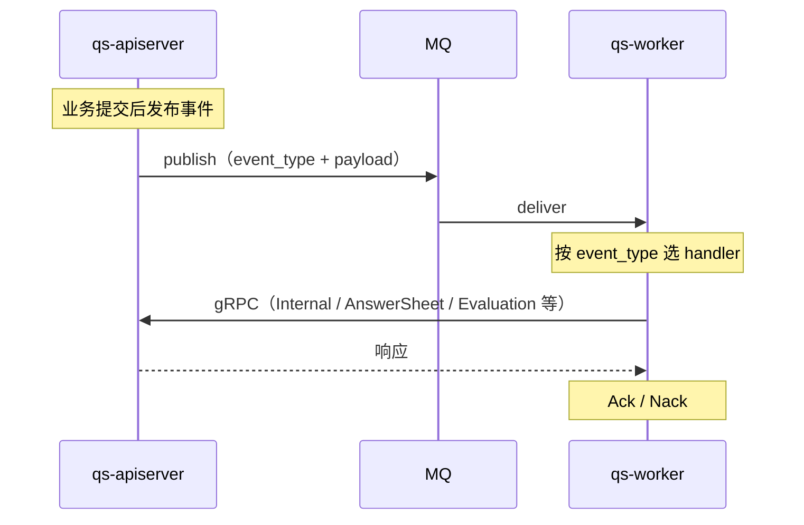

# 运行时

**本文回答**：本组文档解释 `qs-server` 在运行时到底有哪些进程、它们怎么互相调用、同步链路和异步链路分别怎么走，以及这些关系该去哪里继续下钻。

## 30 秒结论

如果只看一屏，先看下面这张表：

| 维度 | 结论 |
| ---- | ---- |
| 进程角色 | `qs-apiserver` 负责主业务状态和对外后台能力；`collection-server` 是前台 BFF；`qs-worker` 负责异步消费与回调 |
| 同步主路径 | 前台通常走 `Client -> collection-server -> gRPC -> qs-apiserver`；后台通常直接 REST 到 `qs-apiserver` |
| 异步主路径 | `qs-apiserver` 发布领域事件到 MQ，`qs-worker` 消费后再通过 gRPC 回调 `qs-apiserver` 执行内部动作 |
| 真值边界 | 运行时图讲“谁调谁、怎么调”；领域规则和聚合边界看 [02-业务模块](../02-业务模块/)；事件/存储/配置机制看 [03-基础设施](../03-基础设施/) |
| 最重要的认识 | worker 是异步执行器，不是第二个主业务服务；主状态仍收口在 `qs-apiserver` |
| 阅读方式 | 先看本文整体图和主链路，再按进程分册下钻内部组件 |

## 重点速查（继续往下读前先记这几条）

1. **三进程分工**：`collection-server` 面向前台入口，`qs-apiserver` 持有主业务写模型，`qs-worker` 负责消费事件并驱动回调。  
2. **两类后台机制**：`Crontab/运维 -> internal REST -> apiserver` 与 `apiserver -> MQ -> worker -> gRPC -> apiserver` 是两条不同链路，不要混读。  
3. **文档边界**：本组优先讲拓扑、时序和组件关系，不替代业务模块的领域说明，也不替代基础设施对事件、存储和配置的机制细节。  
4. **阅读建议**：第一次读先看整体运行图和主链路时序；排障或改造某进程时，再进入本组分册。  

## 为什么这一组要单独存在

运行时文档和业务模块文档解决的不是同一个问题：

- 业务模块先回答“这个模块负责什么、对象怎么组织”
- 运行时先回答“这些模块在哪个进程里跑、谁调谁、消息和 RPC 怎么穿过进程边界”

所以本组优先讲**三进程组件图、调用方向、时序与边界**，不替代 [02-业务模块](../02-业务模块/)（领域与用例）、[03-基础设施](../03-基础设施/)（事件/存储/IAM/配置机制）、[04-接口与运维](../04-接口与运维/)（契约、端口、Crontab）。

## 本组图表怎么读

1. **整体**：先建立「有哪些服务组件、谁依赖谁」——见下文 **「服务组件与整体视图」**。  
2. **示意图 / 时序图**：每篇保留 **结构图**；关键路径补 **sequenceDiagram**（启动、典型请求或异步回调）。  
3. **核心功能与关键点**：用短表回答「这个组件负责什么、排障/扩展时最先看哪几处代码」。  
4. **组件间引用**：明确 **协议**（REST / gRPC / MQ）、**调用方向**、与 [04-进程间通信](./04-进程间通信.md) 对照。  
5. **边界与注意事项**：易混概念（如 BFF vs 主服务、同步 vs 事件）、勿写死的环境差异。

## 服务组件与整体视图

### 运行时服务组件一览

| 组件（进程） | 在系统中的角色 | 对外提供的能力面 | 强依赖的兄弟/外部组件 |
| ------------ | -------------- | ---------------- | ---------------------- |
| **qs-apiserver** | 主业务与状态收口 | 后台 **REST**、**gRPC Server**（含 Internal）、**发 MQ 事件** | MySQL、MongoDB、Redis、IAM SDK、MQ、（被 collection/worker 调用） |
| **collection-server** | 前台 BFF | **REST**（小程序/收集端） | Redis、IAM SDK、**apiserver gRPC** |
| **qs-worker** | 异步执行器 | **无业务 REST**；**消费 MQ** | Redis、MQ、**apiserver gRPC** |
| **（外部）IAM** | 非本仓进程 | 被 apiserver / collection **SDK 调用** | — |
| **（外部）MQ** | 消息中间件 | apiserver **发布**，worker **订阅** | NSQ / RabbitMQ 等（见配置） |

### 整体运行示意图

**要点**：**同步查询/命令**可走 `Client → collection → gRPC → apiserver`；**跨请求异步**走 `apiserver → MQ → worker → gRPC → apiserver`，主状态仍在 **apiserver** 落库。

### 主链路时序

#### 1）前台经 BFF 的同步路径（示意）

#### 2）领域事件驱动的异步路径（示意）

**Verify**：Topic 与 handler 绑定以 [`configs/events.yaml`](../../configs/events.yaml) 为准。

### 组件间引用与方式

| 引用方向 | 方式 | 典型用途 |
| -------- | ---- | -------- |
| collection → apiserver | **gRPC**（客户端证书 + TLS/mTLS） | 前台查询、提交转主服务 |
| worker → apiserver | **gRPC** | 计分、评估、打标签等回调 |
| apiserver → worker | **无直接 RPC** | 仅通过 **MQ** 投递 |
| Client → collection / apiserver | **REST** | 前台 / 后台入口 |
| apiserver / collection → IAM | **SDK（HTTP/gRPC 等，由 iam 配置）** | 验签、身份、监护、服务间 token |
| apiserver → MQ | **Publisher** | 发领域事件 |

更细的矩阵见 [04-进程间通信](./04-进程间通信.md)。

### 本组整体视图的边界与注意事项

- 上图中的 **IAM、MQ、DB** 为逻辑依赖；**具体地址与证书**以 `configs/*.yaml` 与 [04-部署与端口](../04-接口与运维/03-部署与端口.md) 为准。  
- **Crontab 调 apiserver REST** 与 **worker 事件链** 是两类后台，勿混；见 [04-调度与后台任务](../04-接口与运维/04-调度与后台任务.md)。

---

## 与其它文档的分工

| 文档组 | 侧重 |
| ------ | ---- |
| [00-总览](../00-总览/) | 系统地图、主业务叙事、本地 `make` |
| [02-业务模块](../02-业务模块/) | 各 BC 模型、接口与模块内锚点 |
| [03-基础设施](../03-基础设施/) | 事件 YAML、存储、限流、IAM 机制、Options |
| [04-接口与运维](../04-接口与运维/) | 契约文件、端口表、调度脚本 |
| **01-运行时** | **三进程组件视图、交互与时序** |

---

## 分册阅读（各进程内部组件）

| 文档 | 内容侧重 |
| ---- | -------- |
| [01-apiserver](./01-apiserver.md) | 主进程内部：容器模块、双栈、预热、ticker |
| [02-collection-server](./02-collection-server.md) | BFF：中间件、排队、gRPC 下游 |
| [03-worker](./03-worker.md) | 消费：订阅、分发、handler、gRPC 客户端 |
| [05-IAM认证与身份链路](./05-IAM认证与身份链路.md) | 鉴权在**三进程**中的落点（细节配置见 [03-基础设施/04](../03-基础设施/04-IAM与认证.md)） |

---

## 建议阅读顺序

1. **本 README**（含上文 **服务组件与整体视图**）  
2. [04-进程间通信.md](./04-进程间通信.md) — 通信矩阵与跨组件时序  
3. [01-apiserver.md](./01-apiserver.md) → [02-collection-server.md](./02-collection-server.md) → [03-worker.md](./03-worker.md)  
4. [05-IAM认证与身份链路.md](./05-IAM认证与身份链路.md) — 横切鉴权在各组件中的位置  

**事实来源**：[`configs/events.yaml`](../../configs/events.yaml)；REST/proto 见 [api/rest/](../../api/rest/)、[internal/apiserver/interface/grpc/proto](../../internal/apiserver/interface/grpc/proto/)。
