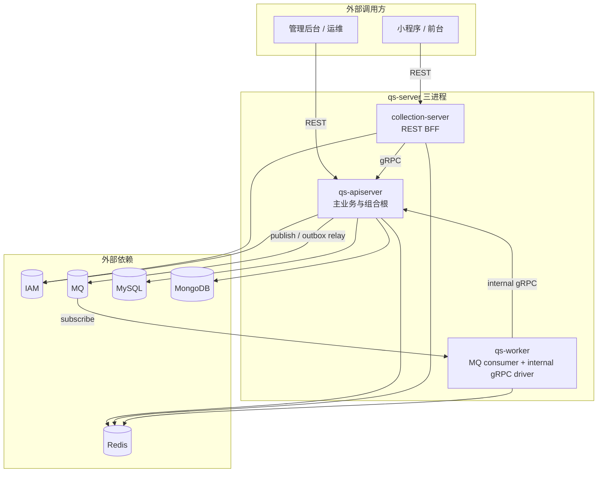

# 运行时（01）

**本文回答**：`01-运行时` 这一组文档如何阅读；它解释 qs-server 三个进程如何启动、如何协作、如何通过 REST/gRPC/MQ 交互、如何接入 IAM、如何执行后台任务，以及如何优雅关闭。业务对象和领域规则不在本组展开，需回到 [02-业务模块](../02-业务模块/)；事件、存储、安全、Redis 等机制细节需回到 [03-基础设施](../03-基础设施/)。

---

## 30 秒结论

| 维度 | 结论 |
| ---- | ---- |
| 本组作用 | 解释运行时拓扑、启动阶段、进程间调用、身份链路、后台任务和 shutdown |
| 核心前提 | `qs-server` 是三进程系统：`qs-apiserver`、`collection-server`、`qs-worker` |
| 主状态位置 | 主业务状态收口在 `qs-apiserver`；collection 是 BFF；worker 是异步执行器 |
| 同步链路 | 前台通常 `Client -> collection-server REST -> apiserver gRPC`；后台可直连 apiserver REST |
| 异步链路 | `apiserver outbox -> MQ -> worker -> internal gRPC -> apiserver` |
| 本组不负责 | 不展开 Survey / Scale / Evaluation / Actor / Plan / Statistics 的领域模型，不维护 REST/OpenAPI 详细契约 |
| 推荐读法 | 先读三进程协作，再按进程读启动文档，最后读 gRPC/IAM/调度/shutdown |

---

## 文档地图

| 顺序 | 文档 | 回答的问题 |
| ---- | ---- | ---------- |
| 1 | [00-三进程协作总览](./00-三进程协作总览.md) | 三个进程分别负责什么、谁调谁、主链路怎么穿过进程边界 |
| 2 | [01-qs-apiserver启动与组合根](./01-qs-apiserver启动与组合根.md) | apiserver 如何初始化资源、container、REST/gRPC、后台 runtime |
| 3 | [02-collection-server运行时](./02-collection-server运行时.md) | collection 如何作为 BFF 接收 REST、做身份/限流/排队、gRPC 调 apiserver |
| 4 | [03-qs-worker运行时](./03-qs-worker运行时.md) | worker 如何加载事件目录、订阅 MQ、派发 handler、internal gRPC 回调 apiserver |
| 5 | [04-进程间调用与gRPC](./04-进程间调用与gRPC.md) | collection/worker 到 apiserver 的 gRPC 调用和 InternalService 边界 |
| 6 | [05-IAM认证与身份链路](./05-IAM认证与身份链路.md) | JWT、TenantScope、AuthzSnapshot、ServiceAuth、mTLS/ACL 在三进程中的位置 |
| 7 | [06-后台任务与调度](./06-后台任务与调度.md) | scheduler、outbox relay、worker MQ 消费、SubmitQueue 如何区分 |
| 8 | [07-优雅关闭与资源释放](./07-优雅关闭与资源释放.md) | 三进程收到退出信号后资源释放顺序是什么 |

---

## 本组与其它目录的边界

| 你想知道 | 先看这里 | 再看哪里 |
| -------- | -------- | -------- |
| 系统整体是什么 | [00-总览/01-系统地图](../00-总览/01-系统地图.md) | 本组 `00-三进程协作总览` |
| 一次答卷如何变报告 | [00-总览/03-核心业务链路](../00-总览/03-核心业务链路.md) | 本组 `04-进程间调用与gRPC`、`06-后台任务与调度` |
| apiserver 怎么装配业务模块 | 本组 `01-qs-apiserver启动与组合根` | [02-业务模块](../02-业务模块/) |
| collection 为什么不是主服务 | 本组 `02-collection-server运行时` | [03-基础设施/resilience](../03-基础设施/resilience/) |
| worker 怎么消费事件 | 本组 `03-qs-worker运行时` | [03-基础设施/event](../03-基础设施/event/) |
| IAM 怎么接入 | 本组 `05-IAM认证与身份链路` | [03-基础设施/security](../03-基础设施/security/) |
| REST / gRPC 具体接口 | 本组只讲调用方向 | [04-接口与运维](../04-接口与运维/) |
| 为什么这样拆 | 本组只讲现状 | [05-专题分析](../05-专题分析/) |

---

## 推荐阅读路径

### 第一次理解运行时

```text
00-三进程协作总览
  -> 01-qs-apiserver启动与组合根
  -> 02-collection-server运行时
  -> 03-qs-worker运行时
```

读完后应该能回答：

1. 三个进程分别启动哪些资源；
2. 主业务状态为什么在 apiserver；
3. collection 为什么是 BFF；
4. worker 为什么不是第二套业务服务；
5. 事件和 gRPC 如何穿过进程边界。

### 排查答卷提交到报告链路

```text
00-总览/03-核心业务链路
  -> 02-collection-server运行时
  -> 04-进程间调用与gRPC
  -> 03-qs-worker运行时
  -> 06-后台任务与调度
```

重点检查：

- collection SubmitQueue 是否受理；
- apiserver durable submit 是否写入 outbox；
- worker 是否订阅对应 topic；
- internal gRPC 是否可达；
- evaluation pipeline 是否执行；
- report / statistics / tag 事件是否继续推进。

### 排查认证或授权问题

```text
05-IAM认证与身份链路
  -> 04-进程间调用与gRPC
  -> 03-基础设施/security
```

重点检查：

- JWT 是否验证成功；
- tenant_id / org_id 是否存在且合法；
- AuthzSnapshot 是否加载；
- collection service auth 是否注入到 gRPC metadata；
- apiserver gRPC mTLS / ACL 是否拦截。

### 排查后台任务

```text
06-后台任务与调度
  -> 01-qs-apiserver启动与组合根
  -> 03-qs-worker运行时
  -> 07-优雅关闭与资源释放
```

重点检查：

- scheduler 是否启用；
- Redis leader lock 是否可用；
- worker subscriber 是否启动；
- outbox relay 是否补发；
- shutdown 是否提前停止了后台 runtime。

---

## 运行时全局图



这张图的关键是：

- `apiserver -> MQ -> worker -> apiserver` 是异步闭环；
- worker 回调 apiserver，不直接复制业务写模型；
- collection 作为前台 BFF，不承担主业务持久化；
- IAM 是外部系统，以 SDK/客户端能力嵌入 collection 和 apiserver，不是 qs-server 第四进程。

---

## 运行时事实来源

| 类型 | 路径 |
| ---- | ---- |
| 三进程入口 | [`cmd/qs-apiserver`](../../cmd/qs-apiserver/)、[`cmd/collection-server`](../../cmd/collection-server/)、[`cmd/qs-worker`](../../cmd/qs-worker/) |
| apiserver process | [`internal/apiserver/process`](../../internal/apiserver/process/) |
| collection process | [`internal/collection-server/process`](../../internal/collection-server/process/) |
| worker process | [`internal/worker/process`](../../internal/worker/process/) |
| apiserver container | [`internal/apiserver/container`](../../internal/apiserver/container/) |
| collection container | [`internal/collection-server/container`](../../internal/collection-server/container/) |
| worker container | [`internal/worker/container`](../../internal/worker/container/) |
| gRPC server runtime | [`internal/pkg/grpc`](../../internal/pkg/grpc/) |
| event catalog | [`configs/events.yaml`](../../configs/events.yaml) |
| REST 契约 | [`api/rest`](../../api/rest/) |
| gRPC proto | [`internal/apiserver/interface/grpc/proto`](../../internal/apiserver/interface/grpc/proto/) |
| 配置文件 | [`configs`](../../configs/) |

---

## 维护原则

### 1. 启动事实以 process 为准

只要涉及“启动阶段”“资源初始化”“shutdown”，优先看：

```text
internal/*/process/
```

不要只看 `cmd/*/main.go`，因为 main 只是入口。

### 2. 依赖装配以 container 为准

只要涉及“某个 handler / service / client 是谁 new 的”，优先看：

```text
internal/*/container/
```

apiserver 的业务模块装配尤其要看 `internal/apiserver/container`。

### 3. 进程间契约以 proto / events.yaml 为准

- gRPC 方法以 proto 和 gRPC registry 为准；
- event type / topic / handler 以 `configs/events.yaml` 为准；
- REST 路径以 `api/rest/*.yaml` 和 transport router 为准。

### 4. 不把 worker 写成第二业务服务

worker 是事件消费者和 internal gRPC driver。它可以拥有 handler、lock、notifier、client，但不能被文档写成“另一个 Evaluation 服务”或“另一个 Survey 服务”。

### 5. 不把 collection 写成主写模型

collection 可以做身份、监护、限流、SubmitQueue、状态查询和 gRPC 转调；主业务状态仍然落在 apiserver。

---

## Verify

```bash
# 三进程 process 与 container
go test ./internal/apiserver/process/... ./internal/apiserver/container/...
go test ./internal/collection-server/process/... ./internal/collection-server/container/...
go test ./internal/worker/process/... ./internal/worker/container/...

# gRPC 与事件
go test ./internal/pkg/grpc/... ./internal/worker/integration/...

# 全量
go test ./...
```

文档检查：

```bash
make docs-hygiene
```

---

## 下一跳

第一次读完本 README 后，建议继续：

1. [00-三进程协作总览](./00-三进程协作总览.md)
2. [01-qs-apiserver启动与组合根](./01-qs-apiserver启动与组合根.md)
3. [02-collection-server运行时](./02-collection-server运行时.md)
4. [03-qs-worker运行时](./03-qs-worker运行时.md)

如果你已经在排障，可以直接进入对应专题：

- gRPC / internal 调用：[04-进程间调用与gRPC](./04-进程间调用与gRPC.md)
- IAM / 身份 / 授权：[05-IAM认证与身份链路](./05-IAM认证与身份链路.md)
- scheduler / outbox / worker 消费：[06-后台任务与调度](./06-后台任务与调度.md)
- shutdown / 资源释放：[07-优雅关闭与资源释放](./07-优雅关闭与资源释放.md)
