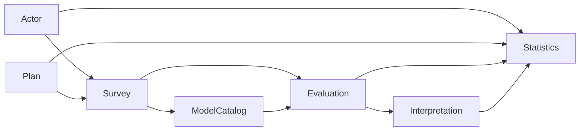

# 业务模块总览

## 1. 结论

主链由四个事实边界组成，三个支撑模块围绕参与者、任务编排和读侧查询工作。

## 2. 事实所有权

| 事实 | 所有者 |
| --- | --- |
| Questionnaire、AnswerSheet | Survey |
| AssessmentModel、Definition、Binding、发布快照 | ModelCatalog |
| Assessment、EvaluationRun、Outcome | Evaluation |
| ReportGeneration、InterpretationRun、InterpretReport | Interpretation |
| Testee、Clinician、Operator、AssessmentEntry、关系 | Actor |
| AssessmentPlan、AssessmentTask | Plan |
| AssessmentEpisode、统计快照与读模型 | Statistics |

具体类型与持久化边界必须回到各模块源码核对。
