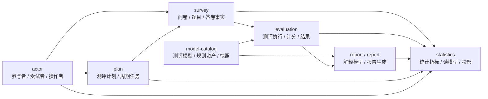

# 业务模块总览

**本文回答**：`qs-server` 的业务模块如何按测评业务生命周期分层，而不是按接口资源或数据库表分层。

---

## 1. 30 秒结论

`qs-server` 的业务模块不是问卷 CRUD，也不是以 `scale` 为中心的单一量表系统。它按测评业务生命周期拆成 4 个核心模块和 3 个支撑模块：

| 分组 | 模块 | 业务问题 |
| ---- | ---- | -------- |
| 核心 | `survey` | 用户答了什么，答卷事实如何沉淀 |
| 核心 | `model-catalog` | 用什么测评模型、规则资产和发布快照来解释答卷 |
| 核心 | `evaluation` | 一次测评如何执行、计分、失败重试并产出结构化结果 |
| 核心 | `interpretation` | 结构化结果如何变成用户可理解的解释报告 |
| 支撑 | `actor` | 谁在参与测评，受试者、操作者和业务上下文是什么 |
| 支撑 | `plan` | 周期测评和任务生命周期如何编排 |
| 支撑 | `statistics` | 运营与行为指标如何通过读侧投影聚合 |

---

## 2. 业务模块图



这张图表达业务依赖方向，不表达进程边界。运行时装配事实仍以 [`registry.go`](../../internal/apiserver/container/modules/registry.go) 为准。

---

## 3. 核心链路

```text
Survey
  采集问卷定义、题目结构和 AnswerSheet 作答事实。

Assessment Model
  管理测评模型资产，包括 Kind、Snapshot、Binding、Payload。

Evaluation
  把 AnswerSheet 和 Assessment Model Snapshot 结合，完成一次测评执行。

Interpretation Model / Report
  把 EvaluationResult 聚合成 InterpretReport，并负责报告 builder、adapter 和持久化。
```

这四层的关键分离是：

| 不要混淆 | 正确边界 |
| -------- | -------- |
| 问卷和模型 | `Questionnaire` 负责展示与提交结构，`AssessmentModel` 负责可执行规则资产 |
| 作答和测评 | `AnswerSheet` 是输入事实，`Evaluation` 是一次执行实例 |
| 测评结果和报告 | `EvaluationResult` 是结构化机器结果，`InterpretReport` 是用户可读解释 |
| 统计和事实源 | `statistics` 是读侧投影，不反向驱动核心业务状态 |

---

## 4. 支撑链路

`actor`、`plan`、`statistics` 不应被理解为次要代码包。它们支撑核心链路的业务上下文：

| 模块 | 支撑点 | 不替代什么 |
| ---- | ------ | ---------- |
| `actor` | 提供受试者、从业者、操作者和访问上下文 | 不替代 IAM 认证主身份 |
| `plan` | 提供测评计划、周期任务、任务开放和完成生命周期 | 不执行计分，不生成报告 |
| `statistics` | 消费事件或读模型形成指标聚合 | 不维护主写事实，不改变核心状态 |

---

## 5. 代码事实

当前业务包注册事实：

```text
survey
modelcatalog
evaluation
interpretation
actor
plan
statistics
```

文档业务名称和代码包名的映射见 [README.md](./README.md#4-命名映射)。

---

## 6. 下一步阅读

先读 [01-模块边界与依赖关系.md](./01-模块边界与依赖关系.md)，再读 [02-核心业务全链路.md](./02-核心业务全链路.md)。如果只关心单个模块，从对应编号目录的 README 进入。
