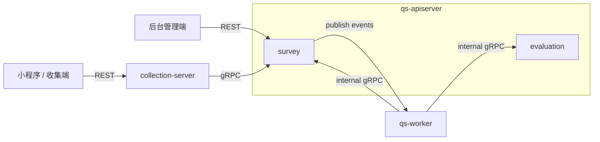
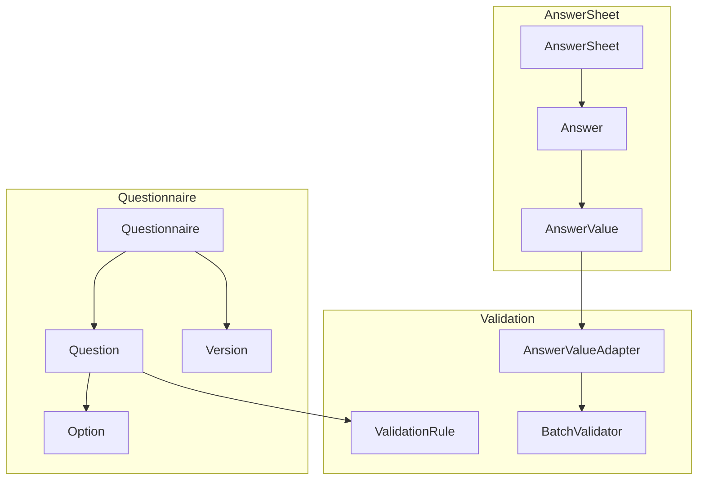
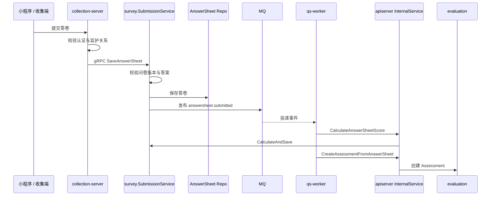

# survey

本文介绍 `survey` 模块的职责边界、模型组织、输入输出和主链路。

## 30 秒了解系统

`survey` 是 `qs-apiserver` 里的问卷域模块，负责两件核心事情：

- 管理问卷：定义题目结构、维护版本和生命周期
- 管理答卷：接收提交、校验答案、保存结果、发布后续事件

它不是独立进程，而是 `apiserver` 容器中的一个业务模块。前台提交最终会落到 `survey.AnswerSheet`，后台配置问卷则落到 `survey.Questionnaire`。

核心代码入口：

- [internal/apiserver/container/assembler/survey.go](../../internal/apiserver/container/assembler/survey.go)
- [internal/apiserver/domain/survey/questionnaire](../../internal/apiserver/domain/survey/questionnaire)
- [internal/apiserver/domain/survey/answersheet](../../internal/apiserver/domain/survey/answersheet)

## 模块边界

### 负责什么

- 问卷生命周期：创建、保存草稿、发布、取消发布、归档、删除
- 问卷内容管理：增删改题目、批量更新、重排
- 答卷提交：校验问卷版本、发布状态和答案合法性，保存答卷
- 答卷事件与分数：发布 `answersheet.submitted`，并在异步链路中补算答卷分数
- 问卷二维码能力接入

### 不负责什么

- 用户认证和监护关系校验：入口在 `collection-server`
- Assessment 创建与测评执行：在 `evaluation`
- 标签、报告、统计：由 `worker` 或其他模块处理

### 运行时位置

## 模型与服务组织

### 模型

`survey` 当前由两个核心聚合构成：

- `Questionnaire`
  - 聚合根：
    [internal/apiserver/domain/survey/questionnaire/questionnaire.go](../../internal/apiserver/domain/survey/questionnaire/questionnaire.go)
  - 管理问卷结构、版本、状态和题目集合
- `AnswerSheet`
  - 聚合根：
    [internal/apiserver/domain/survey/answersheet/answersheet.go](../../internal/apiserver/domain/survey/answersheet/answersheet.go)
  - 管理问卷答案、填写人引用、问卷版本引用和提交事件

答卷校验依赖通用 `validation` 组件，但它不是 `survey` 自己装配出的第三个子模块：

- [internal/apiserver/domain/validation](../../internal/apiserver/domain/validation)

### 服务

`survey` 的应用服务不是按技术层横切，而是按业务动作组织：

- `Questionnaire`
  - `LifecycleService`
    [internal/apiserver/application/survey/questionnaire/lifecycle_service.go](../../internal/apiserver/application/survey/questionnaire/lifecycle_service.go)
  - `ContentService`
    [internal/apiserver/application/survey/questionnaire/content_service.go](../../internal/apiserver/application/survey/questionnaire/content_service.go)
  - `QueryService`
    [internal/apiserver/application/survey/questionnaire/query_service.go](../../internal/apiserver/application/survey/questionnaire/query_service.go)
- `AnswerSheet`
  - `SubmissionService`
    [internal/apiserver/application/survey/answersheet/submission_service.go](../../internal/apiserver/application/survey/answersheet/submission_service.go)
  - `ManagementService`
    [internal/apiserver/application/survey/answersheet/management_service.go](../../internal/apiserver/application/survey/answersheet/management_service.go)
  - `ScoringService`
    [internal/apiserver/application/survey/answersheet/scoring_app_service.go](../../internal/apiserver/application/survey/answersheet/scoring_app_service.go)

模块装配入口：

- [internal/apiserver/container/assembler/survey.go](../../internal/apiserver/container/assembler/survey.go)

这套组织方式的重点是：

- Handler 和 gRPC Service 负责协议与 DTO
- 应用服务负责编排仓储、领域服务和事件
- 复杂规则保留在聚合和领域服务中

## 接口输入与事件输出

### 输入

- 后台 REST
  - `/api/v1/questionnaires`
  - `/api/v1/answersheets`
  - 路由入口：
    [internal/apiserver/routers.go](../../internal/apiserver/routers.go)
- 前台 gRPC
  - `collection-server` 调 `AnswerSheetService`
  - 入口：
    [internal/collection-server/application/answersheet/submission_service.go](../../internal/collection-server/application/answersheet/submission_service.go)
    [internal/apiserver/interface/grpc/service/answersheet.go](../../internal/apiserver/interface/grpc/service/answersheet.go)
- internal gRPC
  - `worker` 调 `InternalService.CalculateAnswerSheetScore`
  - 入口：
    [internal/worker/handlers/answersheet_handler.go](../../internal/worker/handlers/answersheet_handler.go)
    [internal/apiserver/interface/grpc/service/internal.go](../../internal/apiserver/interface/grpc/service/internal.go)

### 输出

- 问卷生命周期事件
  - `questionnaire.published`
  - `questionnaire.unpublished`
  - `questionnaire.archived`
  - 定义：
    [internal/apiserver/domain/survey/questionnaire/events.go](../../internal/apiserver/domain/survey/questionnaire/events.go)
- 答卷提交事件
  - `answersheet.submitted`
  - 定义：
    [internal/apiserver/domain/survey/answersheet/events.go](../../internal/apiserver/domain/survey/answersheet/events.go)

### 前台提交流程的真正入口

`apiserver` 的 [internal/apiserver/interface/restful/handler/answersheet.go](../../internal/apiserver/interface/restful/handler/answersheet.go) 不是小程序收集端的主提交入口。前台答卷提交主链路实际是：

`collection-server -> gRPC -> survey.SubmissionService`

## 核心业务链路

### 问卷管理链路

后台管理端通过 REST 进入 `QuestionnaireHandler`，再由 `LifecycleService`、`ContentService` 和 `QueryService` 编排问卷聚合与仓储。问卷发布、取消发布和归档时，会发布对应领域事件。

### 答卷提交链路

这条链路里，`survey` 同步完成“校验并保存答卷”，异步完成“补算答卷分数”。测评创建与执行已经进入 `evaluation` 的职责边界。

## 关键设计点

### 1. 题型扩展采用“注册器 + 工厂 + 参数容器”

`Questionnaire` 面临的核心问题不是“怎么保存题目”，而是“题型会持续演化，如何避免每加一种题型就改一遍核心创建逻辑”。

当前代码的做法是：

- `NewQuestion` 作为统一创建入口
  - [internal/apiserver/domain/survey/questionnaire/factory.go](../../internal/apiserver/domain/survey/questionnaire/factory.go)
- `QuestionParams` 作为参数容器，负责收集所有构造参数
  - [internal/apiserver/domain/survey/questionnaire/question.go](../../internal/apiserver/domain/survey/questionnaire/question.go)
- 各题型在 `init()` 中注册自己的工厂函数
  - [internal/apiserver/domain/survey/questionnaire/question.go](../../internal/apiserver/domain/survey/questionnaire/question.go)

这套设计有三个直接收益：

- 新增题型时，不需要把一长串 `switch-case` 改得到处都是
- 参数收集和对象创建分离，调用端只关心 `WithCode`、`WithStem`、`WithOption` 这类选项
- 不同题型可以在自己的工厂函数里做特有校验，比如单选和多选题必须有选项

从扩展角度看，如果未来真的要增加新题型，通常只需要关注这几步：

- 定义新的 `QuestionType`
- 实现新的题型结构并满足 `Question` 接口
- 在 `init()` 中注册题型工厂
- 如有必要，给 `QuestionParams` 增加新的字段和 `With*` 选项

这也是 `survey` 里最明确体现开闭原则的地方。

### 2. 问卷把复杂规则放到领域服务，而不是堆进聚合根

`Questionnaire` 的复杂性主要来自三个方面：

- 生命周期转换
- 题目集合管理
- 发布前业务校验

当前代码没有把这些逻辑全部写进聚合根方法，而是拆成了独立领域服务：

- `Lifecycle`
  - [internal/apiserver/domain/survey/questionnaire/lifecycle.go](../../internal/apiserver/domain/survey/questionnaire/lifecycle.go)
- `QuestionManager`
  - [internal/apiserver/domain/survey/questionnaire/question_manager.go](../../internal/apiserver/domain/survey/questionnaire/question_manager.go)
- `Validator`
  - [internal/apiserver/domain/survey/questionnaire/validator.go](../../internal/apiserver/domain/survey/questionnaire/validator.go)

这种拆分不是形式上的“分文件”，而是有明确职责分工：

- `Lifecycle` 负责状态前置检查、发布前验证、版本推进，再调用聚合根的包内状态变更方法
- `QuestionManager` 负责题目增删改和重排，确保题目集合操作不污染其他规则
- `Validator` 负责发布前和基础信息校验，避免应用服务自行拼装校验逻辑

这样做的结果是：

- 聚合根仍然掌握最终状态变更和事件触发
- 复杂编排从聚合根中抽离，阅读和测试都更直接
- 应用服务可以清楚地看出自己是在“调用领域规则”，而不是把规则写在服务层

### 3. 生命周期设计同时承担状态机和版本推进

问卷生命周期不只是“草稿变发布”这么简单，它还隐含着版本演进。

当前 `Lifecycle.Publish` 的真实顺序是：

1. 检查当前状态是否合法
2. 调用 `Validator.ValidateForPublish`
3. 调用 `Versioning` 递增大版本
4. 最后调用聚合根内部 `publish()`

关键代码：

- [internal/apiserver/domain/survey/questionnaire/lifecycle.go](../../internal/apiserver/domain/survey/questionnaire/lifecycle.go)

这个顺序的价值在于：

- 发布不是单纯改状态，而是一次“经过验证的正式版本切换”
- 版本语义落在领域规则里，而不是散落在应用服务或仓储实现里
- 读代码时可以明确看到：状态机、版本和事件是绑定在一起演化的

因此，`Questionnaire` 的生命周期不只是“支持发布/下线/归档”，还包括“发布会推动版本演进”这一层业务语义。

### 4. 校验体系被设计成独立规则引擎

`survey` 里的校验不是零散 if-else，而是一个相对独立的规则系统：

- 规则值对象：
  [internal/apiserver/domain/validation/rule.go](../../internal/apiserver/domain/validation/rule.go)
- 单值校验器：
  [internal/apiserver/domain/validation/validator.go](../../internal/apiserver/domain/validation/validator.go)
- 批量校验器：
  [internal/apiserver/domain/validation/batch.go](../../internal/apiserver/domain/validation/batch.go)
- 策略接口：
  [internal/apiserver/domain/validation/strategy.go](../../internal/apiserver/domain/validation/strategy.go)

它解决的是两个问题：

- 问卷定义里的校验规则需要和答卷提交时的真实校验串起来
- 校验逻辑不能反向耦合到 `AnswerSheet` 或 `Questionnaire` 的具体实现

当前的组织方式是：

- 题目上挂 `ValidationRule`
- 提交答卷时把答案转成 `ValidationTask`
- `BatchValidator` 统一执行校验
- 每一种规则由独立策略处理

这里最重要的是：`validation` 更像一个领域级规则引擎，而不只是几个工具函数。

### 5. 答卷通过适配器接入通用校验，而不是自带一套校验接口

`AnswerSheet` 有自己的 `AnswerValue` 抽象，但 `validation` 只认识 `ValidatableValue`。当前代码没有让两个子域直接互相依赖，而是通过适配器连接：

- [internal/apiserver/domain/survey/answersheet/validation_adapter.go](../../internal/apiserver/domain/survey/answersheet/validation_adapter.go)

`AnswerValueAdapter` 做了三件事：

- 统一判空
- 将原始答案转换为字符串、数值或数组视图
- 让 `BatchValidator` 可以无感知地处理不同答案类型

这背后的设计价值是：

- `validation` 不需要知道 `AnswerValue` 的具体实现细节
- `AnswerSheet` 不需要为配合校验而污染自己的核心接口
- 将来如果别的模块也想复用校验体系，只要实现自己的适配器即可

更重要的是，这个适配层定义了 `survey` 和 `validation` 之间真正稳定的契约：`validation` 只关心“一个值能否被解释成字符串、数值或数组”，并不关心它原本是不是 `StringValue`、`NumberValue` 或别的答案类型。只要新的答案表示最终还能被适配到这三类语义，校验层通常就不需要跟着一起感知题型细节。

### 6. 扩展 survey 时，先判断改的是题型、答案值，还是校验规则

扩展 `survey` 时，首先要判断变更落在哪一层。并不是每增加一种题型，都一定同时改动题型定义、答案值和校验规则。

关键代码：

- [internal/apiserver/domain/survey/questionnaire/factory.go](../../internal/apiserver/domain/survey/questionnaire/factory.go)
- [internal/apiserver/domain/survey/answersheet/answer.go](../../internal/apiserver/domain/survey/answersheet/answer.go)
- [internal/apiserver/domain/validation/strategy.go](../../internal/apiserver/domain/validation/strategy.go)

当前代码里，常见扩展其实分成三类：

- 新增题型定义
  - 重点改 `QuestionType`、题型工厂、`QuestionParams` 和对应 `Question` 实现
  - 如果它复用已有字符串/数字/多选语义，未必需要改校验层
- 新增答案值语义
  - 重点改 `CreateAnswerValueFromRaw` 和 `AnswerValueAdapter`
  - 只有当原始值无法再自然映射到字符串、数值或数组时，才意味着值语义真的变了
- 新增校验规则
  - 重点改 `RuleType`、规则构造和 `ValidationStrategy` 注册
  - 这种场景通常不需要回头改 `Questionnaire` 或 `AnswerSheet` 的核心模型

所以对 `survey` 来说，真正重要的不是记住一个“新增题型 checklist”，而是先分清当前需求是在扩展题目结构、答案表示，还是规则系统。把这个判断做对，改动范围就会很清楚。

### 7. 答案值创建刻意保持简单

`AnswerSheet` 的答案值创建没有沿用题型那套注册器机制，而是通过 `CreateAnswerValueFromRaw` 做简单工厂映射：

- [internal/apiserver/domain/survey/answersheet/answer.go](../../internal/apiserver/domain/survey/answersheet/answer.go)

这其实是一种刻意的权衡：

- `Questionnaire` 的题型扩展频率高，值得投入更重的扩展机制
- `AnswerValue` 的类型目前稳定，而且与题型的映射关系直接

所以这里选择简单工厂而不是统一用注册器，是为了避免“为了模式而模式”。相比单纯描述“这里用了简单工厂”，更重要的是理解它背后的取舍。

### 8. 缓存只覆盖问卷侧，说明两类数据的访问特征不同

当前缓存策略并不是“Survey 全量缓存”，而是只给问卷仓储加装饰器：

- 问卷缓存装饰器：
  [internal/apiserver/infra/cache/questionnaire_cache.go](../../internal/apiserver/infra/cache/questionnaire_cache.go)
- 答卷仓储：
  [internal/apiserver/infra/mongo/answersheet](../../internal/apiserver/infra/mongo/answersheet)

这隐含了两个运行时判断：

- 问卷结构是高复用、低频变更的数据，适合做缓存
- 答卷是强写入、实例化的数据，当前更适合直接走存储

这类设计点不一定复杂，但对理解系统的性能和一致性边界很重要。

## 边界与注意事项

- `survey` 是业务模块，不是独立服务；它只运行在 `apiserver` 内。
- 后端没有“答卷草稿”概念，客户端草稿不等于后端答卷。
- 问卷必须已发布且版本匹配，答卷才允许提交。
- `answersheet.submitted` 是跨模块桥梁，很多后续能力都依赖它。
- 前台提交流程的真正入口在 `collection-server -> gRPC -> survey.SubmissionService`，不能只靠 REST Handler 判断运行时主链路。
