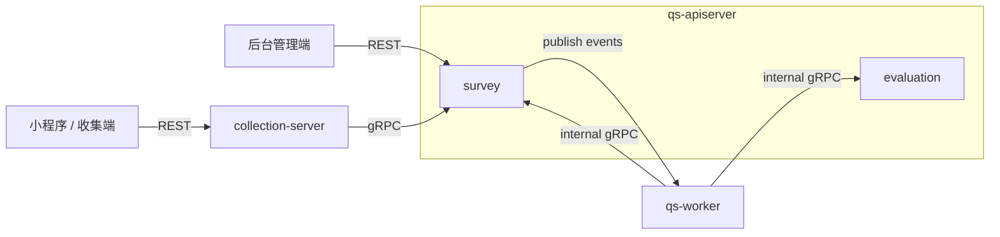
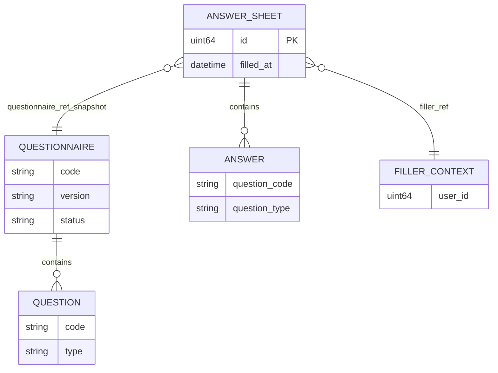
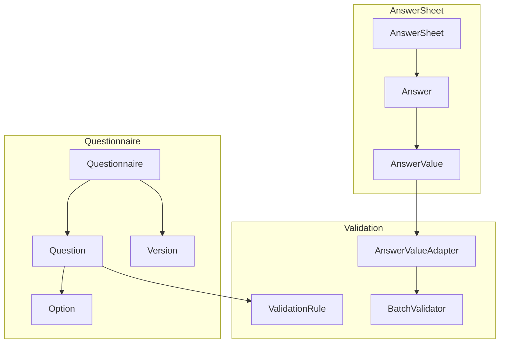
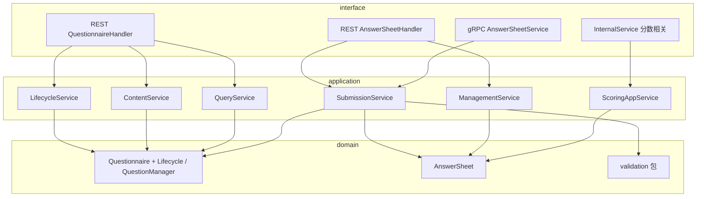
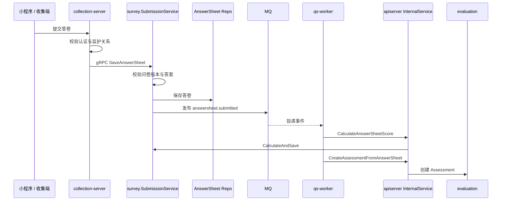
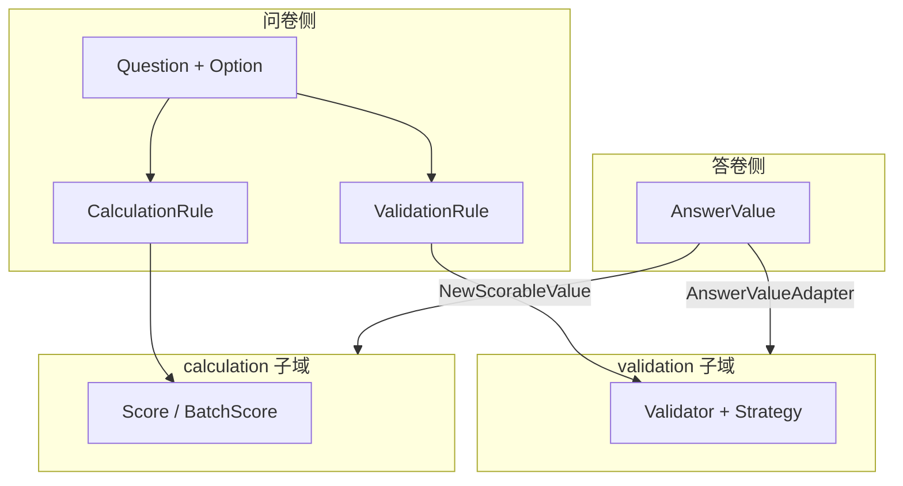

# survey

本文档按 [CONTRIBUTING-DOCS.md](../CONTRIBUTING-DOCS.md) 中的**业务模块推荐结构**撰写；写作时需覆盖的动机、命名、实现位置与可核对性，见该文「讲解维度」一节，本文正文不重复贴标签。

---

## 30 秒了解系统

### 概览

`survey` 是 `qs-apiserver` 里的问卷域模块，负责两件核心事情：

- 管理问卷：定义题目结构、维护版本和生命周期
- 管理答卷：接收提交、校验答案、保存结果、发布后续事件

它不是独立进程，而是 `apiserver` 容器中的一个业务模块。前台提交最终会落到 `survey.AnswerSheet`，后台配置问卷则落到 `survey.Questionnaire`。

代码主路径：`internal/apiserver/domain/survey`（聚合与领域服务）、`internal/apiserver/application/survey`（用例编排）；问卷与答卷持久化当前主要在 **MongoDB**（见下文「核心存储」）。**题型**在问卷侧与答卷侧扩展方式不同；**校验**与**计分计算**分别委托 `domain/validation` 与 `domain/calculation`——见「核心设计」中 **「题型扩展：全局组织与两侧分工」**、**「核心横切」** 两节。

### 模块边界

| | 内容 |
| -- | ---- |
| **负责（摘要）** | 问卷生命周期与内容；答卷提交与校验；`questionnaire.*` / `answersheet.submitted` 等领域事件；问卷二维码等 |
| **不负责（摘要）** | 认证与监护（`collection-server`）；测评与报告（[evaluation](./03-evaluation.md)）；标签/统计等下游实现（多由 `worker` 消费事件） |
| **关联专题** | 三界与引用边界 [05-专题/01](../05-专题分析/01-测评业务模型：survey、scale、evaluation%20为什么分离.md)；异步主链 [05-专题/02](../05-专题分析/02-异步评估链路：从答卷提交到报告生成.md)；问卷版本与历史答卷读路径见专题 01 专节；读侧缓存 [05-专题/03](../05-专题分析/03-保护层与读侧架构：限流、背压、缓存、统计预聚合.md) |

#### 负责什么（细项）

维护文档时**以本清单为模块职责真值**之一，与代码不一致时应改代码或改文。

- **问卷生命周期**：创建、保存草稿、发布、取消发布、归档、删除（及对应状态与版本规则，见领域 `Lifecycle` / `Versioning`）。
- **问卷内容管理**：题目增删改、批量更新、重排；题型通过工厂与注册机制扩展。
- **答卷提交**：校验问卷 **已发布**、**版本与 DTO 对齐**（`FindByCode` 取当前文档再比对版本）、答案合法性（`validation` + 适配器），持久化 `AnswerSheet`。
- **事件与异步衔接**：发布 `answersheet.submitted`；问卷发布/下架/归档等生命周期事件；答卷分数在异步链路中由 Internal gRPC 触发补算（见 [03-evaluation](./03-evaluation.md) / worker）。
- **二维码等协同**：问卷侧能力与 `scale` 等模块的事件、worker 协同以代码及 `events.yaml` 为准。

#### 不负责什么（细项）

- **用户认证、Token、监护关系校验**：入口在 `collection-server`（BFF），不在 `survey`。
- **`Assessment` 创建、评估引擎、报告生成**：在 [evaluation](./03-evaluation.md)；`survey` 只保证答卷事实与事件。
- **标签、通知、统计等消费逻辑**：通常由 `worker` 或其它服务订阅事件后实现；`survey` 不实现完整下游业务。
- **量表规则权威源**：在 [scale](./02-scale.md)；`survey` 不定义因子与医学解读规则。

### 契约入口

- **REST**：问卷与答卷路径以 [api/rest/apiserver.yaml](../../api/rest/apiserver.yaml) 为准；Handler 见 [internal/apiserver/interface/restful/handler/](../../internal/apiserver/interface/restful/handler/) 下问卷/答卷相关文件。
- **前台 gRPC**：`SaveAnswerSheet` 等以 [answersheet.proto](../../internal/apiserver/interface/grpc/proto/answersheet/answersheet.proto) 及 [answersheet.go](../../internal/apiserver/interface/grpc/service/answersheet.go) 为准。
- **领域事件**：事件类型字符串、Topic、handler 须与 [configs/events.yaml](../../configs/events.yaml) 一致；下文「核心契约」中有对照表便于 **Verify**。

### 运行时示意图

#### 运行时图说明

后台直接调 `apiserver` REST；收集端经 `collection-server` gRPC 提交答卷；`survey` 发布事件后由 `worker` 异步触发分数回写与下游测评链路。

### 主要代码入口（索引）

| 关注点 | 路径 |
| ------ | ---- |
| 装配 | [internal/apiserver/container/assembler/survey.go](../../internal/apiserver/container/assembler/survey.go) |
| 问卷 / 答卷领域 | [domain/survey/questionnaire](../../internal/apiserver/domain/survey/questionnaire)、[domain/survey/answersheet](../../internal/apiserver/domain/survey/answersheet) |
| 校验子域 | [domain/validation](../../internal/apiserver/domain/validation) |
| 计算子域 | [domain/calculation](../../internal/apiserver/domain/calculation) |

---

## 模型与服务

与 [evaluation](./03-evaluation.md) 一致，本节用 **ER 图**表达概念实体与引用关系，用 **流程图**表达「题目—答案—校验」协作，再用 **分层图**对齐 interface → application → domain。

### 模型 ER 图

描述 `survey` 子域内主要概念（**非**与 Mongo 文档字段 1:1）。`AnswerSheet` 上的问卷信息以 **值对象引用**（code + version + title）钉死提交时刻，不内嵌整份 `Questionnaire` 树。

- **持久化**：问卷、答卷文档以 [infra/mongo/questionnaire](../../internal/apiserver/infra/mongo/questionnaire)、[infra/mongo/answersheet](../../internal/apiserver/infra/mongo/answersheet) 为准。
- **不变量（语义）**：答卷一旦提交即 **不可变**（见 [answersheet.go](../../internal/apiserver/domain/survey/answersheet/answersheet.go) 注释）；后端无「答卷草稿」聚合。

### 概念关系图：题目、答案与校验

`validation` 是独立子包，通过 [validation_adapter.go](../../internal/apiserver/domain/survey/answersheet/validation_adapter.go) 与 `AnswerValue` 衔接。

### 领域模型与领域服务

#### 限界上下文

- **解决**：问卷模板结构、版本与生命周期；作答事实与提交校验；与 `validation` 的规则执行契约。
- **不解决**：测评实例与报告；量表计分/解读规则权威；统一身份与权限（IAM / `collection-server`）。

#### 核心概念

| 概念 | 职责 | 与相邻概念的关系 |
| ---- | ---- | ---------------- |
| `Questionnaire` | 模板聚合：题目集合、状态、版本 | 发布驱动版本演进（`Versioning` + `Lifecycle`） |
| `Question` / `Option` | 题型与展示结构 | 由工厂注册扩展；可挂 `ValidationRule` |
| `AnswerSheet` | 一次提交的作答事实 | 持 `QuestionnaireRef`；提交后不可改 |
| `Answer` / `AnswerValue` | 单题作答 | `CreateAnswerValueFromRaw` 映射原始 DTO |
| `validation.*` | 规则引擎与策略 | 与题型解耦；经适配器消费答案 |

#### 主要领域服务（问卷侧）

| 服务 | 职责摘要 | 锚点 |
| ---- | -------- | ---- |
| `Lifecycle` | 状态迁移、发布前校验、版本推进 | [lifecycle.go](../../internal/apiserver/domain/survey/questionnaire/lifecycle.go) |
| `QuestionManager` | 题目集合增删改与重排 | [question_manager.go](../../internal/apiserver/domain/survey/questionnaire/question_manager.go) |
| `Validator`（问卷） | 发布与基础信息校验 | [validator.go](../../internal/apiserver/domain/survey/questionnaire/validator.go) |
| `Versioning` | 草稿小版本 / 发布大版本规则 | [versioning.go](../../internal/apiserver/domain/survey/questionnaire/versioning.go) |

### 应用服务、领域服务与领域模型

**应用服务** 编排仓储、领域服务、事件发布；**协议层**（REST / gRPC）只做 DTO 与路由。装配入口：[assembler/survey.go](../../internal/apiserver/container/assembler/survey.go)。

| 应用服务 | 用途 | 目录锚点 |
| -------- | ---- | -------- |
| `LifecycleService` | 问卷创建、发布、归档等 | `application/survey/questionnaire/lifecycle_service.go` |
| `ContentService` | 题目内容维护 | `application/survey/questionnaire/content_service.go` |
| `QueryService` | 问卷查询 | `application/survey/questionnaire/query_service.go` |
| `SubmissionService` | 答卷提交主路径 | `application/survey/answersheet/submission_service.go` |
| `ManagementService` | 答卷管理类用例 | `application/survey/answersheet/management_service.go` |
| `ScoringAppService` | 与答卷分数回写衔接 | `application/survey/answersheet/scoring_app_service.go` |

#### 分层图说明

- **C 端主提交**：`collection-server` → gRPC → `SubmissionService`（REST `AnswerSheet` Handler 不是小程序主入口）。
- **问卷读热点**：查询可走带缓存的仓储装饰（见「核心模式」缓存节与 [05-专题/03](../05-专题分析/03-保护层与读侧架构：限流、背压、缓存、统计预聚合.md)）。

## 核心设计

### 核心契约：REST、gRPC 与领域事件

#### 输入

- 后台 REST
  - `/api/v1/questionnaires`
  - `/api/v1/answersheets`
  - 路由入口：
    [internal/apiserver/routers.go](../../internal/apiserver/routers.go)
- 前台 gRPC
  - `collection-server` 调 `AnswerSheetService`
  - 入口：
    [internal/collection-server/application/answersheet/submission_service.go](../../internal/collection-server/application/answersheet/submission_service.go)
    [internal/apiserver/interface/grpc/service/answersheet.go](../../internal/apiserver/interface/grpc/service/answersheet.go)
- internal gRPC
  - `worker` 调 `InternalService.CalculateAnswerSheetScore`
  - 入口：
    [internal/worker/handlers/answersheet_handler.go](../../internal/worker/handlers/answersheet_handler.go)
    [internal/apiserver/interface/grpc/service/internal.go](../../internal/apiserver/interface/grpc/service/internal.go)

#### 输出

- 问卷生命周期事件
  - `questionnaire.published`
  - `questionnaire.unpublished`
  - `questionnaire.archived`
  - 定义：
    [internal/apiserver/domain/survey/questionnaire/events.go](../../internal/apiserver/domain/survey/questionnaire/events.go)
- 答卷提交事件
  - `answersheet.submitted`
  - 定义：
    [internal/apiserver/domain/survey/answersheet/events.go](../../internal/apiserver/domain/survey/answersheet/events.go)

**与 `configs/events.yaml` 对照（Verify）**：

| 事件类型 | Topic（`topics.*.name`） | handler（yaml） | 备注 |
| -------- | ------------------------ | ----------------- | ---- |
| `questionnaire.published` | `questionnaire.lifecycle` | `questionnaire_published_handler` | 与量表生命周期共用 Topic |
| `questionnaire.unpublished` | `questionnaire.lifecycle` | `questionnaire_unpublished_handler` | |
| `questionnaire.archived` | `questionnaire.lifecycle` | `questionnaire_archived_handler` | |
| `answersheet.submitted` | **`assessment.lifecycle`** | `answersheet_submitted_handler` | 与测评链共用 Topic，消费者含 `qs-worker` |

改事件名或 consumer 时须同步 **yaml**、领域 `events.go`、发布点与 worker [registry.go](../../internal/worker/handlers/registry.go)。

#### 前台提交流程的真正入口

`apiserver` 的 [internal/apiserver/interface/restful/handler/answersheet.go](../../internal/apiserver/interface/restful/handler/answersheet.go) 不是小程序收集端的主提交入口。前台答卷提交主链路实际是：

`collection-server -> gRPC -> survey.SubmissionService`

### 核心链路：问卷管理与答卷提交

#### 问卷管理链路

后台管理端通过 REST 进入 `QuestionnaireHandler`，再由 `LifecycleService`、`ContentService` 和 `QueryService` 编排问卷聚合与仓储。问卷发布、取消发布和归档时，会发布对应领域事件。

#### 答卷提交链路

这条链路里，`survey` 同步完成“校验并保存答卷”，异步完成“补算答卷分数”。测评创建与执行已经进入 `evaluation` 的职责边界。

### 题型扩展：全局组织与两侧分工

**题型**在 `survey` 里不是「一个开关」，而是三件事叠在一起：**模板侧怎么定义题目**、**作答侧怎么承载答案**、以及二者如何与 **校验 / 计算** 对齐（后者见下节「核心横切」）。本节按 **全局 → 问卷侧实现 → 答卷侧实现** 组织，避免把「注册器 + 工厂 + 参数容器」单独成章又与「两侧扩展」重复讲同一故事。

#### 全局视图与对齐契约

- **两条演进线**：**模板线**（问卷里长什么样）与**作答线**（用户提交什么），用 `QuestionType` 对齐；**扩展机制刻意不对称**——题目侧用注册表 + 工厂，答案侧用轻量工厂，避免处处 `switch`。

| 维度 | 问卷侧 `Questionnaire` / `Question` | 答卷侧 `AnswerSheet` / `Answer` |
| ---- | ------------------------------------- | -------------------------------- |
| **扩展入口** | `RegisterQuestionFactory` + `NewQuestion`（[factory.go](../../internal/apiserver/domain/survey/questionnaire/factory.go)） | `CreateAnswerValueFromRaw` + `NewAnswer`（[answer.go](../../internal/apiserver/domain/survey/answersheet/answer.go)） |
| **承载** | 各题型实现 `Question` 接口；可挂题目级 `ValidationRule`、选项 `Option`；题目可暴露 `GetCalculationRule()`（与 [calculation.CalculationRule](../../internal/apiserver/domain/calculation/types.go) 衔接，见 [question.go](../../internal/apiserver/domain/survey/questionnaire/question.go)） | `Answer` = `questionCode` + `questionType` + `AnswerValue`；**提交后不可变** |
| **何时扩展** | 新增/改题型结构、选项语义、题目级规则 | 当且仅当「原始 JSON → 值语义」与现有一致性模型不兼容时，才需要新 `AnswerValue` 实现或扩展 `CreateAnswerValueFromRaw` |

**对齐契约（实现时必须同时满足）**：

1. **提交**：`AnswerDTO` 的题型与 `Question` 一致，且 `CreateAnswerValueFromRaw` 能解析客户端 raw 值。  
2. **校验**：题目上的 `ValidationRule` 经 `ValidationTask` 作用在 **适配后的可校验值** 上（[validation_adapter.go](../../internal/apiserver/domain/survey/answersheet/validation_adapter.go)）。  
3. **计分（答卷侧粗分）**：`AnswerValue` → `NewScorableValue` → `calculation.ScorableValue`，再与题目选项分、`CalculationRule` 组合（[scoring_service.go](../../internal/apiserver/domain/survey/answersheet/scoring_service.go)）。

#### 问卷侧：注册器、工厂与 QuestionParams

`Questionnaire` 面临的核心问题不是「怎么保存题目」，而是「题型会持续演化，如何避免每加一种题型就改一遍核心创建逻辑」。实现上采用 **注册器 + 工厂 + 参数容器**（即以往口语中的「题型扩展三板斧」），全部落在问卷侧：

- **统一入口** `NewQuestion` — [factory.go](../../internal/apiserver/domain/survey/questionnaire/factory.go)
- **参数容器** `QuestionParams` 收集 `WithCode`、`WithStem`、`WithOption` 等 — [question.go](../../internal/apiserver/domain/survey/questionnaire/question.go)
- **注册**：各题型在 `init()` 中 `RegisterQuestionFactory`，避免中央 `switch`

收益简述：新增题型时不必改一长串 `switch`；参数收集与具体题型构造分离；工厂内可做题型特有校验（如选项非空）。

**新增题型时的典型步骤**（与代码路径一致）：

1. 定义新的 `QuestionType` 常量  
2. 实现满足 `Question` 接口的具体题型  
3. 在 `init()` 中注册该题型的工厂函数  
4. 若需要，扩展 `QuestionParams` 的字段与 `With*` 选项  

这也是 `survey` 里开闭原则最集中的落点；与上表「问卷侧 / 扩展入口」列是同一套机制。

#### 答卷侧：答案值与 CreateAnswerValueFromRaw

作答侧**不**采用与题目对称的注册表：`Answer` 由 `NewAnswer` 组装，`AnswerValue` 由 `CreateAnswerValueFromRaw(questionType, raw)` 从提交 JSON 映射而来（[answer.go](../../internal/apiserver/domain/survey/answersheet/answer.go)）。原因是当前多数题型仍落在少数值语义上，用轻量工厂即可；**何时需要动这一侧**，见下文 **「扩展 survey 时，先判断改的是题型、答案值，还是校验规则」** 与 **「答案值创建刻意保持简单」** 两节。

### 核心横切：校验引擎与计算引擎的独立

`survey` 把「**值是否合法**」与「**按规则算多少分**」从聚合根中剥离，分别委托给 **`domain/validation`** 与 **`domain/calculation`**。二者都是**可复用子域**：不持有 `Questionnaire` / `AnswerSheet` 聚合，只消费已经适配好的值与规则。

| 引擎 | 包 | 职责摘要 | 与 `survey` 的衔接 |
| ---- | --- | -------- | ------------------- |
| **校验** | [domain/validation](../../internal/apiserver/domain/validation) | `规则 + ValidatableValue → ValidationResult`；策略按 `RuleType` 分发（[validator.go](../../internal/apiserver/domain/validation/validator.go)、[strategy.go](../../internal/apiserver/domain/validation/strategy.go)） | 题目带 `ValidationRule`；`AnswerValue` 经 [AnswerValueAdapter](../../internal/apiserver/domain/survey/answersheet/validation_adapter.go) 实现 `ValidatableValue` |
| **计算** | [domain/calculation](../../internal/apiserver/domain/calculation) | 无状态计分：`OptionScorer`（[scorer.go](../../internal/apiserver/domain/calculation/scorer.go)）+ 批量封装（[batch.go](../../internal/apiserver/domain/calculation/batch.go)）；另含 `ScoringStrategy` 注册表，供**多 float64 聚合**（量表等）复用，与答卷「选项分粗分」不同路径 | `ScoringService` 组装 `ScoreTask`，`AnswerValue` 经 [NewScorableValue](../../internal/apiserver/domain/survey/answersheet/scoring_service.go) 转为 `ScorableValue` |

**calculation 子域（survey 侧怎么读）**：

- **值契约**：`ScorableValue`（[types.go](../../internal/apiserver/domain/calculation/types.go)）与 `ValidatableValue` 对称——只要求 `IsEmpty`、以及 **单选 / 多选 / 数值** 三种视图；子域**不依赖** `Question` / `Answer` 具体类型。
- **单题怎么算**：`Score(value, optionScores)` 内部分发到 `OptionScorer`：单选按选项编码取分；多选对命中选项**累加**；若走 `AsNumber` 则直接把数值当得分（常见李克特类）。
- **整卷怎么批**：`ScoringService.buildScoreTasks` 为每题准备 `optionCode → float64` 与 `NewScorableValue(ans.Value())`，再 `BatchScoreToMap` 得到 `map[题码]ScoreResult`（含 `MaxScore`，即选项分中的最大值）；批量层可并发、小任务量回落串行（见 [batch.go](../../internal/apiserver/domain/calculation/batch.go)）。
- **与 survey 的边界**：领域层只做 **建映射、组任务、把结果写回 `ScoredAnswerSheet`**；`calculation` 侧不出现 `Questionnaire`/`AnswerSheet`，保持纯函数式、可测。
- **同包另一条链**：`GetStrategy` + `ScoringStrategy` 多用于 **若干得分再聚合**（例如 [scale/scoring_service.go](../../internal/apiserver/domain/scale/scoring_service.go) 中的 sum/avg/count），与上文「选项映射粗分」并列存在于 `calculation`，避免在量表与问卷各写一套聚合。
- **题目上的 `CalculationRule`**：问卷建模可挂 `FormulaType` 等（与 [types.go](../../internal/apiserver/domain/calculation/types.go) 值对象一致）；**当前** `ScoringService` 粗分路径**未读取**该字段，选题得分来自 **`Option` 上的分值配置** + `ScorableValue`。勿把「挂了规则对象」等同于「粗分引擎已按公式执行」。

**设计意图（与代码注释一致）**：

- **validation**：接口注释写明只关心「规则 + 值 → 结果」，**不依赖**问卷/答卷类型，便于其它限界上下文复用。  
- **calculation**：[scoring_service.go](../../internal/apiserver/domain/survey/answersheet/scoring_service.go) 文末说明——**领域层组装任务，计算层做无状态算法**；注释中曾写 `pkg/calculation`，仓库实际路径为 **`internal/apiserver/domain/calculation`**。  
- **两个适配器、两种接口**：校验走 `ValidatableValue`（字符串/数值/数组视图），计分走 `ScorableValue`（单选/多选/数值视图）；**职责不同，故不强行合并为一个适配层**。

**边界**：此处「计算」指 **问卷选项分、答卷粗分** 等与 `survey.ScoringService` 绑定的路径；**医学量表因子分、风险与报告**在 [evaluation](./03-evaluation.md) 与 [scale](./02-scale.md)，避免与本文「计算引擎」混淆。

### 核心模式与实现要点

以下各节从**生命周期、聚合职责、校验/适配、扩展取舍、缓存**等角度补充说明；**题型在两侧如何长、如何对齐**，已集中在上一节 **「题型扩展：全局组织与两侧分工」**，此处不再重复「注册器 + 工厂」细节。

#### 1. 问卷把复杂规则放到领域服务，而不是堆进聚合根

`Questionnaire` 的复杂性主要来自三个方面：

- 生命周期转换
- 题目集合管理
- 发布前业务校验

当前代码没有把这些逻辑全部写进聚合根方法，而是拆成了独立领域服务：

- `Lifecycle`
  - [internal/apiserver/domain/survey/questionnaire/lifecycle.go](../../internal/apiserver/domain/survey/questionnaire/lifecycle.go)
- `QuestionManager`
  - [internal/apiserver/domain/survey/questionnaire/question_manager.go](../../internal/apiserver/domain/survey/questionnaire/question_manager.go)
- `Validator`
  - [internal/apiserver/domain/survey/questionnaire/validator.go](../../internal/apiserver/domain/survey/questionnaire/validator.go)

这种拆分不是形式上的“分文件”，而是有明确职责分工：

- `Lifecycle` 负责状态前置检查、发布前验证、版本推进，再调用聚合根的包内状态变更方法
- `QuestionManager` 负责题目增删改和重排，确保题目集合操作不污染其他规则
- `Validator` 负责发布前和基础信息校验，避免应用服务自行拼装校验逻辑

这样做的结果是：

- 聚合根仍然掌握最终状态变更和事件触发
- 复杂编排从聚合根中抽离，阅读和测试都更直接
- 应用服务可以清楚地看出自己是在“调用领域规则”，而不是把规则写在服务层

#### 2. 生命周期设计同时承担状态机和版本推进

问卷生命周期不只是“草稿变发布”这么简单，它还隐含着版本演进。

当前 `Lifecycle.Publish` 的真实顺序是：

1. 检查当前状态是否合法
2. 调用 `Validator.ValidateForPublish`
3. 调用 `Versioning` 递增大版本
4. 最后调用聚合根内部 `publish()`

关键代码：

- [internal/apiserver/domain/survey/questionnaire/lifecycle.go](../../internal/apiserver/domain/survey/questionnaire/lifecycle.go)

这个顺序的价值在于：

- 发布不是单纯改状态，而是一次“经过验证的正式版本切换”
- 版本语义落在领域规则里，而不是散落在应用服务或仓储实现里
- 读代码时可以明确看到：状态机、版本和事件是绑定在一起演化的

因此，`Questionnaire` 的生命周期不只是“支持发布/下线/归档”，还包括“发布会推动版本演进”这一层业务语义。

#### 3. 校验体系被设计成独立规则引擎

> **读法**：`validation` 子域为何独立、`Validator` / `Strategy` 边界与接口，**详见上文「核心横切：校验引擎与计算引擎的独立」**；本节仅为 **survey 侧串联 checklist**（改代码时按条核对即可）。

- **串联**：题目挂 `ValidationRule` → 提交时构造 `ValidationTask` → `BatchValidator` 按 `RuleType` 选策略执行（[batch.go](../../internal/apiserver/domain/validation/batch.go)、[strategy.go](../../internal/apiserver/domain/validation/strategy.go)）。
- **包锚点**（与横切节一致，不展开动机）：[rule.go](../../internal/apiserver/domain/validation/rule.go)、[validator.go](../../internal/apiserver/domain/validation/validator.go)。

#### 4. 答卷通过适配器接入通用校验，而不是自带一套校验接口

> **读法**：`AnswerValue` → `ValidatableValue` 的契约与横切含义，**详见「核心横切」** 中的表与图；本节仅 **checklist + 单文件锚点**。

- **锚点**：[validation_adapter.go](../../internal/apiserver/domain/survey/answersheet/validation_adapter.go) —— 判空、把答案暴露为字符串/数值/数组视图、`BatchValidator` 无需感知具体 `AnswerValue` 实现。
- **契约一句话**：`validation` 只认三类语义视图；新题型若仍映射得到，通常不必动校验子域（与「题型扩展」全局契约一致）。

#### 5. 扩展 survey 时，先判断改的是题型、答案值，还是校验规则

与上文 **「题型扩展：全局组织与两侧分工」** 中的「全局视图」「问卷侧」「答卷侧」**对照阅读**：先定改动落在哪一层，再改工厂 / 解析 / 策略。

扩展 `survey` 时，首先要判断变更落在哪一层。并不是每增加一种题型，都一定同时改动题型定义、答案值和校验规则。

关键代码：

- [internal/apiserver/domain/survey/questionnaire/factory.go](../../internal/apiserver/domain/survey/questionnaire/factory.go)
- [internal/apiserver/domain/survey/answersheet/answer.go](../../internal/apiserver/domain/survey/answersheet/answer.go)
- [internal/apiserver/domain/validation/strategy.go](../../internal/apiserver/domain/validation/strategy.go)

当前代码里，常见扩展其实分成三类：

- 新增题型定义
  - 重点改 `QuestionType`、题型工厂、`QuestionParams` 和对应 `Question` 实现
  - 如果它复用已有字符串/数字/多选语义，未必需要改校验层
- 新增答案值语义
  - 重点改 `CreateAnswerValueFromRaw` 和 `AnswerValueAdapter`
  - 只有当原始值无法再自然映射到字符串、数值或数组时，才意味着值语义真的变了
- 新增校验规则
  - 重点改 `RuleType`、规则构造和 `ValidationStrategy` 注册
  - 这种场景通常不需要回头改 `Questionnaire` 或 `AnswerSheet` 的核心模型

所以对 `survey` 来说，真正重要的不是记住一个“新增题型 checklist”，而是先分清当前需求是在扩展题目结构、答案表示，还是规则系统。把这个判断做对，改动范围就会很清楚。

#### 6. 答案值创建刻意保持简单

**与「题型扩展」的关系**：答卷侧为何用轻量工厂而非注册表，见该节 **「答卷侧：答案值与 CreateAnswerValueFromRaw」**；本节只强调取舍。

`AnswerSheet` 的答案值创建没有沿用题型那套注册器机制，而是通过 `CreateAnswerValueFromRaw` 做简单工厂映射：

- [internal/apiserver/domain/survey/answersheet/answer.go](../../internal/apiserver/domain/survey/answersheet/answer.go)

这其实是一种刻意的权衡：

- `Questionnaire` 的题型扩展频率高，值得投入更重的扩展机制
- `AnswerValue` 的类型目前稳定，而且与题型的映射关系直接

所以这里选择简单工厂而不是统一用注册器，是为了避免“为了模式而模式”。相比单纯描述“这里用了简单工厂”，更重要的是理解它背后的取舍。

#### 7. 缓存只覆盖问卷侧，说明两类数据的访问特征不同

当前缓存策略并不是“Survey 全量缓存”，而是只给问卷仓储加装饰器：

- 问卷缓存装饰器：
  [internal/apiserver/infra/cache/questionnaire_cache.go](../../internal/apiserver/infra/cache/questionnaire_cache.go)
- 答卷仓储：
  [internal/apiserver/infra/mongo/answersheet](../../internal/apiserver/infra/mongo/answersheet)

这隐含了两个运行时判断：

- 问卷结构是高复用、低频变更的数据，适合做缓存
- 答卷是强写入、实例化的数据，当前更适合直接走存储

这类设计点不一定复杂，但对理解系统的性能和一致性边界很重要。

### 核心存储：MongoDB 与问卷缓存

| 数据 | 存储 | 实现锚点 |
| ---- | ---- | -------- |
| 问卷（含题目加载路径） | MongoDB | [infra/mongo/questionnaire](../../internal/apiserver/infra/mongo/questionnaire) |
| 答卷 | MongoDB | [infra/mongo/answersheet](../../internal/apiserver/infra/mongo/answersheet) |
| 问卷读路径缓存 | Redis（装饰仓储） | [infra/cache/questionnaire_cache.go](../../internal/apiserver/infra/cache/questionnaire_cache.go) |

问卷缓存 TTL、开关等以各环境 [configs/apiserver.*.yaml](../../configs/apiserver.dev.yaml) 中 `cache` 相关键为准（与 [05-专题/03](../05-专题分析/03-保护层与读侧架构：限流、背压、缓存、统计预聚合.md) 互参）。

### 核心代码锚点索引

| 关注点 | 路径 |
| ------ | ---- |
| 装配 | [internal/apiserver/container/assembler/survey.go](../../internal/apiserver/container/assembler/survey.go) |
| 应用服务 | [internal/apiserver/application/survey/](../../internal/apiserver/application/survey/) |
| 领域 | [internal/apiserver/domain/survey/](../../internal/apiserver/domain/survey/)、[internal/apiserver/domain/validation/](../../internal/apiserver/domain/validation/) |
| 计算子域 | [internal/apiserver/domain/calculation/](../../internal/apiserver/domain/calculation/) |
| REST / gRPC | [internal/apiserver/interface/restful/handler/](../../internal/apiserver/interface/restful/handler/)、[internal/apiserver/interface/grpc/service/answersheet.go](../../internal/apiserver/interface/grpc/service/answersheet.go) |

---

## 边界与注意事项

### 常见误解

- `survey` 是业务模块，不是独立服务；它只运行在 `apiserver` 内。
- 后端没有“答卷草稿”概念，客户端草稿不等于后端答卷。
- 问卷必须已发布且版本匹配，答卷才允许提交。
- `answersheet.submitted` 是跨模块桥梁，很多后续能力都依赖它。
- 前台提交流程的真正入口在 `collection-server -> gRPC -> survey.SubmissionService`，不能只靠 REST Handler 判断运行时主链路。

### 维护时核对

- 变更 REST 路径或请求体：同步 [api/rest/apiserver.yaml](../../api/rest/apiserver.yaml) 与 Handler。
- 变更答卷 gRPC：同步 [answersheet.proto](../../internal/apiserver/interface/grpc/proto/answersheet/answersheet.proto) 与 `collection-server` 调用方。
- 变更事件类型或 Topic：同步 [configs/events.yaml](../../configs/events.yaml)、领域 `events.go`、worker 注册。
- 变更提交版本策略或 `FindByCode` 语义：同步 [submission_service.go](../../internal/apiserver/application/survey/answersheet/submission_service.go) 与 [05-专题/01](../05-专题分析/01-测评业务模型：survey、scale、evaluation%20为什么分离.md) 中「问卷版本演进」专节。

---

*写作约定见 [CONTRIBUTING-DOCS.md](../CONTRIBUTING-DOCS.md)。专题 01 对三界与问卷版本的**设计解释**见 [05-专题分析/01](../05-专题分析/01-测评业务模型：survey、scale、evaluation%20为什么分离.md)（接口真值仍以本文与代码为准）。*
