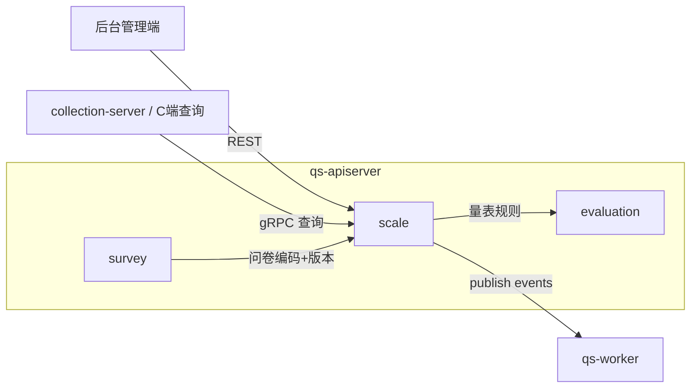
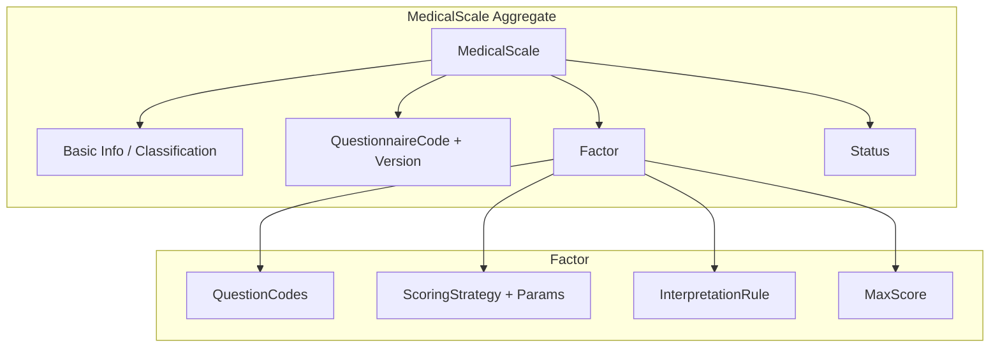
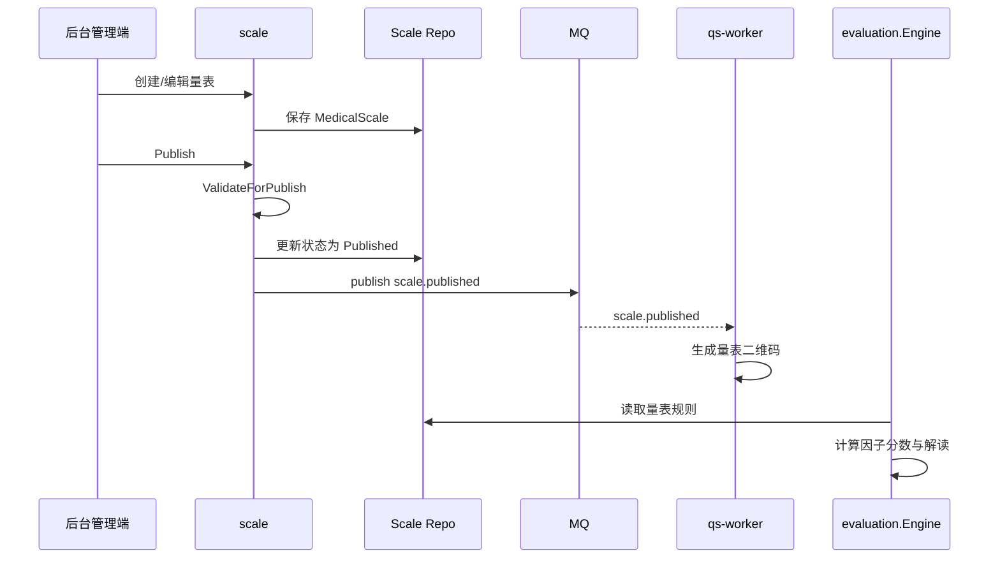

# scale

本文介绍 `scale` 模块的职责边界、模型组织、输入输出和主链路。

## 30 秒了解系统

`scale` 是 `qs-apiserver` 里的量表模块，负责定义“如何对答卷进行计分和解读”。

它当前主要做三件事：

- 管理量表基本信息、分类信息和生命周期
- 定义因子、计分策略、解读规则和总分因子
- 将这些规则配置提供给 `evaluation` 执行评估

它不是独立进程，而是 `apiserver` 容器中的业务模块。运行时里，`scale` 更像“规则配置中心”，而不是“评估执行模块”。

核心代码入口：

- [internal/apiserver/container/assembler/scale.go](../../internal/apiserver/container/assembler/scale.go)
- [internal/apiserver/domain/scale/medical_scale.go](../../internal/apiserver/domain/scale/medical_scale.go)
- [internal/apiserver/domain/scale/factor.go](../../internal/apiserver/domain/scale/factor.go)
- [internal/apiserver/domain/scale/scoring_service.go](../../internal/apiserver/domain/scale/scoring_service.go)

## 模块边界

### 负责什么

- 量表基本信息管理：标题、描述、分类、标签、适用年龄、填报人
- 问卷绑定：维护量表关联的问卷编码与问卷版本
- 因子管理：定义因子、题目映射、是否总分因子、是否展示
- 规则配置：配置计分策略、计分参数、解读规则和最大分
- 生命周期管理：草稿、发布、下架、归档
- 对外提供量表查询与已发布量表列表

### 不负责什么

- 问卷结构定义和答卷提交：在 `survey`
- 评估流程执行：在 `evaluation`
- 报告生成、标签、统计：在 `evaluation` 或 `worker`
- 用户身份与组织信息：在 `actor` / IAM

### 运行时位置

## 模型与服务组织

### 模型

`scale` 当前基本可以理解成“一个聚合根 + 一个核心实体 + 一组规则值对象”：

- `MedicalScale`
  - 聚合根：
    [internal/apiserver/domain/scale/medical_scale.go](../../internal/apiserver/domain/scale/medical_scale.go)
  - 管理量表基本信息、问卷引用、状态、因子集合和领域事件
- `Factor`
  - 实体：
    [internal/apiserver/domain/scale/factor.go](../../internal/apiserver/domain/scale/factor.go)
  - 管理题目映射、计分策略、计分参数、最大分和解读规则
- `InterpretationRule`
  - 值对象：
    [internal/apiserver/domain/scale/interpretation_rule.go](../../internal/apiserver/domain/scale/interpretation_rule.go)
  - 定义分数区间、风险等级、结论和建议的映射

### 服务

`scale` 的应用服务以“编辑规则”和“查询规则”两条线组织：

- `LifecycleService`
  - [internal/apiserver/application/scale/lifecycle_service.go](../../internal/apiserver/application/scale/lifecycle_service.go)
  - 负责创建、更新基本信息、绑定问卷、发布、下架、归档、删除
- `FactorService`
  - [internal/apiserver/application/scale/factor_service.go](../../internal/apiserver/application/scale/factor_service.go)
  - 负责增删改因子、批量替换因子、更新解读规则
- `QueryService`
  - [internal/apiserver/application/scale/query_service.go](../../internal/apiserver/application/scale/query_service.go)
  - 负责详情、列表、按问卷查询、已发布查询和因子列表
- `CategoryService`
  - [internal/apiserver/application/scale/category_service.go](../../internal/apiserver/application/scale/category_service.go)
  - 负责开放分类枚举

模块装配入口：

- [internal/apiserver/container/assembler/scale.go](../../internal/apiserver/container/assembler/scale.go)

这套组织的重点是：

- `MedicalScale` 统一管理规则配置的一致性
- 生命周期和因子编辑分开，避免“配置编辑”和“发布管理”混在一个服务里
- 查询能力对后台和 C 端同时复用，但只向 C 端暴露已发布量表

## 接口输入与事件输出

### 输入

- 后台 REST
  - `/api/v1/scales`
  - `/api/v1/scales/:code/factors`
  - `/api/v1/scales/:code/interpret-rules`
  - 路由入口：
    [internal/apiserver/routers.go](../../internal/apiserver/routers.go)
    [internal/apiserver/interface/restful/handler/scale.go](../../internal/apiserver/interface/restful/handler/scale.go)
- C 端 gRPC 查询
  - `GetScale`
  - `ListScales`
  - `GetScaleCategories`
  - 入口：
    [internal/apiserver/interface/grpc/service/scale.go](../../internal/apiserver/interface/grpc/service/scale.go)
- 跨模块依赖输入
  - 发布时可从 `survey` 的问卷仓储补齐最新问卷版本
  - 入口：
    [internal/apiserver/application/scale/lifecycle_service.go](../../internal/apiserver/application/scale/lifecycle_service.go)

### 输出

- `scale.published`
- `scale.unpublished`
- `scale.updated`
- `scale.archived`
  - 定义：
    [internal/apiserver/domain/scale/events.go](../../internal/apiserver/domain/scale/events.go)

这些事件当前主要用于通知其他服务和驱动 `worker` 做二维码生成、缓存协同等后续动作。

### 量表规则如何进入评估链

`scale` 会定义“计分策略”和“解读规则”，但当前代码里并不直接承担整条评估执行链。真正执行评估时，`evaluation` 的处理器会读取量表规则，再调用 `scale.ScoringService` 和解读配置去完成计算与解释。

## 核心业务链路

### 量表配置链路

后台管理端通过 REST 进入 `ScaleHandler`，再由 `LifecycleService` 和 `FactorService` 编排 `MedicalScale` 聚合与仓储。编辑阶段主要更新基本信息、问卷绑定和因子结构；发布阶段则会先执行完整验证，再切换状态并发布事件。

### 量表被评估链路消费

这条链路的关键点是：

- `scale` 提供规则配置
- `evaluation` 消费这些规则去执行评估
- `worker` 只处理围绕量表事件的辅助动作，不负责量表核心写库

## 关键设计点

### 1. MedicalScale 是规则聚合，而不是评估结果聚合

`MedicalScale` 管理的是“规则定义”，不是“评估结果”。它里面保存的是：

- 量表元数据
- 问卷绑定关系
- 因子集合
- 因子的计分与解读规则

关键代码：

- [internal/apiserver/domain/scale/medical_scale.go](../../internal/apiserver/domain/scale/medical_scale.go)

这样设计的价值在于：

- 一个量表可以被很多测评复用
- 规则配置和测评实例不会相互污染
- 量表修改、发布和归档可以独立于评估流程演进

### 2. 因子是实体，解读规则是值对象

`Factor` 之所以被设计成实体，是因为它有明确身份和可编辑生命周期：

- 有稳定的 `FactorCode`
- 可以增删改、替换、单独更新解读规则
- 可以标记是否为总分因子、是否在报告中展示

而 `InterpretationRule` 只是描述一条规则：

- 分数区间
- 风险等级
- 结论文案
- 建议文案

关键代码：

- [internal/apiserver/domain/scale/factor.go](../../internal/apiserver/domain/scale/factor.go)
- [internal/apiserver/domain/scale/interpretation_rule.go](../../internal/apiserver/domain/scale/interpretation_rule.go)

这种拆分很重要，因为它把“可编辑的业务维度”和“维度上的静态规则描述”分开了。

### 3. 发布前验证决定了量表是否可被 evaluation 使用

量表的发布不是简单改状态。当前 `Validator.ValidateForPublish` 会至少检查：

- 基本信息是否完整
- 是否至少存在一个因子
- 是否存在且仅存在一个总分因子
- 每个因子是否有题目映射
- 每个因子是否配置了解读规则
- 是否绑定了问卷编码和问卷版本

关键代码：

- [internal/apiserver/domain/scale/validator.go](../../internal/apiserver/domain/scale/validator.go)
- [internal/apiserver/domain/scale/lifecycle.go](../../internal/apiserver/domain/scale/lifecycle.go)

这个设计直接决定了：`evaluation` 读取到的已发布量表，默认就是一份“可执行规则配置”，而不是半成品草稿。

### 4. 发布时自动补齐问卷版本，说明 scale 绑定的是“问卷快照”

当前 `LifecycleService.Publish` 在执行生命周期切换前，会尝试确保量表上写入问卷版本：

- [internal/apiserver/application/scale/lifecycle_service.go](../../internal/apiserver/application/scale/lifecycle_service.go)

这说明 `scale` 绑定的不是模糊的“某个问卷编码”，而是更稳定的“问卷编码 + 问卷版本”。这样做的好处是：

- 评估时可以明确知道规则是针对哪个问卷版本定义的
- 问卷后续继续演化时，不会让已发布量表失去可追溯性

这也是 `scale` 和 `survey` 协作里最关键的边界之一。

### 5. 因子编辑通过领域服务集中维护结构一致性

量表因子的编辑不是直接在应用服务里改切片，而是通过 `FactorManager` 统一处理：

- [internal/apiserver/domain/scale/factor_manager.go](../../internal/apiserver/domain/scale/factor_manager.go)

它当前至少保证了这些结构约束：

- 因子编码唯一
- 替换因子时总分因子不能重复
- 更新解读规则时规则本身必须有效

这样做的价值在于：

- 因子结构约束不会散落在多个 Handler 和 Service 中
- 批量替换因子时，规则校验和结构校验可以放在同一个地方看

### 6. 量表定义规则，但真实计分执行委托给领域服务

`scale` 不只是保存配置，它还提供了真正被 `evaluation` 调用的领域计分服务：

- [internal/apiserver/domain/scale/scoring_service.go](../../internal/apiserver/domain/scale/scoring_service.go)

这里的边界很关键：

- `scale` 决定因子使用 `sum / avg / cnt` 等哪种策略
- `scoring_service` 根据量表因子配置和答卷数据执行因子得分计算
- 更底层的通用数学策略落在 `domain/calculation`

所以当前代码里的真实分层是：

- `scale` 定义并部分执行规则
- `evaluation` 编排整条评估链

### 7. Scale -> Evaluation 的规则映射是显式的，不是隐式约定

除了量表本身如何建模，还需要回答另一个运行时问题：量表里定义的规则，评估时究竟落到哪一步。

关键代码：

- [internal/apiserver/application/evaluation/engine/pipeline/factor_score.go](../../internal/apiserver/application/evaluation/engine/pipeline/factor_score.go)
- [internal/apiserver/domain/scale/scoring_service.go](../../internal/apiserver/domain/scale/scoring_service.go)
- [internal/apiserver/application/evaluation/engine/pipeline/interpretation.go](../../internal/apiserver/application/evaluation/engine/pipeline/interpretation.go)

当前最关键的映射关系是：

- `Factor.questionCodes`
  - 决定评估时从答卷里抽取哪些题目的得分参与这个因子的计算
- `Factor.scoringStrategy`
  - `sum / avg / cnt` 会进入 `scale.ScoringService`
  - 再分别落到 `domain/calculation` 的求和、平均、计数策略或对应实现
- `Factor.interpretRules`
  - 会被 `InterpretationHandler` 转成 `interpretation.InterpretConfig`
  - 再交给 `evaluation` 的区间解读策略执行
- `Factor.isTotalScore`
  - 决定某个因子得分是否直接被视为总分；如果没有总分因子，`evaluation` 才会回退到累加所有因子得分

这层映射说明 `scale` 和 `evaluation` 的关系不是“后者神秘地理解前者”，而是一套明确的字段到处理器映射。读懂这层后，再看评估引擎就不会把规则来源和执行位置混在一起。

### 8. 查询侧对已发布量表做了缓存和双通道暴露

`scale` 当前既有后台 REST，也有 C 端 gRPC 查询面；同时仓储层可以被 Redis 缓存装饰：

- 缓存装饰器：
  [internal/apiserver/infra/cache/scale_cache.go](../../internal/apiserver/infra/cache/scale_cache.go)
- 全局发布列表缓存：
  [internal/apiserver/application/scale/global_list_cache.go](../../internal/apiserver/application/scale/global_list_cache.go)

这说明运行时对 `scale` 的预期是：

- 后台编辑是低频写
- 已发布量表查询是高频读

因此，缓存重点放在已发布量表和列表查询，而不是编辑流程本身。

## 边界与注意事项

- `scale` 负责定义规则，评估执行发生在 `evaluation`。
- 一个量表必须绑定问卷，且发布时需要明确问卷版本。
- 当前量表必须包含总分因子，否则不能发布。
- `scale` 事件主要用于外围协同能力，例如二维码生成和其他服务通知；量表主业务仍然是规则配置与发布。
- 阅读 `scale` 时，要把它和 `survey/evaluation` 一起看：`survey` 提供问卷结构，`scale` 定义规则，`evaluation` 执行规则。
