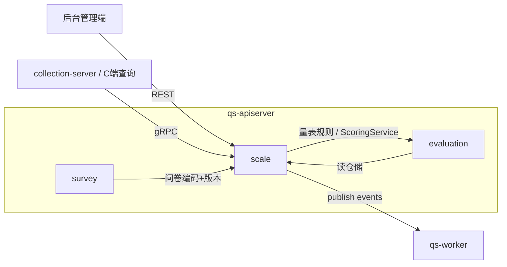
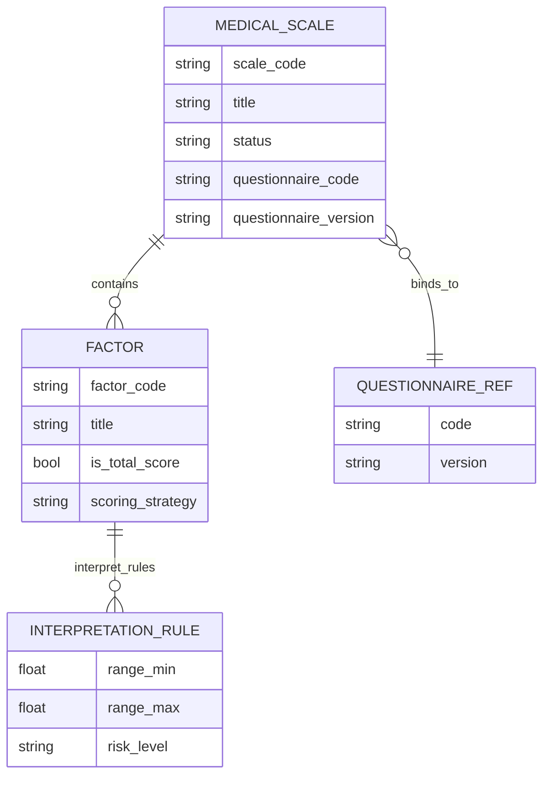
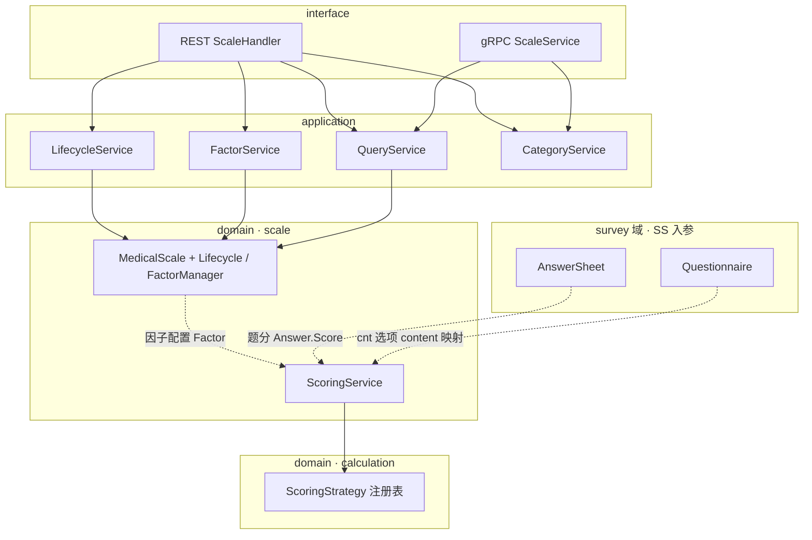
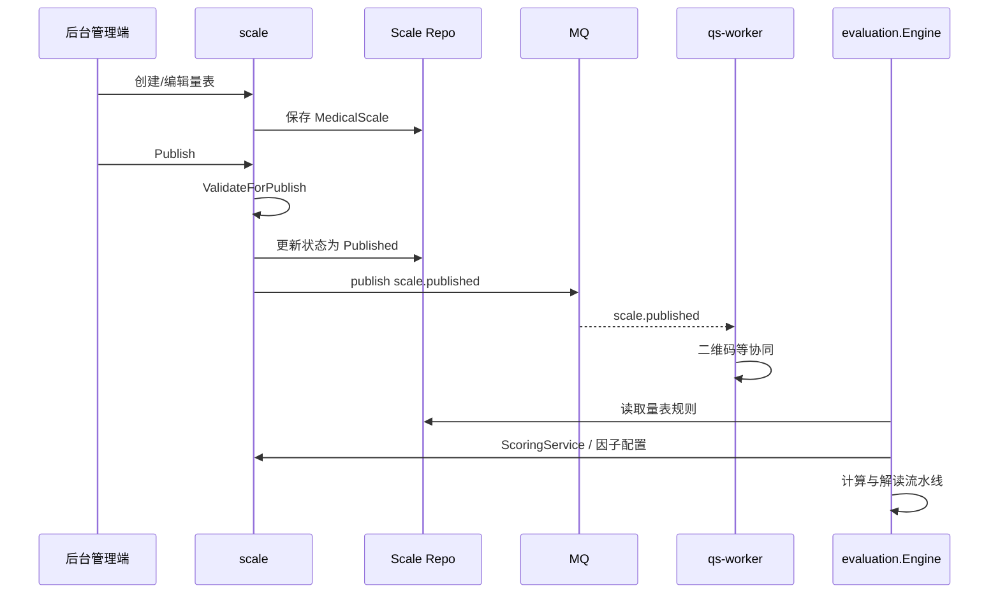

# scale

本文档按 [CONTRIBUTING-DOCS.md](../CONTRIBUTING-DOCS.md) 中的**业务模块推荐结构**撰写；写作时需覆盖的动机、命名、实现位置与可核对性，见该文「讲解维度」一节，本文正文不重复贴标签。

---

## 30 秒了解系统

### 概览

`scale` 是 `qs-apiserver` 里的**医学量表规则模块**：在「问卷 + 答卷事实」之上，定义 **因子、计分策略、解读区间与风险文案**，供 [evaluation](./03-evaluation.md) 在评估流水线中读取并执行。它**不**替代 [survey](./01-survey.md) 的题级粗分，而是消费「题已算好的分」再做 **因子级聚合与解读配置**。

代码主路径：`internal/apiserver/domain/scale`（`MedicalScale` 聚合、`Factor`、`ScoringService` 等）、`internal/apiserver/application/scale`（生命周期、因子编辑、查询）；量表持久化当前主要在 **MongoDB**（见下文「核心存储」）。因子聚合（sum / avg / cnt）委托 **`domain/calculation`** 的 `ScoringStrategy` 注册表；题级选项分仍来自 **答卷侧** `Answer.Score()`（依赖 survey 侧已写入的计分结果），见「核心设计」中 **「核心横切：题分 → 因子分 → 解读」**。

### 模块边界

| | 内容 |
| -- | ---- |
| **负责（摘要）** | 量表元数据与分类；问卷绑定（code + version）；因子与解读规则；生命周期与发布；`scale.*` 领域事件；已发布量表查询（含 C 端 gRPC） |
| **不负责（摘要）** | 问卷结构与答卷提交（[survey](./01-survey.md)）；`Assessment` 编排与报告生成（[evaluation](./03-evaluation.md)）；账号与监护（[actor](./05-actor.md) / `collection-server`） |
| **关联专题** | 三界与引用边界 [05-专题/01](../05-专题分析/01-测评业务模型：survey、scale、evaluation%20为什么分离.md)；异步链路 [05-专题/02](../05-专题分析/02-异步评估链路：从答卷提交到报告生成.md)；读侧缓存 [05-专题/03](../05-专题分析/03-保护层与读侧架构：限流、背压、缓存、统计预聚合.md) |

#### 负责什么（细项）

维护文档时**以本清单为模块职责真值**之一，与代码不一致时应改代码或改文。

- **量表生命周期**：创建、编辑基本信息、绑定问卷（编码 + 版本）、发布、下架（回草稿）、归档、删除（仅草稿可删）。
- **因子与解读**：因子增删改、批量替换、解读规则维护；发布前校验「至少一因子、总分因子唯一、非总分因子须挂题、解读规则非空」等（见 [validator.go](../../internal/apiserver/domain/scale/validator.go)）。
- **规则消费契约**：向 `evaluation` 提供可加载的 `MedicalScale` + `Factor`；领域层 `ScoringService.CalculateFactorScore` 在运行时用 **答卷 + 问卷** 计算因子分（见 [scoring_service.go](../../internal/apiserver/domain/scale/scoring_service.go)）。
- **事件与外围协同**：`scale.published` / `unpublished` / `updated` / `archived`；`worker` / `collection-server` 等消费者见 [configs/events.yaml](../../configs/events.yaml)。
- **查询与列表**：后台 REST + C 端 gRPC；已发布量表列表可经应用层缓存刷新（见 [global_list_cache.go](../../internal/apiserver/application/scale/global_list_cache.go)）。

#### 不负责什么（细项）

- **`AnswerSheet` 的保存与题级校验**：在 `survey`。
- **测评实例创建、引擎流水线、报告落库**：在 `evaluation`；`scale` 只提供**规则与领域计分服务**，不持有 `Assessment`。
- **统一身份与 BFF 策略**：在 `collection-server`。

### 契约入口

- **REST**：量表路径以 [api/rest/apiserver.yaml](../../api/rest/apiserver.yaml) 为准；Handler 见 [scale.go](../../internal/apiserver/interface/restful/handler/scale.go)、路由 [routers.go](../../internal/apiserver/routers.go)。
- **C 端 gRPC**：`GetScale` / `ListScales` / `GetScaleCategories` 等以 [scale.proto](../../internal/apiserver/interface/grpc/proto/scale/scale.proto) 与 [scale.go](../../internal/apiserver/interface/grpc/service/scale.go) 为准。
- **领域事件**：事件类型、Topic、handler 须与 [configs/events.yaml](../../configs/events.yaml) 一致；下文「核心契约」中有对照表便于 **Verify**。

### 运行时示意图

#### 运行时图说明

后台配置量表；C 端读已发布量表走 gRPC；`evaluation` 评估时从量表仓储读取规则并调用 `scale.ScoringService`；`worker` 消费 `scale.*` 等事件做二维码、缓存协同等（以 yaml 为准）。

### 主要代码入口（索引）

| 关注点 | 路径 |
| ------ | ---- |
| 装配 | [internal/apiserver/container/assembler/scale.go](../../internal/apiserver/container/assembler/scale.go) |
| 量表领域 | [internal/apiserver/domain/scale/](../../internal/apiserver/domain/scale/) |
| 计算子域（因子聚合） | [internal/apiserver/domain/calculation/](../../internal/apiserver/domain/calculation/) |
| 问卷领域（绑定与版本） | [internal/apiserver/domain/survey/questionnaire/](../../internal/apiserver/domain/survey/questionnaire/) |

---

## 模型与服务

与 [survey](./01-survey.md)、[evaluation](./03-evaluation.md) 一致，本节用 **ER 图**表达概念实体与对外引用，用 **分层图**对齐 interface → application → domain。

### 模型 ER 图

描述 `scale` 子域内主要概念（**非**与 Mongo 文档字段 1:1）。`MedicalScale` 通过 **问卷编码 + 版本** 引用 `survey` 侧的问卷（不内嵌题目树）；`Factor` 内嵌多条 `InterpretationRule` 值对象。

- **对外引用**：`QUESTIONNAIRE_REF` 表示「问卷 code + version」；与 [survey](./01-survey.md) 中 `Questionnaire` 版本语义一致。
- **持久化**：见下文「核心存储」。

### 领域模型与领域服务

#### 限界上下文

- **解决**：量表元数据与分类；因子与计分/解读规则；生命周期与发布；向评估侧提供**可执行规则**与**因子计分服务**。
- **不解决**：问卷模板与答卷提交；测评实例与报告全文；题级 `validation`/`calculation` 的细粒度契约（见 `survey`）。

#### 核心概念

| 概念 | 职责 | 与相邻概念的关系 |
| ---- | ---- | ---------------- |
| `MedicalScale` | 量表聚合根：状态、基本信息、问卷绑定、因子集合 | 发布/下架/归档驱动领域事件 |
| `Factor` | 实体：维度、题目编码列表、计分策略与参数、解读规则、是否总分 | `questionCodes` 指向问卷题目；`interpretRules` 为多条值对象 |
| `InterpretationRule` | 值对象：`ScoreRange` + `RiskLevel` + 结论/建议文案 | `ScoreRange` 为 **左闭右开** `[min, max)`（[types.go](../../internal/apiserver/domain/scale/types.go)） |
| `ScoringParams` | 计分参数（如 `cnt` 的 `cnt_option_contents`） | 随策略序列化入 Mongo（见 `ToMap` / `FromMap`） |

#### 量表元数据与分类（MedicalScale 除因子外）

除「问卷绑定 + 因子」外，聚合根还承载 **检索与展示用** 元数据；枚举与校验集中在 [types.go](../../internal/apiserver/domain/scale/types.go)，标题/描述/问卷绑定变更见 [baseinfo.go](../../internal/apiserver/domain/scale/baseinfo.go)。

| 维度 | 说明 | 典型锚点 |
| ---- | ---- | -------- |
| **主类 Category** | 量表主类（如 ADHD、情绪等常量）；与「开放类」判断 `IsOpen()` 配合，用于 C 端筛选语义 | `Category` / `AllCategories` |
| **阶段 Stage、适用年龄 ApplicableAge、填报人 Reporter** | 多选列表，可选；用于标注量表适用场景 | 各类型 `IsValid` |
| **标签 Tag** | 自由标签（最多约 50 字、格式校验见 `Tag.Validate`）；**不再**固定枚举，后台动态输入 | `WithTags` / `Tag.Validate` |
| **开放分类枚举** | gRPC/REST 给前端的下拉数据由 `CategoryService` 组装（`Category` 选项 + Stage/Age/Reporter 等） | [category_service.go](../../internal/apiserver/application/scale/category_service.go) |

> 这些字段**不参与** `ScoringService` 数学计算；发布前强校验仍以 [validator.go](../../internal/apiserver/domain/scale/validator.go) 中「因子 / 问卷 / 解读」为主，元数据多为可选或展示策略。

#### 主要领域服务（量表域内）

| 服务 | 职责摘要 | 锚点 |
| ---- | -------- | ---- |
| `Lifecycle` | 发布/下架/归档编排，发布前调 `Validator` | [lifecycle.go](../../internal/apiserver/domain/scale/lifecycle.go) |
| `Validator` | `ValidateForPublish`、因子与解读规则校验 | [validator.go](../../internal/apiserver/domain/scale/validator.go) |
| `FactorManager` | 因子增删改、批量替换与唯一性/总分约束 | [factor_manager.go](../../internal/apiserver/domain/scale/factor_manager.go) |
| `ScoringService` | 按因子策略从答卷收集题分并聚合 | [scoring_service.go](../../internal/apiserver/domain/scale/scoring_service.go) |

### 应用服务、领域服务与领域模型

**应用服务** 编排仓储、问卷仓储（绑定版本）、事件发布、列表缓存；**协议层**（REST / gRPC）只做 DTO 与路由。

| 应用服务 | 用途 | 目录锚点 |
| -------- | ---- | -------- |
| `LifecycleService` | 创建、更新基本信息、绑定问卷、发布/下架/归档/删除 | `application/scale/lifecycle_service.go` |
| `FactorService` | 因子 CRUD、批量替换、解读规则更新 | `application/scale/factor_service.go` |
| `QueryService` | 详情、列表、按问卷查、已发布量表与因子列表 | `application/scale/query_service.go` |
| `CategoryService` | 开放分类枚举等 | `application/scale/category_service.go` |

#### 分层图说明

- **写路径**：配置变更经 `LifecycleService` / `FactorService` 落聚合根；发布前 **领域校验** 失败则不可发布。
- **读路径**：查询可走带缓存的仓储装饰（见「核心模式」缓存节与 [05-专题/03](../05-专题分析/03-保护层与读侧架构：限流、背压、缓存、统计预聚合.md)）。
- **`ScoringService` 的依赖方向**：`CalculateFactorScore(ctx, factor, sheet, qnr)` **不**持有 `MedicalScale`；`Factor` 由调用方从已加载量表取出，`AnswerSheet` / `Questionnaire` 来自 **survey 域**。上图用虚线表示「数据入参」，避免误解为「计分服务只依赖聚合根」。
- **`ScoringService`**：供 [evaluation 管道](../../internal/apiserver/application/evaluation/engine/pipeline/factor_score.go) 调用，不在 scale 的 REST 层单独暴露为 HTTP。

---

## 核心设计

### 核心契约：REST、gRPC 与领域事件

#### 输入

- 后台 REST（示例路径）
  - `/api/v1/scales`、`/api/v1/scales/:code/factors`、`/api/v1/scales/:code/interpret-rules` 等
  - 路由入口：[routers.go](../../internal/apiserver/routers.go)、[scale.go](../../internal/apiserver/interface/restful/handler/scale.go)
- C 端 gRPC
  - 见 [scale.proto](../../internal/apiserver/interface/grpc/proto/scale/scale.proto)、[scale.go](../../internal/apiserver/interface/grpc/service/scale.go)
- 跨模块依赖
  - 发布前若问卷版本为空，从 [questionnaire.Repository](../../internal/apiserver/domain/survey/questionnaire/repository.go) 取最新版本并写回量表（[lifecycle_service.go](../../internal/apiserver/application/scale/lifecycle_service.go) `ensureQuestionnaireVersion`）

#### 输出

- `scale.published`
- `scale.unpublished`
- `scale.updated`
- `scale.archived`
   - 定义与事件载荷：[events.go](../../internal/apiserver/domain/scale/events.go)；类型常量来自 [eventconfig](../../internal/pkg/eventconfig/types.go)（与 yaml 字符串一致）。

**与 `configs/events.yaml` 对照（Verify）**：

| 事件类型 | Topic（yaml 字段 `topic`） | handler（yaml） | consumers（摘录） |
| -------- | -------------------------- | ----------------- | ------------------- |
| `scale.published` | `questionnaire-lifecycle` | `scale_published_handler` | `collection-server`、`qs-worker` |
| `scale.unpublished` | `questionnaire-lifecycle` | `scale_unpublished_handler` | 同上 |
| `scale.updated` | `questionnaire-lifecycle` | `scale_updated_handler` | `qs-worker` |
| `scale.archived` | `questionnaire-lifecycle` | `scale_archived_handler` | `collection-server`、`qs-worker` |

改事件名或 consumer 时须同步 **yaml**、领域 `events.go`、发布点与 worker 侧注册。

#### `scale.updated`：契约意图与代码核对

- **契约侧**：[configs/events.yaml](../../configs/events.yaml) 将 `scale.updated` 挂在 `questionnaire-lifecycle`，handler `scale_updated_handler`，消费者当前为 **`qs-worker`**（用于缓存协同等，以 yaml 为准）。
- **语义意图**：表示「量表内容已变更」、但**未必**发生发布/下架/归档（与 `scale.published` 等生命周期事件区分）。
- **代码核对（Verify）**：`NewScaleUpdatedEvent` 仅在 [events.go](../../internal/apiserver/domain/scale/events.go) 定义；**当前仓库内未检索到调用点**。`MedicalScale` 领域层仅对 **发布 / 下架 / 归档** 通过 `addEvent` 收集事件（见 [medical_scale.go](../../internal/apiserver/domain/scale/medical_scale.go) 中 `publish` / `unpublish` / `archive`）。若业务强依赖 `scale.updated` 投递，须确认是否应在「保存草稿/更新因子」等应用路径**补发布**，或以实际 MQ 观测为准。

### 核心链路：规则配置与评估消费

#### 量表配置链路

后台管理端通过 REST 进入 `ScaleHandler`，再由 `LifecycleService`、`FactorService` 编排 `MedicalScale` 与仓储。编辑阶段更新基本信息、问卷绑定、因子与解读；**发布**前执行 `ValidateForPublish`，通过后切换状态并发布领域事件。若问卷版本为空且已绑定问卷编码，**发布前**会尝试从问卷仓储 **补齐当前问卷版本**（见 `ensureQuestionnaireVersion`）。

#### 量表被评估链路消费

- `scale` 提供规则与**因子计分服务**；`evaluation` 负责整条评估编排与报告落库。

### 核心横切：题分 → 因子分 → 解读

`survey` 在答卷侧完成 **题级粗分**（`Answer.Score()`、`domain/calculation` 的选项映射路径，见 [01-survey](./01-survey.md)「核心横切」）。`scale` 在此基础上做 **因子级** 事：

| 层级 | 输入 | 做什么 | 代码锚点 |
| ---- | ---- | ------ | -------- |
| 题分 | `AnswerSheet` 上每题的 `Answer.Score()` | 已由 survey 侧写入，表示「该题在问卷选项配置下的得分」 | [answersheet](../../internal/apiserver/domain/survey/answersheet/) |
| 因子分（sum / avg） | `Factor.questionCodes` + 上表题分序列 | `collectQuestionScores` 再 `calculation.GetStrategy(Sum|Average)` | [scoring_service.go](../../internal/apiserver/domain/scale/scoring_service.go) |
| 因子分（cnt） | 因子指定 `cnt_option_contents` + 问卷选项 **content** + 答案选项 ID | 匹配题数转为 `[]float64`，再 `GetStrategy(Count)`；**必须**传入 `Questionnaire`（`qnr == nil` 会报错） | 同上 |
| 解读 | 因子得分 + `InterpretationRule` 区间 | `Matches(score)` 左闭右开；执行在 `evaluation` 管道（如 [interpretation.go](../../internal/apiserver/application/evaluation/engine/pipeline/interpretation.go)） | [interpretation_rule.go](../../internal/apiserver/domain/scale/interpretation_rule.go) |

**设计要点**：

- **不重复造题分**：`scale.ScoringService` **不**再调用 `survey` 的 `ScoringService` 重算题分，而是读 `Answer.Score()`；若题分为 0，需先排查问卷侧计分是否已写回。
- **calculation 的两条用法**：问卷粗分用 `OptionScorer` 路径；因子聚合用 **已注册 `ScoringStrategy`**（sum/avg/count），与 [01-survey](./01-survey.md) 中「同包异路径」描述一致。

### 核心模式与实现要点

#### 1. MedicalScale 是规则聚合，不是评估结果聚合

管理的是元数据、问卷绑定、因子与解读配置；**不包含** `Assessment` 或报告。好处：同一量表可被多次测评引用；规则演进与测评实例解耦。

#### 2. 因子是实体，解读规则是值对象

`Factor` 有稳定 `FactorCode`、可编辑生命周期与策略字段；`InterpretationRule` 描述区间与文案，通过 `IsValid` / `Matches` 参与校验与解读。

#### 3. 发布前验证 = 可执行性门槛

`ValidateForPublish`（[validator.go](../../internal/apiserver/domain/scale/validator.go)）至少包含：标题与 `code`、至少一因子、**恰好一个总分因子**、非总分因子须挂题、每因子至少一条有效解读规则、解读规则区间合法、**问卷编码与版本非空**。通过后，`evaluation` 读到的已发布量表才是「可执行配置」。

#### 4. 发布时补齐问卷版本 = 绑定问卷快照

`ensureQuestionnaireVersion`：若版本**为空**且已绑定问卷编码，则从问卷仓储取 **当前版本** 并写回量表再发布。若发布时版本已手工指定，则**不会**自动覆盖——运维上需理解「量表绑的是哪一版问卷」。

#### 5. 因子编辑通过 FactorManager 集中维护结构

`ReplaceFactors` 等路径保证因子编码唯一、总分因子唯一（[factor_manager.go](../../internal/apiserver/domain/scale/factor_manager.go)），避免 Handler 散落修改切片。

#### 6. 计分策略 sum / avg / cnt 与 `domain/calculation` 的对应关系

- **sum / avg**：`collectQuestionScores` → `calculation.GetStrategy(StrategyTypeSum)` / `StrategyTypeAverage`；策略缺失时代码中有**手动求和/求均值** fallback。
- **cnt**：按选项 **content** 是否属于 `ScoringParams.CntOptionContents` 将匹配题打成 1.0，再 `StrategyTypeCount`；依赖 `questionnaire` 构建 `optionID → content` 映射。

未知策略字符串会 **直接报错**，不静默降级（见 `CalculateFactorScore` 的 `default` 分支）。

#### 7. Scale → Evaluation 的字段映射与总分语义

**管道入口**：[FactorScoreHandler.Handle](../../internal/apiserver/application/evaluation/engine/pipeline/factor_score.go) 对每个 `MedicalScale.GetFactors()` 调用 `scale.ScoringService.CalculateFactorScore`，写入 `Context.FactorScores`，再计算 **`Context.TotalScore`**。

| 量表侧字段 | 评估侧用途（摘要） |
| ---------- | ------------------- |
| `Factor.questionCodes` | 从答卷选取参与计算的题分（经 `collectQuestionScores`） |
| `Factor.scoringStrategy`（sum/avg/cnt） | 驱动 `scale.ScoringService` 分支 |
| `Factor.interpretRules` | 经后续 [InterpretationHandler](../../internal/apiserver/application/evaluation/engine/pipeline/interpretation.go) 等做区间匹配与文案 |
| `Factor.isTotalScore` | 见下 **总分计算** |

**总分 `calculateTotalScore`**（[factor_score.go](../../internal/apiserver/application/evaluation/engine/pipeline/factor_score.go)）：

- 遍历因子得分结果时，若存在 **`IsTotalScore == true`**，**直接取该因子原始分作为总分**并 **`return`**（即 **第一个**命中者生效）。
- 若无任何总分因子，则 **累加全部因子原始分**。

与量表侧一致：`GetTotalScoreFactor()`（[medical_scale.go](../../internal/apiserver/domain/scale/medical_scale.go)）同样 **只返回第一个**总分因子；**批量替换因子**时 [FactorManager.ReplaceFactors](../../internal/apiserver/domain/scale/factor_manager.go) 强制 **至多一个**总分因子。发布校验要求「存在总分因子」，但不单独遍历排除重复——重复配置应通过因子编辑路径避免。

**其它管道锚点**：[interpretation.go](../../internal/apiserver/application/evaluation/engine/pipeline/interpretation.go)（解读与风险）。

#### 8. 查询侧：已发布量表缓存与双通道

- 仓储装饰：[scale_cache.go](../../internal/apiserver/infra/cache/scale_cache.go)
- 全局列表缓存：`ScaleListCache`（[global_list_cache.go](../../internal/apiserver/application/scale/global_list_cache.go)）

**隐含判断**：后台写低频、C 端读已发布量表高频；缓存围绕「已发布」与列表，而非编辑事务。

### 核心存储：MongoDB 与量表缓存

| 数据 | 存储 | 实现锚点 |
| ---- | ---- | -------- |
| 量表（含因子、解读规则等） | MongoDB | [infra/mongo/scale](../../internal/apiserver/infra/mongo/scale) |
| 量表读路径缓存 | Redis（装饰仓储） | [infra/cache/scale_cache.go](../../internal/apiserver/infra/cache/scale_cache.go) |

问卷缓存 TTL、开关等以各环境 [configs/apiserver.*.yaml](../../internal/apiserver.dev.yaml) 中 `cache` 相关键为准（与 [05-专题/03](../05-专题分析/03-保护层与读侧架构：限流、背压、缓存、统计预聚合.md) 互参）。

### 核心代码锚点索引

| 关注点 | 路径 |
| ------ | ---- |
| 装配 | [internal/apiserver/container/assembler/scale.go](../../internal/apiserver/container/assembler/scale.go) |
| 应用服务 | [internal/apiserver/application/scale/](../../internal/apiserver/application/scale/) |
| 领域 | [internal/apiserver/domain/scale/](../../internal/apiserver/domain/scale/) |
| 计算子域 | [internal/apiserver/domain/calculation/](../../internal/apiserver/domain/calculation/) |
| REST / gRPC | [internal/apiserver/interface/restful/handler/scale.go](../../internal/apiserver/interface/restful/handler/scale.go)、[internal/apiserver/interface/grpc/service/scale.go](../../internal/apiserver/interface/grpc/service/scale.go) |

---

## 边界与注意事项

### 常见误解

- `scale` 定义规则，`evaluation` 执行评估与报告；二者通过仓储读取与 `ScoringService` 调用衔接，**不是**「量表自己算完整报告」。
- 量表须绑定问卷，且 **发布校验要求问卷版本已填写**；若为空，发布流程会尝试从问卷仓储 **自动补齐**。
- 必须存在 **总分因子** 且 **唯一**，否则无法发布。
- `Answer.Score()` 为 0 时，因子分可能全为 0；应先确认 survey 侧题分是否已落库（异步补算等见 evaluation / worker）。
- 三界分工：[`survey` 提供问卷与答卷事实](./01-survey.md)，`scale` 提供量表规则，`evaluation` 执行测评。

### 维护时核对

- 变更 REST：同步 [api/rest/apiserver.yaml](../../api/rest/apiserver.yaml) 与 Handler。
- 变更 gRPC：同步 [scale.proto](../../internal/apiserver/interface/grpc/proto/scale/scale.proto) 与 `collection-server` 调用方。
- 变更事件或 Topic：同步 [configs/events.yaml](../../configs/events.yaml)、领域 `events.go`、发布点与 worker。
- 若开始实际发布 `scale.updated`：同步应用层发布点、`MedicalScale` 事件收集与 worker handler，并与本文「`scale.updated`」小节对齐。
- 变更因子计分语义或 `cnt` 参数：同步 `evaluation` 管道与本文「核心横切」表。

---

*写作约定见 [CONTRIBUTING-DOCS.md](../CONTRIBUTING-DOCS.md)。专题 01 对三界与问卷版本的**设计解释**见 [05-专题分析/01](../05-专题分析/01-测评业务模型：survey、scale、evaluation%20为什么分离.md)（接口真值仍以本文与代码为准）。*
