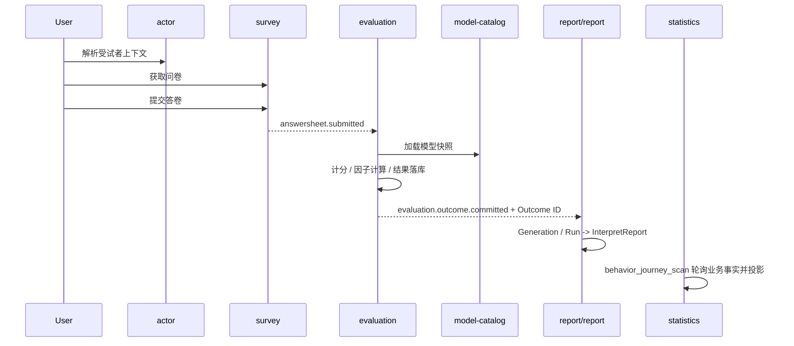
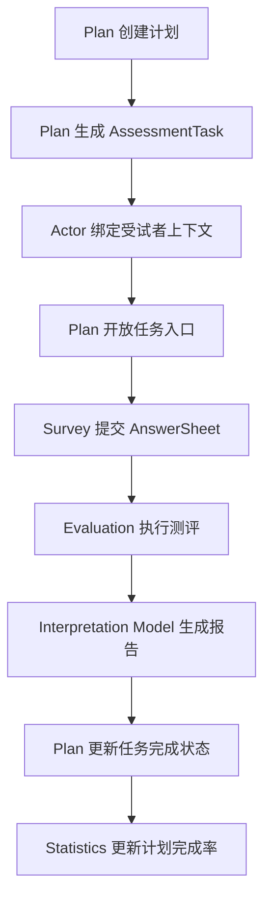
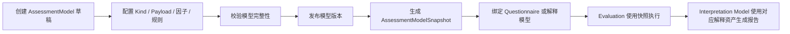

# 核心业务全链路

**本文回答**：一次测评从作答到报告，再到统计投影，在七个业务模块之间如何流转。

---

## 1. 一次性测评链路

### 1. 业务目标

用户完成一次问卷作答后，系统可靠地沉淀 `AnswerSheet`，异步执行测评，生成解释报告，并更新读侧统计。

### 2. 流程图



### 3. 关键规则

| 阶段 | 模块 | 规则 |
| ---- | ---- | ---- |
| 上下文解析 | `actor` | IAM 身份不是业务受试者，必须转成业务上下文 |
| 答卷提交 | `survey` | 提交后形成不可随意改写的 `AnswerSheet` 事实 |
| 模型加载 | `model-catalog` | 执行应使用发布快照，不直接读取可变配置 |
| 测评执行 | `evaluation` | 执行产出结构化结果，不维护最终报告文案 |
| 报告生成 | `interpretation` | 把执行结果转成用户可理解的 `InterpretReport`，不修改 Assessment |
| 统计投影 | `statistics` | 后台扫描业务事实更新读模型，允许最终一致 |

---

## 2. 周期测评链路

### 1. 业务目标

运营或从业者为受试者配置周期计划，系统按计划开放任务，用户完成答卷后进入同一条执行与报告链路。

### 2. 流程



### 3. 关键规则

`plan` 只负责任务生命周期和入口编排，不执行计分，不生成报告。任务完成可以引用 `AnswerSheetID`、`AssessmentID` 或报告标识，但这些事实仍归属对应核心模块。

---

## 3. 模型发布链路

### 1. 业务目标

把医学量表、人格模型或其它测评模型发布成可执行、可追溯、可被报告层解释的模型资产。

### 2. 流程



### 3. 关键规则

`AssessmentModel` 必须版本化。`Evaluation` 执行时必须引用模型快照，而不是直接读取可变配置，否则历史测评和报告无法追溯。

---

## 4. 报告查询链路

### 1. 业务目标

答卷提交后前端可以查询报告状态；执行和报告生成异步完成后，查询端返回最终报告。

### 2. 流程

```text
1. 目标提交用例同步持久化 AnswerSheet 并幂等创建 Assessment，返回两者 ID；当前代码仍由事件异步创建 Assessment。
2. Evaluation 异步执行，把 Assessment 推进到 `evaluated` 并持久化 EvaluationResult。
3. Interpretation Model / Report 写入 InterpretReport。
4. 查询端根据 Assessment + Report 投影读取 `evaluating / interpreting / completed`，或读取报告内容。
5. Statistics 异步更新报告生成、查看等读侧指标。
```

### 3. 异常处理

| 异常 | 归属模块 | 处理原则 |
| ---- | -------- | -------- |
| 答案结构非法 | `survey` | 拒绝提交，不进入执行链路 |
| 模型快照缺失 | `model-catalog` / `evaluation` | 执行失败并记录错误原因 |
| 执行临时失败 | `evaluation` | 按幂等键和重试策略补偿 |
| 报告生成失败 | `interpretation` | 保留执行结果，报告层单独恢复 |
| 统计未及时更新 | `statistics` | 允许最终一致，不影响主链路成功 |

---

## 5. 下一步阅读

- 作答事实：[10-survey/README.md](./10-survey/README.md)
- 模型资产：[20-model-catalog/README.md](./20-model-catalog/README.md)
- 执行状态：[30-evaluation/README.md](./30-evaluation/README.md)
- 报告解释：[40-interpretation/README.md](./40-interpretation/README.md)
