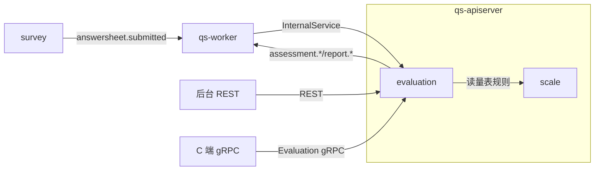
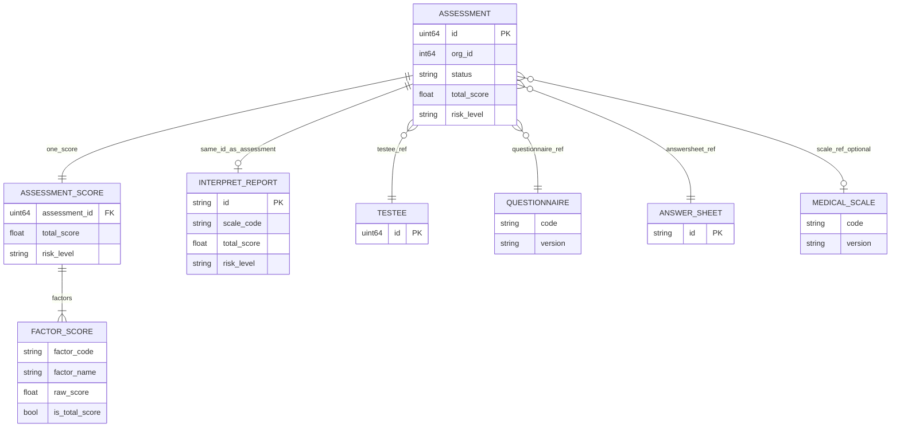
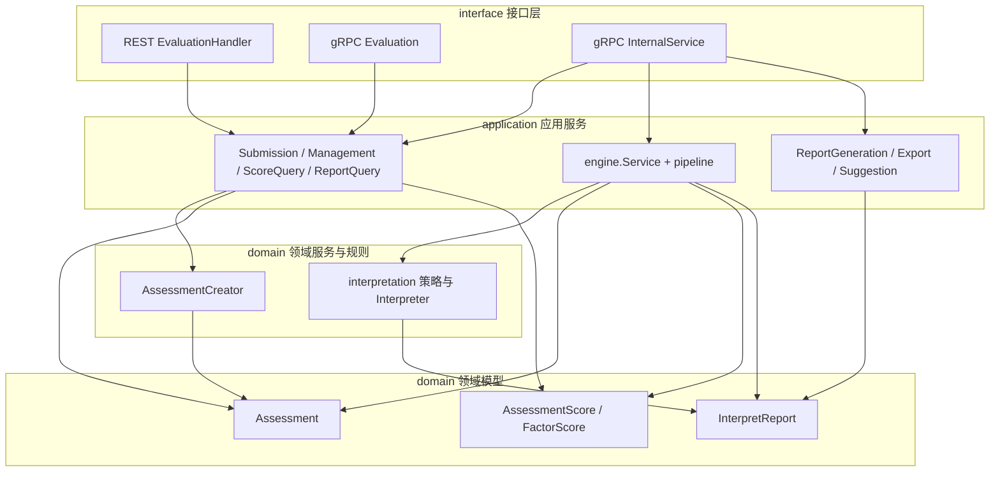
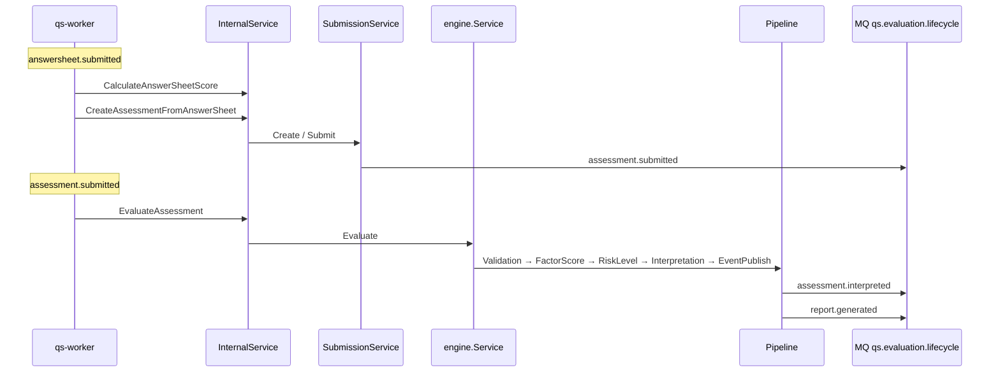

# evaluation（测评 / 评估）

**本文回答**：`evaluation` 模块负责把“已落库的答卷 + 量表规则”稳定推进为“测评状态、结构化得分、解读报告与后续事件”；这篇文档会先给出模块边界与重点速查，再展开模型、链路、契约和存储细节。

本文档按 [CONTRIBUTING-DOCS.md](../CONTRIBUTING-DOCS.md) 中的**业务模块推荐结构**撰写；写作时需覆盖的动机、命名、实现位置与可核对性，见该文「讲解维度」一节，本文正文不重复贴标签。

---

## 30 秒了解系统

### 概览

本模块把「已落库的答卷」与「量表规则」稳定地变成**可追踪的测评结果**（状态、得分、风险、解读、报告），并通过领域事件衔接统计、标签等下游，而不是只做问卷存储。

代码上主要落在 `internal/apiserver/domain/evaluation`、`application/evaluation`；运行上属于 **`qs-apiserver` 内嵌模块**，非独立进程。契约入口：[api/rest/apiserver.yaml](../../api/rest/apiserver.yaml)、[internal/apiserver/interface/grpc/proto](../../internal/apiserver/interface/grpc/proto)、[configs/events.yaml](../../configs/events.yaml)；下文表格可与之一一对照。

### 重点速查

如果只看一屏，先看下面这张表：

| 维度 | 结论 |
| ---- | ---- |
| 模块职责 | 管测评创建与状态机、评估引擎编排、得分与报告查询、`assessment.*` / `report.*` 事件 |
| 主入口 | 主链路入口通常是 `answersheet.submitted -> qs-worker -> InternalService`，不是用户直接 REST 建测评 |
| 核心对象 | `Assessment`、`AssessmentScore`、`InterpretReport` |
| 核心事件 | `assessment.submitted`、`assessment.interpreted`、`assessment.failed`、`report.generated` |
| 存储分层 | `Assessment` / `AssessmentScore` 在 MySQL；`InterpretReport` 在 MongoDB |
| 运行时边界 | worker 负责订阅和驱动，真正的评估与写库仍在 `qs-apiserver` 内完成 |

### 模块边界

| | 内容 |
| -- | ---- |
| **负责** | 测评创建与状态机、评估引擎编排、报告构建与查询、发布 `assessment.*` / `report.*` 等领域事件 |
| **不负责** | 问卷与答题采集（[survey](./01-survey.md)）；量表定义与计分规则权威源（[scale](./02-scale.md)，本模块消费）；账号主体（[actor](./05-actor.md)）；统计/标签等**消费侧**实现 |
| **关联专题** | 三界模型 [05-专题/01](../05-专题分析/01-测评业务模型：survey、scale、evaluation%20为什么分离.md)；全链路异步 [05-专题/02](../05-专题分析/02-异步评估链路：从答卷提交到报告生成.md) |

主链路入口通常不是「用户直接 REST 建测评」，而是 **答卷提交 → `answersheet.submitted` → `qs-worker` → Internal gRPC** 进入本模块；REST/gRPC 更多用于管理与 C 端查询。

### 运行时示意图

#### 运行时图说明

`qs-worker` 订阅 MQ 后**回调** `apiserver` 的 gRPC；评估计算与写库在 **apiserver 进程**内完成，worker 不复制一套领域写模型。

---

## 模型与服务

本节拆成两块：**模型 ER 图**单独描述数据与跨域引用；**应用服务 + 领域服务 + 领域模型**用一张分层图说明调用与依赖方向（与 ER 正交：前者偏存储与关系，后者偏运行时分层）。

### 模型 ER 图

描述 evaluation 子域内**概念实体**之间的关系，以及 `Assessment` 对外部限界（survey / scale / actor）的**引用**（实现上多为 ID、编码与版本号，**不**表示外域表在本库中的物理外键）。

`InterpretReport` 与 `Assessment` 在领域上 **1:1**，报告主键与测评 ID 对齐（见 [report.go](../../internal/apiserver/domain/evaluation/report/report.go)）。`AssessmentScore` / `FactorScore` 的物理表结构以 [infra/mysql/evaluation](../../internal/apiserver/infra/mysql/evaluation) 为准。

#### 报告与得分：真实落库位置与查询入口

| 对象 | 当前存储 | 为什么这样存 | 典型查询入口 |
| ---- | -------- | ------------ | ------------ |
| `Assessment` | MySQL `assessment` 表 | 流程状态、业务来源、跨域引用适合结构化事务存储；`answer_sheet_id` 还有唯一约束 | [assessment_repository.go](../../internal/apiserver/infra/mysql/evaluation/assessment_repository.go)、[management_service.go](../../internal/apiserver/application/evaluation/assessment/management_service.go) |
| `AssessmentScore` / `FactorScore` | MySQL `assessment_score` 表 | 需要按 `assessment_id`、`testee_id`、`factor_code` 做查询与趋势分析 | [score_repository.go](../../internal/apiserver/infra/mysql/evaluation/score_repository.go)、[score_query_service.go](../../internal/apiserver/application/evaluation/assessment/score_query_service.go) |
| `InterpretReport` | Mongo `interpret_reports` 集合 | 维度解读和建议列表是文档型结构，读取更偏报告视图 | [repo.go](../../internal/apiserver/infra/mongo/evaluation/repo.go)、[query_service.go](../../internal/apiserver/application/evaluation/report/query_service.go) |

对外讲解时若被问“报告和得分为什么不合并”，可以直接回答：`AssessmentScore` 偏结构化查询，`InterpretReport` 偏文档视图；它们都围绕 `AssessmentID` 协作，但服务的读取模式不同。

---

### 领域模型与领域服务

#### 限界上下文

- **解决**：一次测评的生命周期、异步评估流水线、解读与报告、领域事件。
- **不解决**：问卷结构、量表元数据权威、账号体系、下游统计实现细节。

#### 核心概念

| 概念 | 职责 | 与相邻概念的关系 |
| ---- | ---- | ---------------- |
| `Assessment` | 流程与状态、跨域引用 | 持 `QuestionnaireRef` / `AnswerSheetRef` / `MedicalScaleRef`，不内嵌 survey/scale 聚合 |
| `AssessmentScore` / `FactorScore` | 结构化得分 | 依附 Assessment，MySQL |
| `InterpretReport` | 解读与建议视图 | 与测评关联，MongoDB |
| `interpretation` | 解读规则与策略 | 与量表配置衔接 |
| `Origin` | adhoc / plan / screening 等 | 业务来源锚点，非装饰字段 |
| `engine` | 校验→计分→风险→解读→发事件 | 委托 scale / calculation |

#### 不变量与状态（概要）

- 状态机：`pending → submitted → interpreted` 或 `failed`；存在 `failed → submitted` 重试路径；不应从 `pending` 直跳 `interpreted`。
- 跨聚合创建规则集中在 `AssessmentCreator`，避免校验散落在 Handler。

#### 主要代码路径

- 聚合与事件：[internal/apiserver/domain/evaluation/assessment/assessment.go](../../internal/apiserver/domain/evaluation/assessment/assessment.go)、[events.go](../../internal/apiserver/domain/evaluation/assessment/events.go)
- 创建规则：[creator.go](../../internal/apiserver/domain/evaluation/assessment/creator.go)
- 报告：[report/report.go](../../internal/apiserver/domain/evaluation/report/report.go)、[builder.go](../../internal/apiserver/domain/evaluation/report/builder.go)
- 引用类型：[types.go](../../internal/apiserver/domain/evaluation/assessment/types.go)

---

### 应用服务、领域服务与领域模型

将「命令（提交/管理）」「查询」「引擎编排」「报告」拆开，避免单类膨胀。装配入口：`EvaluationModule` — [assembler/evaluation.go](../../internal/apiserver/container/assembler/evaluation.go)。

**应用服务（application）**：对外用例编排、事务边界、与 infra 协作；**领域服务（domain）**：跨聚合规则（如 `AssessmentCreator`）、解读策略等无状态或领域专属逻辑；**领域模型**：聚合根与实体，承载不变量与领域事件。评估 **pipeline** 位于 `application/evaluation/engine/pipeline`，通过 Handler 链调用 domain 与外部 scale/calculation。

| 类型 | 代表 | 目录锚点 |
| ---- | ---- | -------- |
| 应用服务 | Submission / Management、ReportQuery / ScoreQuery | `application/evaluation/assessment/` |
| 应用服务 | `engine.Service` 与 pipeline Handlers | `application/evaluation/engine/` |
| 应用服务 | ReportGeneration / Export / Suggestion | `application/evaluation/report/` |
| 领域服务 | `AssessmentCreator` 等 | `domain/evaluation/assessment/` |
| 领域模型 | `Assessment`、`InterpretReport`、`AssessmentScore` | `domain/evaluation/` |

#### 分层图说明

- **入口**：后台与 Internal 多走 `Submission`/`Management`/`engine`；C 端查询走 `ReportQuery`/`ScoreQuery` 等（以实际 Handler 注册为准）。
- **engine**：只表示依赖关系；pipeline 内各 Handler 顺序见下文「核心引擎：流水线与模块分工」。
- **infra / 事件发布**：由应用服务经容器注入仓储与 `EventPublisher`，图中省略，避免与 ER 图混淆。

---

## 核心设计

### 核心异步链路：从答卷到报告

入口请求保持短；重计算与写结果在后台推进。**worker 只负责订阅与触发**，业务写入仍经 `apiserver`。

先抓重点：这条链不是“worker 自己做评估”，而是 `worker` 订阅事件后回调 `InternalService`，再由 `apiserver` 内的 `engine.Service + pipeline` 完成真正评估。

#### Topic 与通道

Topic 配置键 `assessment-lifecycle`，运行时名称 **`qs.evaluation.lifecycle`**（见 [configs/events.yaml](../../configs/events.yaml) `topics.assessment-lifecycle.name`）。

| 步骤 | 动作 | RPC / 事件 | 实现锚点 |
| ---- | ---- | ----------- | -------- |
| 1 | 计分回写答卷 | `CalculateAnswerSheetScore` | [internal.go](../../internal/apiserver/interface/grpc/service/internal.go)；[answersheet_handler.go](../../internal/worker/handlers/answersheet_handler.go) |
| 2 | 建测评并提交 | `CreateAssessmentFromAnswerSheet` → `assessment.submitted` | [internal.go](../../internal/apiserver/interface/grpc/service/internal.go)；[events.go](../../internal/apiserver/domain/evaluation/assessment/events.go) |
| 3 | 执行评估 | `EvaluateAssessment` | [assessment_handler.go](../../internal/worker/handlers/assessment_handler.go)；[engine/service.go](../../internal/apiserver/application/evaluation/engine/service.go) |
| 4 | 流水线结束 | `assessment.interpreted`、`report.generated` | [pipeline/chain.go](../../internal/apiserver/application/evaluation/engine/pipeline/chain.go)；[report/events.go](../../internal/apiserver/domain/evaluation/report/events.go) |

#### 分支说明

无量表时 `AssessmentSubmittedData.NeedsEvaluation()` 为 false（[events.go](../../internal/apiserver/domain/evaluation/assessment/events.go)），可能不跑全链；改文档或行为前应对照 payload 与调用方。

---

### 核心契约：REST、gRPC 与领域事件

#### REST

`/evaluations/*`、`/assessments/*` 等以 [api/rest/apiserver.yaml](../../api/rest/apiserver.yaml) 为准；Handler [evaluation.go](../../internal/apiserver/interface/restful/handler/evaluation.go)，路由 [routers.go](../../internal/apiserver/routers.go)。

#### 对外 gRPC（Evaluation）

如 `GetMyAssessment`、`ListMyAssessments`、`GetAssessmentScores`、`GetAssessmentReport` — [evaluation.proto](../../internal/apiserver/interface/grpc/proto/evaluation/evaluation.proto)，实现 [evaluation.go](../../internal/apiserver/interface/grpc/service/evaluation.go)。

#### 对内 gRPC（InternalService）

[internal.proto](../../internal/apiserver/interface/grpc/proto/internalapi/internal.proto) 中与测评强相关：`CalculateAnswerSheetScore`、`CreateAssessmentFromAnswerSheet`、`EvaluateAssessment`；实现 [internal.go](../../internal/apiserver/interface/grpc/service/internal.go)。

#### 领域事件（须与配置一致）

事件类型字符串与 [`configs/events.yaml`](../../configs/events.yaml)、[eventconfig](../../internal/pkg/eventconfig) 对齐。

| 事件类型 | Topic（name） | handler（yaml） | 发布侧（概念） | consumers（yaml 节选） |
| -------- | -------------- | ----------------- | -------------- | ------------------------ |
| `answersheet.submitted` | `qs.evaluation.lifecycle` | `answersheet_submitted_handler` | 答卷提交流程 | `qs-worker` 等 |
| `assessment.submitted` | `qs.evaluation.lifecycle` | `assessment_submitted_handler` | 提交测评 | `qs-worker` 等 |
| `assessment.interpreted` | `qs.evaluation.lifecycle` | `assessment_interpreted_handler` | 引擎 | 多消费者 |
| `assessment.failed` | `qs.evaluation.lifecycle` | `assessment_failed_handler` | 失败路径 | logging 等 |
| `report.generated` | `qs.evaluation.lifecycle` | `report_generated_handler` | 引擎 | `qs-worker` 等 |
| `report.exported` | `qs.evaluation.lifecycle` | `report_exported_handler` | 导出 | `qs-worker` |

主异步闭环以 **`report.generated`** 为报告就绪信号；`report.exported` 存在但非本文主链路重点。

---

### 核心对象与不变量：引用、Origin、状态机

流程态与报告内容分离；跨模块只传**引用**以降低耦合与事件体积；`Origin` 支撑回溯与过滤。

#### 实现位置

- 引用：`QuestionnaireRef`、`AnswerSheetRef`、`MedicalScaleRef` — [types.go](../../internal/apiserver/domain/evaluation/assessment/types.go)
- 状态与重试：[assessment.go](../../internal/apiserver/domain/evaluation/assessment/assessment.go)
- `AssessmentCreator` 跨聚合校验 — [creator.go](../../internal/apiserver/domain/evaluation/assessment/creator.go)

---

### 核心引擎：流水线与模块分工

流水线把评估拆成可替换步骤，顺序在代码中显式可读，避免单函数堆叠。

#### 处理器顺序

以仓库实现为准：`ValidationHandler` → `FactorScoreHandler` → `RiskLevelHandler` → `InterpretationHandler` → `EventPublishHandler`。

#### 入口

[service.go](../../internal/apiserver/application/evaluation/engine/service.go)、[pipeline/chain.go](../../internal/apiserver/application/evaluation/engine/pipeline/chain.go)

#### 与 scale、calculation 的职责边界

- **evaluation**：评估**编排**。
- **scale**：因子「如何计分」的规则解释 — [scoring_service.go](../../internal/apiserver/domain/scale/scoring_service.go)
- **calculation**：通用数学策略 — [calculation](../../internal/apiserver/domain/calculation)
- 因子分入口：[pipeline/factor_score.go](../../internal/apiserver/application/evaluation/engine/pipeline/factor_score.go)

#### 解读链路

量表规则 → `InterpretConfig` → 策略执行 — [pipeline/interpretation.go](../../internal/apiserver/application/evaluation/engine/pipeline/interpretation.go)、[interpretation/](../../internal/apiserver/domain/evaluation/interpretation/)

#### 报告构建

计算与展示结构分离 — [report/builder.go](../../internal/apiserver/domain/evaluation/report/builder.go)

---

### 核心存储与缓存：MySQL、MongoDB、Redis

事务态与结构化得分适合关系库；报告文档适合文档库；热点读用缓存降载。

| 数据 | 存储 | 路径 |
| ---- | ---- | ---- |
| Assessment、Score | MySQL | [infra/mysql/evaluation](../../internal/apiserver/infra/mysql/evaluation) |
| Report | MongoDB | [infra/mongo/evaluation](../../internal/apiserver/infra/mongo/evaluation) |

#### 相关配置（apiserver）

`cache.disable_evaluation_cache`、`cache.ttl.assessment_detail`、`cache.ttl.assessment_status` — 见 [configs/apiserver.dev.yaml](../../configs/apiserver.dev.yaml)（prod 同理）。

---

### 核心代码锚点索引

| 关注点 | 路径 |
| ------ | ---- |
| 模块装配 | [internal/apiserver/container/assembler/evaluation.go](../../internal/apiserver/container/assembler/evaluation.go) |
| 应用服务 | [internal/apiserver/application/evaluation/](../../internal/apiserver/application/evaluation/) |
| 领域 | [internal/apiserver/domain/evaluation/](../../internal/apiserver/domain/evaluation/) |
| 接口 | [handler/evaluation.go](../../internal/apiserver/interface/restful/handler/evaluation.go)、[grpc/service/evaluation.go](../../internal/apiserver/interface/grpc/service/evaluation.go)、[grpc/service/internal.go](../../internal/apiserver/interface/grpc/service/internal.go) |

---

## 边界与注意事项

### 常见误解

勿把 evaluation 当作「唯一计分中心」——规则在 scale/calculation；勿忽略 **worker 只触发、apiserver 内执行** 的边界。

### 分支行为

无量表时可能缩短或跳过引擎链；以 `NeedsEvaluation()` 与代码为准。

### 维护时核对

改事件名或 handler 须同步 **`configs/events.yaml`**、领域 `events.go`、worker [handlers/registry.go](../../internal/worker/handlers/registry.go)；全链路交叉验证见 [05-专题/02](../05-专题分析/02-异步评估链路：从答卷提交到报告生成.md)。

---

*写作约定见 [CONTRIBUTING-DOCS.md](../CONTRIBUTING-DOCS.md)。*
