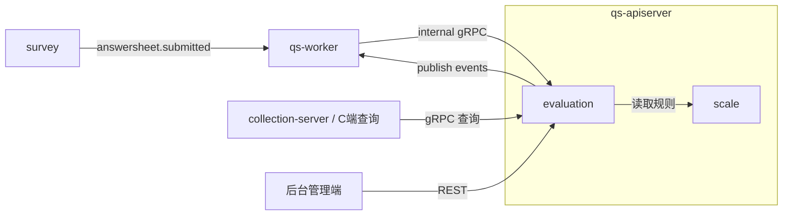
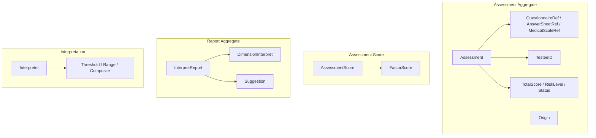
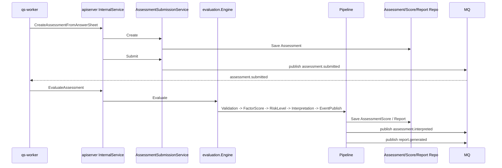

# evaluation

本文介绍 `evaluation` 模块的职责边界、模型组织、输入输出和主链路。

## 30 秒了解系统

`evaluation` 是 `qs-apiserver` 里的测评模块，负责把“答卷”转成“测评结果”。

它当前包含三类核心能力：

- `Assessment`：管理一次测评的创建、提交、评估、完成或失败
- `engine`：执行异步评估流程，产出得分、风险等级和报告
- `Report / Query`：保存报告并对外提供报告、得分和趋势查询

它不是独立进程，而是 `apiserver` 容器中的业务模块。实际主链路通常从 `survey` 的 `answersheet.submitted` 事件开始，经 `worker` 回调进入 `evaluation`。

核心代码入口：

- [internal/apiserver/container/assembler/evaluation.go](../../internal/apiserver/container/assembler/evaluation.go)
- [internal/apiserver/domain/evaluation/assessment](../../internal/apiserver/domain/evaluation/assessment)
- [internal/apiserver/application/evaluation/engine/service.go](../../internal/apiserver/application/evaluation/engine/service.go)
- [internal/apiserver/domain/evaluation/report](../../internal/apiserver/domain/evaluation/report)

## 模块边界

### 负责什么

- 创建测评：根据答卷、问卷、量表和来源信息生成 `Assessment`
- 管理测评状态：`pending -> submitted -> interpreted / failed`
- 执行评估：计算因子得分、风险等级、解读结论并生成报告
- 保存查询结果：提供测评详情、得分详情、趋势、高风险因子和报告查询
- 发布评估相关事件，驱动后续统计、标签和通知链路

### 不负责什么

- 问卷结构和答卷采集：在 `survey`
- 量表配置本身：在 `scale`
- 用户和受试者身份信息：在 `actor`
- 统计、预警、标签等后续消费动作：由 `worker` 或其他模块处理

### 运行时位置

## 模型与服务组织

### 模型

`evaluation` 当前可以理解成“一个流程聚合 + 一个结果聚合 + 两组无状态领域能力”：

- `Assessment`
  - 聚合根：
    [internal/apiserver/domain/evaluation/assessment/assessment.go](../../internal/apiserver/domain/evaluation/assessment/assessment.go)
  - 管理测评引用、来源、状态、总分、风险等级和领域事件
- `InterpretReport`
  - 聚合根：
    [internal/apiserver/domain/evaluation/report/report.go](../../internal/apiserver/domain/evaluation/report/report.go)
  - 管理总体结论、维度解读和建议列表
- `interpretation`
  - 解读规则与策略：
    [internal/apiserver/domain/evaluation/interpretation](../../internal/apiserver/domain/evaluation/interpretation)
- `assessment score`
  - 因子得分和值对象定义：
    [internal/apiserver/domain/evaluation/assessment/score.go](../../internal/apiserver/domain/evaluation/assessment/score.go)

### 服务

`evaluation` 的服务组织比 `survey` 更偏“流程编排”：

- `Assessment` 应用服务
  - `SubmissionService`
    [internal/apiserver/application/evaluation/assessment/submission_service.go](../../internal/apiserver/application/evaluation/assessment/submission_service.go)
  - `ManagementService`
    [internal/apiserver/application/evaluation/assessment/management_service.go](../../internal/apiserver/application/evaluation/assessment/management_service.go)
  - `ReportQueryService`
    [internal/apiserver/application/evaluation/assessment/report_query_service.go](../../internal/apiserver/application/evaluation/assessment/report_query_service.go)
  - `ScoreQueryService`
    [internal/apiserver/application/evaluation/assessment/score_query_service.go](../../internal/apiserver/application/evaluation/assessment/score_query_service.go)
- `engine`
  - 入口：
    [internal/apiserver/application/evaluation/engine/service.go](../../internal/apiserver/application/evaluation/engine/service.go)
  - 负责执行完整评估链
- `report`
  - `ReportGenerationService`
  - `ReportExportService`
  - `SuggestionService`
  - 装配入口：
    [internal/apiserver/container/assembler/evaluation.go](../../internal/apiserver/container/assembler/evaluation.go)

模块装配入口：

- [internal/apiserver/container/assembler/evaluation.go](../../internal/apiserver/container/assembler/evaluation.go)

这套组织的重点是：

- `Assessment` 管流程状态
- `engine` 管异步评估编排
- 查询服务把“测评过程”与“结果读取”分开
- 报告生成能力虽然属于 `evaluation`，但实际落在引擎处理链里完成

## 接口输入与事件输出

### 输入

- 后台 REST
  - `/api/v1/evaluations/assessments`
  - `/api/v1/evaluations/scores/trend`
  - `/api/v1/evaluations/reports`
  - 路由入口：
    [internal/apiserver/routers.go](../../internal/apiserver/routers.go)
    [internal/apiserver/interface/restful/handler/evaluation.go](../../internal/apiserver/interface/restful/handler/evaluation.go)
- C 端 gRPC 查询
  - `GetMyAssessment`
  - `ListMyAssessments`
  - `GetAssessmentScores`
  - `GetAssessmentReport`
  - 入口：
    [internal/apiserver/interface/grpc/service/evaluation.go](../../internal/apiserver/interface/grpc/service/evaluation.go)
- internal gRPC
  - `CreateAssessmentFromAnswerSheet`
  - `EvaluateAssessment`
  - 入口：
    [internal/apiserver/interface/grpc/service/internal.go](../../internal/apiserver/interface/grpc/service/internal.go)
    [internal/worker/handlers/answersheet_handler.go](../../internal/worker/handlers/answersheet_handler.go)
    [internal/worker/handlers/assessment_handler.go](../../internal/worker/handlers/assessment_handler.go)

### 输出

- `assessment.submitted`
- `assessment.interpreted`
- `report.generated`
  - 事件定义：
    [internal/apiserver/domain/evaluation/assessment/events.go](../../internal/apiserver/domain/evaluation/assessment/events.go)
    [internal/apiserver/domain/evaluation/report/events.go](../../internal/apiserver/domain/evaluation/report/events.go)

此外，`assessment.failed` 事件在领域模型中已定义，但当前主运行时链路更应关注 `assessment.submitted -> assessment.interpreted -> report.generated` 这条异步主线。

当前代码里，`report.exported` 事件已定义，但导出链路仍未成为主要运行时路径，不应当写成当前主链路。

### 评估链是事件驱动启动的

`evaluation` 的“创建测评”入口通常不是用户直接调用 REST，而是 `worker` 在消费 `answersheet.submitted` 后，通过 internal gRPC 回调 `CreateAssessmentFromAnswerSheet` 进入模块。也就是说，`evaluation` 在真实运行时里更像一个被事件驱动的后台流程模块，而不是单纯的查询接口模块。

## 核心业务链路

### 从答卷到测评

`worker` 消费 `answersheet.submitted` 后，先调用 `CalculateAnswerSheetScore` 回写答卷分数，再调用 `CreateAssessmentFromAnswerSheet` 创建测评。若问卷关联量表，`InternalService` 会自动提交该测评，进而发布 `assessment.submitted`。

### 从测评到报告

这条链路里有两个关键边界：

- `evaluation` 负责“测评流程”和“测评结果”
- `worker` 负责驱动异步执行，但不直接写 `evaluation` 的核心数据

## 关键设计点

### 1. Assessment 是流程聚合，不是结果文档

`Assessment` 的核心职责不是保存完整报告，而是表示“一次测评行为”：

- 它记录谁做的、基于哪份问卷和答卷、来自哪个业务场景
- 它管理 `pending -> submitted -> interpreted / failed` 的状态机
- 它发布 `assessment.submitted / interpreted / failed` 等事件

关键代码：

- [internal/apiserver/domain/evaluation/assessment/assessment.go](../../internal/apiserver/domain/evaluation/assessment/assessment.go)
- [internal/apiserver/domain/evaluation/assessment/events.go](../../internal/apiserver/domain/evaluation/assessment/events.go)

这样拆的价值在于：

- “流程状态”与“报告内容”不会被塞进同一个超大对象
- 异步链路可以围绕 `Assessment` 状态推进来运转
- 查询报告和管理测评时，可以明确区分读的是什么对象

### 2. 引用对象把跨聚合依赖压成稳定边界

`Assessment` 需要关联问卷、答卷和量表，但当前代码并没有直接持有这些聚合，而是只保存轻量引用：

- `QuestionnaireRef`
- `AnswerSheetRef`
- `MedicalScaleRef`

关键代码：

- [internal/apiserver/domain/evaluation/assessment/types.go](../../internal/apiserver/domain/evaluation/assessment/types.go)
- [internal/apiserver/domain/evaluation/assessment/assessment.go](../../internal/apiserver/domain/evaluation/assessment/assessment.go)

这层设计的价值不只是“少存几个字段”，而是明确了 `evaluation` 和其他模块的边界：

- `evaluation` 只依赖跨聚合最小必要信息，不直接持有 `survey / scale` 的完整对象
- 引用对象可以独立做存在性和一致性校验，避免把外部聚合生命周期拖进来
- 持久化和事件载荷更轻，异步链路不需要为了一个测评把整份问卷或量表一起搬运

这也是为什么 `Assessment` 里保存的是“问卷编码 + 版本”“答卷 ID”“量表 ID / 编码”这类引用，而不是跨模块对象树。

### 3. 测评创建通过领域服务做跨聚合编排

`Assessment` 不是直接 `new` 出来就完事。创建测评时，模块需要同时确认：

- 受试者是否存在
- 问卷是否存在且已发布
- 答卷是否存在且属于该问卷
- 若有关联量表，量表是否与该问卷匹配

当前代码把这类跨聚合验证封装进 `AssessmentCreator`：

- [internal/apiserver/domain/evaluation/assessment/creator.go](../../internal/apiserver/domain/evaluation/assessment/creator.go)

这使得应用服务能保持清晰：

- `SubmissionService` 负责 DTO、持久化和缓存更新
- `AssessmentCreator` 负责领域级创建规则

这比把验证逻辑散落在 Handler、Service 和 Repo 里更稳，也更适合后续扩展新的 `Origin` 来源类型。

### 4. Origin 不是附属字段，而是评估链路的业务来源锚点

`Origin` 当前支持三种来源：

- `adhoc`
  - 后台手动创建的一次性测评
- `plan`
  - 来自测评计划，需要保留计划关联
- `screening`
  - 为筛查场景预留的来源类型

关键代码：

- [internal/apiserver/domain/evaluation/assessment/types.go](../../internal/apiserver/domain/evaluation/assessment/types.go)
- [internal/apiserver/domain/evaluation/assessment/creator.go](../../internal/apiserver/domain/evaluation/assessment/creator.go)

`Origin` 的作用不只是“做个枚举”：

- 它决定测评如何回溯到上游业务场景
- 它为统计、列表过滤和权限判断提供来源语义
- 它让 `plan` 和 `evaluation` 之间保持“引用关联”，而不是共享生命周期

这样 `originType` 才不会退化成一个可有可无的标签字段。

### 5. 状态机刻意保持窄口径，但保留显式重试路径

当前 `Assessment` 的主状态机非常收敛：

- `pending -> submitted`
- `submitted -> interpreted`
- `submitted -> failed`

同时，当前代码还保留了一条显式重试路径：

- `failed -> submitted`

关键代码：

- [internal/apiserver/domain/evaluation/assessment/types.go](../../internal/apiserver/domain/evaluation/assessment/types.go)
- [internal/apiserver/domain/evaluation/assessment/assessment.go](../../internal/apiserver/domain/evaluation/assessment/assessment.go)

这里真正值得写进文档的是两个判断：

- 正常主链路必须先提交再评估，不能从 `pending` 直接跳到 `interpreted`
- `failed` 在业务上通常表示一次评估失败结束，但在代码上不是绝对不可恢复终态，模块明确提供了 `RetryFromFailed`

这套设计让主流程保持简单，同时给运维性失败留下了受控重试入口。

### 6. 评估引擎采用处理器链，而不是一个巨型函数

当前 `engine.Service` 最重要的设计不是“能算分”，而是它把整个评估过程拆成了一条稳定处理链：

- `ValidationHandler`
- `FactorScoreHandler`
- `RiskLevelHandler`
- `InterpretationHandler`
- `EventPublishHandler`

关键代码：

- [internal/apiserver/application/evaluation/engine/service.go](../../internal/apiserver/application/evaluation/engine/service.go)
- [internal/apiserver/application/evaluation/engine/pipeline/chain.go](../../internal/apiserver/application/evaluation/engine/pipeline/chain.go)

这种设计的价值是：

- 每一步职责单一，出错点清晰
- 引擎扩展时通常只需要新增或替换处理器
- 流程顺序在代码里是显式的，不需要从一个超长函数里反推

### 7. 因子计分由 evaluation 编排，但规则不完全属于 evaluation

在评估链里，因子计分的编排发生在 `evaluation`，但规则来源和底层执行并不都属于 `evaluation`。

当前代码里，`FactorScoreHandler` 负责“从答卷和量表出发，得到因子得分”，但真正的计分规则执行委托给了 `scale.ScoringService`，而底层又会复用 `domain/calculation`：

- 处理器入口：
  [internal/apiserver/application/evaluation/engine/pipeline/factor_score.go](../../internal/apiserver/application/evaluation/engine/pipeline/factor_score.go)
- 量表计分服务：
  [internal/apiserver/domain/scale/scoring_service.go](../../internal/apiserver/domain/scale/scoring_service.go)
- 通用计算策略：
  [internal/apiserver/domain/calculation](../../internal/apiserver/domain/calculation)

这意味着：

- `evaluation` 负责评估编排
- `scale` 负责解释“一个因子该怎么计分”
- `calculation` 负责通用数学策略

只有把这个边界看清，才不会把 `evaluation` 误解成“拥有全部计分规则”的模块。

### 8. 解读层是独立规则系统，并带默认回退

风险等级和文本结论不是在 Handler 里硬编码的。当前实现里，`InterpretationHandler` 会把量表中的解读规则转换成 `interpretation.InterpretConfig`，再交给默认解读器和策略系统执行：

- [internal/apiserver/application/evaluation/engine/pipeline/interpretation.go](../../internal/apiserver/application/evaluation/engine/pipeline/interpretation.go)
- [internal/apiserver/domain/evaluation/interpretation/interpreter.go](../../internal/apiserver/domain/evaluation/interpretation/interpreter.go)
- [internal/apiserver/domain/evaluation/interpretation/strategy.go](../../internal/apiserver/domain/evaluation/interpretation/strategy.go)

这里有两个很重要的权衡：

- 优先使用量表配置的解读规则
- 若规则不存在或匹配失败，则回退到默认解读提供者，而不是直接中断整条链路

所以它既是规则驱动的，又保留了运行时的稳健性。

### 9. 报告生成使用 Builder，把“结果组织”从评估流程中抽出来

报告不是在引擎里随手拼一个结构体，而是通过 `ReportBuilder` 构建：

- [internal/apiserver/domain/evaluation/report/builder.go](../../internal/apiserver/domain/evaluation/report/builder.go)

它负责把这些信息组织成最终报告：

- 总分与总体风险
- 各因子的维度解读
- 来自因子解读配置和建议生成器的建议

这种设计的价值在于：

- 评估流程负责产出结果
- 报告构建负责组织结果的表现形式
- 后续如果要增强建议策略或调整报告结构，不必把引擎主流程改得很重

### 10. 混合存储反映了流程数据和结果数据的不同特性

`evaluation` 当前不是单库设计，而是按数据特性拆存储：

- `Assessment` 和 `Score`
  - MySQL
  - [internal/apiserver/infra/mysql/evaluation](../../internal/apiserver/infra/mysql/evaluation)
- `Report`
  - MongoDB
  - [internal/apiserver/infra/mongo/evaluation](../../internal/apiserver/infra/mongo/evaluation)

这个设计背后的理由很明确：

- 测评状态和得分更适合事务型、结构化存储
- 报告内容更适合文档型、灵活结构存储

同时，`Assessment` 侧还叠加了状态缓存与“我的测评列表”缓存，这说明当前运行时最重视的是测评状态查询和用户侧列表读取体验。

## 边界与注意事项

- `evaluation` 是流程模块，不只是“报告查询模块”。
- 纯问卷模式下，测评可以存在，但不会进入完整评估链。
- 当前主链路里真正发布的报告事件是 `report.generated`，`report.exported` 仍不是主要运行时能力。
- 阅读 `evaluation` 时，需要把 `Calculation` 理解为一组被评估链复用的通用计算能力；当前实现里计分职责已经部分落在 `scale` 和 `domain/calculation`。
- 阅读 `evaluation` 时，最好把 `survey -> worker -> evaluation -> worker` 当成一条完整链路来看，而不是只看单个 Handler 或 Service。
