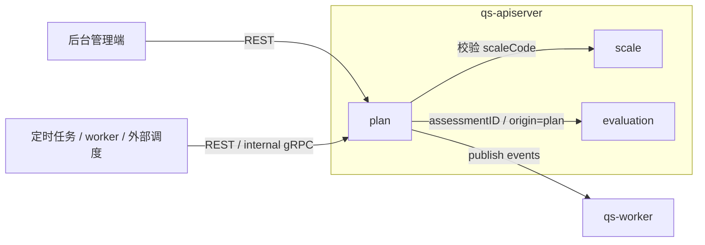
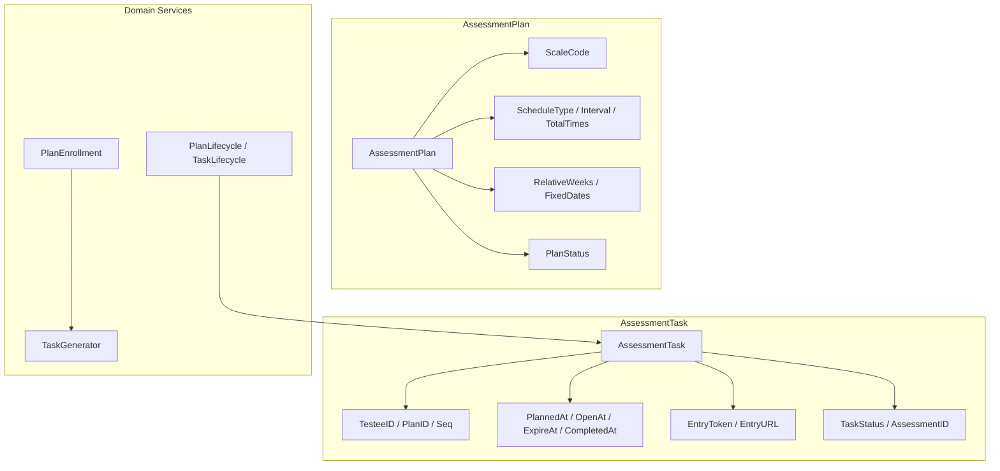
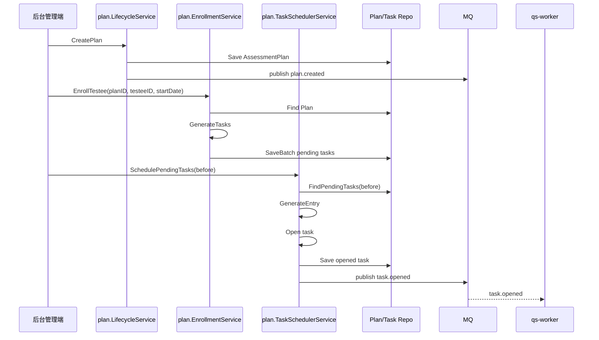

# plan

本文介绍 `plan` 模块的职责边界、模型组织、输入输出和主链路。

## 30 秒了解系统

`plan` 是 `qs-apiserver` 里的测评计划模块，负责把“周期性测评策略”落成“某个受试者在某个时间点要做的一次任务”。

它当前主要做四件事：

- 管理测评计划模板，包括量表绑定、周期策略和生命周期
- 让受试者加入计划，并一次性生成该受试者的全部待执行任务
- 在任务到达计划时间后生成入口链接并开放任务
- 记录任务完成、过期、取消等状态，供后续统计和通知消费

它不是独立进程，而是 `apiserver` 容器中的业务模块。运行时里，`plan` 更像“周期性测评编排模块”，不是单纯的 cron 子系统，也不是测评结果模块。

核心代码入口：

- [internal/apiserver/container/assembler/plan.go](../../internal/apiserver/container/assembler/plan.go)
- [internal/apiserver/domain/plan/assessment_plan.go](../../internal/apiserver/domain/plan/assessment_plan.go)
- [internal/apiserver/domain/plan/assessment_task.go](../../internal/apiserver/domain/plan/assessment_task.go)
- [internal/apiserver/application/plan/task_scheduler_service.go](../../internal/apiserver/application/plan/task_scheduler_service.go)

## 模块边界

### 负责什么

- 计划模板管理：维护计划绑定的 `scaleCode`、周期类型、间隔、次数和计划状态
- 受试者加入/退出计划：按 `startDate` 为某个受试者生成或终止任务
- 任务调度：扫描待开放任务，生成入口令牌和链接，开放任务
- 任务生命周期管理：开放、完成、过期、取消
- 对外提供计划与任务的后台查询

### 不负责什么

- 问卷结构和答卷采集：在 `survey`
- 量表规则定义：在 `scale`
- 测评创建、评估执行和报告生成：在 `evaluation`
- 用户身份、受试者身份和组织鉴权：在 `actor` / IAM
- 通知、统计、预警等计划事件的后续动作：由 `worker` 或其他模块消费

### 运行时位置

## 模型与服务组织

### 模型

`plan` 当前可以理解成“一个模板聚合 + 一个运行时任务实体 + 三组围绕任务生成/调度的领域能力”：

- `AssessmentPlan`
  - 聚合根：
    [internal/apiserver/domain/plan/assessment_plan.go](../../internal/apiserver/domain/plan/assessment_plan.go)
  - 表示周期性测评策略模板，管理量表绑定、周期规则和计划状态
- `AssessmentTask`
  - 实体：
    [internal/apiserver/domain/plan/assessment_task.go](../../internal/apiserver/domain/plan/assessment_task.go)
  - 表示“某个受试者的第 N 次测评任务”，管理开放、完成、过期、取消和入口信息
- `TaskGenerator`
  - 任务生成器：
    [internal/apiserver/domain/plan/task_generator.go](../../internal/apiserver/domain/plan/task_generator.go)
  - 按计划策略和 `startDate` 计算任务时间点
- `PlanEnrollment`
  - 受试者加入计划领域服务：
    [internal/apiserver/domain/plan/plan_enrollment.go](../../internal/apiserver/domain/plan/plan_enrollment.go)
  - 负责加入计划、终止参与
- `PlanLifecycle` / `TaskLifecycle`
  - 生命周期领域服务：
    [internal/apiserver/domain/plan/plan_lifecycle.go](../../internal/apiserver/domain/plan/plan_lifecycle.go)
    [internal/apiserver/domain/plan/task_lifecycle.go](../../internal/apiserver/domain/plan/task_lifecycle.go)
  - 负责计划暂停/恢复和任务状态迁移

### 服务

`plan` 的应用服务按“模板管理、受试者加入、任务调度、任务管理、查询”五条线组织：

- `LifecycleService`
  - [internal/apiserver/application/plan/lifecycle_service.go](../../internal/apiserver/application/plan/lifecycle_service.go)
  - 负责创建、暂停、恢复、取消计划
- `EnrollmentService`
  - [internal/apiserver/application/plan/enrollment_service.go](../../internal/apiserver/application/plan/enrollment_service.go)
  - 负责受试者加入计划、终止参与
- `TaskSchedulerService`
  - [internal/apiserver/application/plan/task_scheduler_service.go](../../internal/apiserver/application/plan/task_scheduler_service.go)
  - 负责扫描待开放任务并生成入口
- `TaskManagementService`
  - [internal/apiserver/application/plan/task_management_service.go](../../internal/apiserver/application/plan/task_management_service.go)
  - 负责开放、完成、过期、取消单个任务
- `QueryService`
  - [internal/apiserver/application/plan/query_service.go](../../internal/apiserver/application/plan/query_service.go)
  - 负责计划、任务和受试者维度查询

模块装配入口：

- [internal/apiserver/container/assembler/plan.go](../../internal/apiserver/container/assembler/plan.go)

这套组织的重点是：

- `AssessmentPlan` 只描述模板，不直接绑定受试者
- 受试者加入计划后，才会落成 `AssessmentTask`
- 调度能力单独放在 `TaskSchedulerService`，避免和计划编辑逻辑混在一起
- 任务状态迁移与计划状态迁移分开，便于后续按任务维度扩展通知和统计

## 接口输入与事件输出

### 输入

- 后台 REST
  - `/api/v1/plans`
  - `/api/v1/plans/enroll`
  - `/api/v1/plans/:id/tasks`
  - `/api/v1/plans/tasks/schedule`
  - `/api/v1/plans/tasks/:id/open`
  - `/api/v1/plans/tasks/:id/complete`
  - `/api/v1/plans/tasks/:id/expire`
  - 路由入口：
    [internal/apiserver/routers.go](../../internal/apiserver/routers.go)
    [internal/apiserver/interface/restful/handler/plan.go](../../internal/apiserver/interface/restful/handler/plan.go)
- internal gRPC
  - `SchedulePendingTasks`
  - 入口：
    [internal/apiserver/interface/grpc/service/internal.go](../../internal/apiserver/interface/grpc/service/internal.go)
- 跨模块依赖输入
  - 创建计划时，可通过 `scale.Repository.ExistsByCode` 验证量表编码是否存在
  - 入口：
    [internal/apiserver/application/plan/lifecycle_service.go](../../internal/apiserver/application/plan/lifecycle_service.go)

### 输出

当前 `plan` 的领域事件刻意保持轻载荷。它们更像“运行时信号”，不是把完整计划或任务对象直接广播给下游。

事件定义：

- [internal/apiserver/domain/plan/events.go](../../internal/apiserver/domain/plan/events.go)

#### `plan.created`

计划创建成功后发出，表示模板已经生效，但并不代表已经为任何受试者生成任务。当前载荷只包含 `plan_id / scale_code / created_at`；像 `orgID`、`totalTimes` 这类更丰富上下文仍需回查计划详情。`worker` 当前已订阅该事件，但处理逻辑仍以日志、统计 `TODO` 和可选缓存预热为主。

#### `task.opened`

待开放任务生成入口并迁移到 `opened` 后发出，表示用户已经可以通过入口访问这次测评任务，但不等于任务已完成。当前载荷只包含 `task_id / plan_id / testee_id / entry_url / open_at`；`expire_at`、`entry_token`、`seq` 等信息不在事件里，若下游需要这些字段，需要回查任务详情。`worker` 当前主要记录日志，通知和统计仍是预留能力。

#### `task.completed`

任务被显式完成并绑定 `assessmentID` 后发出，表示计划任务已经和一次测评实例建立引用关系，形成计划侧闭环。当前载荷只包含 `task_id / plan_id / assessment_id / completed_at`，不会把测评结果或风险等级直接带出来。`worker` 当前只做日志记录，计划完成率统计、报告联动和风险检查都仍停留在 `TODO` 级别。

#### `task.expired`

任务被判定过期后发出，表示本次计划任务以失效结束，不会进入完成态。当前载荷只包含 `task_id / plan_id / expired_at`；如果下游需要 `testeeID` 或入口信息，同样需要回查任务详情。`worker` 当前已有订阅，但过期通知、统计和原因分析仍属弱实现。

### 调度只负责开放任务

`plan` 当前没有单独的前台查询协议面，也没有自己去创建 `Assessment`。它更多是生成任务、开放入口、记录任务状态；真正的测评实例仍由 `evaluation` 管理。两者的连接点主要是：

- 任务里保存 `assessmentID`
- 测评来源可标记为 `originType=plan`

## 核心业务链路

### 从计划模板到待执行任务

后台管理端通过 REST 创建 `AssessmentPlan` 后，计划会立即进入 `active` 状态并发布 `plan.created`。但这时还没有具体任务。只有当某个受试者调用加入计划接口时，`EnrollmentService` 才会根据计划模板和 `startDate` 生成该受试者的全部 `pending` 任务。

### 从待执行任务到开放入口

### 从任务到测评结果

任务开放后，用户通过入口链接进入答题链路。后续问卷填写、答卷提交、测评创建和评估执行不再由 `plan` 负责，而是转入 `survey` 和 `evaluation`。`plan` 只在需要时通过 `CompleteTask(taskID, assessmentID)` 把某次任务标记为完成，并建立和测评实例的引用关系。

### 运行时约束

- `SchedulePendingTasks` 只负责批量开放 `pending` 任务，不负责发送通知、创建答卷或触发评估。
- `EntryGenerator` 生成的是访问入口三元组：`token / url / expireAt`。它是基础设施接口，不是领域对象，默认实现当前使用 UUID 令牌、固定 base URL 和“开放后 7 天过期”策略。
- 任务开放之后，链路才真正转入 `survey -> evaluation`；`plan` 不接管后续答卷和测评生命周期。
- `CompleteTask(taskID, assessmentID)` 是显式回写接口。当前代码并没有把“答卷提交后总会自动回写任务完成”做成强保证。

## 关键设计点

### 1. AssessmentPlan 是模板，不是受试者实例

`AssessmentPlan` 的核心不是“某个人现在要做什么”，而是“这类人应该按什么节奏测什么量表”。

关键代码：

- [internal/apiserver/domain/plan/assessment_plan.go](../../internal/apiserver/domain/plan/assessment_plan.go)

这样设计的价值在于：

- 一个计划模板可以被多个受试者复用
- 不同受试者可以用不同 `startDate` 推导出各自的任务时间线
- 计划编辑和受试者参与关系分离，避免把模板与实例耦死

这也是为什么 `AssessmentPlan` 里没有 `testeeID`，也没有 `startDate`。这些信息属于“某个受试者加入该模板后的运行时上下文”，不属于模板本身。

### 2. TaskGenerator 把周期策略翻译成任务时间线

`plan` 最核心的业务能力不是 CRUD，而是“把周期规则算成任务”。

当前 `TaskGenerator` 支持四类周期策略：

- `by_week`
- `by_day`
- `custom`
- `fixed_date`

关键代码：

- [internal/apiserver/domain/plan/task_generator.go](../../internal/apiserver/domain/plan/task_generator.go)

这里的设计取舍很明确：

- `AssessmentPlan` 只保存规则
- `TaskGenerator` 负责把规则和 `startDate` 组合，生成每个 `seq` 对应的 `plannedAt`
- 当前默认策略是“加入计划时一次性生成全部任务”，而不是按未来窗口懒生成

这样做的好处是实现简单、查询直接，特别适合次数有限的周期性测评。代价是长期跨度极大的计划会一次性写入更多任务记录，但当前代码已经把这种边界写在生成器注释里了。

### 3. 计划生命周期和任务生命周期必须分开

`plan` 里有两套不同粒度的状态机：

- `AssessmentPlan` 的状态：`active / paused / finished / canceled`
- `AssessmentTask` 的状态：`pending / opened / completed / expired / canceled`

关键代码：

- [internal/apiserver/domain/plan/plan_lifecycle.go](../../internal/apiserver/domain/plan/plan_lifecycle.go)
- [internal/apiserver/domain/plan/task_lifecycle.go](../../internal/apiserver/domain/plan/task_lifecycle.go)

这两套状态不能合并，否则会出现两个问题：

- 一个计划下会同时存在很多任务，它们不可能共享同一个实时状态
- 计划暂停/恢复时，需要对未终态任务做批量取消或重新生成，这和单个任务开放/完成是两种完全不同的业务动作

当前实现里，暂停计划会取消所有 `pending/opened` 任务；恢复计划则会按每个受试者的完成进度重新生成未完成任务。这正是把两层状态分开的直接收益。

### 4. 调度服务只负责“开放任务”，不负责“跑完整个测评流程”

`TaskSchedulerService` 的职责非常收敛：

- 扫描 `plannedAt <= before` 的 `pending` 任务
- 通过 `EntryGenerator` 生成 `token / url / expireAt`
- 调用 `TaskLifecycle.Open` 迁移状态
- 保存任务并发布 `task.opened`

关键代码：

- [internal/apiserver/application/plan/task_scheduler_service.go](../../internal/apiserver/application/plan/task_scheduler_service.go)
- [internal/apiserver/infra/plan/entry_generator.go](../../internal/apiserver/infra/plan/entry_generator.go)

这样设计的好处是边界清晰：

- 调度系统不需要知道问卷怎么提交
- `plan` 不需要自己创建答卷或测评
- 入口生成器可以在基础设施层替换，而不影响领域模型

这也解释了为什么 `SchedulePendingTasks` 可以通过 REST 或 internal gRPC 被外部定时系统调用，它本质上是“开放任务”动作，不是一个必须常驻在模块内部的后台线程。

### 5. 调度方式是外部驱动，不是模块内常驻线程

当前 `plan` 没有自己维护一个长期运行的内部调度循环。触发调度的方式是：

- 外部定时任务调用 REST：当前推荐方式
- internal gRPC 调用 `SchedulePendingTasks`：保留为备用入口

关键代码：

- [internal/apiserver/interface/restful/handler/plan.go](../../internal/apiserver/interface/restful/handler/plan.go)
- [internal/apiserver/interface/grpc/service/internal.go](../../internal/apiserver/interface/grpc/service/internal.go)

这层设计直接决定了运维方式：调度能力属于 `plan` 模块，但调度时机不属于模块自己控制，而是依赖外部 Cron、Systemd Timer、Kubernetes CronJob 或其他任务系统来驱动。

### 6. 调度更强调错误隔离，而不是单次批处理原子性

`SchedulePendingTasks` 当前是逐个任务执行这条链：

- 查询待开放任务
- 生成入口
- 迁移状态
- 持久化
- 发布事件

关键代码：

- [internal/apiserver/application/plan/task_scheduler_service.go](../../internal/apiserver/application/plan/task_scheduler_service.go)

真实运行时语义是：

- 单个任务生成入口失败，会记录日志并继续处理下一条任务
- 单个任务开放或保存失败，也不会阻塞整批调度
- 返回结果只包含本次真正开放成功的任务

所以当前调度更像“尽力而为的批处理”，而不是“全部成功或全部回滚”的事务操作。这对理解监控、补偿和重复调度都很重要。

### 7. plan 与 evaluation 通过引用和来源耦合，而不是彼此接管生命周期

`plan` 和 `evaluation` 的关系很紧，但不是主从包含关系。

当前代码里，两者主要通过这些字段和协议衔接：

- `AssessmentTask.assessmentID`
- `evaluation` 侧 `originType=plan`
- 计划和测评都可按 `planID` 查询关联结果

关键代码：

- [internal/apiserver/domain/plan/assessment_task.go](../../internal/apiserver/domain/plan/assessment_task.go)
- [internal/apiserver/interface/restful/request/evaluation.go](../../internal/apiserver/interface/restful/request/evaluation.go)
- [internal/apiserver/domain/evaluation/assessment/repository.go](../../internal/apiserver/domain/evaluation/assessment/repository.go)

这种设计比“计划模块自己生成测评、自己追踪报告”更稳，因为它允许：

- `plan` 只关注周期编排
- `evaluation` 只关注测评实例和结果
- 两边通过 `assessmentID` 和 `originType` 建立业务关联，而不是共享一个超大聚合

## 边界与注意事项

- `plan` 当前主要是后台能力，没有独立的 `collection-server` 前台查询接口。
- `worker` 对 `plan.created / task.opened / task.completed / task.expired` 的消费逻辑目前大多还是日志和 `TODO`，通知、统计、预警还不是完整落地能力。
- 调度频率更适合作为当前运行建议来理解：待开放任务扫描通常按“每小时一次”，过期任务处理通常按“每天一次”设计，但这些都依赖外部定时系统，不是模块内硬编码规范。
- `SchedulePendingTasks` 虽然同时暴露了 REST 和 internal gRPC，但内部 gRPC 注释里已经明确推荐优先使用外部定时任务调用 HTTP 接口。
- 入口生成器当前在模块装配中使用了固定 base URL：`https://collect.yangshujie.com/entry`。这更像当前部署约定，不是一个已经彻底配置化的通用能力。
- 当前没有独立的“批量过期任务调度服务”；代码里已有 `ExpireTask` 语义和单任务接口，但如果要按日批量处理过期任务，仍需要外部定时任务自行扫描并循环调用。
- `AssessmentTask` 保存了 `orgID` 和 `scaleCode`，这是为了查询优化和权限控制，不代表任务拥有这些对象的完整生命周期。
- 当前代码提供了 `CompleteTask(taskID, assessmentID)`，但从现有实现看，`plan` 与 `evaluation` 的联动更适合理解为“弱耦合引用关系”，而不是自动闭环。
