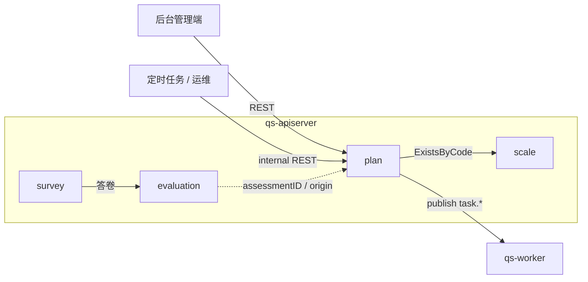
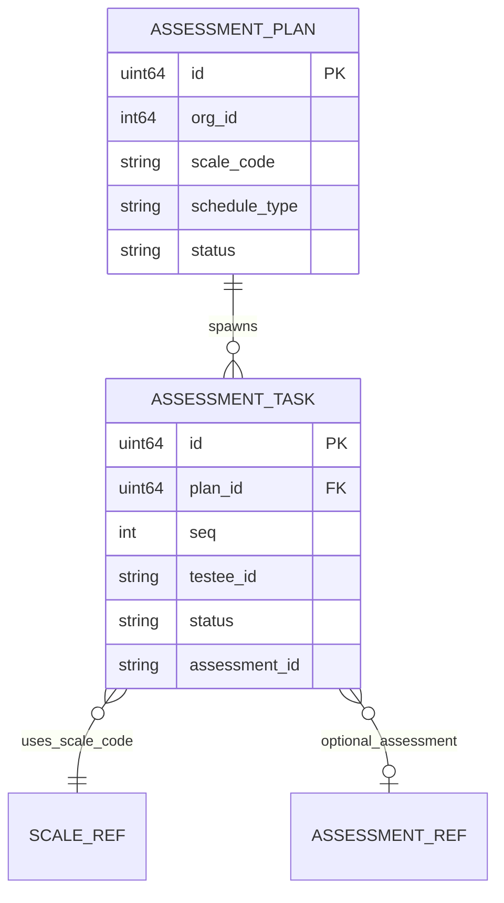
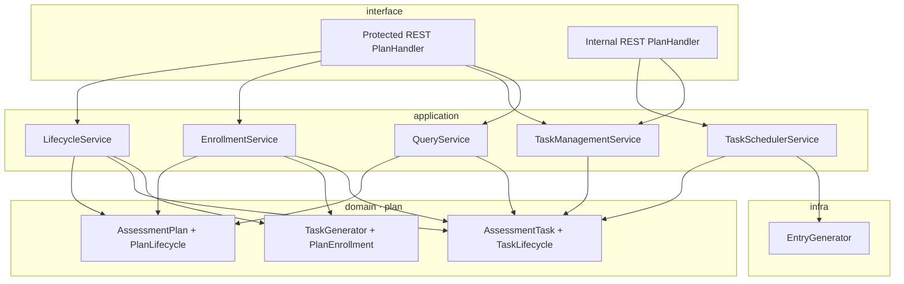
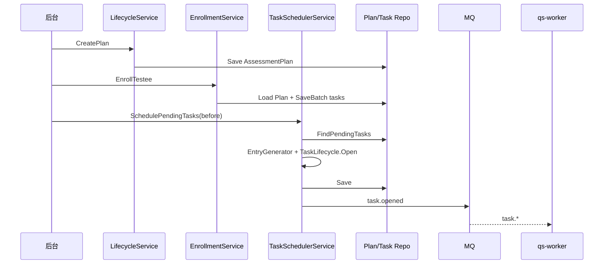

# plan

**本文回答**：`plan` 模块负责把“周期性测评策略”稳定落成“某个受试者在某个时间点要做的一次任务”，并在计划模板、入组、调度开放、任务终态与 `assessmentID` 回写之间建立闭环；这篇文档会先让读者一屏内看清模块职责、主入口、核心对象和与 `survey` / `evaluation` 的边界，再展开模型、契约、链路与存储细节。

本文档按 [CONTRIBUTING-DOCS.md](../CONTRIBUTING-DOCS.md) 中的**业务模块推荐结构**撰写；写作时需覆盖的动机、命名、实现位置与可核对性，见该文「讲解维度」一节，本文正文不重复贴标签。

---

## 30 秒了解系统

### 概览

`plan` 是 `qs-apiserver` 里的**测评计划模块**：把「周期性测评策略」落成「某受试者在某时间点要做的一次任务」，并负责**入组、任务时间线生成、到期开放入口、任务终态与 `assessmentID` 回写**。它不实现问卷/答卷、量表规则或测评引擎，**不**创建 `Assessment`（由 [evaluation](./03-evaluation.md) 负责）；与测评的衔接主要靠 **任务上 `assessmentID` + 来源标记**。

代码主路径：`internal/apiserver/domain/plan`（`AssessmentPlan`、`AssessmentTask`、`TaskGenerator`、`PlanEnrollment`、`PlanLifecycle`/`TaskLifecycle`）、`internal/apiserver/application/plan`（生命周期、入组、调度、任务管理、查询）；计划与任务持久化当前主要在 **MySQL**（见下文「核心存储」）。可选 **Redis** 装饰计划仓储（见 [assembler/plan.go](../../internal/apiserver/container/assembler/plan.go)）。

### 重点速查

如果只看一屏，先看下面这张表：

| 维度 | 结论 |
| ---- | ---- |
| 模块职责 | 管计划模板、受试者入组、任务时间线生成、到点开放、任务终态和 `assessmentID` 回写 |
| 主入口 | 后台用户动作走 `/api/v1` REST；调度等系统动作走 `/internal/v1` |
| 核心对象 | `AssessmentPlan`、`AssessmentTask`、`PlanEnrollment`、`TaskGenerator` |
| 与评估的关系 | `plan` 不创建测评，只通过 `assessmentID` 和来源标记与 `evaluation` 建立弱引用闭环 |
| 关键边界 | 不负责问卷/答卷、量表规则、测评引擎、IAM；这些分别在 `survey`、`scale`、`evaluation`、`actor` |
| 存储分层 | 计划与任务主存储在 MySQL；可选 Redis 仅做计划仓储装饰，不是任务真值来源 |

### 模块边界

| | 内容 |
| -- | ---- |
| **负责（摘要）** | 计划模板与周期策略；受试者入组与任务批量生成；任务调度开放（入口 token/URL）；任务完成/过期/取消与 `task.*` 事件；后台查询 |
| **不负责（摘要）** | 问卷与答卷（[survey](./01-survey.md)）；量表规则（[scale](./02-scale.md)）；测评实例与报告编排（[evaluation](./03-evaluation.md)）；账号 IAM（[actor](./05-actor.md)）；通知/统计落地（多由 `worker` 等消费事件） |
| **关联专题** | 异步链路 [05-专题/02](../05-专题分析/02-异步评估链路：从答卷提交到报告生成.md)；三界与引用 [05-专题/01](../05-专题分析/01-测评业务模型：survey、scale、evaluation%20为什么分离.md)；读侧 [05-专题/03](../05-专题分析/03-保护层与读侧架构：限流、背压、缓存、统计预聚合.md) |

#### 负责什么（细项）

维护文档时**以本清单为模块职责真值**之一，与代码不一致时应改代码或改文。

- **计划模板**：创建、暂停、恢复、取消；绑定 **量表编码** `scaleCode`；周期类型 `by_week` / `by_day` / `fixed_date` / `custom` 及参数（见 [types.go](../../internal/apiserver/domain/plan/types.go)、[assessment_plan.go](../../internal/apiserver/domain/plan/assessment_plan.go)）。
- **受试者入组**：`EnrollTestee(planID, testeeID, startDate)`，由 [TaskGenerator](../../internal/apiserver/domain/plan/task_generator.go) 一次性生成该受试者全部 `pending` 任务。
- **任务调度**：`SchedulePendingTasks(before)` 扫描 `plannedAt <= before` 的 `pending` 任务，生成入口并 `Open`，发布 `task.opened`（见 [task_scheduler_service.go](../../internal/apiserver/application/plan/task_scheduler_service.go)）。
- **任务管理**：开放、完成（绑定 `assessmentID`）、过期、取消等（[task_management_service.go](../../internal/apiserver/application/plan/task_management_service.go)、[task_lifecycle.go](../../internal/apiserver/domain/plan/task_lifecycle.go)）。
- **事件**：当前只保留 `task.opened`、`task.completed`、`task.expired`、`task.canceled`（[events.go](../../internal/apiserver/domain/plan/events.go)）；计划生命周期本身不再单独事件化，与 [configs/events.yaml](../../configs/events.yaml) 对读。

#### 不负责什么（细项）

- **答卷提交与题级校验**：在 `survey`。
- **量表是否存在**：创建计划时可通过 `scale.Repository.ExistsByCode` 校验（应用层），规则权威在 `scale`。
- **测评流水线与报告**：在 `evaluation`；`plan` 通过 `CompleteTask(taskID, assessmentID)` **显式**关联，不保证「答卷提交自动回写任务」的强闭环（见「边界与注意事项」）。

### 契约入口

- **REST**：用户侧计划与任务路径以 [api/rest/apiserver.yaml](../../api/rest/apiserver.yaml) 为准（如 `/api/v1/plans`、`/api/v1/plans/enroll`）；系统动作走 `/internal/v1/plans/tasks/schedule|:id/complete|:id/expire`。Handler 见 [plan.go](../../internal/apiserver/interface/restful/handler/plan.go)、路由 [routers.go](../../internal/apiserver/routers.go)。
- **领域事件**：事件类型、Topic、handler 须与 [configs/events.yaml](../../configs/events.yaml) 一致；下文「核心契约」中有对照表便于 **Verify**。

### 运行时示意图

#### 运行时图说明

后台配置计划并入组；**调度**由外部 Cron 等调用 `/internal/v1` 触发 `SchedulePendingTasks`；任务开放后答题走 `survey` → `evaluation`；`plan` 通过内部动作 `CompleteTask` 写入 `assessmentID` 形成弱引用闭环。

### 主要代码入口（索引）

| 关注点 | 路径 |
| ------ | ---- |
| 装配 | [internal/apiserver/container/assembler/plan.go](../../internal/apiserver/container/assembler/plan.go) |
| 领域 | [internal/apiserver/domain/plan/](../../internal/apiserver/domain/plan/) |
| 应用服务 | [internal/apiserver/application/plan/](../../internal/apiserver/application/plan/) |
| 持久化 | [internal/apiserver/infra/mysql/plan/](../../internal/apiserver/infra/mysql/plan/)、入口生成 [infra/plan/entry_generator.go](../../internal/apiserver/infra/plan/entry_generator.go) |

---

## 模型与服务

与 [survey](./01-survey.md)、[evaluation](./03-evaluation.md) 一致，本节用 **ER 图**表达实体与引用，用 **分层图**对齐 interface → application → domain。

### 模型 ER 图

描述 `plan` 子域内主要概念（**非**与表字段 1:1）。`AssessmentPlan` 为**模板**（无 `testeeID`、无 `startDate`）；`startDate` 在**入组时**作为参数参与任务生成。

- **SCALE_REF**：任务冗余 `scaleCode`（与 [assessment_task.go](../../internal/apiserver/domain/plan/assessment_task.go) 注释一致，便于查询与权限，非聚合内嵌）。
- **ASSESSMENT_REF**：`assessmentID` 可选，完成后写入。

### 领域模型与领域服务

#### 限界上下文

- **解决**：周期性测评**编排**（模板 → 任务实例 → 开放入口 → 与测评实例关联）。
- **不解决**：问卷内容、量表规则、测评执行与报告；**不**内置常驻调度线程（调度由外部触发）。

#### 核心概念

| 概念 | 职责 | 与相邻概念的关系 |
| ---- | ---- | ---------------- |
| `AssessmentPlan` | 聚合根：机构、量表编码、周期、`PlanStatus` | 模板；创建后进入 `active`，但当前不再发布单独的计划级生命周期事件 |
| `AssessmentTask` | 实体：`planID` + `seq` + `testeeID` + 时间点 + `TaskStatus` + 入口 + `assessmentID` | 入组时批量生成；`orgID`/`scaleCode` 冗余 |
| `TaskGenerator` | 按 `scheduleType` 与 `startDate` 计算各 `seq` 的 `plannedAt` | 与 [task_generator.go](../../internal/apiserver/domain/plan/task_generator.go) 策略一致 |
| `PlanEnrollment` | 入组与终止参与 | 调 `TaskGenerator`，不直接写仓储（应用层持久化） |
| `PlanLifecycle` / `TaskLifecycle` | 计划暂停/恢复与任务状态迁移 | 暂停：取消 `pending`/`opened`；恢复：按领域规则处理（见下文「核心模式」） |

#### 主要领域服务（plan 域内）

| 服务 | 职责摘要 | 锚点 |
| ---- | -------- | ---- |
| `PlanLifecycle` | 激活、暂停、恢复、取消计划；暂停时批量取消未终态任务等 | [plan_lifecycle.go](../../internal/apiserver/domain/plan/plan_lifecycle.go) |
| `TaskLifecycle` | 开放、完成、过期、取消任务；收集领域事件 | [task_lifecycle.go](../../internal/apiserver/domain/plan/task_lifecycle.go) |
| `PlanEnrollment` | `EnrollTestee`、终止参与 | [plan_enrollment.go](../../internal/apiserver/domain/plan/plan_enrollment.go) |
| `TaskGenerator` | 生成任务时间线 | [task_generator.go](../../internal/apiserver/domain/plan/task_generator.go) |
| `PlanValidator` | 入组与计划状态前置校验 | [validator.go](../../internal/apiserver/domain/plan/validator.go) |

### 应用服务、领域服务与领域模型

| 应用服务 | 用途 | 目录锚点 |
| -------- | ---- | -------- |
| `LifecycleService` | 创建、暂停、恢复、取消计划 | `application/plan/lifecycle_service.go` |
| `EnrollmentService` | 受试者入组、终止参与 | `application/plan/enrollment_service.go` |
| `TaskSchedulerService` | `SchedulePendingTasks` | `application/plan/task_scheduler_service.go` |
| `TaskManagementService` | 单任务开放、完成、过期、取消 | `application/plan/task_management_service.go` |
| `QueryService` | 计划/任务/受试者维度查询 | `application/plan/query_service.go` |

#### 分层图说明

- **写路径**：计划 CRUD、入组、调度、任务管理经各自应用服务落领域与仓储。
- **入口生成**：`EntryGenerator` 为 **infra** 接口（[application/plan/task_scheduler_service.go](../../internal/apiserver/application/plan/task_scheduler_service.go) 内嵌定义），默认实现 [entry_generator.go](../../internal/apiserver/infra/plan/entry_generator.go)，装配时注入 `NewEntryGenerator(baseURL)`。

---

## 核心设计

### 核心契约：REST 与领域事件

#### 输入

- 后台 REST：以 [apiserver.yaml](../../api/rest/apiserver.yaml) 为准；Handler [plan.go](../../internal/apiserver/interface/restful/handler/plan.go)。
- **系统动作 REST**：`POST /internal/v1/plans/tasks/schedule|:id/complete|:id/expire`，路由见 [routers.go](../../internal/apiserver/routers.go) `registerPlanInternalRoutes`。
- **跨模块**：创建计划时可选 `scale.Repository.ExistsByCode`（[lifecycle_service.go](../../internal/apiserver/application/plan/lifecycle_service.go) 与装配注入）。

#### 输出

- `task.opened`
- `task.completed`
- `task.expired`
- `task.canceled`

定义与载荷见 [events.go](../../internal/apiserver/domain/plan/events.go)（当前只保留 `AssessmentTask` 相关事件）。计划生命周期变化本身不再单独事件化。

**与 `configs/events.yaml` 对照（Verify）**：

- 事件：`task.opened`、`task.completed`、`task.expired`、`task.canceled`
- Topic key：`task-lifecycle`，对应运行时 topic `qs.plan.task`
- handler：`task_opened_handler`、`task_completed_handler`、`task_expired_handler`、`task_canceled_handler`
- 运行时消费链路：当前仓库内通用业务消费者是 `qs-worker`；完整上下游见 [03-基础设施/01-事件系统.md](../03-基础设施/01-事件系统.md)

**载荷边界（与代码一致）**：事件为轻量信号；`task.opened` 含 `task_id` / `plan_id` / `testee_id` / `entry_url` / `open_at`；`task.completed` 含 `assessment_id`；`task.expired` / `task.canceled` 只携带任务、计划、受试者和时间。更多字段需回查仓储。

改事件名、topic 绑定或 handler 名时须同步 **yaml**、领域 `events.go`、发布点与 worker 侧注册（如 [registry.go](../../internal/worker/handlers/registry.go)）。

### 核心链路：模板 → 入组 → 调度 → 测评闭环

#### 从计划模板到待执行任务

创建 `AssessmentPlan` 后不会再发布单独的计划级生命周期事件，**尚未**有任务。受试者入组时 `EnrollmentService` 调 `PlanEnrollment.EnrollTestee`，按 `startDate` 与 `TaskGenerator` **一次性**生成该受试者全部 `pending` 任务并持久化。

#### 从待执行到开放入口

#### 从任务到测评结果

任务开放后，用户经 **入口 URL** 进入收集端；答卷与测评在 `survey` / `evaluation`。`plan` 通过 **`CompleteTask(taskID, assessmentID)`** 把任务标为完成并写入 `assessmentID`，发布 `task.completed`。是否每次测评都自动调用 `CompleteTask`，取决于上游编排与集成，**非** `plan` 模块内强保证。

### 核心横切：计划任务与 survey / evaluation 的边界

| 侧 | 职责 | 与 `plan` 的衔接 |
| ---- | ---- | ---------------- |
| **survey** | 问卷与答卷事实 | 入口 URL 携带 `task_id`/`token` 等，由收集端与 BFF 解析后继续答题 |
| **evaluation** | `Assessment` 与报告 | `AssessmentTask.assessmentID` 指向测评实例；来源可标记 `originType=plan`（以 evaluation 侧契约为准） |
| **plan** | 任务生命周期与事件 | 不创建 `Assessment`；只保存引用与状态 |

**结论**：`plan` 是**编排与任务事实**；测评**执行**仍在 `evaluation`。

### 核心模式与实现要点

#### 1. AssessmentPlan 是模板，不是受试者实例

无 `testeeID`、`startDate`；`startDate` 仅在入组参数中出现。多受试者共享同一计划模板，各自生成独立任务序列。

#### 2. TaskGenerator 把周期策略翻译成任务时间线

支持 `by_week` / `by_day` / `fixed_date` / `custom`（[types.go](../../internal/apiserver/domain/plan/types.go)）。**默认**一次入组生成**全部**任务（非懒生成），实现简单、查询直接；长周期计划会一次性写入较多任务行（见生成器注释）。

#### 3. 计划状态机与任务状态机分离

- `PlanStatus`：`active` / `paused` / `finished` / `canceled`
- `TaskStatus`：`pending` / `opened` / `completed` / `expired` / `canceled`

暂停计划会取消未终态任务；恢复路径见 [plan_lifecycle.go](../../internal/apiserver/domain/plan/plan_lifecycle.go)（含按任务列表重算等逻辑）。

#### 4. TaskSchedulerService 仅负责「到点开放」

扫描 `pending` 且 `plannedAt <= before` → `EntryGenerator` → `TaskLifecycle.Open` → 持久化 → 发布 `task.opened`。**不**发送业务通知、**不**创建答卷。

#### 5. 调度由外部驱动，非模块内常驻线程

推荐外部定时调用 **internal REST** `SchedulePendingTasks`；模块内无独立调度循环。

#### 6. SchedulePendingTasks 批处理语义：错误隔离

单任务失败（生成入口、Open、Save）**记录日志并继续处理下一任务**，非整批事务；返回值反映本次成功开放数量（见 [task_scheduler_service.go](../../internal/apiserver/application/plan/task_scheduler_service.go)）。

#### 7. EntryGenerator 与 baseURL

默认实现：`token`（UUID）、URL 形如 `{baseURL}?token=...&task_id=...`、开放后 **7 天** `expireAt`（[entry_generator.go](../../internal/apiserver/infra/plan/entry_generator.go)）。装配默认 `baseURL` 见 [assembler/plan.go](../../internal/apiserver/container/assembler/plan.go)（代码注释 **TODO：从配置读取**），部署时需按环境核对。

#### 8. plan 与 evaluation：引用耦合，非生命周期包含

关键字段：`AssessmentTask.assessmentID`；测评侧按 `planID` 等查询可关联。优势：计划与测评实例解耦，可独立演进。

### 核心存储：MySQL 与可选 Redis

| 数据 | 存储 | 实现锚点 |
| ---- | ---- | -------- |
| 计划、任务 | MySQL | [infra/mysql/plan](../../internal/apiserver/infra/mysql/plan) |
| 计划读路径缓存（可选） | Redis 装饰仓储 | [plan_cache.go](../../internal/apiserver/infra/cache/plan_cache.go)（`CachedPlanRepository`，装配见 [assembler/plan.go](../../internal/apiserver/container/assembler/plan.go)） |

缓存 TTL、开关等以各环境 `configs/apiserver.*.yaml` 为准（与 [05-专题/03](../05-专题分析/03-保护层与读侧架构：限流、背压、缓存、统计预聚合.md) 互参）。

### 核心代码锚点索引

| 关注点 | 路径 |
| ------ | ---- |
| 装配 | [internal/apiserver/container/assembler/plan.go](../../internal/apiserver/container/assembler/plan.go) |
| 应用服务 | [internal/apiserver/application/plan/](../../internal/apiserver/application/plan/) |
| 领域 | [internal/apiserver/domain/plan/](../../internal/apiserver/domain/plan/) |
| REST | [internal/apiserver/interface/restful/handler/plan.go](../../internal/apiserver/interface/restful/handler/plan.go)、[internal/apiserver/routers.go](../../internal/apiserver/routers.go)（受保护与 internal 路由） |
| MySQL | [internal/apiserver/infra/mysql/plan/](../../internal/apiserver/infra/mysql/plan/) |

---

## 边界与注意事项

### 常见误解

- `plan` **无** `collection-server` 专属前台查询面；任务入口由 **开放后的 URL** 进入收集端；计划/任务管理以 **后台 REST** 与 internal REST 为主。
- `SchedulePendingTasks` **不**保证「全成功或全回滚」；监控与补偿需按**单任务**理解。
- **过期任务批量处理**：领域有单任务过期语义；若需「按日批量过期」，依赖外部定时循环调用应用层接口（以当前代码为准）。
- `CompleteTask` 与答卷提交 **无**自动强绑定；闭环依赖 **evaluation/上游** 显式调用。
- `worker` 对计划/任务事件的具体业务（通知、统计）以 **实现与 yaml** 为准，勿仅按文档推断已全量落地。

### 维护时核对

- 变更 REST：同步 [api/rest/apiserver.yaml](../../api/rest/apiserver.yaml) 与 Handler。
- 变更 `SchedulePendingTasks` / `CompleteTask` / `ExpireTask`：同步 [routers.go](../../internal/apiserver/routers.go)、[plan.go](../../internal/apiserver/interface/restful/handler/plan.go)、运维脚本与本文说明。
- 变更事件或 Topic：同步 [configs/events.yaml](../../configs/events.yaml)、领域 `events.go`、发布点与 worker。
- 变更入口 URL 规则或 `baseURL`：同步 [entry_generator.go](../../internal/apiserver/infra/plan/entry_generator.go) 与装配/配置。

---

*写作约定见 [CONTRIBUTING-DOCS.md](../CONTRIBUTING-DOCS.md)。异步主链与事件衔接见 [05-专题分析/02](../05-专题分析/02-异步评估链路：从答卷提交到报告生成.md)。*
