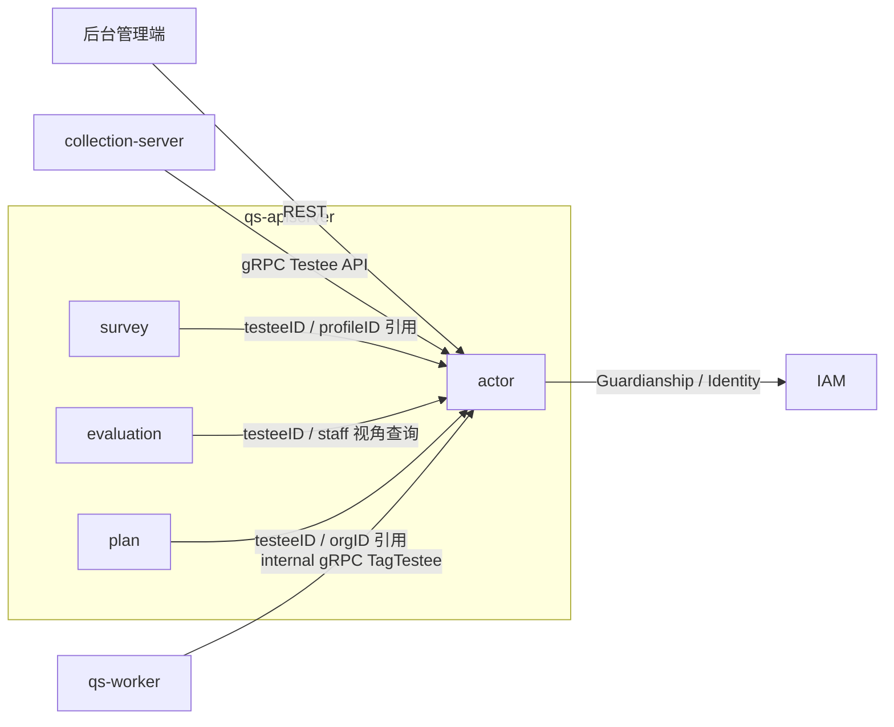
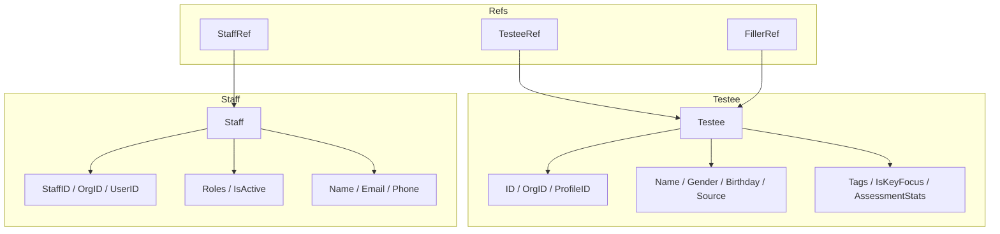
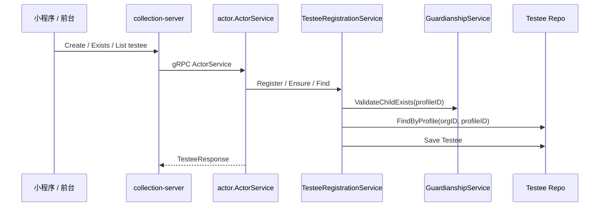

# actor

本文介绍 `actor` 模块的职责边界、模型组织、输入输出和主链路。

## 30 秒了解系统

`actor` 是 `qs-apiserver` 里的主体模块，负责回答两个问题：

- “谁是被测的人”。
- “谁是系统里的后台工作人员”。

它当前主要由两条子线组成：

- `testee`：受试者档案、标签、重点关注状态、与 IAM 档案的绑定
- `staff`：后台员工、机构内角色、激活状态、与 IAM 用户的绑定

它不是统一身份系统，也不是权限中心。运行时里，`actor` 更像“问卷 BC 内的主体投影层”：把 IAM 的用户/儿童档案，转换成当前业务真正关心的 `Testee` 和 `Staff`。

核心代码入口：

- [internal/apiserver/container/assembler/actor.go](../../internal/apiserver/container/assembler/actor.go)
- [internal/apiserver/domain/actor/testee/testee.go](../../internal/apiserver/domain/actor/testee/testee.go)
- [internal/apiserver/domain/actor/staff/staff.go](../../internal/apiserver/domain/actor/staff/staff.go)
- [internal/apiserver/interface/grpc/service/actor_service.go](../../internal/apiserver/interface/grpc/service/actor_service.go)

## 模块边界

### 负责什么

- 管理受试者档案：姓名、性别、生日、来源、标签、重点关注状态
- 管理受试者与 `profileID` 的绑定关系
- 管理后台员工：机构内员工记录、业务角色、激活状态
- 提供后台查询和前台 `testee` 查询能力
- 通过 IAM 集成补充监护关系和用户详情
- 为其他模块提供稳定的主体引用基础，如 `testeeID`、`staffID`

### 不负责什么

- 登录、Token、密码、账户认证：在 IAM
- 系统级权限中心和粗粒度授权：在 IAM / Auth 中间件
- 问卷填写、答卷保存：在 `survey`
- 测评创建、报告生成：在 `evaluation`
- 机构实体本身的完整生命周期：当前模块只有 `orgID` 标量引用，没有独立 `organization` 聚合

### 运行时位置

## 模型与服务组织

### 模型

`actor` 当前不是一个单聚合模块，而是“两个业务主体模型 + 两组跨模块引用值对象”：

- `Testee`
  - 聚合根：
    [internal/apiserver/domain/actor/testee/testee.go](../../internal/apiserver/domain/actor/testee/testee.go)
  - 表示“被测的人”在当前 BC 内的业务视图，是历史、趋势、标签和重点关注的主体
- `Staff`
  - 聚合根：
    [internal/apiserver/domain/actor/staff/staff.go](../../internal/apiserver/domain/actor/staff/staff.go)
  - 表示后台工作人员在当前 BC 内的轻量业务投影，核心是机构内角色
- `TesteeRef / StaffRef`
  - 跨聚合引用值对象：
    [internal/apiserver/domain/actor/ref.go](../../internal/apiserver/domain/actor/ref.go)
  - 用于其他聚合按 ID 引用主体，而不是直接持有实体
- `FillerRef`
  - 填写动作引用值对象：
    [internal/apiserver/domain/actor/filler_ref.go](../../internal/apiserver/domain/actor/filler_ref.go)
  - 用于区分“谁被测”和“谁在填”，当前仍属于已设计待全面接入状态

### 服务

`actor` 的应用服务按主体和行为者拆成两组。

`testee` 侧：

- `RegistrationService`
  - [internal/apiserver/application/actor/testee/registration_service.go](../../internal/apiserver/application/actor/testee/registration_service.go)
  - 面向 C 端或外部系统，负责注册和幂等确保受试者存在
- `ManagementService`
  - [internal/apiserver/application/actor/testee/management_service.go](../../internal/apiserver/application/actor/testee/management_service.go)
  - 面向后台员工，负责更新基本信息、绑定档案、标签和重点关注状态
- `QueryService`
  - [internal/apiserver/application/actor/testee/query_service.go](../../internal/apiserver/application/actor/testee/query_service.go)
  - 负责基础查询
- `BackendQueryService`
  - [internal/apiserver/application/actor/testee/backend_query_service.go](../../internal/apiserver/application/actor/testee/backend_query_service.go)
  - 在基础查询上补充 IAM 监护人信息
- `TaggingService`
  - [internal/apiserver/application/actor/testee/tagging_service.go](../../internal/apiserver/application/actor/testee/tagging_service.go)
  - 供内部流程按测评结果更新标签和重点关注状态

`staff` 侧：

- `LifecycleService`
  - [internal/apiserver/application/actor/staff/lifecycle_service.go](../../internal/apiserver/application/actor/staff/lifecycle_service.go)
  - 负责注册员工、绑定 IAM 用户、同步联系方式
- `AuthorizationService`
  - [internal/apiserver/application/actor/staff/authorization_service.go](../../internal/apiserver/application/actor/staff/authorization_service.go)
  - 负责角色分配和激活/停用
- `QueryService`
  - [internal/apiserver/application/actor/staff/query_service.go](../../internal/apiserver/application/actor/staff/query_service.go)
  - 负责员工查询

模块装配入口：

- [internal/apiserver/container/assembler/actor.go](../../internal/apiserver/container/assembler/actor.go)

这套组织的重点是：

- `testee` 解决“谁是长期被测主体”
- `staff` 解决“谁在这个机构里以什么角色管理系统”
- IAM 只提供身份和关系，不直接替代这两个业务模型

## 接口输入与事件输出

### 输入

- 后台 REST
  - `/api/v1/testees`
  - `/api/v1/testees/by-profile-id`
  - `/api/v1/testees/:id`
  - `/api/v1/testees/:id/scale-analysis`
  - `/api/v1/staff`
  - 路由入口：
    [internal/apiserver/routers.go](../../internal/apiserver/routers.go)
    [internal/apiserver/interface/restful/handler/actor.go](../../internal/apiserver/interface/restful/handler/actor.go)
- C 端 / BFF gRPC
  - `CreateTestee`
  - `GetTestee`
  - `UpdateTestee`
  - `TesteeExists`
  - `ListTesteesByOrg`
  - `ListTesteesByUser`
  - 入口：
    [internal/apiserver/interface/grpc/service/actor_service.go](../../internal/apiserver/interface/grpc/service/actor_service.go)
    [internal/apiserver/interface/grpc/proto/actor/actor.proto](../../internal/apiserver/interface/grpc/proto/actor/actor.proto)
- internal gRPC
  - `TagTestee`
  - 入口：
    [internal/apiserver/interface/grpc/service/internal.go](../../internal/apiserver/interface/grpc/service/internal.go)

### 输出

`actor` 当前没有像 `survey / evaluation / plan` 那样稳定落地的领域事件总线。领域层里能看到的事件发布点大多还停留在注释或预留状态，它们还不是稳定的主运行时能力。

当前更真实的“输出”是：

- 直接返回 `testee / staff` 查询结果
- 通过 internal gRPC 完成 `TagTestee`
- 通过 `TesteeRef / StaffRef` 供其他模块持有主体引用

### 前台只暴露 testee 能力

`actor` 的 gRPC 面当前只覆盖 `testee`，不覆盖 `staff`。这意味着前台和 `collection-server` 复用的是“受试者能力”，而员工管理仍然主要停留在 `apiserver` 后台 REST。

## 核心业务链路

### 受试者创建与绑定链路

`collection-server` 会把前台的 `testee` 创建、存在性判断和列表查询转成对 `ActorService` 的 gRPC 调用。`apiserver` 侧再进入 `RegistrationService`，校验 IAM `Child` 是否存在、检查是否重复绑定，并最终保存 `Testee`。

### 后台查看受试者与监护人链路

后台通过 REST 查询受试者详情时，会先走 `QueryService` 取本地 `Testee`，再由 `BackendQueryService` 按 `profileID` 到 IAM 查询监护关系和监护人资料，拼成后台展示所需的完整结果。

### 测评结果驱动打标链路

`worker` 在评估流程后，通过 internal gRPC 调 `TagTestee`，`TaggingService` 再根据风险等级更新 `risk_high / risk_severe / risk_medium` 等标签，并按条件把受试者标记为重点关注对象。

## 关键设计点

### 1. Testee 是业务主体，不是 IAM.Child 的别名

`Testee` 的设计核心不是“把 IAM 儿童档案搬过来”，而是为问卷 BC 提供一个稳定的“被测人”主体。

关键代码：

- [internal/apiserver/domain/actor/testee/testee.go](../../internal/apiserver/domain/actor/testee/testee.go)
- [internal/apiserver/domain/actor/testee/binder.go](../../internal/apiserver/domain/actor/testee/binder.go)

这层抽象的价值在于：

- `Testee` 可以承载标签、重点关注状态和测评统计快照
- 它可以绑定 IAM 档案，也可以作为临时受试者独立存在
- 其他模块聚合时引用的是 `testeeID`，而不是直接依赖 IAM 主键

这也是为什么当前代码里 `profileID` 是可选引用，而不是 `Testee` 的唯一身份本体。

### 2. Staff 是 IAM.User 在本 BC 的轻量业务投影

`Staff` 不是完整用户实体，而是“某个 IAM 用户在某个机构内，以什么业务角色参与 QS 系统”的投影。

关键代码：

- [internal/apiserver/domain/actor/staff/staff.go](../../internal/apiserver/domain/actor/staff/staff.go)
- [internal/apiserver/domain/actor/staff/types.go](../../internal/apiserver/domain/actor/staff/types.go)

这样设计的价值在于：

- 同一个 IAM 用户可以在不同 `orgID` 下拥有不同 `Staff` 记录和角色
- 业务角色如 `qs:content_manager`、`qs:evaluation_plan_manager` 可以留在本 BC 内部建模
- 常用字段可以本地缓存，避免每次都回 IAM 拉取

所以 `Staff` 要持久化，但它持久化的是业务角色和机构内状态，不是认证信息。

### 3. Testee 的创建入口统一，但不同业务场景接入程度不同

`actor` 提供统一的 `Testee` 注册/确保存在入口，不同业务场景只是以不同方式接入这套入口。

关键代码：

- [internal/apiserver/application/actor/testee/registration_service.go](../../internal/apiserver/application/actor/testee/registration_service.go)
- [internal/apiserver/interface/grpc/service/actor_service.go](../../internal/apiserver/interface/grpc/service/actor_service.go)
- [internal/collection-server/application/testee/service.go](../../internal/collection-server/application/testee/service.go)

运行时可以分成三类接入路径：

- 前台 / 一次性测评路径
  - `collection-server` 通过 gRPC 直接调用 `ActorService.CreateTestee`
  - `RegistrationService` 负责注册和按 `profileID` 幂等确保存在
- 测评计划路径
  - `plan` 当前直接引用 `testeeID`
  - 也就是说，计划入组前默认假设 `Testee` 已存在，而不是由 `plan` 自动代建
- 筛查路径
  - 业务概念仍然存在，但当前仓库里没有稳定落地的 `screening` 运行时模块
  - 因而“筛查会自动创建 Testee”还不是系统今天的运行时行为

这让“业务上有哪些场景”和“系统今天自动做了什么”保持了清晰分界。

### 4. actor 的核心分界是“谁被测”和“谁在填/谁在管理”

`Testee`、`Filler`、`Staff` 不能混成一个“用户”概念。

关键代码：

- [internal/apiserver/domain/actor/filler_ref.go](../../internal/apiserver/domain/actor/filler_ref.go)
- [internal/apiserver/domain/actor/ref.go](../../internal/apiserver/domain/actor/ref.go)

这层分界解决了三个不同问题：

- `Testee`：统计和历史归档按谁聚合
- `FillerRef`：这份答卷是谁操作填写
- `Staff`：谁在后台配置和管理系统

当前 `FillerRef` 还没有完全接入主链路，但它表达的建模方向是对的，后续文档也不应再把“填写人”和“被测人”混写。

### 5. testee 与 IAM 的关系是“绑定 + 补充”，不是“完全外包”

当前 `testee` 侧和 IAM 的集成主要出现在两个点：

- 注册时，用 `GuardianshipService.ValidateChildExists` 验证档案存在
- 后台查询时，用 `GuardianshipService` 和 `IdentityService` 补齐监护人信息

关键代码：

- [internal/apiserver/application/actor/testee/registration_service.go](../../internal/apiserver/application/actor/testee/registration_service.go)
- [internal/apiserver/application/actor/testee/backend_query_service.go](../../internal/apiserver/application/actor/testee/backend_query_service.go)
- [internal/apiserver/infra/iam/guardianship.go](../../internal/apiserver/infra/iam/guardianship.go)
- [internal/apiserver/infra/iam/identity.go](../../internal/apiserver/infra/iam/identity.go)

这种设计比“完全依赖 IAM 动态查询”更稳，因为本地仍保留业务主键和业务状态；但它也避免了重复造轮子，把关系验证和用户详情查询交给 IAM。

### 6. 当前请求用户停留在中间件和接口层，不进入 actor 领域模型

请求用户身份停留在中间件和接口层，通过 JWT claims 注入运行时上下文。进入业务模型后，再按需要映射成 `Testee`、`Staff` 或 `FillerRef`。

关键代码：

- [internal/apiserver/interface/restful/middleware/iam_middleware.go](../../internal/apiserver/interface/restful/middleware/iam_middleware.go)
- [internal/apiserver/interface/restful/handler/base.go](../../internal/apiserver/interface/restful/handler/base.go)

当前代码的真实做法是：

- 中间件从 JWT claims 解析 `user_id / org_id / roles`
- Handler 通过 `GetUserID / GetOrgID / GetRoles` 读取这些运行时身份信息
- 进入业务模型后，再按需要映射成 `Testee`、`Staff` 或 `FillerRef`

这意味着：

- “当前是谁在请求”是运行时上下文，不是 `actor` 聚合的一部分
- `actor` 领域对象关心的是业务主体引用，而不是 Token claims
- `Principal`、JWT claims 和当前会话态不属于 `actor` 自己维护的数据模型

### 7. actor 的前台能力通过 gRPC 只暴露 testee，这是一种有意收敛

当前 `ActorService` 对外提供的 gRPC 全是 `testee` 相关能力，`collection-server` 也只消费这部分。

关键代码：

- [internal/apiserver/interface/grpc/service/actor_service.go](../../internal/apiserver/interface/grpc/service/actor_service.go)
- [internal/collection-server/application/testee/service.go](../../internal/collection-server/application/testee/service.go)

这说明当前运行时判断是：

- 前台需要直接操作的是“我的孩子/我的受试者”
- `staff` 仍然属于后台管理域，不适合暴露给 collection-server

这条边界很重要，后面写接口文档时也不应该把 `actor` 误写成一个对前后台完全对称开放的用户中心。

## 边界与注意事项

- 当前模块没有独立 `organization` 聚合，`orgID` 只是多租户边界和查询条件。
- `actor` 当前没有稳定落地的 MQ 事件输出；代码里能看到的事件更多是预留注释，还不是既成事实。
- `Testee.AssessmentStats` 属于读模型优化快照，不是每次写操作都同步计算的实时领域状态。
- `BackendQueryService` 拉取监护人信息时，若 IAM 不可用或返回不完整，主查询仍会成功，只是缺少监护人补充信息。
- `GetScaleAnalysis` 目前放在 `ActorHandler` 下，但本质上它已经跨进了 `evaluation` 数据聚合视角；更适合理解为“以 testee 为主体的聚合查询”，而不是 `actor` 自己生成的原生领域数据。
