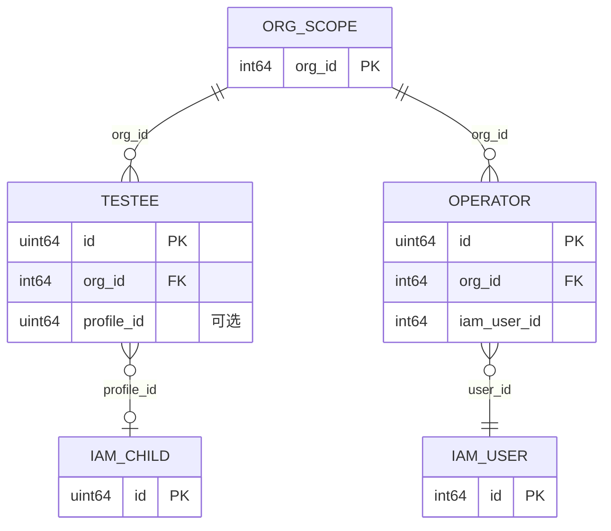
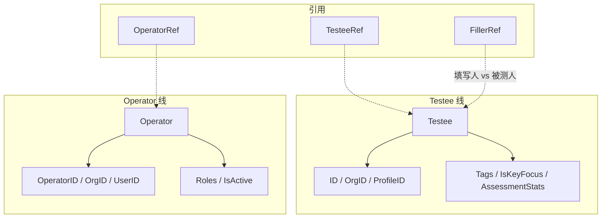
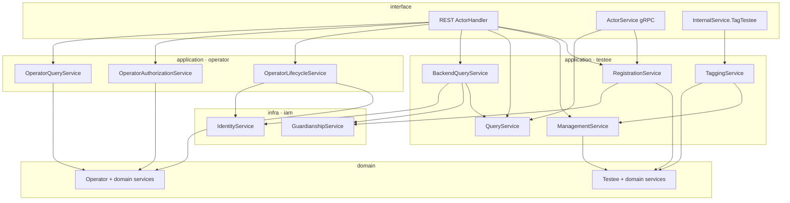
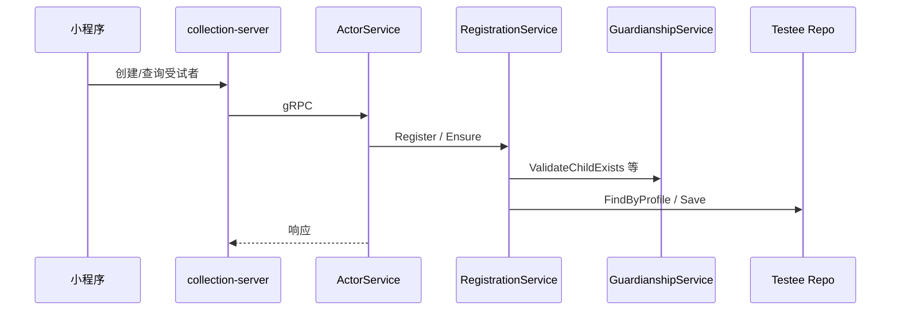

# actor

**本文回答**：`actor` 模块负责回答“业务里的人是谁”，把 `Testee`、`Operator`、`Clinician` 以及它们与 IAM、测评入口关系稳定收敛成可引用的业务主体；这篇文档会先让读者一屏内看清模块职责、主入口、关键边界和运行时位置，再展开模型、契约、集成与存储细节。

> 深讲 truth layer 已迁到 [actor/README.md](./actor/README.md)。本文保留为兼容入口和连续阅读材料；新增 Testee / Clinician / Operator / IAM 边界能力时，优先维护子目录深讲。

本文档按 [CONTRIBUTING-DOCS.md](../CONTRIBUTING-DOCS.md) 中的**业务模块推荐结构**撰写；写作时需覆盖的动机、命名、实现位置与可核对性，见该文「讲解维度」一节，本文正文不重复贴标签。

---

## 30 秒了解系统

### 概览

`actor` 是 `qs-apiserver` 里的**主体（Actor）模块**，现在在问卷/测评限界上下文内回答三件事：**谁是被测的人**（`Testee`）、**谁是机构侧操作者**（`Operator`）、**谁是业务从业者**（`Clinician`）。它把 **IAM** 的用户/儿童档案与业务侧 **`testeeID` / `operatorID` / `clinicianID`** 对齐，并承载标签、重点关注、机构内角色、医生-受试者关系、测评入口等**本 BC 状态**；**不是**统一登录与全局权限中心。

代码主路径：`internal/apiserver/domain/actor`（`testee`、`operator`、引用值对象）、`internal/apiserver/application/actor`；持久化当前主要在 **MySQL**（见「核心存储」）。受试者读路径可经 **Redis** 装饰仓储（见 [assembler/actor.go](../../internal/apiserver/container/assembler/actor.go)）。与 IAM 的交互经 [infra/iam](../../internal/apiserver/infra/iam)（`GuardianshipService`、`IdentityService` 等）。

### 重点速查

如果只看一屏，先看下面这张表：

| 维度 | 结论 |
| ---- | ---- |
| 模块职责 | 统一管理业务里的 `Testee` / `Operator` / `Clinician` 主体，以及从业者-受试者关系与测评入口 |
| 主入口 | 后台主要走 REST；C 端主要走 `ActorService` gRPC；worker 可通过 internal gRPC `TagTestee` 回写标签 |
| 核心对象 | `Testee`、`Operator`、`Clinician`、`ClinicianTesteeRelation`、`AssessmentEntry`、`TesteeRef`、`OperatorRef`、`ClinicianRef`、`FillerRef` |
| 与 IAM 的关系 | IAM 提供身份与档案源，`actor` 负责在业务域里完成绑定、投影与补充状态，不把 IAM 当聚合本身 |
| 后台可见性 | 受保护接口以 JWT `org_id` 为准；兼容 `org_id` / `iam_child_id` 只留在 REST/gRPC 边界做归一化；`qs:admin` 可看机构全量，其他后台用户按 `ClinicianTesteeRelation` 收口 |
| 后台动作权限 | `actor` 只提供统一角色守卫；计划写操作收口到 `qs:evaluation_plan_manager` / `qs:admin`，评估后台动作收口到 `qs:evaluator` / `qs:admin`，统计同步与校验收口到 `qs:admin` |
| 关键边界 | 不负责登录、JWT、系统级授权，也不负责问卷、测评、计划等业务主流程 |
| 存储分层 | 主存储在 MySQL；受试者读路径可经 Redis 装饰仓储加速 |

### 模块边界

| | 内容 |
| -- | ---- |
| **负责（摘要）** | 受试者/操作者/从业者档案与查询；与 IAM 的绑定与校验；`testeeID`/`operatorID`/`clinicianID` 及主体引用；从业者-受试者关系；测评入口；后台 REST + C 端 gRPC（testee）；internal gRPC `TagTestee` |
| **不负责（摘要）** | 登录与系统级授权（IAM）；问卷与答卷（[survey](./01-survey.md)）；测评与报告（[evaluation](./03-evaluation.md)）；机构聚合全生命周期；`collection-server` BFF 策略 |
| **关联专题** | 三界与主体引用 [05-专题/01](../05-专题分析/01-测评业务模型：survey、scale、evaluation%20为什么分离.md)；异步链路 [05-专题/02](../05-专题分析/02-异步评估链路：从答卷提交到报告生成.md)；读侧 [05-专题/03](../05-专题分析/03-保护层与读侧架构：限流、背压、缓存、统计预聚合.md) |

#### 负责什么（细项）

维护文档时**以本清单为模块职责真值**之一，与代码不一致时应改代码或改文。

- **受试者 `Testee`**：注册/幂等确保存在、基本信息与档案绑定、标签与重点关注、测评相关统计字段（见 [testee.go](../../internal/apiserver/domain/actor/testee/testee.go)）。
- **操作者 `Operator`**：机构内注册、与 IAM 用户绑定、角色分配、激活/停用（见 [operator.go](../../internal/apiserver/domain/actor/operator/operator.go)）。
- **业务从业者 `Clinician`**：医生/咨询师等业务身份，与后台 `Operator` 解耦，可绑定 `operator_id`（见 `domain/actor/clinician`）。
- **业务关系 `ClinicianTesteeRelation`**：回答“这个受试者归谁看、来源是什么”，是医生“只能看自己的用户”的过滤基础（见 `domain/actor/relation`）。
- **测评入口 `AssessmentEntry`**：承载二维码 token、归属从业者、目标问卷/量表、过期控制（见 `domain/actor/assessmententry`）。
- **访问守卫 `TesteeAccessService`**：统一解析 `JWT org_id` + `operator user_id`，并把后台 testee / assessment / report / task / statistics 的访问范围收口到 `qs:admin` 或 `ClinicianTesteeRelation`。
- **跨模块引用**：`TesteeRef` / `OperatorRef` / `ClinicianRef`（[ref.go](../../internal/apiserver/domain/actor/ref.go)）；`FillerRef` 建模「谁填写」与「谁被测」分离（[filler_ref.go](../../internal/apiserver/domain/actor/filler_ref.go)，接入程度见「核心模式」）。
- **对外协议**：后台 [REST](#核心契约restgrpcinternal-grpc-与领域事件)；C 端 [ActorService gRPC](#核心契约restgrpcinternal-grpc-与领域事件)；worker 等经 **internal** `TagTestee` 打标。

#### 不负责什么（细项）

- **JWT / 会话**：由中间件与 Handler 上下文提供 `user_id` / `org_id` 等，**不**作为 `actor` 聚合内持久化状态；后台受保护接口统一信任 JWT `org_id`，旧 `org_id` / `iam_child_id` 仅在 REST/gRPC 边界做兼容归一化与校验（见「核心模式」）。
- **领域事件总线**：当前 **无** 与 `survey`/`plan` 同级的稳定 `actor.*` MQ 事件落地（代码中多为注释占位，见「核心契约」）。

### 契约入口

- **REST**：`/api/v1/testees`、`/api/v1/staff`、`/api/v1/clinicians`、`/api/v1/public/assessment-entries/:token` 等以代码为准；当前保留 `/api/v1/practitioners` 作为兼容别名。Handler [actor.go](../../internal/apiserver/interface/restful/handler/actor.go)、[clinician.go](../../internal/apiserver/interface/restful/handler/clinician.go)、路由 [transport/rest](../../internal/apiserver/transport/rest/)。
- **C 端 / BFF gRPC**：`CreateTestee`、`GetTestee`、`ListTesteesByOrg` 等见 [actor.proto](../../internal/apiserver/interface/grpc/proto/actor/actor.proto)、[actor_service.go](../../internal/apiserver/interface/grpc/service/actor_service.go)。
- **internal gRPC**：`TagTestee` 见 [internal.proto](../../internal/apiserver/interface/grpc/proto/internalapi/internal.proto)、[internal.go](../../internal/apiserver/interface/grpc/service/internal.go)。
- **领域事件**：**N/A（当前无纳入 `configs/events.yaml` 的 actor 领域事件）**；与代码注释占位对照见「核心契约」。

### 运行时示意图

#### 运行时图说明

后台 REST 管理受试者与操作者；小程序经 `collection-server` 只打 **testee** gRPC；`plan`/`survey`/`evaluation` 引用 `testeeID`；异步链路完成后 **worker** 可经 internal gRPC 调 `TagTestee` 更新标签与重点关注。

### 主要代码入口（索引）

| 关注点 | 路径 |
| ------ | ---- |
| 装配 | [internal/apiserver/container/assembler/actor.go](../../internal/apiserver/container/assembler/actor.go) |
| 领域 | [internal/apiserver/domain/actor/](../../internal/apiserver/domain/actor/) |
| 应用服务 | [internal/apiserver/application/actor/](../../internal/apiserver/application/actor/) |
| 持久化 | [internal/apiserver/infra/mysql/actor/](../../internal/apiserver/infra/mysql/actor/) |
| IAM 适配 | [internal/apiserver/infra/iam/](../../internal/apiserver/infra/iam/) |

---

## 模型与服务

与 [survey](./01-survey.md)、[plan](./04-plan.md) 一致，本节用 **ER 图**表达租户与 IAM 外键语义，再用 **概念 flowchart** 与 **分层图**对齐 interface → application → domain。

### 模型 ER 图

描述 `actor` 子域内实体与 **租户边界**、**IAM 外部系统** 的关系（**非**与 MySQL 表字段 1:1）。本模块**不**实现 `Organization` 聚合；`org_id` 仅作多租户外键。`Clinician` 与 `Operator` 可通过 `operator_id` 绑定；`ClinicianTesteeRelation` 与 `AssessmentEntry` 负责承载业务归属关系。

- **ORG_SCOPE**：仅表达「机构 ID」这一租户维度；权威机构模型不在 `actor`。
- **IAM_***：落在 IAM 限界上下文；图中为 **逻辑外键**，非 `actor` 表内子表。
- **Testee.profile_id**：可选，当前语义对应 IAM 儿童档案（见 [testee.go](../../internal/apiserver/domain/actor/testee/testee.go)）；**Operator.user_id** 绑定 IAM 用户（见 [operator.go](../../internal/apiserver/domain/actor/operator/operator.go)）。

### 模型关系（概念）

`actor` **不是**单一聚合模块，而是 **两条子线**（`testee` / `operator`）加 **引用值对象**。

- 与上图对照：`flowchart` 强调 **子域内职责块**；**租户与 IAM** 以 **ER 图**为准。

### 领域模型与领域服务

#### 限界上下文

- **解决**：本 BC 内「被测主体」与「机构侧操作者」的持久化视图、与 IAM 的绑定、testee 侧标签/重点关注。
- **不解决**：统一身份认证与全局 RBAC；问卷内容与测评流水线。

#### 核心概念

| 概念 | 职责 | 与相邻概念的关系 |
| ---- | ---- | ---------------- |
| `Testee` | 聚合根：机构内受试者，可绑定 IAM `profileID`（儿童档案） | 被 `plan`、`AnswerSheet` 等引用 `testeeID` |
| `Operator` | 聚合根：机构内操作者，绑定 IAM `userID`，含角色与激活状态 | 后台权限与系统管理主体 |
| `Clinician` | 聚合根：业务从业者，可选绑定 `operator_id` | 医生/咨询师等业务身份，不直接等于后台账号 |
| `ClinicianTesteeRelation` | 聚合根：从业者与受试者之间的业务关系 | 回答“谁能看谁”，并记录来源 |
| `AssessmentEntry` | 聚合根：测评入口 | 回答“谁发的码、码指向什么、什么时候失效” |
| `TesteeRef` / `OperatorRef` / `ClinicianRef` | 值对象：跨聚合引用 ID（及可选展示字段） | [ref.go](../../internal/apiserver/domain/actor/ref.go) |
| `FillerRef` | 值对象：区分「谁填写」与「谁被测」 | 设计已完成，**全面接入 AnswerSheet 仍待演进**（见文件头注释） |

#### 主要领域服务（按包）

| 子域 | 类型 | 职责摘要 | 锚点 |
| ---- | ---- | -------- | ---- |
| testee | `Factory` / `Editor` / `Binder` / `Validator` / `Tagger` | 创建、编辑、档案绑定、校验、打标 | [testee/](../../internal/apiserver/domain/actor/testee/) |
| operator | `Factory` / `Editor` / `Binder` / `Validator` / `RoleAllocator` / `Lifecycler` | 注册、绑定用户、角色、生命周期 | [operator/](../../internal/apiserver/domain/actor/operator/) |
| clinician | `Validator` | 校验从业者业务身份 | `domain/actor/clinician/` |
| relation | 聚合 + 仓储 | 持久化从业者-受试者关系 | `domain/actor/relation/` |
| assessmententry | `Validator` | 校验测评入口目标与 token | `domain/actor/assessmententry/` |

### 应用服务、领域服务与领域模型

| 应用服务 | 行为者 / 用途 | 目录锚点 |
| -------- | ------------- | -------- |
| `TesteeRegistrationService` | C 端：注册、Ensure、与 IAM 儿童档案校验 | `application/actor/testee/registration_service.go` |
| `TesteeManagementService` | 后台：信息维护、绑定、标签与重点关注 | `application/actor/testee/management_service.go` |
| `TesteeQueryService` | 通用查询 | `application/actor/testee/query_service.go` |
| `TesteeBackendQueryService` | 后台：本地 Testee + IAM 监护人等补充 | `application/actor/testee/backend_query_service.go` |
| `TesteeTaggingService` | 系统：`TagTestee` 内部实现 | `application/actor/testee/tagging_service.go` |
| `OperatorLifecycleService` | 操作者注册与绑定、同步联系方式 | `application/actor/operator/lifecycle_service.go` |
| `OperatorAuthorizationService` | 角色分配、激活/停用 | `application/actor/operator/authorization_service.go` |
| `OperatorQueryService` | 操作者查询 | `application/actor/operator/query_service.go` |
| `ClinicianLifecycleService` | 从业者注册、绑定后台操作者 | `application/actor/clinician/lifecycle_service.go` |
| `ClinicianQueryService` | 从业者查询、按 operator 反查业务身份 | `application/actor/clinician/query_service.go` |
| `ClinicianRelationshipService` | 建立从业者-受试者关系、查询名下受试者 | `application/actor/clinician/relationship_service.go` |
| `AssessmentEntryService` | 创建测评入口、解析 token、扫码 intake | `application/actor/assessmententry/service.go` |
| `TesteeAccessService` | 解析后台访问范围：`admin bypass` / `ClinicianTesteeRelation` | `application/actor/access/service.go` |

#### 分层图说明

- **装配注入**：`ActorModule.Initialize` 接收 `*gorm.DB`、可选 `GuardianshipService`、`IdentityService`、可选 **Redis**（装饰 `TesteeRepo`），见 [assembler/actor.go](../../internal/apiserver/container/assembler/actor.go)。
- **评估跨域查询**：`ActorHandler` 可通过 `SetEvaluationServices` 延迟注入测评查询（用于如量表分析类 REST），见同文件。

---

## 核心设计

### 核心契约：REST、gRPC、internal gRPC 与领域事件

#### 输入

- **后台 REST**：`/api/v1/testees`、`/api/v1/testees/by-profile-id`、`/api/v1/testees/{id}`、`/api/v1/testees/{id}/scale-analysis` 等；`/api/v1/staff` 等——以 [apiserver.yaml](../../api/rest/apiserver.yaml) 为准。
- **C 端 gRPC（仅 testee）**：`CreateTestee`、`GetTestee`、`UpdateTestee`、`TesteeExists`、`ListTesteesByOrg`、`ListTesteesByUser` 等 — [actor.proto](../../internal/apiserver/interface/grpc/proto/actor/actor.proto)。
- **internal gRPC**：`TagTestee(TagTesteeRequest{ testee_id, risk_level, scale_code, mark_key_focus, high_risk_factors })` — [internal.proto](../../internal/apiserver/interface/grpc/proto/internalapi/internal.proto)。

**与 OpenAPI / 路由对读（Verify）**：

以下为 **机器可读契约**（以 [api/rest/apiserver.yaml](../../api/rest/apiserver.yaml) 为准）；路由挂载以 [transport/rest](../../internal/apiserver/transport/rest/)（`registerActorProtectedRoutes` 等）为准，二者不一致时应以代码为准并同步 yaml。

| HTTP | 路径（前缀 `/api/v1`） | 摘要 | 备注 |
| ---- | ---------------------- | ---- | ---- |
| `GET` | `/testees` | 受试者列表 | Actor |
| `GET` | `/testees/by-profile-id` | 按 profile 查受试者 | Actor |
| `GET` | `/testees/{id}` | 受试者详情 | Actor |
| `PUT` | `/testees/{id}` | 更新受试者 | Actor |
| `GET` | `/testees/{id}/scale-analysis` | 量表分析（聚合 evaluation 读模型） | 见「核心模式」§8 |
| `GET` | `/testees/{id}/plans` | 受试者参与计划列表 | OpenAPI 标签 Plan-Query，与 [plan](./04-plan.md) 查询衔接 |
| `GET` | `/testees/{id}/plans/{plan_id}/tasks` | 计划下任务列表 | 同上 |
| `GET` | `/testees/{id}/tasks` | 受试者任务列表 | 同上 |
| `POST` | `/staff` | 创建操作者（兼容路径） | Actor |
| `GET` | `/staff` | 操作者列表（兼容路径） | Actor |
| `GET` | `/staff/{id}` | 操作者详情（兼容路径） | Actor |
| `DELETE` | `/staff/{id}` | 删除操作者（兼容路径） | Actor |

受试者周期统计当前归属 Statistics 路由：`GET /api/v1/statistics/testees/{testee_id}/periodic`，挂载以 [routes_statistics.go](../../internal/apiserver/transport/rest/routes_statistics.go) 为准；不要把它当成 Actor REST 主表的一部分维护。

**gRPC（Verify）**：

| 服务 | RPC | 用途 |
| ---- | ----- | ---- |
| `actor.ActorService` | `CreateTestee`、`GetTestee`、`UpdateTestee`、`TesteeExists`、`ListTesteesByOrg`、`ListTesteesByUser` | C 端 / BFF，见 [actor.proto](../../internal/apiserver/interface/grpc/proto/actor/actor.proto) |
| `internalapi.InternalService` | `TagTestee` | worker 等内部打标，见 [internal.proto](../../internal/apiserver/interface/grpc/proto/internalapi/internal.proto) |

#### 输出（领域事件）

**当前状态**：[`configs/events.yaml`](../../configs/events.yaml) **无** `actor.*` / `testee.*` / `operator.*` 条目；领域代码中 **操作者激活/停用** 等处仍保留 **注释掉的 `events.Publish(...)` 占位**（见 [lifecycler.go](../../internal/apiserver/domain/actor/operator/lifecycler.go)）。

**Verify**：若未来引入 MQ 事件，须新增 yaml、领域事件类型与发布点，并更新本文。

**当前真实输出形态**：REST/gRPC 直接返回实体或 DTO；`TagTestee` 返回操作结果；其他模块持有 **`testeeID` / `operatorID` 引用**。

### 核心链路：受试者注册、后台查询与打标

#### C 端注册与幂等（gRPC）

BFF 侧编排示例：[collection-server/application/testee/service.go](../../internal/collection-server/application/testee/service.go)。

#### 后台受试者详情（含监护人）

`TesteeBackendQueryService` 在 [backend_query_service.go](../../internal/apiserver/application/actor/testee/backend_query_service.go) 中组合 **本地 Testee** 与 IAM **监护人/身份** 信息；IAM 失败时策略见「边界与注意事项」。

#### 测评后打标（internal）

`InternalService.TagTestee` → `TesteeTaggingService`：按风险等级等更新标签、可选重点关注（实现见 [tagging_service.go](../../internal/apiserver/application/actor/testee/tagging_service.go)、[internal.go](../../internal/apiserver/interface/grpc/service/internal.go)）。

### 核心横切：actor、IAM、collection-server 与业务模块

| 侧 | 职责 | 与 `actor` 的衔接 |
| ---- | ---- | ---------------- |
| **IAM** | 用户/儿童档案、监护关系 | 注册时校验档案存在；后台查询补监护人 |
| **collection-server** | BFF、鉴权 | 仅转发 **testee** gRPC，不暴露 operator gRPC |
| **survey / plan / evaluation** | 业务事实与编排 | 引用 `testeeID`（及 operator 查询场景） |

**结论**：`actor` 是 **BC 内主体投影**；**认证授权**仍以 IAM + 中间件为准。

### 核心集成：actor 与 IAM（分场景）

仓库内 IAM 通过 **适配层** [infra/iam](../../internal/apiserver/infra/iam) 封装 IAM SDK（`GuardianshipService`、`IdentityService` 等），**不是**在领域模型里直接依赖 gRPC 协议细节。

| 场景 | actor 入口 | IAM 侧做什么 | 典型行为（与代码一致） |
| ---- | ---------- | ------------- | ------------------------ |
| **受试者注册 / 绑定档案** | [RegistrationService](../../internal/apiserver/application/actor/testee/registration_service.go) | `GuardianshipService.ValidateChildExists` | 当存在 `profileID`（儿童档案）且监护服务 **已启用** 时，先校验 IAM 中儿童存在；未启用则跳过该校验路径 |
| **后台受试者详情（监护人等）** | [BackendQueryService](../../internal/apiserver/application/actor/testee/backend_query_service.go) | `GuardianshipService.ListGuardians` + `IdentityService` 补全用户资料 | 本地 `Testee` 为主；有 `profileID` 且服务启用时拉监护人与展示信息；IAM 不可用或关闭时仍可返回本地数据，监护人字段可能为空（见「边界与注意事项」） |
| **操作者注册与绑定** | [OperatorLifecycleService](../../internal/apiserver/application/actor/operator/lifecycle_service.go) | `IdentityService.SearchUsers` / `CreateUser` 等 | 在 IAM 侧检索或创建用户，再与 `Operator` 绑定；服务未启用时走代码内分支（见该文件） |

**Operator ↔ IAM 方法锚点（补充）**（均在同文件 [lifecycle_service.go](../../internal/apiserver/application/actor/operator/lifecycle_service.go) 的 `resolveOrCreateUser` 内）：

- **`IdentityService.SearchUsers`**：`SearchUsers(ctx, &identityv1.SearchUsersRequest{ Phones: []string{dto.Phone} })`，用于注册操作者时按**手机号**在 IAM 查是否已有用户（约 186–199 行）。
- **`IdentityService.CreateUser`**：`CreateUser(ctx, dto.Name, dto.Email, dto.Phone)`，搜索未命中时**创建** IAM 用户并返回 `userID`（约 201–203 行）。

**装配与注入**：`ActorModule.Initialize` 将 `GuardianshipService`、`IdentityService` 从容器注入（参数顺序见 [assembler/actor.go](../../internal/apiserver/container/assembler/actor.go)）；未注入或 `IsEnabled()==false` 时，行为以各应用服务内的 **nil / 降级分支** 为准。

**Verify**：改 IAM 契约或 SDK 时，须同步 `infra/iam`、上述应用服务与本文表。

### 核心模式与实现要点

#### 1. Testee 是业务主体，不是 IAM.Child 的别名

本地持久化 `Testee`，可绑定 `profileID`；标签、重点关注、统计字段属于 **本模块**。其他聚合引用 **`testeeID`**，降低对 IAM 主键的直接耦合。

#### 2. Operator 是 IAM.User 在机构内的业务投影

同一 IAM 用户可在不同 `orgID` 下对应不同 `Operator` 与角色（见 [types.go](../../internal/apiserver/domain/actor/operator/types.go)）；认证信息不在此重复造轮子。

#### 3. gRPC 只暴露 testee，是有意收敛

`ActorService` **无** operator 方法；操作者管理当前仍走 **后台 REST `/staff` 兼容路径**。避免把 BFF 扩成「全用户中心」。

#### 4. 请求用户身份在接口层，不进 actor 聚合

JWT / claims 由 [iam_middleware](../../internal/apiserver/interface/restful/middleware/iam_middleware.go)、[handler/base](../../internal/apiserver/interface/restful/handler/base.go) 等解析；领域对象不持久化「当前会话」。

#### 5. 后台 testee 可见性统一走访问守卫

`TesteeAccessService` 是第三阶段后新增的统一访问守卫：先从 JWT 解析 `org_id` 与当前 `user_id`，再在 `actor` 域内按 **`Operator -> qs:admin bypass -> Clinician -> ClinicianTesteeRelation`** 解析后台访问范围。规则如下：

- `qs:admin`：拥有机构级全量可见性。
- 非 admin 且绑定了 `Clinician`：只能访问自己 active relation 命中的 `Testee` 及其派生资源。
- 非 admin 且未绑定 `Clinician`：访问受保护 testee 相关后台接口返回 `403`。
- 旧 `org_id` query/body 字段只做兼容校验；与 JWT `org_id` 不一致时返回 `400`。

当前这条规则已被收口到 `actor`、`evaluation`、`plan`、`statistics` 的后台 testee 读路径中；`/api/v1/clinicians/me/testees` 也复用了同一条受限查询链。

#### 6. 后台动作权限统一走角色守卫

第四阶段后，后台动作权限通过路由分组与 [capability_middleware.go](../../internal/apiserver/interface/restful/middleware/capability_middleware.go) 统一收口；它不替代全局 IAM 授权，而是把当前 BC 内最关键的动作权限稳定地表达在 REST 入口层：

- `qs:evaluation_plan_manager` / `qs:admin`：创建/暂停/恢复/取消计划，受试者入组/退组，调度待推送任务，手动开放/取消任务。
- `qs:evaluator` / `qs:admin`：批量评估、重试失败测评。
- `qs:admin`：系统级统计、问卷统计、计划统计，以及统计同步/一致性校验。

这里的分工是刻意的：**可见性** 仍由 `TesteeAccessService` 按 relation 收口，**动作权限** 则由角色守卫决定，二者不要混成同一条规则。

#### 7. Testee 创建入口统一，接入场景不同

- **前台路径**：`collection-server` → gRPC → `RegistrationService`。
- **计划路径**：[plan](./04-plan.md) 入组引用已有 `testeeID`，**不**由 plan 代建 Testee（需前置存在）。
- **其它外部业务场景**：以代码与产品为准；勿假设未在仓库落地的模块会自动建 Testee。

#### 8. TesteeRef / OperatorRef / FillerRef

引用值对象减轻跨聚合依赖；`FillerRef` 表达「填写人 ≠ 被测人」，**主链路全面接入仍以代码为准**。

#### 9. IAM 集成：绑定 + 补充

详见上文 **「核心集成：actor 与 IAM（分场景）」**；适配类见 [guardianship.go](../../internal/apiserver/infra/iam/guardianship.go)、[identity.go](../../internal/apiserver/infra/iam/identity.go)。原则：**本地 `testeeID`/`operatorID` 仍为业务主键**，IAM 用于档案存在性、监护关系与用户资料补全。

#### 10. REST 上的「量表分析」类接口

如 `GetScaleAnalysis` 在 Handler 层聚合 **evaluation** 读数据，语义是「以 testee 为维度的查询」，**不是** actor 域原生生成的核心业务对象（见 [actor.go](../../internal/apiserver/interface/restful/handler/actor.go) 与装配注入）。

### 核心存储：MySQL 与可选 Redis

| 数据 | 存储 | 实现锚点 |
| ---- | ---- | -------- |
| `Testee`、`Operator` | MySQL | [infra/mysql/actor](../../internal/apiserver/infra/mysql/actor) |
| Testee 读路径缓存（可选） | Redis 装饰仓储 | [testee_cache.go](../../internal/apiserver/infra/cache/testee_cache.go)（`NewCachedTesteeRepository`，装配见 [assembler/actor.go](../../internal/apiserver/container/assembler/actor.go)） |

### 核心代码锚点索引

| 关注点 | 路径 |
| ------ | ---- |
| 装配 | [internal/apiserver/container/assembler/actor.go](../../internal/apiserver/container/assembler/actor.go) |
| 应用服务 | [internal/apiserver/application/actor/](../../internal/apiserver/application/actor/) |
| 领域 | [internal/apiserver/domain/actor/](../../internal/apiserver/domain/actor/) |
| REST | [internal/apiserver/interface/restful/handler/actor.go](../../internal/apiserver/interface/restful/handler/actor.go) |
| gRPC | [internal/apiserver/interface/grpc/service/actor_service.go](../../internal/apiserver/interface/grpc/service/actor_service.go) |
| internal gRPC | [internal/apiserver/interface/grpc/service/internal.go](../../internal/apiserver/interface/grpc/service/internal.go)（`TagTestee`） |
| MySQL | [internal/apiserver/infra/mysql/actor/](../../internal/apiserver/infra/mysql/actor/) |

---

## 边界与注意事项

### 常见误解

- **`actor` ≠ IAM**：登录、全局权限仍以 IAM 为准；本模块是 **业务主体与机构内角色**。
- **无独立 organization 聚合**：`orgID` 为租户/查询边界。
- **`Testee.AssessmentStats` 等**：多为读模型或快照字段，**不是**每次业务写路径都强一致重算（以代码为准）。
- **领域事件**：当前 **无** 稳定 MQ 事件表；勿把注释占位当运行时行为。
- **BackendQueryService**：IAM 不可用或数据不全时，可能仅返回本地 Testee，监护人字段为空。
- **GetScaleAnalysis**：跨 [evaluation](./03-evaluation.md) 聚合查询，勿归类为纯 actor 领域数据。

### 维护时核对

- 变更 REST：同步 [api/rest/apiserver.yaml](../../api/rest/apiserver.yaml) 与 Handler。
- 变更 C 端 gRPC：同步 [actor.proto](../../internal/apiserver/interface/grpc/proto/actor/actor.proto) 与 `collection-server`。
- 变更 `TagTestee`：同步 [internal.proto](../../internal/apiserver/interface/grpc/proto/internalapi/internal.proto)、[internal.go](../../internal/apiserver/interface/grpc/service/internal.go) 与 worker 调用方。
- 若引入 actor 领域事件：新增 [configs/events.yaml](../../configs/events.yaml)、领域事件定义、发布点，并废除本文「N/A」表述。

---

*写作约定见 [CONTRIBUTING-DOCS.md](../CONTRIBUTING-DOCS.md)。三界与主体引用见 [05-专题分析/01](../05-专题分析/01-测评业务模型：survey、scale、evaluation%20为什么分离.md)。*
