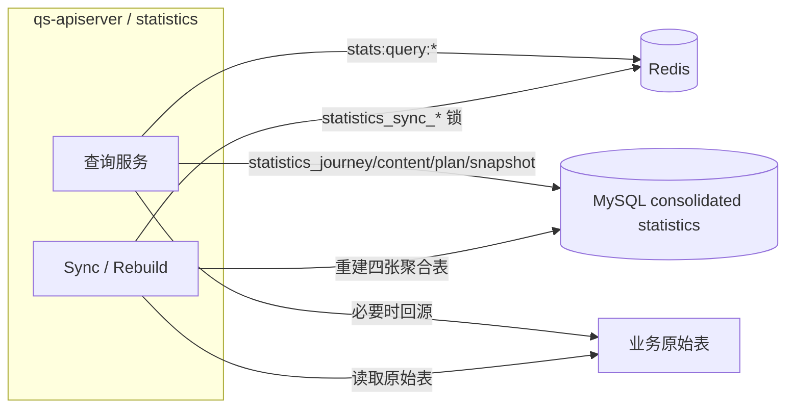

# statistics

**本文回答**：`qs-server` 当前的 `statistics` 模块到底负责什么、查询链路怎么分层、Redis 在统计模块里还承担什么角色、夜间同步如何运行，以及哪些旧的 Redis 预聚合设计已经退出运行时。

> 深讲 truth layer 已迁到 [statistics/README.md](./statistics/README.md)。本文保留为兼容入口和连续阅读材料；新增统计口径、读模型、query cache 或 behavior projection 关系时，优先维护子目录深讲。

---

## 30 秒了解系统

### 概览

`statistics` 是 `qs-apiserver` 内部的读侧统计模块。它不负责主业务写入，不负责计分和评估，也不发布稳定的 `statistics.*` 业务事件。它做的事情更具体：

- 对外提供系统级、问卷级、受试者级、计划级统计查询
- 在需要时从原始业务表回源聚合
- 维护 MySQL 统计读模型
- 通过 `apiserver` 内部定时任务重建统计表，并在必要时触发统计缓存预热

当前实现已经从早期“复杂 Redis 预聚合体系”收口成：

- 查询结果缓存
- MySQL 统计读模型
- 由 Redis 分布式锁保护的夜间重建任务

### 一屏结论

| 维度 | 当前事实 |
| ---- | -------- |
| 模块定位 | 读侧统计模块，不是主业务写入域 |
| 主要查询 | system / questionnaire / testee / plan |
| 查询优先级 | 查询结果缓存 -> MySQL 统计表 -> 原始表回源 |
| worker 角色 | 不再承担统计 Redis 增量写入；worker 与统计模块只保留间接事件来源关系 |
| Redis 统计键 | 统计模块直接使用的只剩 `stats:query:*` |
| Redis 锁 | `statistics_sync_leader` / `statistics_sync` 由 `apiserver` 统计同步任务使用，但它们属于共享锁层，不属于统计缓存 key family |
| 已退出运行时的旧键 | 旧的 window / accumulated / distribution 统计键族 |
| 部署现实 | `cache.disable_statistics_cache=false` 时才启用统计查询结果缓存；夜间同步是否运行由 `statistics_sync.*` 和 Redis 锁共同决定 |

---

## 模块边界

### 负责什么

- system / questionnaire / testee / plan 统计查询
- Redis 查询结果缓存
- 从原始业务表重建四张 MySQL 聚合读模型：`statistics_journey_daily / statistics_content_daily / statistics_plan_daily / statistics_org_snapshot`
- 通过调度器执行统计同步，并在完成后触发统计缓存预热

### 不负责什么

- 计分、评估引擎、报告生成
- 计划调度
- 问卷 / 答卷 / 测评主数据写入
- 统一 BI / OLAP 平台能力
- 独立 `statistics-service` 进程

---

## 当前运行时结构

### 运行时示意图

### 角色分工

| 进程 | 对统计的职责 |
| ---- | ------------ |
| `qs-worker` | 不直接承载统计 Redis 写入；只通过事件链路间接影响后续统计结果 |
| `qs-apiserver` | 提供查询、维护查询结果缓存、重建 MySQL 统计表，并运行统计同步调度器 |

---

## 查询链路

### 查询优先级

当前统计查询的典型优先级是：

1. 先读 `stats:query:*`
2. 命中不到时读 MySQL 统计表
3. MySQL 统计表不够时再回源原始业务表
4. 计算完成后回填 `stats:query:*`

### 各查询服务

| 服务 | 主要用途 | 代码锚点 |
| ---- | -------- | -------- |
| `SystemStatisticsService` | 系统级统计 | [../../internal/apiserver/application/statistics/system_service.go](../../internal/apiserver/application/statistics/system_service.go) |
| `QuestionnaireStatisticsService` | 问卷维度统计 | [../../internal/apiserver/application/statistics/questionnaire_service.go](../../internal/apiserver/application/statistics/questionnaire_service.go) |
| `TesteeStatisticsService` | 受试者维度统计 | [../../internal/apiserver/application/statistics/testee_service.go](../../internal/apiserver/application/statistics/testee_service.go) |
| `PlanStatisticsService` | 计划维度统计 | [../../internal/apiserver/application/statistics/plan_service.go](../../internal/apiserver/application/statistics/plan_service.go) |

### 当前查询模型的真实形态

- `system`：查询结果缓存 + MySQL / 原始表组合
- `questionnaire`：MySQL 统计表是主读源；必要时补原始表聚合
- `testee`：当前是“原始表聚合 + 查询结果缓存”，不再依赖旧的 Redis 预聚合 / MySQL accumulated 链路
- `plan`：查询结果缓存 + 统计表 / 原始表聚合

---

## 当前统计模块直接使用的 Redis 只剩 1 类 key family

### 运行时保留的 key family

| Key family | 谁在写 | 谁在读 | TTL | 用途 |
| ---------- | ------ | ------ | --- | ---- |
| `stats:query:{cacheKey}` | `qs-apiserver` 查询 miss 后回填 | 同一批统计查询服务 | `5m` | 查询结果缓存 |

代码锚点：

- 统计 Redis 封装：[../../internal/apiserver/infra/statistics/cache.go](../../internal/apiserver/infra/statistics/cache.go)
- 查询服务使用点：
  [../../internal/apiserver/application/statistics/system_service.go](../../internal/apiserver/application/statistics/system_service.go)
  [../../internal/apiserver/application/statistics/questionnaire_service.go](../../internal/apiserver/application/statistics/questionnaire_service.go)
  [../../internal/apiserver/application/statistics/testee_service.go](../../internal/apiserver/application/statistics/testee_service.go)
  [../../internal/apiserver/application/statistics/plan_service.go](../../internal/apiserver/application/statistics/plan_service.go)

### 当前已经退出运行时的旧 key family

以下设计不应再写成“当前系统仍在用”：

- `event:processed:*`
- `stats:daily:questionnaire:*`
- 旧的 window 统计键族
- 旧的 accumulated 统计键族
- 旧的 distribution 统计键族

它们已经从运行时代码中清掉，不再作为现状叙述。

---

## 统计同步如何运行

### 当前由 apiserver 内部调度器触发

统计同步不再依赖 worker 写 Redis daily 中转，而是由 `apiserver` 内部调度器按日触发：

- [../../internal/apiserver/runtime/scheduler/statistics_sync.go](../../internal/apiserver/runtime/scheduler/statistics_sync.go)
- [../../internal/apiserver/application/statistics/sync_service.go](../../internal/apiserver/application/statistics/sync_service.go)

调度器会先通过共享锁层获取：

- `statistics_sync_leader`
- `statistics_sync`

然后再执行统计表重建与统计缓存预热。

### 当前同步内容

| 服务 | 当前作用 | 代码锚点 |
| ---- | -------- | -------- |
| `StatisticsSyncRunner` | 定时触发 nightly sync，获取 leader / task lock，并在完成后触发统计 warmup | [../../internal/apiserver/runtime/scheduler/statistics_sync.go](../../internal/apiserver/runtime/scheduler/statistics_sync.go) |
| `StatisticsSyncService.SyncDailyStatistics` | 从事实表重建 `statistics_journey_daily / statistics_content_daily` | [../../internal/apiserver/application/statistics/sync_service.go](../../internal/apiserver/application/statistics/sync_service.go) |
| `StatisticsSyncService.SyncOrgSnapshotStatistics` | 刷新 `statistics_org_snapshot` | 同上 |
| `StatisticsSyncService.SyncPlanStatistics` | 从 `assessment_task` 等业务表重建 `statistics_plan_daily` | 同上 |
| `WarmupCoordinator.HandleStatisticsSync` | 在 nightly sync 之后执行统计查询缓存预热 | [../../internal/apiserver/application/cachegovernance/coordinator.go](../../internal/apiserver/application/cachegovernance/coordinator.go) |

### 当前配置边界

- `cache.disable_statistics_cache=true` 时，统计查询结果缓存会被关闭
- `statistics_sync.enable=false` 时，不会启动 nightly sync 调度器
- `statistics_sync.lock_key / lock_ttl` 控制调度器抢锁行为
- 统计同步后的预热由 `cache.statistics_warmup` 和 `cache.warmup.*` 共同控制

代码锚点：

- [../../internal/apiserver/options/options.go](../../internal/apiserver/options/options.go)
- [../../internal/apiserver/process/runtime_bootstrap.go](../../internal/apiserver/process/runtime_bootstrap.go)

---

## MySQL 统计表和同步链路

### 当前主要读模型表

| 表 | 用途 |
| --- | ---- |
| `statistics_journey_daily` | org / clinician / entry 维度的行为旅程、接入漏斗、测评服务日聚合 |
| `statistics_content_daily` | questionnaire / scale / content 维度的提交、完成、失败、报告日聚合 |
| `statistics_plan_daily` | 计划任务日聚合 |
| `statistics_org_snapshot` | 机构总览快照 |

### 当前同步逻辑

| 服务 | 当前作用 | 代码锚点 |
| ---- | -------- | -------- |
| `StatisticsSyncService.SyncDailyStatistics` | 从原始业务表重建 journey/content daily | [../../internal/apiserver/application/statistics/sync_service.go](../../internal/apiserver/application/statistics/sync_service.go) |
| `StatisticsSyncService.SyncOrgSnapshotStatistics` | 从原始业务表刷新 org snapshot | 同上 |
| `StatisticsSyncService.SyncPlanStatistics` | 从业务表聚合计划统计到 `statistics_plan_daily` | 同上 |
| `StatisticsSyncRunner` | 负责 nightly 调度、获取 Redis 锁、触发 warmup | [../../internal/apiserver/runtime/scheduler/statistics_sync.go](../../internal/apiserver/runtime/scheduler/statistics_sync.go) |

### 当前最重要的现实边界

- `statistics` 模块当前不再依赖 worker 写入 Redis daily 中转
- `plan` 统计一直是独立重建，不走 Redis daily
- `testee` 统计不依赖 MySQL accumulated，也不依赖旧 Redis 累计链路
- 旧 `statistics_daily / statistics_accumulated / statistics_plan` 与拆散的 `analytics_*_daily` 已退出运行时代码路径，并由 `000028_drop_legacy_statistics_read_models` 物理删表
- Redis 在统计模块中的职责已经收口为“查询结果缓存 + 调度锁”

---

## REST 与运维入口

### 外部查询入口

| 路径 | 用途 |
| ---- | ---- |
| `/api/v1/statistics/system` | 系统统计 |
| `/api/v1/statistics/questionnaires/:code` | 问卷统计 |
| `/api/v1/statistics/testees/:testee_id` | 受试者统计 |
| `/api/v1/statistics/plans/:plan_id` | 计划统计 |

### internal 运维入口

| 路径 | 用途 |
| ---- | ---- |
| `/internal/v1/statistics/sync/daily` | 同步 daily |
| `/internal/v1/statistics/sync/org-snapshot` | 同步 org snapshot |
| `/internal/v1/statistics/sync/plan` | 同步 plan |

代码锚点：

- [../../internal/apiserver/transport/rest/handler/statistics.go](../../internal/apiserver/transport/rest/handler/statistics.go)
- [../../internal/apiserver/transport/rest](../../internal/apiserver/transport/rest/)

说明：历史上曾有 `statistics/validate` 入口，但它已经不在当前 router 注册路径中，不应再按现行能力描述。

---

## 当前不应再讲的旧统计心智

下面这些说法现在都不应继续出现在现状文档里：

- “worker 还会写旧的 window / accumulated / distribution 统计键族”
- “Validate 还会对旧 accumulated 键和 MySQL accumulated 做对账”
- “testee / plan 统计仍依赖 Redis 预聚合体系”
- “统计 Redis 还是一整套复杂预聚合模型”

这些都已经不是当前运行时代码的事实。

---

## 当前边界：哪些话可以讲，哪些不要讲过头

### 可以明确讲成“当前已实现”的

- 统计查询结果缓存仍然在线，且 Redis 不可用时可降级
- 统计 Redis 运行时只剩 `stats:query:*`、`event:processed:*`、`stats:daily:questionnaire:*`
- 问卷 daily 同步与校验链仍然存在
- `testee` 统计已经回到“原始表聚合 + 查询结果缓存”

### 不能讲过头的

- 不能再把旧的 `stats:window / accum / dist` 讲成现状
- 不能把 worker 统计 Redis 讲成“默认一定在线”，因为默认配置下它通常是关闭的
- 不能把统计模块讲成独立统计服务或统一 BI 引擎

---

## 代码索引

### 装配与接口

- [../../internal/apiserver/container/assembler/statistics.go](../../internal/apiserver/container/assembler/statistics.go)
- [../../internal/apiserver/transport/rest/handler/statistics.go](../../internal/apiserver/transport/rest/handler/statistics.go)

### 应用服务

- [../../internal/apiserver/application/statistics/](../../internal/apiserver/application/statistics/)

### 持久化

- [../../internal/apiserver/infra/mysql/statistics/](../../internal/apiserver/infra/mysql/statistics/)
- [../../internal/apiserver/infra/statistics/cache.go](../../internal/apiserver/infra/statistics/cache.go)
- [../../internal/apiserver/runtime/scheduler/statistics_sync.go](../../internal/apiserver/runtime/scheduler/statistics_sync.go)

### 调度与重建

- [../../internal/apiserver/application/statistics/sync_service.go](../../internal/apiserver/application/statistics/sync_service.go)
- [../../internal/apiserver/application/cachegovernance/coordinator.go](../../internal/apiserver/application/cachegovernance/coordinator.go)

---

*写作约定见 [CONTRIBUTING-DOCS.md](../CONTRIBUTING-DOCS.md)。*
