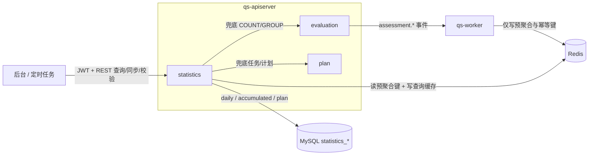
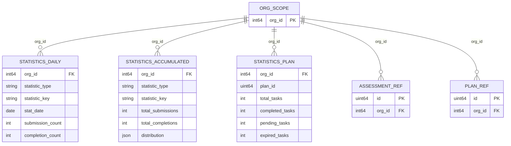
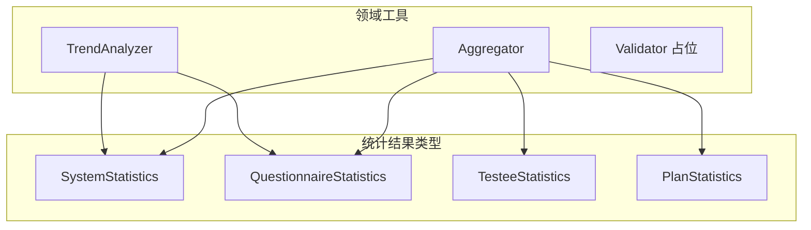
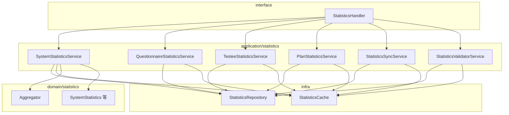
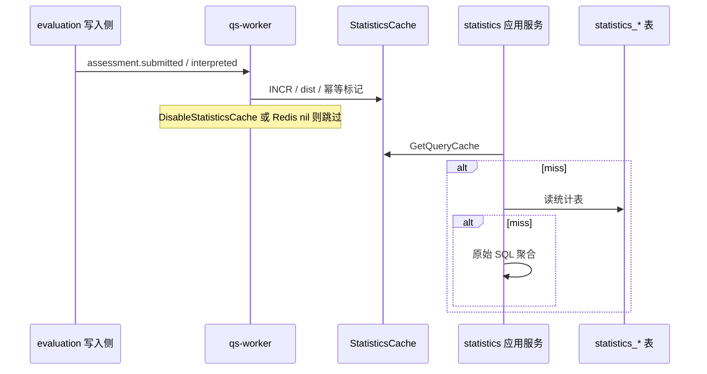

# statistics

**本文回答**：`statistics` 模块负责把分散在测评、计划、主体等域的数据整理成可查询的统计读模型；这篇文档会先让读者一屏内看清模块职责、查询分层、同步入口和运行时边界，再展开模型、服务、事件驱动更新与一致性校验细节。

本文档按 [CONTRIBUTING-DOCS.md](../CONTRIBUTING-DOCS.md) 中的**业务模块推荐结构**撰写；写作时需覆盖的动机、命名、实现位置与可核对性，见该文「讲解维度」一节，本文正文不重复贴标签。

---

## 30 秒了解系统

### 概览

`statistics` 是 `qs-apiserver` 内的**读侧统计模块**：把分散在 [evaluation](./03-evaluation.md)、[actor](./05-actor.md)、[plan](./04-plan.md) 等数据上的指标，收敛成系统级、问卷级、受试者级、计划级等**可查询视图**。实现上采用 **Redis 预聚合 + MySQL 统计表 + 原始表回源** 的分层读取；**不是**主业务写入域，也**不是**通用 BI/实时分析引擎。

代码主路径：`internal/apiserver/domain/statistics`（结果类型与 `Aggregator` / `TrendAnalyzer` 等）、`internal/apiserver/application/statistics`；持久化在 **MySQL**（`statistics_*` 表）与可选 **Redis**（`StatisticsCache`）；**qs-worker** 内消费测评相关事件并写 Redis（见 [statistics_handler.go](../../internal/worker/handlers/statistics_handler.go)）。读侧保护与预聚合总览见 [05-专题/03](../05-专题分析/03-保护层与读侧架构：限流、背压、缓存、统计预聚合.md)。

### 重点速查

如果只看一屏，先看下面这张表：

| 维度 | 结论 |
| ---- | ---- |
| 模块职责 | 提供系统级、问卷级、受试者级、计划级等统计查询视图，并负责同步与校验入口 |
| 查询分层 | 优先读 Redis 查询缓存，再读 MySQL 统计表，最后必要时回源业务表聚合 |
| 同步入口 | 外部后台查询走 `/api/v1/statistics/*`；同步/校验走 `/internal/v1/statistics/*` |
| 事件驱动 | `assessment.*` 相关事件由 `qs-worker` 消费后写 Redis 预聚合，不在 apiserver 事件路径内直接增量写 |
| 核心边界 | 不负责测评计分、计划调度、问卷主数据写入，也不发布稳定 `statistics.*` 业务事件 |
| 存储分层 | MySQL 持久化 `statistics_*` 读模型；Redis 同时承担预聚合键与查询结果缓存，但两类键用途不同 |

### 模块边界

| | 内容 |
| -- | ---- |
| **负责（摘要）** | 多维度统计查询；Redis/MySQL/原始表分层读；运维向同步与一致性校验（internal REST）；测评事件驱动的 Redis 预聚合（在 worker 进程内实现） |
| **不负责（摘要）** | 测评计分与流水线编排；计划调度；问卷/答卷主数据写入（[survey](./01-survey.md)）；**无**独立统计微服务进程（[`events.yaml`](../../configs/events.yaml) 已不与虚构 `statistics-service` consumer 对齐） |
| **关联专题** | 读侧与缓存策略 [05-专题/03](../05-专题分析/03-保护层与读侧架构：限流、背压、缓存、统计预聚合.md)；横切存储细节 [03-基础设施](../03-基础设施/) |

#### 负责什么（细项）

维护文档时**以本清单与源码为真值**；与代码不一致时应改代码或改文。

- **查询**：`GET /api/v1/statistics/system|questionnaires/:code|testees/:testee_id|plans/:plan_id` — 统一走「查询结果缓存 → MySQL 统计表 → 原始表聚合」优先级（各 `*_service.go`）。
- **同步**：`POST /internal/v1/statistics/sync/daily|accumulated|plan` — 将 Redis 日/累计写入 `statistics_daily` / `statistics_accumulated`，计划统计从业务表聚合入 `statistics_plan`（[sync_service.go](../../internal/apiserver/application/statistics/sync_service.go)）。
- **校验**：`POST /internal/v1/statistics/validate` — 应用层 `StatisticsValidatorService.ValidateConsistency`（非领域层 `Validator` 全量实现）。
- **事件侧增量**：`assessment.submitted` / `assessment.interpreted` 在 **qs-worker** 中由主 handler（yaml 登记为 `assessment_*_handler`）**内部再调用** `statistics_assessment_*_handler` 写 Redis（见 [assessment_handler.go](../../internal/worker/handlers/assessment_handler.go)）；与 [configs/events.yaml](../../configs/events.yaml) 对读见下「Verify」。

#### 不负责什么（细项）

- **领域事件输出**：本模块**不**发布稳定的 `statistics.*` 业务事件；对外是查询与运维接口。
- **Mongo 问卷/答卷计数**：系统统计兜底路径中问卷数、答卷数、今日新增答卷等仍为占位或未接 Mongo（见 [system_service.go](../../internal/apiserver/application/statistics/system_service.go) 注释）。
- **plan / task / report.exported 的「统计更新」**：[`events.yaml`](../../configs/events.yaml) 仅列真实消费者（如 `qs-worker`）；对应 handler 内事件驱动统计仍为 **TODO**（[plan_handler.go](../../internal/worker/handlers/plan_handler.go)、[report_handler.go](../../internal/worker/handlers/report_handler.go)），**计划维度的 `statistics_plan` 以 apiserver `POST /statistics/sync/plan` 等同步为主**。

### 契约入口

- **REST**：以 [api/rest/apiserver.yaml](../../api/rest/apiserver.yaml) `Statistics` / `Statistics-Sync` 为准；[statistics.go](../../internal/apiserver/interface/restful/handler/statistics.go)、[routers.go](../../internal/apiserver/routers.go) `registerStatisticsProtectedRoutes`。
- **领域事件**：[`configs/events.yaml`](../../configs/events.yaml) Topic、handler 名与 consumers；与 worker 注册名对照见下文 **Verify**。

### 运行时示意图

#### 运行时图说明

查询与同步在 **apiserver · statistics** 内闭环；**测评事件驱动的 Redis 预聚合**只在 **qs-worker** 内写入。启用 IAM 时，统计路由与 `/api/v1` 其它受保护接口同属 **JWT** 链（见 [routers.go](../../internal/apiserver/routers.go) 前置中间件）。

#### Redis 写入/读取分工（apiserver vs worker）

| 进程 | 对 Redis 的行为 | 键族（前缀） | 锚点 |
| ---- | --------------- | ------------ | ---- |
| **qs-worker** | **写**：事件增量 INCR、分布 Hash、幂等标记 | `stats:daily:`、`stats:window:`、`stats:accum:`、`stats:dist:`、`event:processed:` | [statistics_handler.go](../../internal/worker/handlers/statistics_handler.go) |
| **qs-apiserver · statistics** | **写**：各统计接口的**查询结果** JSON 缓存 | `stats:query:` + 业务 `cacheKey`（如 `system:1`） | 各 `*_service.go` `SetQueryCache`、[cache.go](../../internal/apiserver/infra/statistics/cache.go) |
| **qs-apiserver · statistics** | **读**：同步扫日键、读日计数；校验读累计计数 | `stats:daily:*`（`ScanDailyKeys` / `GetDailyCount`）、`stats:accum:*`（`GetAccumCount`） | [sync_service.go](../../internal/apiserver/application/statistics/sync_service.go)、[validator_service.go](../../internal/apiserver/application/statistics/validator_service.go) |

**注意**：worker **不**写 `stats:query:*`；apiserver **不**在测评事件路径上写 `stats:daily` / `stats:accum`（仅同步/校验读、查询链写查询缓存）。

### 主要代码入口（索引）

| 关注点 | 路径 |
| ------ | ---- |
| 装配 | [internal/apiserver/container/assembler/statistics.go](../../internal/apiserver/container/assembler/statistics.go) |
| 应用服务 | [internal/apiserver/application/statistics/](../../internal/apiserver/application/statistics/) |
| 领域类型与工具 | [internal/apiserver/domain/statistics/](../../internal/apiserver/domain/statistics/) |
| MySQL 仓储 | [internal/apiserver/infra/mysql/statistics/](../../internal/apiserver/infra/mysql/statistics/) |
| Redis 缓存 | [internal/apiserver/infra/statistics/cache.go](../../internal/apiserver/infra/statistics/cache.go) |
| REST | [internal/apiserver/interface/restful/handler/statistics.go](../../internal/apiserver/interface/restful/handler/statistics.go) |
| worker 统计 | [internal/worker/handlers/statistics_handler.go](../../internal/worker/handlers/statistics_handler.go) |

---

## 模型与服务

与 [actor](./05-actor.md) 等模块一致：先用 **ER** 表达持久化读模型与业务外键语义，再用 **flowchart** 表达领域结果类型与工具类关系。

### 模型 ER 图

统计表为 **读模型**，权威业务仍落在 `assessment`、`assessment_task`、`testee` 等表；图中为逻辑关系，非 GORM 全字段展开。

- **`statistic_type` / `statistic_key`**：区分 `system` / `questionnaire` / `testee` 等维度及业务键（问卷 code、受试者 ID 等），见 [po.go](../../internal/apiserver/infra/mysql/statistics/po.go)。

### 模型关系（概念）

`statistics` **不是**以单一聚合根为中心，而是以**统计结果 DTO** + **领域工具**组织，便于独立演进查询字段。

### 领域模型与领域服务

#### 限界上下文

- **解决**：在**不修改**测评/计划主写入路径的前提下，提供可运维、可降级的统计读模型。
- **不解决**：业务状态机、报告生成、通知投递。

#### 核心概念

| 概念 | 职责 | 与相邻概念的关系 |
| ---- | ---- | ---------------- |
| `StatisticType` | 维度枚举（system / questionnaire / testee / plan） | 与 Redis 键、MySQL `statistic_type` 列一致 |
| `*Statistics` 结构体 | 对外 JSON 统计视图 | 由 PO 转换或实时聚合填充 |
| `Aggregator` | 完成率、窗口计数等通用计算 | 被各应用服务调用 |
| `TrendAnalyzer` | 时间序列趋势 | 系统/问卷趋势 |
| `Validator`（domain） | 占位 | **真正校验**在 `StatisticsValidatorService` |

### 应用服务设计

| 应用服务 | 用途摘要 | 锚点 |
| -------- | -------- | ---- |
| `SystemStatisticsService` | 系统级统计查询 | [system_service.go](../../internal/apiserver/application/statistics/system_service.go) |
| `QuestionnaireStatisticsService` | 问卷/量表维度 | [questionnaire_service.go](../../internal/apiserver/application/statistics/questionnaire_service.go) |
| `TesteeStatisticsService` | 受试者维度 | [testee_service.go](../../internal/apiserver/application/statistics/testee_service.go) |
| `PlanStatisticsService` | 计划任务聚合 | [plan_service.go](../../internal/apiserver/application/statistics/plan_service.go) |
| `StatisticsSyncService` | daily / accumulated / plan 同步 | [sync_service.go](../../internal/apiserver/application/statistics/sync_service.go) |
| `StatisticsValidatorService` | Redis vs MySQL 一致性修复 | [validator_service.go](../../internal/apiserver/application/statistics/validator_service.go) |

#### 分层图说明

- **Redis 缺失**：`StatisticsCache` 可为 nil，查询降级到 MySQL 与原始表；**同步/校验服务不初始化**（[assembler/statistics.go](../../internal/apiserver/container/assembler/statistics.go)）。
- **限流**：统计路由使用与其它查询/提交一致的 **rate limit** 配置（见 `routers.go` 中 `rateLimitedHandlers`）。

---

## 核心设计

### 核心契约：REST 与领域事件

#### REST（Verify）

机器可读契约以 [apiserver.yaml](../../api/rest/apiserver.yaml) 为准；路由以 [routers.go](../../internal/apiserver/routers.go) 为准。

| HTTP | 路径 | 摘要 |
| ---- | ---- | ---- |
| `GET` | `/api/v1/statistics/system` | 系统整体统计 |
| `GET` | `/api/v1/statistics/questionnaires/{code}` | 问卷/量表统计 |
| `GET` | `/api/v1/statistics/testees/{testee_id}` | 受试者统计 |
| `GET` | `/api/v1/statistics/plans/{plan_id}` | 计划统计 |
| `POST` | `/internal/v1/statistics/sync/daily` | 同步每日统计 |
| `POST` | `/internal/v1/statistics/sync/accumulated` | 同步累计统计 |
| `POST` | `/internal/v1/statistics/sync/plan` | 同步计划统计 |
| `POST` | `/internal/v1/statistics/validate` | 一致性校验与修复 |

#### 领域事件（Verify）

[`configs/events.yaml`](../../configs/events.yaml) 中 **事件名字符串、Topic、handler** 须与发布端、worker 注册名一致。下表强调**本仓库实际落地**部分：

| 事件 | Topic（yaml） | `events.yaml` 登记的 handler | 统计相关实际代码路径 | 说明 |
| ---- | ------------- | --------------------------- | --------------------- | ---- |
| `assessment.submitted` | `assessment-lifecycle` | `assessment_submitted_handler` | [assessment_handler.go](../../internal/worker/handlers/assessment_handler.go) → `GetFactory("statistics_assessment_submitted_handler")` → [statistics_handler.go](../../internal/worker/handlers/statistics_handler.go) | 写 Redis 日/窗口/累计/分布；yaml consumers 为 `qs-worker` 等 |
| `assessment.interpreted` | `assessment-lifecycle` | `assessment_interpreted_handler` | 同上 → `statistics_assessment_interpreted_handler` | 完成数、风险分布等 |
| `plan.created` / `task.*` / `report.exported` | 各 Topic | `plan_created_handler` 等 | [plan_handler.go](../../internal/worker/handlers/plan_handler.go)、[report_handler.go](../../internal/worker/handlers/report_handler.go) | consumers 与 yaml 一致（无 `statistics-service`）；**事件侧统计更新多为 TODO** |

**Verify 步骤**：改事件消费行为时，同时核对 **yaml 的 `handler` 名**、**`assessment_handler` 内对子 handler 的调用**、**`statistics_handler` 注册名**、以及本文「运行时」描述。

### 核心链路：查询、同步与 worker 增量

#### 查询优先级

1. Redis **查询结果缓存**（如 `system:{orgID}` 等）  
2. MySQL `statistics_*`  
3. 原始表实时聚合（`assessment`、`testee`、`assessment_task` 等）

#### 同步与校验

- **Daily**：Redis `stats:daily:*` → `statistics_daily`（[SyncDailyStatistics](../../internal/apiserver/application/statistics/sync_service.go)）  
- **Accumulated**：对问卷/受试者维度，按 `statKey` 调 `AggregateDailyToAccumulated`，该函数**只读 MySQL `statistics_daily` 行**汇总后 upsert `statistics_accumulated`（[repository.go](../../internal/apiserver/infra/mysql/statistics/repository.go)）；**不直接扫 Redis `stats:accum`**。同一同步流程内另调 `syncSystemStatistics` 从 **`assessment` / `testee` 原始表** 写 `statistic_type=system` 累计行。  
- **Plan**：从 `assessment_plan` + `assessment_task` 聚合 → `statistics_plan`，**不依赖** Redis 计划预聚合。  
- **Validate**：Redis `stats:accum:*:total_submissions` 与 MySQL `total_submissions` 比对，**以 Redis 为准修复**（非全量原始表对账）— [validator_service.go](../../internal/apiserver/application/statistics/validator_service.go)。

#### 定时任务推荐顺序（运维）

以下针对 **internal REST** `POST /internal/v1/statistics/sync/*` 与 `validate`；实现推荐 **Crontab + internal REST**。代码为 **upsert**，一般可重复执行，间隔按数据量调整。

| 步骤 | internal REST（`/internal/v1/statistics`） | 说明 |
| ---- | ------------------------------------------ | ---- |
| 1 | `POST .../sync/daily` | 把 worker 写入的 Redis 日统计刷入 `statistics_daily`。**须先于步骤 2**：累计同步从 **MySQL 日表**汇总，而非从 Redis 累计键重算。 |
| 2 | `POST .../sync/accumulated` | 日表 → 问卷/受试者 `statistics_accumulated` + 系统行（原始表）。 |
| 3 | `POST .../sync/plan` | 与步骤 1～2 **无数据依赖**，可与 2 并行或固定排在 2 后便于统一运维窗口。 |
| 4（可选） | `POST .../validate` | 建议在 **步骤 2 之后**按需执行：用 Redis **累计提交数**覆盖 MySQL 同行。若业务以「日表汇总」为真值，则可能与 worker 侧 **INCR 的 `stats:accum`** 不一致，需明确治理策略（见「一致性校验」小节）。 |

**前置**：若希望日表/累计反映事件增量，须 **worker 启用统计 Redis**（`DisableStatisticsCache=false` 且 Redis 可用）；否则步骤 1～2 仍安全执行，但 Redis 侧多为空，累计主要体现日表已有数据或后续回源。

#### worker 侧

- **`Options.Cache.DisableStatisticsCache`**（默认 `true`，[options.go](../../internal/worker/options/options.go)）：为 true 时 **不向 worker 注入 Redis**，统计 handler 跳过更新（与 [server.go](../../internal/worker/server.go) 一致）。
- **`org_id`**：worker 直接从 `assessment.submitted / interpreted` 事件载荷读取；事件缺少 `org_id` 时会跳过统计增量，避免写入错误租户。

### 核心数据流：维度矩阵、Redis 键与校验范围

本节把「读路径三层」「事件写 Redis」「同步落库」「校验修复」落到**可核对**的表；细节以代码为准。

#### 各统计视图：查询优先级与更新来源

四条查询服务的**读顺序**一致：**查询结果缓存**（`stats:query:*`）→ **`statistics_*` 表** → **原始 SQL 聚合**。下表强调**除读路径外**，哪些维度会被 **worker 事件**写入 Redis 预聚合、哪些主要靠 **同步/回源**。

| 视图 | 应用服务 | 查询结果缓存键（`cacheKey`，见 [cache.go](../../internal/apiserver/infra/statistics/cache.go) `GetQueryCache`） | MySQL 读模型 | 原始表回源（兜底） | worker 预聚合（`assessment.*`） |
| ---- | -------- | ---------------------------------------------------------------------------------------------------------- | ------------ | ------------------ | ------------------------------ |
| 系统 | `SystemStatisticsService` | `system:{orgID}` | `statistics_accumulated`，`statistic_type=system`，`statistic_key=system` | `assessment`、`testee` 等 | **否**（worker 不写 `system` 维度的 `stats:*`；`SyncAccumulatedStatistics` 内 `syncSystemStatistics` 从原始表写入累计行，见 [sync_service.go](../../internal/apiserver/application/statistics/sync_service.go)） |
| 问卷/量表 | `QuestionnaireStatisticsService` | `questionnaire:{orgID}:{questionnaire_code}` | `statistics_accumulated`，`statistic_type=questionnaire`，`statistic_key=问卷 code` | `assessment` 等 | **是**（问卷 code / 日 / 窗口 / 累计 / 分布） |
| 受试者 | `TesteeStatisticsService` | `testee:{orgID}:{testee_id}` | `statistics_accumulated`，`statistic_type=testee`，`statistic_key=受试者 ID 字符串` | `assessment` 等 | **是** |
| 计划 | `PlanStatisticsService` | `plan:{orgID}:{plan_id}` | `statistics_plan` | `assessment_task`（及受试者计数相关聚合） | **否**（[statistics_handler.go](../../internal/worker/handlers/statistics_handler.go) 仅问卷/受试者维度；计划表由 **SyncPlanStatistics** 扫 `assessment_plan` + `assessment_task` 写入） |

补充：**GET 查询**不直接解析 `stats:daily` / `stats:accum` 等预聚合键（整段 JSON 的 `stats:query:*` 除外）；worker 写的 Redis 预聚合主要经 **同步任务** 进入 `statistics_*` 后再被查询第二步读取，或长期在 Redis 中供校验器使用。

查询结果缓存 TTL 在应用层多为 **5 分钟**（各 `*_service.go` 中 `SetQueryCache`）。

#### 运维同步：输入与落表

| internal REST | 主要输入 | 写入/更新 |
| ------------- | -------- | -------- |
| `POST /internal/v1/statistics/sync/daily` | 扫描**当前请求 org** 下的 Redis `stats:daily:{org}:{type}:*`（`ScanDailyKeys`），`statTypes` 含 questionnaire / testee / **plan** | `statistics_daily`（[SyncDailyStatistics](../../internal/apiserver/application/statistics/sync_service.go)） |
| `POST /internal/v1/statistics/sync/accumulated` | 按**当前请求 org**的日键提取 `statKey`，`AggregateDailyToAccumulated`；另对当前 `org_id` 调 `syncSystemStatistics` | `statistics_accumulated`（问卷/受试者累计 + **system** 行） |
| `POST /internal/v1/statistics/sync/plan` | 只扫描**当前请求 org** 的 `assessment_plan`，再按任务表聚合 | `statistics_plan`（**不依赖** Redis 计划预聚合） |

说明：`SyncDailyStatistics` 当前扫描 `questionnaire` / `testee` / `plan` 三类日键；计划维度仍以 **sync/plan** 与查询回源为主。

#### Redis 键模板与 TTL

以下前缀与字段由 [cache.go](../../internal/apiserver/infra/statistics/cache.go) 定义；`orgID`、`statType`、`statKey` 与领域 `StatisticType`、业务键（问卷 code、受试者 ID 等）对应。

| 用途 | 键模式 | 备注 |
| ---- | ------ | ---- |
| 每日计数 | `stats:daily:{orgID}:{statType}:{statKey}:{YYYY-MM-DD}` | Hash：`submission_count`、`completion_count`；TTL **90 天**（`DefaultDailyStatsTTL`） |
| 滑动窗口 | `stats:window:{orgID}:{statType}:{statKey}:{window}`，`window` 为 `last7d` / `last15d` / `last30d` | 字符串 INCR；TTL **90 天** |
| 累计计数 | `stats:accum:{orgID}:{statType}:{statKey}:{metric}` | `metric` 如 `total_submissions`、`total_completions`、`total_assessments`、`completed_assessments`；**默认不过期**（`DefaultAccumStatsTTL=0`） |
| 分布 | `stats:dist:{orgID}:{statType}:{statKey}:{dimension}` | `dimension` 如 `origin`、`risk`；field 为枚举值；TTL **90 天** |
| 查询结果 | `stats:query:{cacheKey}` | `cacheKey` 见上表「查询结果缓存键」；TTL 由调用方传入（多为 5 分钟） |
| 事件幂等 | `event:processed:{eventID}` | worker 内 `IsEventProcessed` / `MarkEventProcessed` |

#### 一致性校验 `ValidateConsistency` 实际范围

实现见 [validator_service.go](../../internal/apiserver/application/statistics/validator_service.go)：

- **机构**：只校验**当前请求 org**。  
- **类型**：仅 **`questionnaire`**、**`testee`** 的累计维度；**不包含** `system` / `plan`。  
- **对比字段**：Redis `stats:accum:...:total_submissions` 与 MySQL `statistics_accumulated.total_submissions`。  
- **修复策略**：不一致时 **以 Redis 为准** 覆盖 MySQL `UpsertAccumulatedStatistics`。  
- **未覆盖**：`total_completions`、分布 JSON、`statistics_daily` / `statistics_plan` 的全字段对账、原始表再校验。

### 核心模式：读模型、三层读与租户假设

1. **CQRS 读模型**：统计表可重建、可重跑同步，不反向驱动业务聚合根状态。  
2. **三层读**：性能与可用性权衡；结果**可能短暂滞后**，不宜当作强实时账务。  
3. **租户收口**：worker 增量、internal REST 同步/校验、查询缓存键都以 `org_id` 为边界；定时调度器则通过 `statistics_sync.org_ids` 显式指定扫描范围。  
4. **领域 `Validator` vs 应用校验器**：一致性修复以应用服务为准，勿混淆两层职责。

### 核心存储与配置锚点

| 存储/配置 | 说明 |
| --------- | ---- |
| MySQL | `statistics_daily`、`statistics_accumulated`、`statistics_plan`（[po.go](../../internal/apiserver/infra/mysql/statistics/po.go)）；行级语义见上「维度矩阵」。 |
| Redis | 键模板与 TTL 见上「Redis 键模板与 TTL」；实现 [cache.go](../../internal/apiserver/infra/statistics/cache.go)。 |
| worker | `cache.disable-statistics-cache` / `DisableStatisticsCache` — [options.go](../../internal/worker/options/options.go) |

---

### 核心代码锚点索引

| 关注点 | 路径 | 说明 |
| ------ | ---- | ---- |
| 装配 | [internal/apiserver/container/assembler/statistics.go](../../internal/apiserver/container/assembler/statistics.go) | Redis 缺失时同步/校验为 nil |
| 应用层 | [internal/apiserver/application/statistics/](../../internal/apiserver/application/statistics/) | 查询与同步主逻辑 |
| 领域 | [internal/apiserver/domain/statistics/](../../internal/apiserver/domain/statistics/) | 类型与聚合工具 |
| REST | [internal/apiserver/interface/restful/handler/statistics.go](../../internal/apiserver/interface/restful/handler/statistics.go)、[internal/apiserver/routers.go](../../internal/apiserver/routers.go) | 查询与 internal 同步/校验入口 |
| worker | [internal/worker/handlers/statistics_handler.go](../../internal/worker/handlers/statistics_handler.go) | 测评事件 → Redis |

---

## 边界与注意事项

- **系统统计中的问卷/答卷/今日答卷**：兜底路径仍可能为 `0`（Mongo 未注入），与 OpenAPI 描述「包括问卷数量、答卷数量」并存时，以代码为准。  
- **worker 默认关闭统计缓存**：生产若依赖 Redis 增量，需显式打开并保证 Redis 与 apiserver 一致可用。  
- **Redis 不可用**：同步与校验服务不初始化；查询仍可走 MySQL 与原始表。  
- **`events.yaml` 与实现**：`consumers` 已与仓库进程对齐（无虚构 `statistics-service`）；**已实现**的测评 Redis 预聚合在 **qs-worker** 的 `assessment_*` → `statistics_assessment_*` 调用链。  

---

*写作约定见 [CONTRIBUTING-DOCS.md](../CONTRIBUTING-DOCS.md)。*
