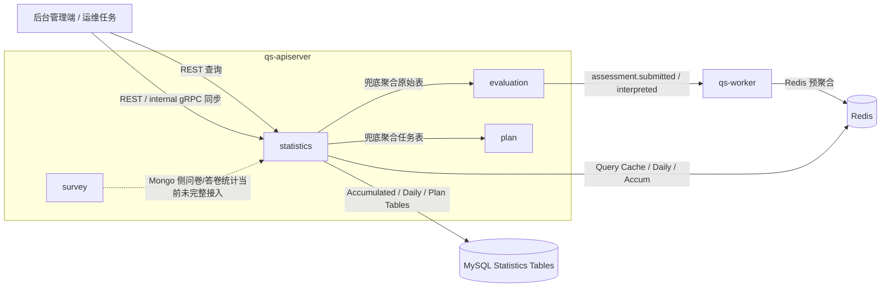
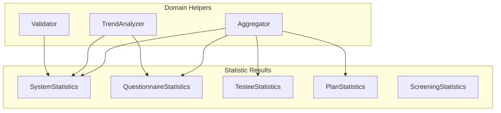
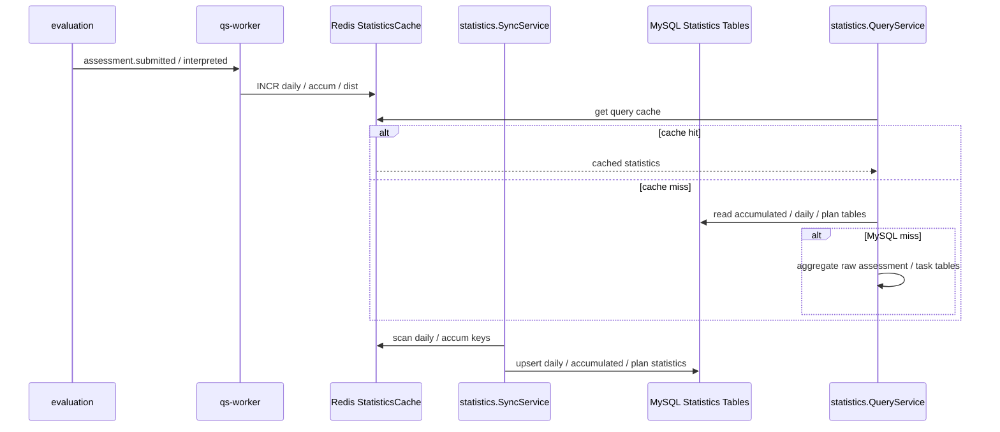

# statistics

本文介绍 `statistics` 模块的职责边界、模型组织、输入输出和主链路。

## 30 秒了解系统

`statistics` 是 `qs-apiserver` 里的统计模块，负责把分散在 `assessment / testee / plan` 等原始数据上的查询，收敛成统一的统计视图。

它当前主要做三件事：

- 提供系统级、问卷级、受试者级、计划级统计查询
- 维护一套 `Redis + MySQL 统计表 + 原始表回源` 的分层读取模型
- 提供定时同步和一致性校验入口，支撑统计数据持久化

它不是主业务写入模块，也不是实时分析引擎。运行时里，`statistics` 更像“读侧聚合模块”：一部分数据靠 `worker` 事件增量写入 Redis，一部分数据靠定时任务落库，一部分数据在查询时直接从原始表兜底聚合。

核心代码入口：

- [internal/apiserver/container/assembler/statistics.go](../../internal/apiserver/container/assembler/statistics.go)
- [internal/apiserver/application/statistics](../../internal/apiserver/application/statistics)
- [internal/apiserver/domain/statistics/types.go](../../internal/apiserver/domain/statistics/types.go)
- [internal/worker/handlers/statistics_handler.go](../../internal/worker/handlers/statistics_handler.go)

## 模块边界

### 负责什么

- 系统整体统计：测评数、受试者数、状态分布、近 30 天趋势
- 问卷/量表统计：总提交数、完成数、时间窗口计数、来源分布、每日趋势
- 受试者统计：总测评数、完成数、待完成数、风险分布、首末测评时间
- 计划统计：任务数、完成率、加入计划人数、活跃受试者数
- 统计数据同步：Redis 预聚合数据同步到 MySQL 统计表
- 统计数据校验：校验 Redis 与 MySQL 的累计统计是否一致

### 不负责什么

- 主业务写入：问卷提交、测评创建、任务创建都不在这里
- 原始业务规则：计分、解读、计划调度都不在这里
- BI 级复杂分析：当前模块主要是固定维度统计，不是通用分析平台
- 筛查统计的完整落地：`screening` 类型和接口已预留，但当前服务未真正初始化

### 运行时位置

## 模型与服务组织

### 模型

`statistics` 当前不是围绕聚合根写模型，而是围绕“统计结果类型”和“聚合算法”组织：

- `SystemStatistics`
- `QuestionnaireStatistics`
- `TesteeStatistics`
- `PlanStatistics`
- `ScreeningStatistics`
  - 定义：
    [internal/apiserver/domain/statistics/types.go](../../internal/apiserver/domain/statistics/types.go)
- `Aggregator`
  - 聚合工具：
    [internal/apiserver/domain/statistics/aggregator.go](../../internal/apiserver/domain/statistics/aggregator.go)
  - 负责完成率、参与率、每日计数等通用计算
- `TrendAnalyzer`
  - 趋势分析工具：
    [internal/apiserver/domain/statistics/trend_analyzer.go](../../internal/apiserver/domain/statistics/trend_analyzer.go)
  - 负责时间序列趋势计算
- `Validator`
  - 预留的领域校验工具：
    [internal/apiserver/domain/statistics/validator.go](../../internal/apiserver/domain/statistics/validator.go)
  - 当前结构仍在，但核心一致性比较与修复逻辑主要落在应用层 `StatisticsValidatorService`

### 服务

`statistics` 的应用服务分成两层：查询服务和后台同步服务。

查询服务：

- `SystemStatisticsService`
  - [internal/apiserver/application/statistics/system_service.go](../../internal/apiserver/application/statistics/system_service.go)
- `QuestionnaireStatisticsService`
  - [internal/apiserver/application/statistics/questionnaire_service.go](../../internal/apiserver/application/statistics/questionnaire_service.go)
- `TesteeStatisticsService`
  - [internal/apiserver/application/statistics/testee_service.go](../../internal/apiserver/application/statistics/testee_service.go)
- `PlanStatisticsService`
  - [internal/apiserver/application/statistics/plan_service.go](../../internal/apiserver/application/statistics/plan_service.go)

后台同步服务：

- `StatisticsSyncService`
  - [internal/apiserver/application/statistics/sync_service.go](../../internal/apiserver/application/statistics/sync_service.go)
  - 负责 `daily / accumulated / plan` 三类同步
- `StatisticsValidatorService`
  - [internal/apiserver/application/statistics/validator_service.go](../../internal/apiserver/application/statistics/validator_service.go)
  - 负责当前真正生效的 Redis 与 MySQL 一致性校验和修复

基础设施层：

- MySQL 统计仓储：
  [internal/apiserver/infra/mysql/statistics/repository.go](../../internal/apiserver/infra/mysql/statistics/repository.go)
- Redis 统计缓存：
  [internal/apiserver/infra/statistics/cache.go](../../internal/apiserver/infra/statistics/cache.go)

模块装配入口：

- [internal/apiserver/container/assembler/statistics.go](../../internal/apiserver/container/assembler/statistics.go)

这套组织的重点是：

- 查询接口和同步接口明确分开
- 统计结果以“类型”组织，不复用原始业务聚合
- `screening` 统计接口已预留，但当前未真正装配服务实例

## 接口输入与事件输出

### 输入

- 后台 REST 查询
  - `/api/v1/statistics/system`
  - `/api/v1/statistics/questionnaires/:code`
  - `/api/v1/statistics/testees/:testee_id`
  - `/api/v1/statistics/plans/:plan_id`
  - 入口：
    [internal/apiserver/routers.go](../../internal/apiserver/routers.go)
    [internal/apiserver/interface/restful/handler/statistics.go](../../internal/apiserver/interface/restful/handler/statistics.go)
- 后台 REST 同步/校验
  - `/api/v1/statistics/sync/daily`
  - `/api/v1/statistics/sync/accumulated`
  - `/api/v1/statistics/sync/plan`
  - `/api/v1/statistics/validate`
- internal gRPC 备用入口
  - `SyncDailyStatistics`
  - `SyncAccumulatedStatistics`
  - `SyncPlanStatistics`
  - `ValidateStatistics`
  - 入口：
    [internal/apiserver/interface/grpc/service/internal.go](../../internal/apiserver/interface/grpc/service/internal.go)
- 事件驱动输入
  - `assessment.submitted`
  - `assessment.interpreted`
  - 由 `worker` 消费后写 Redis 预聚合
  - 入口：
    [internal/worker/handlers/statistics_handler.go](../../internal/worker/handlers/statistics_handler.go)

### 输出

`statistics` 当前几乎没有自己的业务事件输出。它更像消费方和查询方：

- 消费评估事件，更新 Redis 预聚合
- 对外返回统计结果
- 通过同步接口把 Redis 状态落到 MySQL 统计表

### 统计依赖事件增量与定时同步协作

统计链路里确实存在事件驱动的增量更新，但它并不覆盖所有统计类型。当前真正接到 `worker` 事件链上的，主要只有：

- `questionnaire` 维度
- `testee` 维度

而 `system` 和 `plan` 更多依赖定时同步时直接从原始表聚合，`screening` 则仍停留在预留状态。

## 核心业务链路

### 查询链路

`statistics` 的查询服务统一遵循同一条优先级链：

1. 先查 Redis 查询结果缓存
2. 再查 MySQL 统计表
3. 最后从原始业务表实时聚合

这意味着它既追求读性能，也保留了“统计表丢失时仍可回源”的恢复能力。

### 更新与落库链路

### 定时同步链路

定时同步不是查询链路的一部分，而是一条独立运维链路：

- `SyncDailyStatistics`：把 Redis `stats:daily:*` 同步到 `statistics_daily`
- `SyncAccumulatedStatistics`：把 `statistics_daily` 聚合到 `statistics_accumulated`
- `SyncPlanStatistics`：直接从 `assessment_plan / assessment_task` 聚合到 `statistics_plan`
- `ValidateConsistency`：对比 Redis 与 MySQL 累计统计，必要时修复

## 关键设计点

### 1. statistics 是读侧聚合模块，不是业务聚合根模块

`statistics` 里的核心对象不是“可演进的业务实体”，而是“可直接返回给调用方的统计结果”。

关键代码：

- [internal/apiserver/domain/statistics/types.go](../../internal/apiserver/domain/statistics/types.go)

这样设计的价值在于：

- 统计模型不必背负业务写入约束
- 可以按查询需求独立演进字段
- 不会把 `assessment / task / testee` 的主业务生命周期混进统计模块

这也是为什么 `statistics` 更像 CQRS 里的读模型层，而不是 DDD 里的传统聚合根子域。

### 2. 查询优先级固定为 Redis 查询缓存 -> MySQL 统计表 -> 原始表回源

四个查询服务的实现几乎都遵循相同策略：

- 先读 `stats:query:*`
- 再读 `statistics_accumulated / statistics_daily / statistics_plan`
- 最后回源聚合 `assessment / testee / assessment_task`

关键代码：

- [internal/apiserver/application/statistics/system_service.go](../../internal/apiserver/application/statistics/system_service.go)
- [internal/apiserver/application/statistics/questionnaire_service.go](../../internal/apiserver/application/statistics/questionnaire_service.go)
- [internal/apiserver/application/statistics/testee_service.go](../../internal/apiserver/application/statistics/testee_service.go)
- [internal/apiserver/application/statistics/plan_service.go](../../internal/apiserver/application/statistics/plan_service.go)

这种三层读取模型的好处是：

- 热点查询快
- 统计表可持久化，便于运维和恢复
- 即使缓存和统计表失效，也还能从原始数据兜底

但代价也很明确：统计结果天然可能有短暂延迟，不适合被理解成绝对实时值。

### 3. Redis 预聚合目前只覆盖 assessment 事件驱动的部分统计

当前 `worker` 里有专门的统计事件处理器，会在 `assessment.submitted` 和 `assessment.interpreted` 时更新：

- 每日提交/完成计数
- 滑动窗口计数
- 累计提交/完成计数
- 风险分布
- 部分问卷/受试者维度统计

关键代码：

- [internal/worker/handlers/statistics_handler.go](../../internal/worker/handlers/statistics_handler.go)
- [internal/apiserver/infra/statistics/cache.go](../../internal/apiserver/infra/statistics/cache.go)

但这一层并不是“所有统计都靠事件更新”：

- `plan` 统计当前仍主要通过定时任务直接扫任务表
- `system` 统计会在同步时直接从原始表补齐
- `origin_type` 当前在 worker 里还是 `TODO`，问卷来源分布并未完整接好

因此，Redis 预聚合只覆盖部分维度，不能把它理解成完整统计更新总线。

### 4. MySQL 统计表是持久化读模型，不是业务主表

当前持久化模型主要有三张表：

- `statistics_daily`
- `statistics_accumulated`
- `statistics_plan`

关键代码：

- [internal/apiserver/infra/mysql/statistics/po.go](../../internal/apiserver/infra/mysql/statistics/po.go)
- [internal/apiserver/infra/mysql/statistics/repository.go](../../internal/apiserver/infra/mysql/statistics/repository.go)

这三张表的职责分别是：

- `daily`：时间序列粒度
- `accumulated`：统一维度累计统计
- `plan`：计划任务统计专表

把统计表单独建模的价值在于：

- 查询接口不必每次扫原始业务表
- 同步逻辑可以重跑，读模型可以重建
- 统计结构可以按查询需求演进，而不污染业务表

### 5. 当前实现明显带有“单租户优先”的现实假设

统计同步和 worker 增量更新里有一个很重要的现实约束：`org_id` 当前大量使用默认值 `1`。

关键代码：

- [internal/apiserver/application/statistics/constants.go](../../internal/apiserver/application/statistics/constants.go)
- [internal/apiserver/application/statistics/sync_service.go](../../internal/apiserver/application/statistics/sync_service.go)
- [internal/worker/handlers/statistics_handler.go](../../internal/worker/handlers/statistics_handler.go)

这意味着：

- 当前统计链路优先适配单租户场景
- 如果后续要真正做多租户统计，事件载荷、同步扫描和缓存键使用都需要同步升级

这意味着多租户统计仍有明显的后续改造空间。

### 6. 当前一致性校验是应用层修复流程，不是完整领域校验器

`statistics` 里“查询兜底”和“校验修复”是两条不同链路，需要分开理解。

关键代码：

- [internal/apiserver/application/statistics/validator_service.go](../../internal/apiserver/application/statistics/validator_service.go)
- [internal/apiserver/domain/statistics/validator.go](../../internal/apiserver/domain/statistics/validator.go)

当前真正生效的 `ValidateConsistency` 具有几个明确特征：

- 它在应用层执行，不是由领域层 `Validator` 完成
- 它当前主要校验 `questionnaire / testee` 两类累计提交数
- 发现 Redis 与 MySQL 不一致时，会以 Redis 累计值为准修复 MySQL
- 它不是“拿原始业务表做全字段对账”，也不是覆盖所有统计类型的通用校验器

所以这里的“真值来源”要分场景理解：

- 查询链路的最终兜底来源仍然是原始业务表
- 但当前一致性修复链路里，Redis 预聚合计数才是 MySQL 累计统计的修复基准

把这点写清，读者才不会把“可回源查询”误读成“校验修复也总是以原始表为准”。

## 边界与注意事项

- `screening` 统计类型和接口在模型层、装配层都预留了，但当前 `ScreeningStatisticsService` 仍未初始化，它还不是已实现能力。
- `system` 统计里问卷数量和答卷数量当前在实时聚合路径中仍是占位值 `0`，因为服务没有注入 Mongo 查询仓储。
- `worker` 默认配置里 `DisableStatisticsCache = true`，也就是 Redis 统计增量更新默认是关闭的；不开启时，统计更依赖 MySQL 统计表和原始表兜底。
- 当 Redis 不可用或统计缓存被禁用时，`StatisticsSyncService` 和 `StatisticsValidatorService` 在模块装配里都不会真正初始化，因此同步/校验链路不能视为始终可用。
- `ValidateConsistency` 当前主要校验 Redis 与 MySQL 的累计提交数，不是完整字段级全量校验。
- internal gRPC 的统计同步接口虽然存在，但代码注释已经明确推荐优先通过外部定时任务调用 REST 接口。
