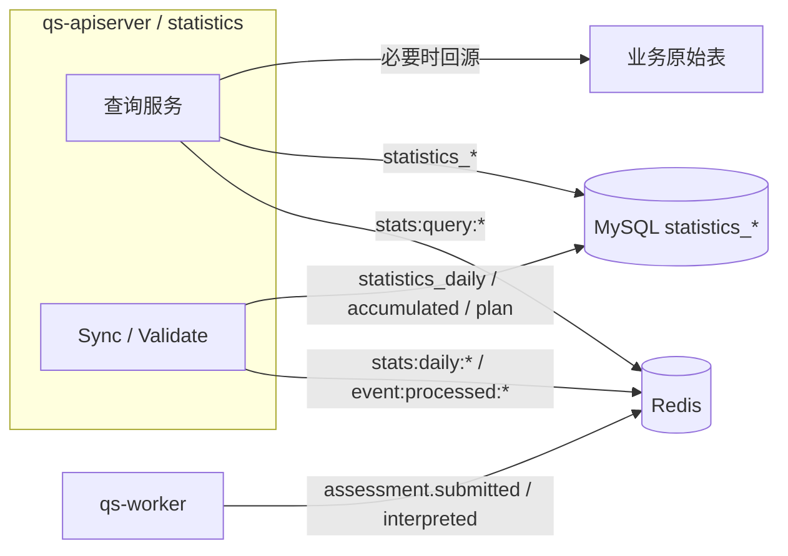

# statistics

**本文回答**：`qs-server` 当前的 `statistics` 模块到底负责什么、查询链路怎么分层、Redis 现在还剩哪些统计 key family、worker 和 apiserver 在统计链路上如何分工、哪些旧设计已经退出运行时。

---

## 30 秒了解系统

### 概览

`statistics` 是 `qs-apiserver` 内部的读侧统计模块。它不负责主业务写入，不负责计分和评估，也不发布稳定的 `statistics.*` 业务事件。它做的事情更具体：

- 对外提供系统级、问卷级、受试者级、计划级统计查询
- 在需要时从原始业务表回源聚合
- 维护 MySQL 统计读模型
- 读取 worker 写入的问卷 daily 中转键，做同步与一致性校验

当前实现已经从早期“复杂 Redis 预聚合体系”收口成：

- 查询结果缓存
- 统计事件幂等
- 问卷 daily 中转

### 一屏结论

| 维度 | 当前事实 |
| ---- | -------- |
| 模块定位 | 读侧统计模块，不是主业务写入域 |
| 主要查询 | system / questionnaire / testee / plan |
| 查询优先级 | 查询结果缓存 -> MySQL 统计表 -> 原始表回源 |
| worker 角色 | 只在 `assessment.*` 事件消费时写统计 Redis |
| Redis 统计键 | 只保留 `stats:query:*`、`event:processed:*`、`stats:daily:questionnaire:*` |
| 已退出运行时的旧键 | 旧的 window / accumulated / distribution 统计键族 |
| 当前唯一保留 Redis daily 中转的类型 | `questionnaire` |
| 部署现实 | worker 默认 `cache.disable_statistics_cache=true`，所以 daily / 幂等键只有在显式开启统计 Redis 时才会产生 |

---

## 模块边界

### 负责什么

- system / questionnaire / testee / plan 统计查询
- Redis 查询结果缓存
- 读取问卷 daily 中转键，同步到 MySQL `statistics_daily`
- 基于 `statistics_daily` 聚合问卷累计统计
- Redis 与 MySQL 间的一致性校验与修复

### 不负责什么

- 计分、评估引擎、报告生成
- 计划调度
- 问卷 / 答卷 / 测评主数据写入
- 统一 BI / OLAP 平台能力
- 独立 `statistics-service` 进程

---

## 当前运行时结构

### 运行时示意图

### 角色分工

| 进程 | 对统计的职责 |
| ---- | ------------ |
| `qs-worker` | 消费测评事件后写统计 Redis（问卷 daily + 幂等键） |
| `qs-apiserver` | 提供查询、同步、校验；写查询结果缓存；落 MySQL 统计表 |

---

## 查询链路

### 查询优先级

当前统计查询的典型优先级是：

1. 先读 `stats:query:*`
2. 命中不到时读 MySQL 统计表
3. MySQL 统计表不够时再回源原始业务表
4. 计算完成后回填 `stats:query:*`

### 各查询服务

| 服务 | 主要用途 | 代码锚点 |
| ---- | -------- | -------- |
| `SystemStatisticsService` | 系统级统计 | [../../internal/apiserver/application/statistics/system_service.go](../../internal/apiserver/application/statistics/system_service.go) |
| `QuestionnaireStatisticsService` | 问卷维度统计 | [../../internal/apiserver/application/statistics/questionnaire_service.go](../../internal/apiserver/application/statistics/questionnaire_service.go) |
| `TesteeStatisticsService` | 受试者维度统计 | [../../internal/apiserver/application/statistics/testee_service.go](../../internal/apiserver/application/statistics/testee_service.go) |
| `PlanStatisticsService` | 计划维度统计 | [../../internal/apiserver/application/statistics/plan_service.go](../../internal/apiserver/application/statistics/plan_service.go) |

### 当前查询模型的真实形态

- `system`：查询结果缓存 + MySQL / 原始表组合
- `questionnaire`：MySQL 统计表是主读源；必要时补原始表聚合
- `testee`：当前是“原始表聚合 + 查询结果缓存”，不再依赖旧的 Redis 预聚合 / MySQL accumulated 链路
- `plan`：查询结果缓存 + 统计表 / 原始表聚合

---

## 当前统计 Redis 只剩 3 类 key family

### 运行时保留的 key family

| Key family | 谁在写 | 谁在读 | TTL | 用途 |
| ---------- | ------ | ------ | --- | ---- |
| `stats:query:{cacheKey}` | `qs-apiserver` 查询 miss 后回填 | 同一批统计查询服务 | `5m` | 查询结果缓存 |
| `event:processed:{eventID}` | `qs-worker` 统计 handler 处理成功后写入 | 同一 handler 处理前检查 | `7d` | 统计事件幂等 |
| `stats:daily:{org}:questionnaire:{code}:{date}` | `qs-worker` 对问卷提交数 / 完成数做 `HINCRBY` | sync / validate 服务 | `90d` | 问卷 daily 中转站 |

代码锚点：

- 统计 Redis 封装：[../../internal/apiserver/infra/statistics/cache.go](../../internal/apiserver/infra/statistics/cache.go)
- worker 写入：[../../internal/worker/handlers/statistics_handler.go](../../internal/worker/handlers/statistics_handler.go)

### 当前已经退出运行时的旧 key family

以下设计不应再写成“当前系统仍在用”：

- 旧的 window 统计键族
- 旧的 accumulated 统计键族
- 旧的 distribution 统计键族

它们已经从运行时代码中清掉，不再作为现状叙述。

---

## worker 如何写统计 Redis

### 当前只在两个事件上写

worker 统计写入只挂在这两个事件的消费链上：

- `assessment.submitted`
- `assessment.interpreted`

但注意：这是 **assessment 主 handler 内部再调用 statistics handler**，不是 `events.yaml` 里额外再配置一套独立统计消费者。

### 写入内容

| 事件 | 写入内容 |
| ---- | -------- |
| `assessment.submitted` | 问卷 daily `submission_count`；事件幂等键 |
| `assessment.interpreted` | 问卷 daily `completion_count`；事件幂等键 |

代码锚点：

- [../../internal/worker/handlers/assessment_handler.go](../../internal/worker/handlers/assessment_handler.go)
- [../../internal/worker/handlers/statistics_handler.go](../../internal/worker/handlers/statistics_handler.go)

### 当前部署边界

worker 默认：

- `cache.disable_statistics_cache=true`

也就是说，很多环境里如果没有显式开启这项配置，`event:processed:*` 和 `stats:daily:*` 实际不会产生。

代码锚点：

- [../../internal/worker/options/options.go](../../internal/worker/options/options.go)
- [../../internal/worker/server.go](../../internal/worker/server.go)

---

## MySQL 统计表和同步链路

### 当前主要读模型表

| 表 | 用途 |
| --- | ---- |
| `statistics_daily` | 问卷日粒度统计 |
| `statistics_accumulated` | 问卷累计统计 |
| `statistics_plan` | 计划维度统计 |

### 当前同步逻辑

| 服务 | 当前作用 | 代码锚点 |
| ---- | -------- | -------- |
| `StatisticsSyncService.SyncDailyStatistics` | 扫描 `stats:daily:questionnaire:*`，落 MySQL `statistics_daily` | [../../internal/apiserver/application/statistics/sync_service.go](../../internal/apiserver/application/statistics/sync_service.go) |
| `StatisticsSyncService.SyncAccumulatedStatistics` | 基于问卷 daily 聚合 `statistics_accumulated` | 同上 |
| `StatisticsSyncService.SyncPlanStatistics` | 从业务表聚合计划统计到 `statistics_plan` | 同上 |
| `StatisticsValidatorService.ValidateConsistency` | 用 Redis daily 汇总结果修复问卷 accumulated | [../../internal/apiserver/application/statistics/validator_service.go](../../internal/apiserver/application/statistics/validator_service.go) |

### 当前最重要的现实边界

- Redis daily 中转只对 `questionnaire` 成立
- `plan` 统计不是从 Redis daily 来的，而是独立同步
- `testee` 统计不再依赖旧的 Redis 累计链路

---

## REST 与运维入口

### 外部查询入口

| 路径 | 用途 |
| ---- | ---- |
| `/api/v1/statistics/system` | 系统统计 |
| `/api/v1/statistics/questionnaires/:code` | 问卷统计 |
| `/api/v1/statistics/testees/:testee_id` | 受试者统计 |
| `/api/v1/statistics/plans/:plan_id` | 计划统计 |

### internal 运维入口

| 路径 | 用途 |
| ---- | ---- |
| `/internal/v1/statistics/sync/daily` | 同步 daily |
| `/internal/v1/statistics/sync/accumulated` | 同步 accumulated |
| `/internal/v1/statistics/sync/plan` | 同步 plan |
| `/internal/v1/statistics/validate` | 一致性校验与修复 |

代码锚点：

- [../../internal/apiserver/interface/restful/handler/statistics.go](../../internal/apiserver/interface/restful/handler/statistics.go)
- [../../internal/apiserver/routers.go](../../internal/apiserver/routers.go)

---

## 当前不应再讲的旧统计心智

下面这些说法现在都不应继续出现在现状文档里：

- “worker 还会写旧的 window / accumulated / distribution 统计键族”
- “Validate 还会对旧 accumulated 键和 MySQL accumulated 做对账”
- “testee / plan 统计仍依赖 Redis 预聚合体系”
- “统计 Redis 还是一整套复杂预聚合模型”

这些都已经不是当前运行时代码的事实。

---

## 当前边界：哪些话可以讲，哪些不要讲过头

### 可以明确讲成“当前已实现”的

- 统计查询结果缓存仍然在线，且 Redis 不可用时可降级
- 统计 Redis 运行时只剩 `stats:query:*`、`event:processed:*`、`stats:daily:questionnaire:*`
- 问卷 daily 同步与校验链仍然存在
- `testee` 统计已经回到“原始表聚合 + 查询结果缓存”

### 不能讲过头的

- 不能再把旧的 `stats:window / accum / dist` 讲成现状
- 不能把 worker 统计 Redis 讲成“默认一定在线”，因为默认配置下它通常是关闭的
- 不能把统计模块讲成独立统计服务或统一 BI 引擎

---

## 代码索引

### 装配与接口

- [../../internal/apiserver/container/assembler/statistics.go](../../internal/apiserver/container/assembler/statistics.go)
- [../../internal/apiserver/interface/restful/handler/statistics.go](../../internal/apiserver/interface/restful/handler/statistics.go)

### 应用服务

- [../../internal/apiserver/application/statistics/](../../internal/apiserver/application/statistics/)

### 持久化

- [../../internal/apiserver/infra/mysql/statistics/](../../internal/apiserver/infra/mysql/statistics/)
- [../../internal/apiserver/infra/statistics/cache.go](../../internal/apiserver/infra/statistics/cache.go)

### worker 统计写入

- [../../internal/worker/handlers/statistics_handler.go](../../internal/worker/handlers/statistics_handler.go)
- [../../internal/worker/handlers/assessment_handler.go](../../internal/worker/handlers/assessment_handler.go)

---

*写作约定见 [CONTRIBUTING-DOCS.md](../CONTRIBUTING-DOCS.md)。*
