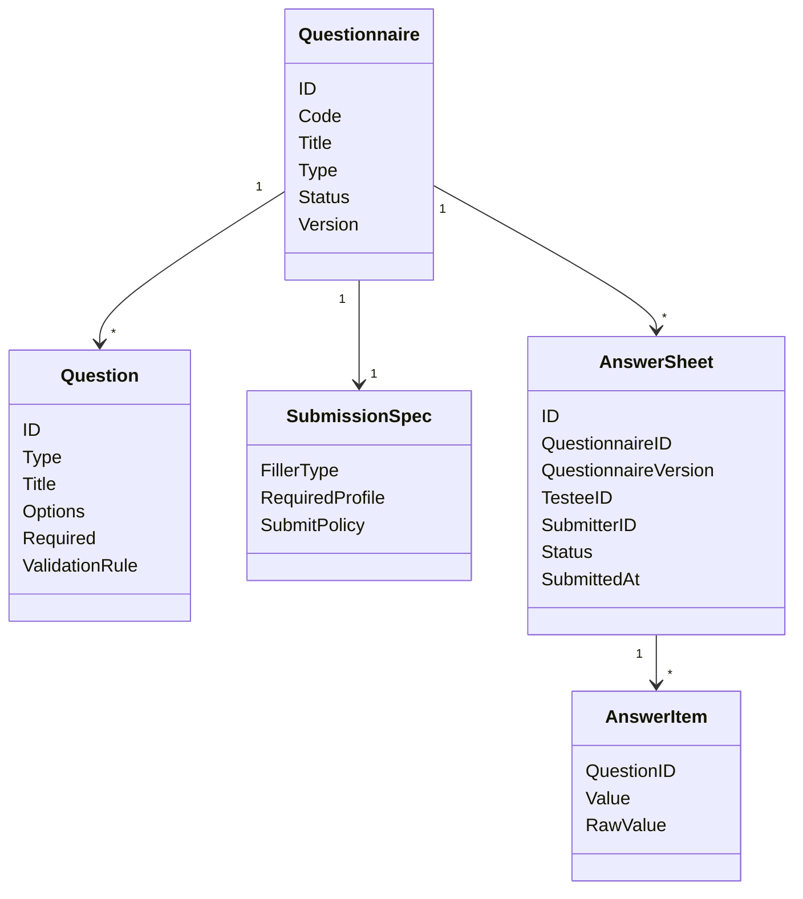

# Survey 领域模型

## 1. 模块核心概念

Survey 围绕两类事实建模：

- `Questionnaire`：一份可发布、可版本化的问卷定义。
- `AnswerSheet`：一次用户提交后的答卷事实。

前者描述“问什么”，后者描述“答了什么”。

---

## 2. 领域模型图

---

## 3. 聚合根与实体

| 类型 | 对象 | 说明 |
| ---- | ---- | ---- |
| 聚合根 | `Questionnaire` | 管理问卷定义、题目集合、生命周期和版本 |
| 实体 | `Question` | 问卷内题目，必须挂在问卷定义下理解 |
| 聚合根 | `AnswerSheet` | 管理一次答卷提交事实 |
| 实体 | `AnswerItem` | 答卷内单题答案 |

---

## 4. 值对象

| 值对象 | 说明 |
| ------ | ---- |
| `QuestionType` | 题型，例如单选、多选、文本、数字等 |
| `AnswerValue` | 单题答案的结构化值 |
| `QuestionnaireStatus` | 草稿、发布、归档等状态 |
| `SubmissionSpec` | 填报人、提交策略和约束 |

---

## 5. 领域服务

| 服务 | 职责 |
| ---- | ---- |
| 问卷校验 | 校验题目、选项、提交规格和发布前完整性 |
| 版本冻结 | 发布后冻结可提交版本，避免提交事实漂移 |
| 答案校验 | 校验必填、题型、答案唯一性和结构 |
| 答卷提交 | 创建 `AnswerSheet` 并触发后续事件 |

---

## 6. 领域事件

| 事件 | 语义 |
| ---- | ---- |
| `questionnaire.changed` | 问卷生命周期或结构发生变化 |
| `answersheet.submitted` | 答卷已提交，后续测评执行可以消费 |

---

## 7. 模型边界与反例

| 反例 | 说明 |
| ---- | ---- |
| `AnswerSheet` 不是 `AssessmentResult` | 前者是输入事实，后者是执行结果 |
| `Questionnaire` 不是 `AssessmentModel` | 前者管采集结构，后者管测评规则资产 |
| `Question` 的选项不是最终计分规则 | 选项可以参与映射，但规则权威在模型资产和执行层 |
| `AnswerSheetSubmitted` 不是 `ReportGenerated` | 提交完成不代表报告已生成 |
