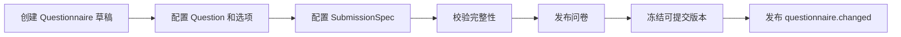

# 问卷定义链路

## 1. 业务目标

创建一份可被用户作答、可被模型绑定、可被历史答卷追溯的问卷定义。

---

## 2. 参与对象

| 对象 | 角色 |
| ---- | ---- |
| `Questionnaire` | 问卷聚合根 |
| `Question` | 题目实体 |
| `SubmissionSpec` | 提交规格 |
| `QuestionnaireVersion` | 发布后可追溯版本 |

---

## 3. 前置条件

- 问卷编码在业务范围内可识别。
- 题目结构完整，题型和答案规则可校验。
- 如果要进入测评链路，需要后续由 `assessment-model` 建立绑定。

---

## 4. 流程图

---

## 5. 关键规则

- 草稿可以调整结构，发布版本必须可追溯。
- 已被历史答卷引用的问卷版本不能被静默改写。
- 题目结构校验只保证可提交，不代表可计分。
- 问卷发布不等同于测评模型发布。

---

## 6. 幂等与异常处理

| 场景 | 处理 |
| ---- | ---- |
| 重复创建编码 | 拒绝或返回既有定义，避免同一业务编码多义 |
| 发布前题目不完整 | 拒绝发布 |
| 发布事件丢失 | `questionnaire.changed` 是 best effort，主事实以持久化问卷为准 |

---

## 7. 产出结果

- 可查询的 `Questionnaire`。
- 可作答的发布版本。
- 可被 `assessment-model` 绑定的问卷引用。
