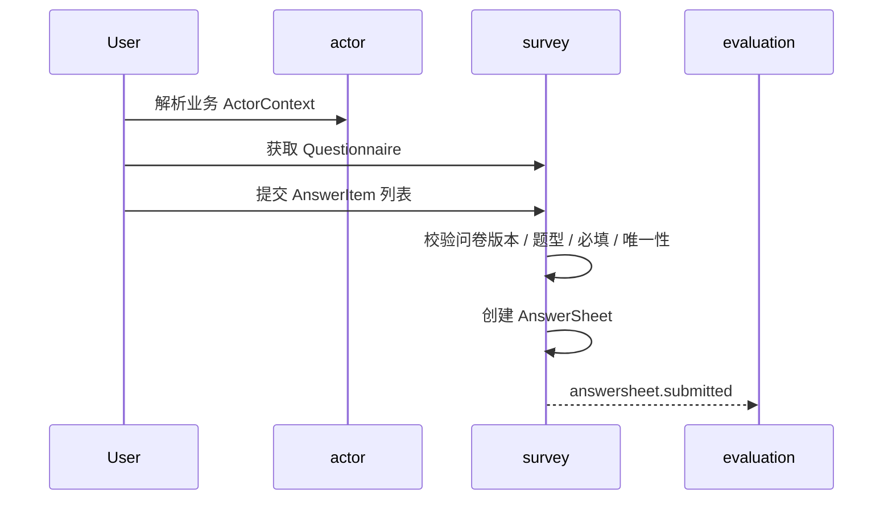

# 答卷提交链路

## 1. 业务目标

把用户一次作答沉淀为可靠的 `AnswerSheet` 事实，并通过事件进入后续测评执行链路。

---

## 2. 参与对象

| 对象 | 角色 |
| ---- | ---- |
| `ActorContext` | 提供受试者、提交者和组织上下文 |
| `Questionnaire` | 提供题目结构和提交规格 |
| `AnswerSheet` | 答卷事实聚合 |
| `AnswerItem` | 单题答案 |

---

## 3. 前置条件

- 问卷存在且处于可提交版本。
- 提交者和受试者上下文已解析。
- 答案结构满足题型和必填校验。

---

## 4. 流程图

---

## 5. 关键规则

- `AnswerSheet` 创建即代表提交事实，不把前端草稿建成后端领域状态。
- 答卷引用的是问卷和版本，不复制完整问卷模型。
- 答卷提交成功只代表作答事实落库，不代表测评或报告完成。

---

## 6. 幂等与异常处理

| 场景 | 处理 |
| ---- | ---- |
| 答案缺失或重复 | 拒绝提交 |
| 问卷版本不可提交 | 拒绝提交 |
| 后续测评暂时失败 | 不回滚 `AnswerSheet`，由 `evaluation` 处理执行失败 |
| 重复提交 | 由提交上下文、任务上下文或业务幂等键约束 |

---

## 7. 产出结果

- `AnswerSheet` 主事实。
- `answersheet.submitted` 可靠事件。
- 面向统计的答卷提交行为投影。
