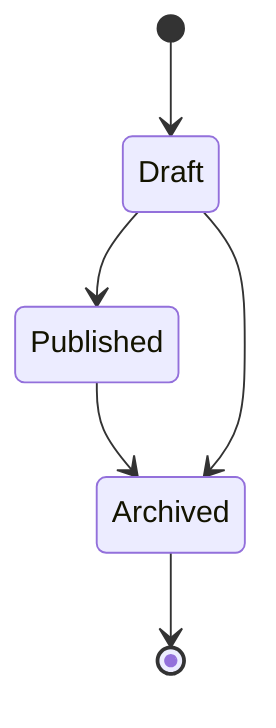
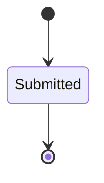

# Survey 状态流转与生命周期

## 1. Questionnaire 生命周期

| 状态 | 含义 |
| ---- | ---- |
| `Draft` | 草稿，可调整题目结构 |
| `Published` | 已发布，可被查询和提交 |
| `Archived` | 已归档，不再作为新提交入口 |

---

## 2. AnswerSheet 生命周期

当前后端领域语义下，`AnswerSheet` 关注提交后的事实，不把前端未提交草稿纳入后端主状态。

---

## 3. 生命周期边界

| 生命周期 | 模块 | 不应混入 |
| -------- | ---- | -------- |
| 问卷发布 / 归档 | `survey` | 模型发布状态 |
| 答卷提交 | `survey` | 测评执行状态 |
| 测评 Pending / Failed / Completed | `evaluation` | 答卷主状态 |
| 任务 Opened / Completed / Expired | `plan` | 答卷主状态 |

---

## 4. 事件

- `questionnaire.changed`：问卷生命周期变化。
- `answersheet.submitted`：答卷提交事实。
