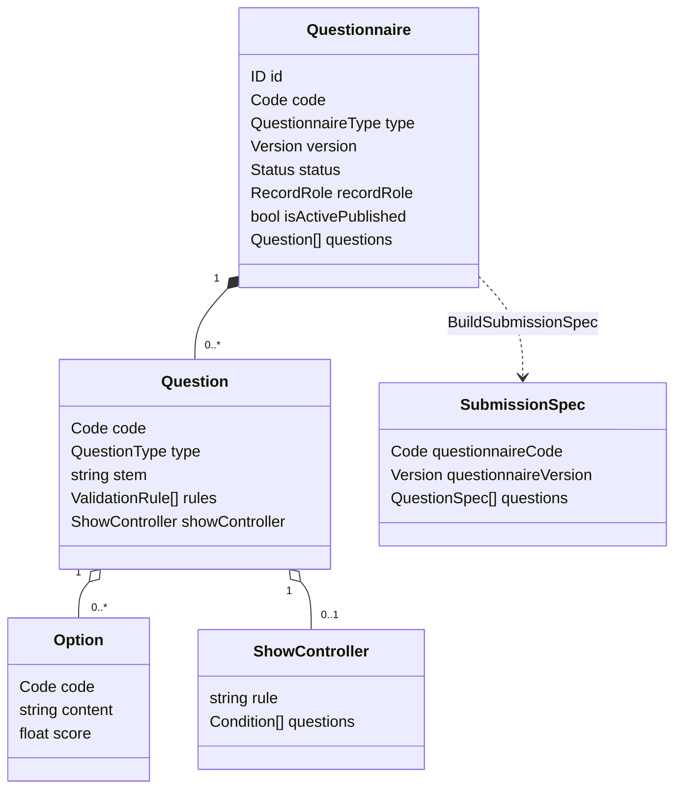
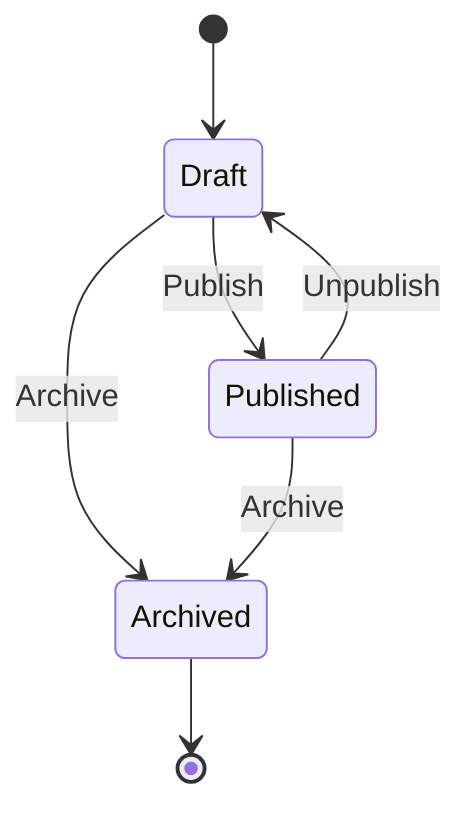

# Survey 领域模型：Questionnaire

## 1. 本文回答

本文说明 `Questionnaire` 聚合如何表达工作版本、发布快照、题目结构、版本和生命周期，并明确它与 Assessment Model 的边界。

## 2. 30 秒结论

`Questionnaire` 是“可被提交的采集结构”聚合，不是测评规则资产。它同时维护：

- 稳定业务标识 `Code`；
- head 工作记录和不可变语义的 published snapshot；
- 题目集合、题型、选项、校验规则与显示条件；
- `draft / published / archived` 生命周期；
- 发布、下架、归档产生的 `questionnaire.changed` 事件。

Mongo 中同一 code 可以有一个 head 和多个发布快照；提交必须绑定到具体发布版本。

## 3. 聚合模型



### 3.1 聚合根

`Questionnaire` 拥有题目集合并保护以下不变量：

- code 和 title 创建时不能为空；
- 问卷内题目 code 唯一；
- archived 问卷不能重新进入其它状态；
- 发布前必须通过完整性校验；
- 提交只接受 published 且 code/version 完整的记录；
- 对外返回的题目集合使用副本，避免绕过聚合修改。

### 3.2 题目多态模型

`Question` 是统一接口，当前具体题型为：

| 题型 | 是否作答 | 选项 | 校验 / 计算 |
| --- | --- | --- | --- |
| `Section` | 否，仅展示 | 无 | 不参与 required 校验 |
| `Radio` | 是 | 必须有选项 | 支持校验规则和 CalculationRule |
| `Checkbox` | 是 | 必须有选项 | 支持校验规则和 CalculationRule |
| `Text` | 是 | 无 | 支持文本校验 |
| `Textarea` | 是 | 无 | 支持文本校验 |
| `Number` | 是 | 无 | 支持数值校验 |

题型工厂由 `RegisterQuestionFactory` 注册。新增题型不能只增加常量，还必须同时处理构造、DTO 转换、提交值转换、校验、持久化映射和测试。

### 3.3 值对象与规则

| 对象 | 语义 |
| --- | --- |
| `QuestionnaireType` | 当前为 `Survey` 或 `MedicalScale`；类型不代表独立聚合 |
| `Version` | 支持 `v1`、`1.0`、`1.0.0` 等数字版本形式 |
| `RecordRole` | `head` 或 `published_snapshot` |
| `Option` | 选项 code、展示内容和基础分值 |
| `ValidationRule` | required、长度、数值等提交校验规则 |
| `CalculationRule` | 题目级基础计算描述，不替代 ModelCatalog/Evaluation 机制 |
| `ShowController` | 基于其它题答案决定题目是否可见，支持 `and / or` |
| `SubmissionSpec` | 从某个发布版本派生的只读提交规格 |

## 4. Head 与发布快照

```text
head
  当前可编辑记录；发布后仍保留为后续编辑入口

published_snapshot
  code + version 对应的发布记录；历史答卷按它追溯

is_active_published
  标记当前对“未指定版本提交”生效的发布快照
```

`Repository.CreatePublishedSnapshot` 按 `code + version + record_role` upsert；`SetActivePublishedVersion` 切换当前发布版本。编辑已发布问卷时，应用层通过 `ensureEditableHead` 派生或恢复可编辑 head，避免直接改写历史发布快照。

## 5. 生命周期与版本



当前版本规则由 `Versioning` 领域服务实现：

| 动作 | 版本变化 |
| --- | --- |
| 新建 | 应用服务默认 `1.0`，也接受外部版本 |
| SaveDraft | 小版本递增，例如 `1.0` → `1.0.1` |
| Publish | 大版本递增并归一到 `x.0.1` |
| 再编辑 | 在 head 上继续演进，不修改旧 published snapshot |

版本算法支持历史格式，不能把它等同于严格 SemVer。

## 6. 发布校验

`Validator.ValidateForPublish` 校验：

- 基本信息、状态和版本；
- 问题列表非空；
- 题目 code、题干、题型；
- 选项完整性与重复；
- 校验规则和计算规则；
- 显示条件引用与依赖；
- 问卷内题目 code 唯一。

`Questionnaire.CanBePublished` 只是领域层布尔判断；真正发布由 `Lifecycle.Publish` 返回结构化错误并完成版本与状态变化。

## 7. 领域事件

发布、下架和归档会产生 `questionnaire.changed`，payload 包含 code、version、title、action 和 changed_at。

该事件在 [`configs/events.yaml`](../../../configs/events.yaml) 中属于 `best_effort`，主要驱动发布后动作，例如二维码生成；缓存失效另外通过 `CacheSignalNotifier` 发送临时信令。二者都不是发布快照的事实源。

## 8. 边界

- Questionnaire 只定义采集结构，不拥有 ModelCatalog 的模型 identity、Definition、Binding 或发布快照。
- `MedicalScale` 是问卷类型；医学量表的模型语义仍属于 ModelCatalog。
- Option score 支持答卷基础计分，但模型因子、常模、分类和解释不属于 Survey。
- published snapshot 解释历史提交，不能被 active head 的后续编辑覆盖。

## 9. 代码事实源与 Verify

| 内容 | 路径 |
| --- | --- |
| 聚合与状态 | [`questionnaire.go`](../../../internal/apiserver/domain/survey/questionnaire/questionnaire.go)、[`types.go`](../../../internal/apiserver/domain/survey/questionnaire/types.go) |
| 题型 | [`question.go`](../../../internal/apiserver/domain/survey/questionnaire/question.go) |
| 发布校验 | [`validator.go`](../../../internal/apiserver/domain/survey/questionnaire/validator.go) |
| 提交规格 | [`submission_spec.go`](../../../internal/apiserver/domain/survey/questionnaire/submission_spec.go) |
| 生命周期与版本 | [`lifecycle.go`](../../../internal/apiserver/domain/survey/questionnaire/lifecycle.go)、[`versioning.go`](../../../internal/apiserver/domain/survey/questionnaire/versioning.go) |
| Mongo 映射 | [`infra/mongo/questionnaire`](../../../internal/apiserver/infra/mongo/questionnaire/) |

```bash
go test ./internal/apiserver/domain/survey/questionnaire
```
