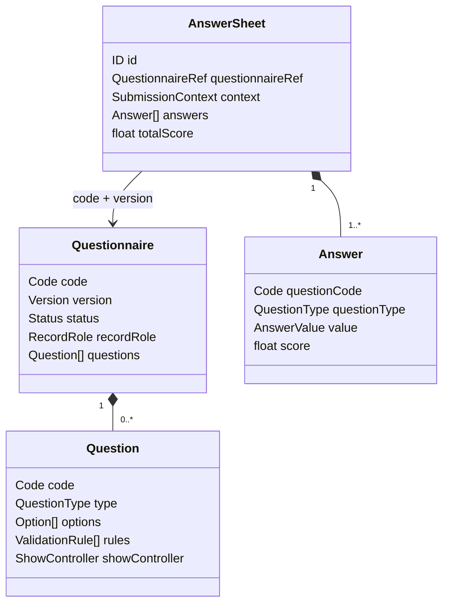
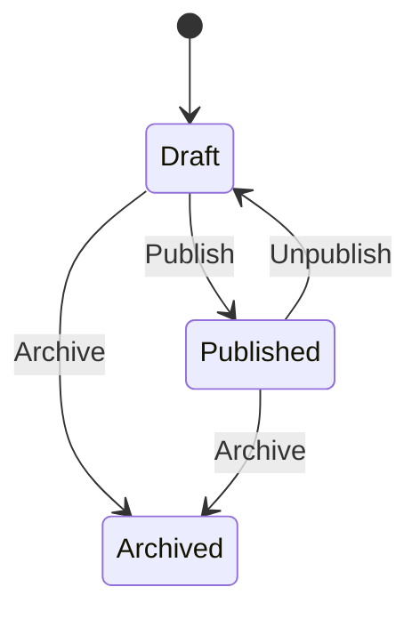

# Survey 领域模型

## 1. 本文回答

本文说明 Survey 为什么拆分为 `Questionnaire` 和 `AnswerSheet` 两个聚合，两者各自拥有哪些实体、值对象、不变式和领域事件，以及它们与其它业务模块的边界。

## 2. 30 秒结论

| 聚合 | 回答的问题 | 稳定标识 | 核心不变式 |
| --- | --- | --- | --- |
| Questionnaire | 某一版本允许问什么 | `code + version` | 只有完整的发布快照才能成为提交契约 |
| AnswerSheet | 针对该版本实际答了什么 | AnswerSheet ID | 问卷版本、提交上下文和原始答案在提交后稳定 |

Questionnaire 不嵌套 AnswerSheet，AnswerSheet 也不复制整份 Questionnaire。两者通过 `QuestionnaireRef(code, version, title)` 关联：



## 3. Questionnaire 聚合

### 3.1 核心对象

| 对象 | 语义 |
| --- | --- |
| `Questionnaire` | 问卷 family 的 head 或某个 published snapshot |
| `Question` | 题目定义，包含题型、题干、选项、校验、计算和显示条件 |
| `Option` | 选项 code、展示文案与基础分值 |
| `Version` | 发布和历史提交的契约版本 |
| `RecordRole` | `head` 或 `published_snapshot` |
| `ShowController` | 根据其它题答案决定题目可见性 |

### 3.2 不变式

Questionnaire 聚合保护：

- code 和 title 非空；
- 问卷内 question code 唯一；
- Radio/Checkbox 必须有合法选项；
- archived 问卷不能回到其它状态；
- 发布前必须通过 `Validator.ValidateForPublish`；
- 只有 published、code/version 完整的快照才可以构造 `SubmissionSpec`；
- 已发布快照用于历史解释，不被后续 head 编辑覆盖。

### 3.3 生命周期



`Lifecycle` 负责 Publish/Unpublish/Archive 规则，`Versioning` 负责历史兼容版本迁移，`Validator` 负责发布完整性。它们不读写 Repository，也不调用 ModelCatalog 或发送缓存信令。

### 3.4 领域事件

Publish、Unpublish 和 Archive 产生 `questionnaire.changed`。该事件表示问卷状态已改变，但它不是发布快照的事实源，也不替代缓存失效信令。

## 4. AnswerSheet 聚合

### 4.1 核心对象

| 对象 | 语义 |
| --- | --- |
| `AnswerSheet` | 一次已提交的作答事实，后端无草稿状态 |
| `QuestionnaireRef` | 冻结 questionnaire code/version/title，version 必填 |
| `SubmissionContext` | FillerRef、TesteeRef、OrgID 和可选 TaskID |
| `Answer` | question code/type、AnswerValue 和可后续更新的基础题分 |
| `AnswerValue` | 结构化答案值，当前有 String、Number、Option 和 Options |

### 4.2 不变式

`answersheet.Submit` 要求：

- AnswerSheet ID 已分配且非零；
- QuestionnaireRef code/version 非空；
- filler、testee 和 org 上下文完整；
- 至少一条 Answer；
- 每个 Answer 的 question code 和 value 合法；
- 同一 question code 不能重复出现。

`NewAnswerSheet` 是兼容旧调用的构造函数，不产生提交事件；新提交使用 `Submit`。`ReconstructSubmissionContext` 只用于从历史数据重建，新提交使用 `NewSubmissionContext`。

### 4.3 行为阶段

```text
Submit
  创建 AnswerSheet 并产生 answersheet.submitted

UpdateScores
  以新 Answer 副本更新单题分和总分
  不改变问卷引用、原始答案或提交上下文
```

AnswerSheet 没有显式 `submitted/scored` 状态字段。Evaluation 的 requested/running/completed/failed 属于 Evaluation 模块，不应加入 AnswerSheet 状态机。

### 4.4 领域事件

`Submit` 成功后产生 `AnswerSheetSubmittedEvent`，payload 包含 AnswerSheet ID、questionnaire code/version、testee/org/filler/task 与 submitted_at。该事件表示“作答事实已建立”，不表示后续测评已执行。

## 5. 对象所有权与模块边界

| 对象/规则 | 所有者 | Survey 的协作方式 |
| --- | --- | --- |
| Questionnaire、Question、SubmissionSpec | Survey | 主写事实 |
| AnswerSheet、Answer、SubmissionContext | Survey | 主写事实 |
| Testee、Filler | Actor | 仅冻结最小引用 |
| AssessmentModel、Definition、Binding | ModelCatalog | 发布医学量表问卷时同步 binding version |
| Assessment、Outcome | Evaluation | 由 assessment intake journey 创建和推进 |
| Plan / AssessmentTask | Plan | SubmissionContext 仅保存 TaskID |
| InterpretReport | Interpretation | Survey 不读写 |
| Statistics read model | Statistics | 从事件或扫描投影，不反写 Survey |

`domain/survey` 不依赖 application、infra、transport 或 worker；`application/survey` 不直接编排 Evaluation/Interpretation。跨模块作答到测评链路放在 `application/journey/assessmentintake`。

## 6. 持久化边界

- `questionnaires` 保存 head 与 published snapshots，通过 record role 和 active flag 区分语义。
- `answersheets` 保存 QuestionnaireRef、SubmissionContext、Answers 和 total score。
- 领域对象不知道 Mongo、Outbox 或幂等集合；这些由 application port 和 infra 实现。
- AnswerSheet 和 `answersheet.submitted` Outbox 在同一 Mongo transaction 中落库；Questionnaire 发布当前是多个顺序持久化步骤。

## 7. 代码事实源与验证

| 主题 | 路径 |
| --- | --- |
| Questionnaire | [`domain/survey/questionnaire`](../../../internal/apiserver/domain/survey/questionnaire/) |
| AnswerSheet | [`domain/survey/answersheet`](../../../internal/apiserver/domain/survey/answersheet/) |
| Questionnaire Mongo | [`infra/mongo/questionnaire`](../../../internal/apiserver/infra/mongo/questionnaire/) |
| AnswerSheet Mongo | [`infra/mongo/answersheet`](../../../internal/apiserver/infra/mongo/answersheet/) |
| 跨模块依赖约束 | [`application/boundary_deps_test.go`](../../../internal/apiserver/application/boundary_deps_test.go) |

```bash
go test ./internal/apiserver/domain/survey/...
go test ./internal/apiserver/application -run ForbiddenCrossModuleImports
```
