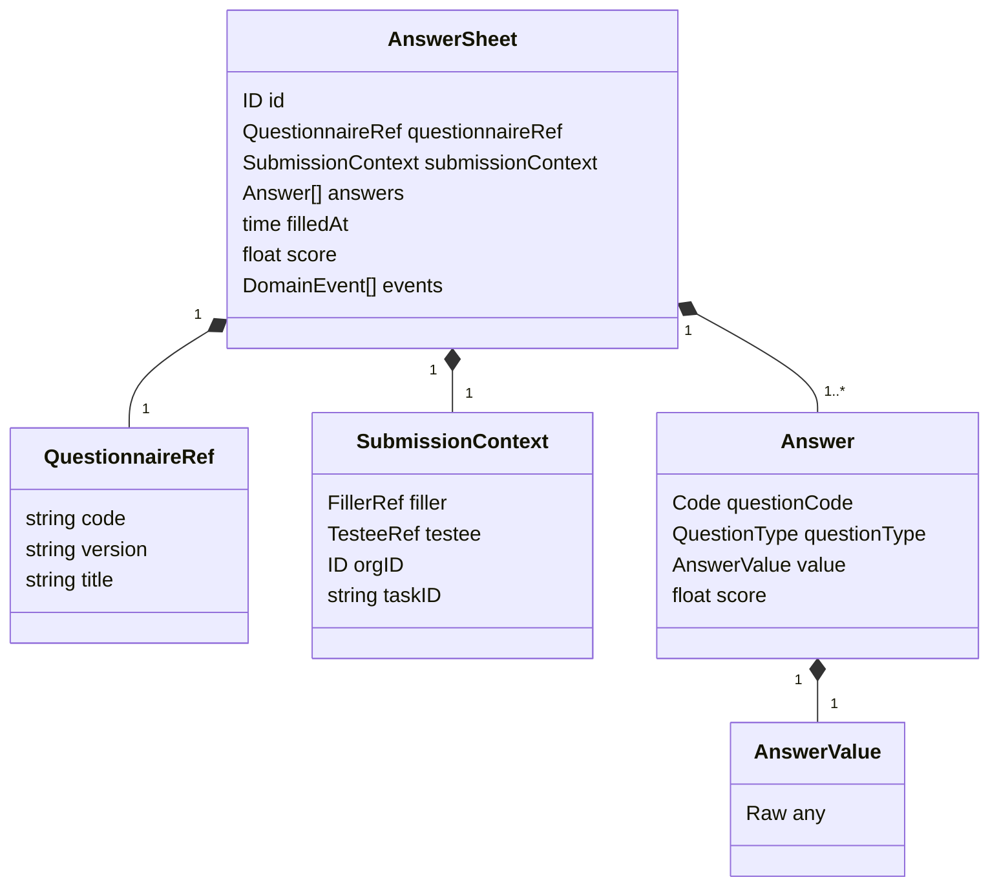
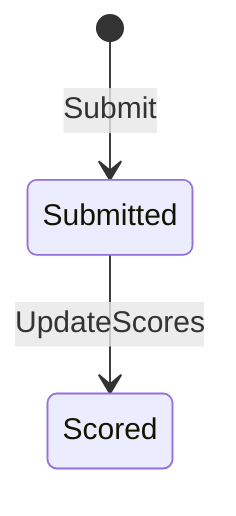

# Survey 领域模型：AnswerSheet

## 1. 本文回答

本文说明一次后端提交如何成为 `AnswerSheet` 事实，以及提交上下文、答案值、计分投影和领域事件之间的关系。

## 2. 30 秒结论

`AnswerSheet` 创建即提交，没有后端草稿状态。`Submit` 要求完整 ID、问卷版本引用、填写者、受试者、组织和至少一条合法答案，并在构造成功时立即产生 `answersheet.submitted`。

答卷的题目与原始答案在提交后不提供编辑行为；后续基础计分通过 `UpdateScores` 更新答案分数和总分。Assessment、Outcome 和 Report 都不是 AnswerSheet 的一部分。

## 3. 聚合模型



## 4. 核心对象与不变量

### 4.1 AnswerSheet

`Submit` 保护以下不变量：

- AnswerSheet ID 非零且预先分配；
- QuestionnaireRef 的 code 和 version 非空；
- SubmissionContext 完整；
- 至少存在一个答案；
- 每个 Answer 自身合法；
- 同一 question code 只能出现一次。

`NewAnswerSheet` 是兼容旧调用方的构造函数，不产生提交事件；新提交必须走 `Submit`。

### 4.2 QuestionnaireRef

答卷只冻结问卷 code、version 和 title 引用，不复制完整 Questionnaire。version 必填是历史追溯的关键约束。

### 4.3 SubmissionContext

| 字段 | 语义 | 是否必填 |
| --- | --- | --- |
| `FillerRef` | 实际填写人及 filler type | 是 |
| `TesteeRef` | 本次测评的受试者 | 是 |
| `OrgID` | 组织范围 | 是 |
| `TaskID` | 可选 Plan 任务关联 | 否 |

对象在构造和 getter 边界复制 Actor 引用，避免外部指针修改已提交上下文。`ReconstructSubmissionContext` 允许旧数据缺字段，只供仓储重建使用，不能作为新提交入口。

### 4.4 Answer 与 AnswerValue

`Answer` 固定 question code、question type 和结构化值。当前 AnswerValue 实现包括：

- `StringValue`；
- `NumberValue`；
- `OptionValue`；
- `OptionsValue`。

原始输入先由 Questionnaire 的 SubmissionSpec 确认题型和选项合法，再转换为对应 AnswerValue。客户端不能通过伪造 question type 改变服务端解释。

## 5. 生命周期



代码没有显式 AnswerSheet status 字段。上图表达的是行为阶段，不应被实现成新的持久化状态机：

- `Submitted`：答卷事实和提交事件已建立；
- `Scored`：基础题目分数与总分已回写；
- Evaluation 的 requested/running/completed/failed 属于 Evaluation 模块。

## 6. 计分投影

`ScoredAnswerSheet` 和 `ScoredAnswer` 是计分结果值对象。`UpdateScores` 按 question code 生成新的 Answer 副本并写回总分，不改变题目引用、答案原值或提交上下文。

这一基础计分由跨模块 assessment intake 在创建 Assessment 前触发。它不等同于模型因子计算、风险等级或报告解释。

## 7. 领域事件

`Submit` 成功后立即产生 `AnswerSheetSubmittedEvent`：

| payload 字段 | 来源 |
| --- | --- |
| `answer_sheet_id` | AnswerSheet ID |
| `questionnaire_code/version` | QuestionnaireRef |
| `testee_id/org_id/filler_id/filler_type/task_id` | SubmissionContext |
| `submitted_at` | filledAt |

事件构造对 ID 做安全转换；完整 SubmissionContext 是事件能够驱动后续 intake 的前提。

## 8. 持久化边界

Mongo `answersheets` 保存答卷主事实，单独的幂等集合保存 idempotency key 到 AnswerSheet ID 的映射。AnswerSheet 仓储同时实现：

- 领域 Repository；
- 读模型入口；
- `SubmissionDurableWriter`，供事务性提交用例写入 AnswerSheet 和 staged events。

领域对象不直接知道 Mongo、Outbox 或幂等集合。

## 9. 边界

- AnswerSheet 是 Survey 主事实，不是 Assessment 的子对象。
- AnswerSheet 可以被计分，但不保存 ModelCatalog Definition、Evaluation Outcome 或 Interpretation Report。
- 提交事件表示“输入已可靠接受”，不表示下游已成功执行。
- 前端 localStorage 草稿不属于后端 AnswerSheet 生命周期。

## 10. 代码事实源与 Verify

| 内容 | 路径 |
| --- | --- |
| 聚合 | [`answersheet.go`](../../../internal/apiserver/domain/survey/answersheet/answersheet.go) |
| 提交上下文 | [`types.go`](../../../internal/apiserver/domain/survey/answersheet/types.go) |
| 答案值 | [`answer.go`](../../../internal/apiserver/domain/survey/answersheet/answer.go) |
| 提交事件 | [`events.go`](../../../internal/apiserver/domain/survey/answersheet/events.go) |
| Mongo 映射 | [`infra/mongo/answersheet`](../../../internal/apiserver/infra/mongo/answersheet/) |

```bash
go test ./internal/apiserver/domain/survey/answersheet
```
