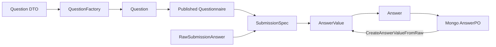

# Survey 题型与答案值类型系统

## 1. 本文回答

本文说明 `Question`、`QuestionType`、原始提交值、`AnswerValue` 与校验/计分能力之间的关系。这些类型必须联合设计；只在某一层新增一个题型常量，不代表系统已经支持该题型。

## 2. 30 秒结论

Survey 的题型系统是一个跨越问卷定义和答卷事实的类型契约：

```text
QuestionType
  -> Question 具体实现与可用能力
  -> 客户端原始值形状
  -> SubmissionSpec 校验
  -> AnswerValue 领域语义
  -> validation / scoring 适配
  -> Mongo 序列化与重建
  -> REST / gRPC 编解码
```

`Radio` 和 `Text` 在传输层都可能是字符串，但它们分别表示“选项 code”和“自由文本”，因此分别使用 `OptionValue` 和 `StringValue`。反过来，`Text` 和 `Textarea` 是不同题型，却共享 `StringValue`。题型与答案值不是一一对应。

## 3. 问卷侧：Question 能力模型

### 3.1 统一接口

`Question` 统一暴露：

- `GetType / GetCode / GetStem`；
- `GetTips / GetPlaceholder`；
- `GetOptions`；
- `GetValidationRules`；
- `GetCalculationRule`；
- `GetShowController`。

`QuestionCore` 提供通用字段和缺省行为，具体题型按需覆盖选项、占位符、校验和计算规则。`NewQuestion` 从 `QuestionParams` 取得题型，再到工厂注册表选择具体实现。

### 3.2 当前题型能力

| QuestionType | 领域用途 | 选项 | 校验 | 基础计分 | 应否作答 |
| --- | --- | --- | --- | --- | --- |
| `Section` | 结构分段与说明 | 无 | 不参与 required | 无 | 否 |
| `Radio` | 从候选集选一个 | 必须 | 支持 | 支持 option score / CalculationRule | 是 |
| `Checkbox` | 从候选集选多个 | 必须 | 支持 | 支持 option score / CalculationRule | 是 |
| `Text` | 单行自由文本 | 无 | 支持长度等规则 | 无 | 是 |
| `Textarea` | 多行自由文本 | 无 | 支持长度等规则 | 无 | 是 |
| `Number` | 数值输入 | 无 | 支持数值范围等规则 | 可作为数值输入 | 是 |

`HasOptions / HasValidation / HasCalculation` 是语义接口，但当前 `Question` 本身已经包含对应 getter，且 `QuestionCore` 提供空实现。因此判断某题真正是否具有选项或计分能力时，还必须检查返回值，不能只依赖 Go 类型断言。

## 4. 答卷侧：Answer 与 AnswerValue

### 4.1 Answer 的责任

`Answer` 同时冻结：

- `questionCode`：它回答了哪一题；
- `questionType`：提交当时服务端确认的题型；
- `AnswerValue`：按领域语义封装的值；
- `score`：可后续更新的基础题分。

`WithScore` 创建新 Answer，不改变问题引用或原始值。

### 4.2 AnswerValue 实现

| AnswerValue | 领域语义 | `Raw()` 形状 | 当前来源题型 |
| --- | --- | --- | --- |
| `OptionValue` | 单个选项 code | `string` | `Radio` |
| `OptionsValue` | 多个选项 code | `[]string` | `Checkbox` |
| `StringValue` | 自由文本 | `string` | `Text / Textarea`；当前转换函数也接受 `Section` |
| `NumberValue` | 数值 | `float64` | `Number` |

`AnswerValue` 不保存问卷规则，它只保留已归一化的值语义。选项是否存在、题型是否匹配、required 是否满足，必须在构造 AnswerValue 之前由发布问卷的 `SubmissionSpec` 确认。

## 5. 当前题型—值—规则矩阵

| QuestionType | 接收的原始值 | AnswerValue | SubmissionSpec 题型特有校验 | validation view | scoring view |
| --- | --- | --- | --- | --- | --- |
| `Section` | 不应提交；当前转换函数可接受 string | `StringValue` | required 检查跳过，但未显式拒绝额外 Section 答案 | string | 通常不参与 |
| `Radio` | string，也兼容可归一化的 option wrapper | `OptionValue` | 必须是题目选项 code | string / single item | single selection |
| `Checkbox` | `[]string` 或 JSON 数组解码结果 | `OptionsValue` | 每个值都必须是题目选项 code | array | multiple selections |
| `Text` | string | `StringValue` | 无题型特有选项校验 | string | 通常不参与 |
| `Textarea` | string | `StringValue` | 无题型特有选项校验 | string | 通常不参与 |
| `Number` | `float64 / int / int64`；gRPC 先解码为 `float64` | `NumberValue` | 无题型特有选项校验 | number | number |

这张表是题型支持的最小一致性单元。任一列未实现，都可能出现“问卷可发布，但答卷无法提交”、“可提交，但无法从 Mongo 重建”或“REST 正常，gRPC 值解码错误”。

## 6. 类型契约的责任链



关键控制点：

1. `buildQuestionFromDTO` 将管理命令转为 `QuestionParams`。
2. `NewQuestion` 通过工厂注册表创建具体题型。
3. Questionnaire Mongo mapper 也通过 `NewQuestion` 重建题型，因此历史数据对工厂的依赖与新建路径相同。
4. `SubmissionSpec` 从已发布问卷提取服务端题型、选项、校验和显示条件。
5. `CreateAnswerValueFromRaw` 将通过规格检查的 raw value 转成领域值。
6. AnswerSheet Mongo mapper 在读取时再次通过 `question_type + raw value` 重建 AnswerValue。

## 7. 不变式与边界

- 客户端传入的 `question_type` 只用于一致性检查，服务端发布问卷才是题型事实源。
- 选项值保存 option code，不保存显示文案；文案属于具体问卷版本。
- `AnswerValue.Raw()` 是持久化和规则引擎的适配面，不应让基础设施层逆向决定领域值语义。
- `Section` 在提交规格中被视为不可作答，但当前代码尚未在 `PrepareAnswers` 显式拒绝客户端为 Section 提交值。文档应将此记为现实边界，不得误写为“已严格禁止”。
- 题目级基础分值是 Survey 能力；因子、常模、风险结论和报告不因题型扩展而进入 Survey。

## 8. 当前扩展成本

题型构造一侧已有注册表，但以下处理仍是分散的：

- `Validator` 中的选择题特有校验；
- `SubmissionSpec` 中的选项和可作答判断；
- `CreateAnswerValueFromRaw` 的题型 switch；
- gRPC `decodeAnswerValue` 的传输值解码；
- validation/scoring adapter 能否暴露所需视图；
- Mongo 重建对 `CreateAnswerValueFromRaw` 的依赖；
- collection-server 的值归一化与客户端契约。

因此当前系统的完整扩展单元是“题型 + 答案值 + 全链路契约”，不是单个 `QuestionFactory`。具体实施清单见 [22-新增题型与答案类型SOP.md](./22-新增题型与答案类型SOP.md)。

## 9. 代码事实源与 Verify

| 主题 | 路径 |
| --- | --- |
| QuestionType / Question | [`types.go`](../../../internal/apiserver/domain/survey/questionnaire/types.go)、[`question.go`](../../../internal/apiserver/domain/survey/questionnaire/question.go) |
| 题型工厂 | [`factory.go`](../../../internal/apiserver/domain/survey/questionnaire/factory.go) |
| 提交值约束 | [`submission_spec.go`](../../../internal/apiserver/domain/survey/questionnaire/submission_spec.go)、[`submission_validation.go`](../../../internal/apiserver/domain/survey/questionnaire/submission_validation.go) |
| Answer / AnswerValue | [`answer.go`](../../../internal/apiserver/domain/survey/answersheet/answer.go) |
| validation / scoring 视图 | [`validation_adapter.go`](../../../internal/apiserver/domain/survey/answersheet/validation_adapter.go)、[`scoring_service.go`](../../../internal/apiserver/domain/survey/answersheet/scoring_service.go) |
| Mongo 重建 | [`infra/mongo/questionnaire/mapper.go`](../../../internal/apiserver/infra/mongo/questionnaire/mapper.go)、[`infra/mongo/answersheet/mapper.go`](../../../internal/apiserver/infra/mongo/answersheet/mapper.go) |
| gRPC 值解码 | [`transport/grpc/service/answersheet.go`](../../../internal/apiserver/transport/grpc/service/answersheet.go) |

```bash
go test ./internal/apiserver/domain/survey/...
go test ./internal/apiserver/application/survey/answersheet
go test ./internal/apiserver/infra/mongo/questionnaire ./internal/apiserver/infra/mongo/answersheet
go test ./internal/apiserver/transport/grpc/service -run 'AnswerValue|DecodeAnswerValue'
```
