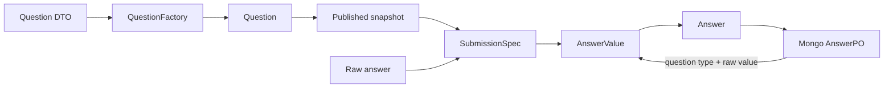

# 核心设计：题型与答案值抽象

## 1. 本文回答

本文说明 `QuestionType`、`Question`、原始提交值、`AnswerValue` 和校验/计分视图如何联合建模，并给出新增题型时必须同步修改的完整扩展面。

## 2. 30 秒结论

题型支持不是一个常量或一个工厂，而是跨层类型契约：

```text
QuestionType
  -> Question 具体实现
  -> 发布快照中的题型能力
  -> 客户端原始值形状
  -> SubmissionSpec 校验
  -> AnswerValue 领域语义
  -> validation / scoring 视图
  -> Mongo 往返
  -> REST / gRPC / collection 编解码
```

`Radio` 和 `Text` 都可以用 string 传输，但前者是 option code，后者是自由文本，因此分别对应 `OptionValue` 和 `StringValue`。`Text` 和 `Textarea` 是不同题型，却共享 `StringValue`。题型与答案值不是一一对应。

## 3. Question 抽象

### 3.1 统一能力面

`Question` 统一暴露：

- code、type、stem、tips 和 placeholder；
- options；
- validation rules；
- calculation rule；
- show controller。

`QuestionCore` 提供通用字段和缺省空行为，具体题型覆盖自己拥有的能力。`NewQuestion` 从 `QuestionParams` 取得题型，通过 `RegisterQuestionFactory` 注册表选择实现。

`HasOptions / HasValidation / HasCalculation` 是语义接口，但当前 `Question` 已包含对应 getter，`QuestionCore` 也提供空实现。因此不能只用类型断言判断某题是否真正具有选项或计分能力，还必须检查返回值。

### 3.2 当前题型

| QuestionType | 语义 | 选项 | 校验/计分 | 是否作答 |
| --- | --- | --- | --- | --- |
| `Section` | 结构分段与说明 | 无 | 不参与 required 或计分 | 否 |
| `Radio` | 单选 | 必须 | validation + option score/CalculationRule | 是 |
| `Checkbox` | 多选 | 必须 | validation + option score/CalculationRule | 是 |
| `Text` | 单行文本 | 无 | 文本校验 | 是 |
| `Textarea` | 多行文本 | 无 | 文本校验 | 是 |
| `Number` | 数值 | 无 | 数值校验 | 是 |

## 4. AnswerValue 抽象

`Answer` 冻结 question code/type、结构化值和基础题分。`AnswerValue` 只表达值语义，不保存问卷规则：

| QuestionType | 接受的原始值 | AnswerValue | `Raw()` |
| --- | --- | --- | --- |
| `Radio` | 可归一化为单个 option code 的值 | `OptionValue` | `string` |
| `Checkbox` | `[]string` 或解码后的 string 数组 | `OptionsValue` | `[]string` |
| `Text / Textarea` | string | `StringValue` | `string` |
| `Number` | `float64 / int / int64` | `NumberValue` | `float64` |
| `Section` | 语义上不应作答 | 当前转换函数仍可构造 `StringValue` | `string` |

`WithScore` 以新 Answer 副本更新分数，不改变原始 AnswerValue。选项答案保存 option code，显示文案留在对应的问卷版本中。

## 5. 从题目定义到答案事实



责任链：

1. `question_command_assembler` 将管理命令转为 `QuestionParams`。
2. `NewQuestion` 创建具体 Question；Questionnaire Mongo mapper 读取时也使用同一工厂重建。
3. 已发布 Questionnaire 派生 `SubmissionSpec`，以服务端题型、选项和规则校验 raw answer。
4. `CreateAnswerValueFromRaw` 将通过规格检查的值归一化为 AnswerValue。
5. validation/scoring adapters 将 AnswerValue 暴露为 string、number、array 或 selection 视图。
6. AnswerSheet Mongo mapper 依靠 question type + raw value 重建历史 AnswerValue。

## 6. 校验与计分视图

| 视图 | 用途 |
| --- | --- |
| `AnswerValueAdapter.IsEmpty` | required 和空值判断，数值 0 不是空 |
| `AsString / AsNumber / AsArray` | 向通用 validation rules 暴露值 |
| `AsSingleSelection / AsMultipleSelections / AsNumber` | 向 Survey 基础题分计算暴露值 |

这些 adapter 只做类型适配，不决定使用哪份问卷、哪些 validation rules 或哪个测评模型。因子、常模和结论规则仍属于 ModelCatalog/Evaluation。

## 7. 新增题型的完整扩展单元

实施前先定义：题型业务意图、是否可作答、raw/JSON/BSON 形状、AnswerValue 语义、validation/scoring 视图和旧客户端策略。然后按顺序完成：

| 步骤 | 必须同步的代码/契约 |
| --- | --- |
| 1. Question domain | QuestionType、Question 实现、QuestionParams、factory registration、Validator |
| 2. Submission contract | `submissionQuestionSpec`、Build/PrepareAnswers、isAnswerable、empty semantics、ShowController |
| 3. AnswerValue | 专用值对象或现有值复用，`CreateAnswerValueFromRaw` 与防御性复制 |
| 4. Rules | validation/scoring adapter 与必要的 ruleengine port |
| 5. Persistence | QuestionnairePO/mapper、AnswerSheet BSON 形状与往返测试 |
| 6. Transport | gRPC `decodeAnswerValue`、返回值编码、REST/OpenAPI、collection converter |
| 7. Compatibility/tests | 旧 document、旧客户端、分层测试与一条纵向提交测试 |

只有“可发布 + 可提交 + 可校验/计分 + 可往返持久化 + 多入口契约一致”都成立，才能宣布新题型完成。

## 8. 当前实现边界

- 题型构造有 registry，但 `Validator`、SubmissionSpec、AnswerValue、gRPC codec 等仍有分散 switch，完整扩展不是单点注册。
- `Section` 语义上不可作答，但当前 `PrepareAnswers` 未显式拒绝客户端为 Section 传值，`CreateAnswerValueFromRaw` 也可构造 StringValue。
- 客户端 `question_type` 与服务端值进行大小写敏感比较；`Radio` 和 `radio` 不等价。
- AnswerSheet mapper 对无法重建的单个 Answer 会跳过，因此 mapper 测试必须检查答案数量和值，不能只检查结果非 nil。
- OpenAPI 部分描述仍使用 `single_choice / multi_choice` 示例性用语，domain 精确值是 `Radio / Checkbox`；扩展时必须一并校正。

## 9. 事实源与验证

| 扩展面 | 主要路径 |
| --- | --- |
| Question / factory | [`question.go`](../../../internal/apiserver/domain/survey/questionnaire/question.go)、[`factory.go`](../../../internal/apiserver/domain/survey/questionnaire/factory.go)、[`types.go`](../../../internal/apiserver/domain/survey/questionnaire/types.go) |
| SubmissionSpec | [`submission_spec.go`](../../../internal/apiserver/domain/survey/questionnaire/submission_spec.go)、共享校验包 [`surveyvalidation`](../../../internal/pkg/surveyvalidation/) |
| AnswerValue / adapters | [`answer.go`](../../../internal/apiserver/domain/survey/answersheet/answer.go)、[`scoring_service.go`](../../../internal/apiserver/domain/survey/answersheet/scoring_service.go)、[`scoring_task_assembler.go`](../../../internal/apiserver/application/survey/answersheet/scoring_task_assembler.go) |
| Application assemblers | [`question_command_assembler.go`](../../../internal/apiserver/application/survey/questionnaire/question_command_assembler.go)、[`submission_answer_assembler.go`](../../../internal/apiserver/application/survey/answersheet/submission_answer_assembler.go) |
| Mongo mappers | [`questionnaire/mapper.go`](../../../internal/apiserver/infra/mongo/questionnaire/mapper.go)、[`answersheet/mapper.go`](../../../internal/apiserver/infra/mongo/answersheet/mapper.go) |
| gRPC / collection | [`grpc/service/answersheet.go`](../../../internal/apiserver/transport/grpc/service/answersheet.go)、[`collection-server/application/answersheet`](../../../internal/collection-server/application/answersheet/) |

```bash
go test ./internal/apiserver/domain/survey/...
go test ./internal/apiserver/application/survey/answersheet
go test ./internal/apiserver/infra/mongo/questionnaire ./internal/apiserver/infra/mongo/answersheet
go test ./internal/apiserver/transport/grpc/service -run 'AnswerSheet|AnswerValue|DecodeAnswerValue'
go test ./internal/collection-server/application/answersheet/...
```
