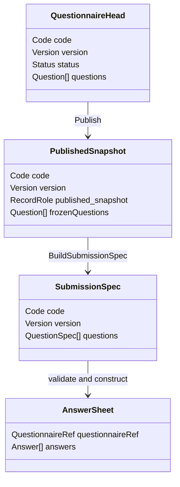

# Survey 版本化作答契约

## 1. 本文回答

本文说明 Questionnaire 的 head、published snapshot 和 active version 如何与 AnswerSheet 的 `QuestionnaireRef` 构成稳定作答契约，以及为什么版本不是纯展示字段。

## 2. 30 秒结论

`Questionnaire code` 标识问卷 family，`code + version` 标识一份可解释提交的已发布定义。AnswerSheet 不引用“当前问卷”，而是冻结它提交时所使用的 `questionnaire code + version + title`。

```text
Questionnaire head
  可继续编辑的工作记录

Published snapshot(code, version)
  提交规格的事实源

Active published version
  未指定版本时的默认解析结果

AnswerSheet.QuestionnaireRef(code, version, title)
  已提交作答的历史解释键
```

因此，后续编辑 head 或发布新版本，都不应改变旧 AnswerSheet 中题型、选项、校验或显示条件的语义。

## 3. 两个聚合的契约边界



Questionnaire 和 AnswerSheet 不通过对象嵌套构成一个大聚合：

- Questionnaire 拥有题目定义和发布生命周期；
- AnswerSheet 拥有一次提交事实；
- `QuestionnaireRef` 只冻结最小历史引用；
- 需要校验或计分时，应用层按 code/version 重新加载发布快照。

这种拆分避免在每份答卷中复制整份问卷，也避免 Questionnaire 聚合因大量答卷变成无法管理的一致性边界。

## 4. RecordRole 与状态不是同一概念

| 维度 | 取值 | 回答的问题 |
| --- | --- | --- |
| `RecordRole` | `head / published_snapshot` | 这条 Mongo 记录是工作头还是历史发布快照？ |
| `Status` | `draft / published / archived` | 该领域对象处于什么业务生命周期？ |
| `IsActivePublished` | bool | 这个发布快照是否是当前默认版本？ |

不能用 `status=published` 单独推断记录是否是历史快照，也不能用 active 标志替代版本号。

## 5. 版本规则

`Versioning` 领域服务封装当前的历史兼容算法：

| 动作 | 变化 | 业务含义 |
| --- | --- | --- |
| 创建 | 应用服务默认 `1.0`，也可接受外部值 | 建立初始 head |
| SaveDraft | `IncrementMinor`，如 `1.0 -> 1.0.1` | 工作版本继续演进，尚未建立新发布契约 |
| Publish | `IncrementMajor`，并归一到 `x.0.1` | 生成新的可提交契约版本 |
| 再编辑 | 在 head 上继续演进 | 不覆盖旧 published snapshot |

该算法支持 `v1 / 1 / 1.0 / 1.0.0` 等历史形式，不是严格 SemVer。文档和客户端不应根据 SemVer 自行推导兼容性；服务端按精确字符串版本解析快照。

## 6. 发布如何建立契约

`Lifecycle.Publish` 在 domain 内完成：

1. 状态检查；
2. `Validator.ValidateForPublish`；
3. 版本迁移；
4. 发布状态变化；
5. `questionnaire.changed` 领域事件。

应用服务再顺序执行：

1. 保存 head；
2. 创建或更新 `published_snapshot`；
3. 设置 active published version；
4. 必要时同步 ModelCatalog binding version；
5. 发布 changed event 和缓存失效信令。

domain 服务决定“什么是合法的发布”，application service 决定“这个用例按什么顺序读写外部依赖”。详细责任链见 [30-关键路径-问卷创建编辑与发布.md](./30-关键路径-问卷创建编辑与发布.md)。

## 7. 提交如何选择契约

```text
请求指定 version
  -> FindByCodeVersion(code, version)
  -> 必须是 published snapshot

请求未指定 version
  -> FindPublishedByCode(code)
  -> 解析 active published version
```

无论入口是否指定版本，一旦解析成功，AnswerSheet 都会保存最终实际使用的 version。因此“使用当前版本”是提交前的解析策略，不是 AnswerSheet 中可随时变化的动态引用。

## 8. 历史解释与计分

后续基础计分不应加载 active 问卷，而应加载 AnswerSheet 冻结的 code/version：

```text
AnswerSheet.QuestionnaireRef
  -> load exact published questionnaire
  -> match Answer.questionCode
  -> read option score / calculation rule
  -> calculate and update scores
```

否则在问卷发布新版本后，对同一份历史答卷重试计分可能产生不同结果。

## 9. 一致性与失败边界

| 边界 | 当前事实 |
| --- | --- |
| Questionnaire head + snapshot + active switch | 多个顺序持久化步骤，当前不在一个应用事务中 |
| Questionnaire -> ModelCatalog binding | 同步调用，但不与 Questionnaire Mongo 写构成跨模块事务 |
| AnswerSheet -> Questionnaire | 通过 code/version 引用，不开启跨聚合强一致事务 |
| AnswerSheet + submitted Outbox | 同一 Mongo transaction，它保护的是答卷事实与事件可靠出站 |

因此发布 API 返回失败时，不能直接推断 head/snapshot 都未变化；应按 head、snapshot、active version、binding 的顺序检查。

## 10. 不变式与反例

- AnswerSheet 的 version 必填，不得只保存 questionnaire code。
- 不得用当前 head 解释历史答卷。
- 不得把 active published version 理解为唯一存在的发布版本。
- 不得在编辑问卷时就地修改历史 published snapshot。
- 不得把 Questionnaire 版本等同于 AssessmentModel 版本；两者通过 binding 协作，但属于不同模块的资产。
- 不得以 changed event 或缓存信令作为问卷发布事实源；Mongo 记录才是主事实。

## 11. 代码事实源与 Verify

| 主题 | 路径 |
| --- | --- |
| 状态、版本与 RecordRole | [`types.go`](../../../internal/apiserver/domain/survey/questionnaire/types.go) |
| Lifecycle / Versioning | [`lifecycle.go`](../../../internal/apiserver/domain/survey/questionnaire/lifecycle.go)、[`versioning.go`](../../../internal/apiserver/domain/survey/questionnaire/versioning.go) |
| QuestionnaireRef | [`domain/survey/answersheet/types.go`](../../../internal/apiserver/domain/survey/answersheet/types.go) |
| 发布与版本解析 | [`application/survey/questionnaire`](../../../internal/apiserver/application/survey/questionnaire/)、[`application/survey/answersheet/submission_service.go`](../../../internal/apiserver/application/survey/answersheet/submission_service.go) |
| Mongo head / snapshot | [`infra/mongo/questionnaire`](../../../internal/apiserver/infra/mongo/questionnaire/) |

```bash
go test ./internal/apiserver/domain/survey/questionnaire -run 'Version|Publish|SubmissionSpec'
go test ./internal/apiserver/application/survey/questionnaire
go test ./internal/apiserver/application/survey/answersheet -run 'Submit|Questionnaire'
```
