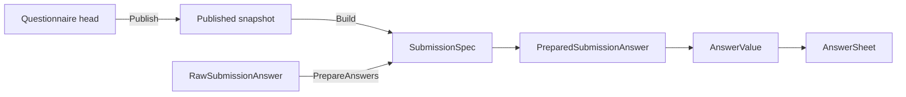

# 核心设计：版本化与作答契约

## 1. 本文回答

本文说明 Questionnaire head、published snapshot、active version、AnswerSheet.QuestionnaireRef 与 `SubmissionSpec` 如何组成版本化作答契约，并明确服务端如何使用该契约校验一次提交。

## 2. 30 秒结论

`Questionnaire code` 标识问卷 family，`code + version` 标识一份可解释提交的已发布定义。

```text
head
  可继续编辑的工作记录

published snapshot(code, version)
  可提交的问卷定义

active published version
  未指定版本时的默认解析结果

SubmissionSpec
  从发布快照派生的服务端提交规格

AnswerSheet.QuestionnaireRef
  已提交作答的历史解释键
```

提交前可以选择“当前发布版本”，但一旦建立 AnswerSheet，必须保存实际使用的精确 version。后续发布新版本不得改变旧答卷的题型、选项、校验和计分语义。

## 3. 版本与记录角色

| 维度 | 值 | 回答的问题 |
| --- | --- | --- |
| `RecordRole` | `head / published_snapshot` | 这条 Mongo 记录是工作头还是历史发布快照？ |
| `Status` | `draft / published / archived` | 该对象处于什么业务生命周期？ |
| `IsActivePublished` | bool | 该快照是否是当前默认版本？ |
| `Version` | 历史兼容字符串 | 该发布定义的精确契约版本是什么？ |

这四个维度不得混为一个概念。`status=published` 不能单独证明记录是 published snapshot，active 标志也不能替代 version。

`Versioning` 当前规则：

| 动作 | 版本变化 |
| --- | --- |
| 创建 | 应用服务默认 `1.0`，也可接受外部值 |
| SaveDraft | 小版本递增，例如 `1.0 -> 1.0.1` |
| Publish | 大版本递增并归一到 `x.0.1` |
| 再编辑 | 在 head 上继续演进，不覆盖旧 snapshot |

该算法兼容 `v1 / 1 / 1.0 / 1.0.0`，不是严格 SemVer。客户端不应根据 SemVer 规则自行推导兼容性。

## 4. 从发布快照到 SubmissionSpec



`SubmissionSpec` 只保留提交所需的最小服务端视图：

- questionnaire code/version/title；
- question code/type；
- validation rules；
- option code 集；
- ShowController。

它不是 Mongo PO，也不是对外 DTO。它的价值是防止 REST、gRPC 和客户端各自重写题型、选项、可见性和 required 规则。

## 5. 提交契约的校验层次

### 5.1 发布版本

`EnsureSubmittable` 要求 Questionnaire 非 nil、`status=published`、code/version 非空。应用层必须在此之前解析精确发布快照：

```text
指定 version
  -> FindByCodeVersion
  -> 必须是 published snapshot

未指定 version
  -> FindPublishedByCode
  -> 使用 active published version
```

### 5.2 题目、题型与选项

`PrepareAnswers` 校验：

1. question code 存在于该问卷版本；
2. 客户端 question type 非空，且与服务端值完全相等；
3. Radio 值是当前题目的单个 option code；
4. Checkbox 的每个值都属于当前题目选项集。

客户端 `question_type` 只用于一致性检查，最终用于构造 Answer 的题型来自服务端 `PreparedSubmissionAnswer`。

### 5.3 可见性与 required

SubmissionSpec 使用全部 raw answers 计算 ShowController：

- 无 controller 默认可见；
- `or` 任一条件命中即可见，其它值按 `and` 处理；
- Section 不作为可作答题；
- 只有“可见 + 可作答 + required”的题必须存在非空值。

### 5.4 通用 validation rules

Application 将 PreparedSubmissionAnswer 转为 AnswerValue 和 `AnswerValidationTask`，由 `ruleengine.AnswerValidator` 执行 required、长度、数值范围和选择数量等规则。

## 6. 历史解释与计分

AnswerSheet 创建时保存实际解析到的 code/version/title。后续基础计分必须按该引用加载精确快照：

```text
AnswerSheet.QuestionnaireRef
  -> exact published questionnaire
  -> match question code
  -> option score / calculation rule
  -> UpdateScores
```

如果改为读取 active 问卷，发布新版本后对旧答卷重试计分可能得到不同结果，破坏可重放性。

## 7. 一致性与反例

| 边界 | 当前事实 |
| --- | --- |
| head + snapshot + active switch | 多个顺序持久化步骤，不在一个应用事务中 |
| Questionnaire -> ModelCatalog binding | 同步调用，不与 Questionnaire Mongo 写构成跨模块事务 |
| AnswerSheet -> Questionnaire | 通过 code/version 引用，不嵌套整个 Questionnaire |
| AnswerSheet + submitted Outbox | 同一 Mongo transaction，保护答卷事实与事件可靠出站 |

禁止：

- 只保存 questionnaire code 而不保存 version；
- 用当前 head 解释历史 AnswerSheet；
- 把 active version 理解为唯一存在的 published snapshot；
- 编辑问卷时就地修改历史 snapshot；
- 把 Questionnaire version 与 AssessmentModel version 混为同一资产；
- 以 changed event 或缓存信令作为发布事实源。

## 8. 事实源与验证

| 主题 | 路径 |
| --- | --- |
| Version / RecordRole | [`types.go`](../../../internal/apiserver/domain/survey/questionnaire/types.go) |
| Lifecycle / Versioning | [`lifecycle.go`](../../../internal/apiserver/domain/survey/questionnaire/lifecycle.go)、[`versioning.go`](../../../internal/apiserver/domain/survey/questionnaire/versioning.go) |
| SubmissionSpec | [`submission_spec.go`](../../../internal/apiserver/domain/survey/questionnaire/submission_spec.go)、共享校验包 [`surveyvalidation`](../../../internal/pkg/surveyvalidation/) |
| QuestionnaireRef | [`domain/survey/answersheet/types.go`](../../../internal/apiserver/domain/survey/answersheet/types.go) |
| 提交组装 | [`application/survey/answersheet`](../../../internal/apiserver/application/survey/answersheet/) |
| Mongo snapshots | [`infra/mongo/questionnaire`](../../../internal/apiserver/infra/mongo/questionnaire/) |

```bash
go test ./internal/apiserver/domain/survey/questionnaire -run 'Version|Publish|SubmissionSpec'
go test ./internal/apiserver/application/survey/answersheet -run 'Submit|Questionnaire|Answer'
```
