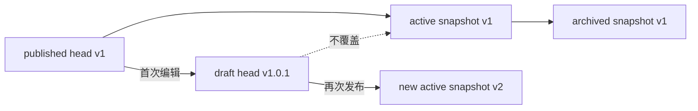
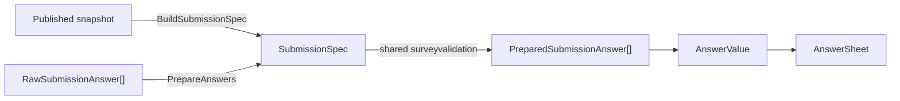

# 核心设计：版本化与作答契约

## 1. 本文回答

本文说明 Questionnaire head、published snapshot、active version、`SubmissionSpec` 与 `AnswerSheet.QuestionnaireRef` 如何共同构成版本化作答契约，并回答三个核心问题：

1. 运营继续编辑问卷时，为什么不会改变已经完成的历史作答？
2. 客户端提交的答案，服务端如何按当时的精确问卷版本校验？
3. 问卷版本、测评模型版本与答卷引用之间，哪些必须绑定，哪些必须分开？

## 2. 30 秒结论

`Questionnaire code` 标识问卷 family，`code + version` 标识一份可稳定解释的已发布问卷定义。

```text
head
  运营继续维护的可变工作记录

published snapshot(code, version)
  不可变的发布契约

active published version
  未指定版本时的默认在线版本

SubmissionSpec
  从某个发布快照派生的服务端提交规格

AnswerSheet.QuestionnaireRef
  已提交答卷的历史解释键
```

提交前可以选择“当前发布版本”，但一旦建立 AnswerSheet，就必须冻结实际使用的 questionnaire code/version/title。后续新版本不得改变旧答卷的题型、选项、校验和基础计分语义。

## 3. 版本契约中的五个不同维度

| 维度 | 当前值 | 回答的问题 |
| --- | --- | --- |
| `Code` | 稳定业务编码 | 这是哪个问卷 family？ |
| `Version` | 历史兼容字符串 | 这是 family 中的哪份精确定义？ |
| `RecordRole` | `head / published_snapshot` | 这是工作记录还是历史快照？ |
| `Status` | `draft / published / archived` | 聚合当前处于什么业务生命周期？ |
| `ReleaseStatus` | `active / archived` | 该 published snapshot 是当前在线版本还是保留的历史版本？ |

`IsActivePublished` 是兼容历史数据的持久化标志，Repository 会将它与 `ReleaseStatus` 归一为发布状态。上述维度不得混为一个概念：

- `head.status=published` 不能单独证明已经存在 active snapshot；
- `head.status=draft` 也不代表线上一定没有 active snapshot；
- active snapshot 只是默认在线版本，不是唯一可读的历史快照。

## 4. 当前版本演进规则

### 4.1 运行时实际行为

| 动作 | 当前行为 |
| --- | --- |
| Create | 应用服务使用外部版本；未传时默认为 `1.0` |
| 首次编辑已发布 head | `ForkDraftFromPublished` 递增小版本并将 head 切为 draft，不下架 active snapshot |
| SaveDraft | 再递增小版本并更新 head |
| Publish | 递增大版本，将小版部分归一为 `x.0.1` 形式，然后生成 published snapshot |

`Version` 兼容 `v1 / 1 / 1.0 / 1.0.0` 等历史形式，不是严格 SemVer。客户端不应根据 SemVer 规则自行推导问卷版本兼容性。

### 4.2 当前不足：初始版本规则不一致

Application `creation_workflow` 实际默认为 `1.0`，但领域 `Versioning.InitializeVersion` 仍使用 `0.0.1`，而且当前创建主路径不调用 `InitializeVersion`。

因此：

- 本文把 `1.0` 写为当前运行时创建事实；
- `0.0.1` 只能作为领域 helper 的当前实现，不能代表主链路；
- 后续应先统一代码规则，再决定是否迁移历史版本表达。

## 5. head 与 published snapshot 如何分离



工作 head 与在线 snapshot 分离解决了一个直接的运营问题：运营准备新版本时，用户仍然可以填写当前发布版本。

`ensureEditableHead` 会在已发布 head 第一次被编辑时：

1. 确保当前发布内容已保留为 snapshot；
2. 在 head 上派生新 draft；
3. 保持当前 active snapshot 不变。

历史 snapshot 使用 `code + version + record_role` 区分，创建同版本快照时会比较不可变内容：内容相同可幂等返回，同版本内容不同则拒绝。

## 6. 发布方式如何影响一致性

Questionnaire 可以独立作为信息收集器，也可以绑定 AssessmentModel 形成可执行测评。两种场景的发布一致性不同：

| 场景 | 发布入口 | 当前一致性 |
| --- | --- | --- |
| 未绑定模型的独立问卷 | `/questionnaires/:code/publish` | head、snapshot、active switch 是多个顺序 Mongo 写，没有外层发布事务 |
| 已绑定 AssessmentModel 的问卷 | `/assessment-releases/:modelCode/publish` | Questionnaire 发布、精确 binding 和 AssessmentModel snapshot 在一个 Mongo session transaction 中共同提交或回滚 |

发布边界由“是否已绑定 AssessmentModel”决定，不由 `QuestionnaireType` 决定。已绑定问卷的独立 Publish/Unpublish/Archive 会被拒绝；它仍可编辑，但新版本只能在 Assessment Release 中生效。

联合发布的详细步骤、替代方案和历史演进见 [关键链路：问卷维护与发布](./30-关键链路-问卷维护与发布.md)。

## 7. 从发布快照构建 `SubmissionSpec`



`SubmissionSpec` 只保留提交所需的最小服务端视图：

- questionnaire code/version/title；
- question code/type；
- validation rules；
- option code 集；
- ShowController。

它不是 Mongo PO，也不是对外 DTO。它的价值是把“这个已发布版本接受什么答案”收口为领域契约。

### 7.1 解析精确发布版本

```text
请求指定 version
  -> FindByCodeVersion(code, version)
  -> 优先加载精确 published snapshot

请求未指定 version
  -> FindPublishedByCode(code)
  -> 优先加载 active published snapshot
```

`EnsureSubmittable` 要求 Questionnaire 非 nil、状态为 published，code/version 非空。正常契约要求可变 head 不得被直接用作提交规格。

> **当前兼容路径：** Mongo Repository 在找不到精确 snapshot 时，`FindByCodeVersion` 会回退查询同 code/version 的 published head；`FindPublishedByCode` 在没有 active snapshot 时也可回退到 published head。这是为了兼容尚未完成 snapshot 迁移的历史数据，不应被当作新数据继续只保留 head 的设计依据。

### 7.2 共享校验规格

`SubmissionSpec.PrepareAnswers` 将执行规则直接委托给 `internal/pkg/surveyvalidation.Spec.Validate`，使 collection-server 预检与 apiserver 最终校验可以复用同一份规格。当前主链路不再组装独立的 `AnswerValidationTask`，也不调用旧文档中的 `ruleengine.AnswerValidator`。

共享校验器当前检查：

1. question code 必须存在于当前问卷版本；
2. 客户端 question type 非空，且与服务端题型完全一致；
3. Radio 值必须是当前题目的单个 option code；
4. Checkbox 的每个值都必须属于当前题目选项集；
5. 可见且可作答的 required 题必须存在非空答案；
6. 长度、数值范围和选择数量等已支持 validation rules。

### 7.3 当前实现与目标契约的差异

| 场景 | 当前实现 | 已确认目标 |
| --- | --- | --- |
| 可见必填题未提交 | 拒绝整份提交 | 拒绝整份提交 |
| 不可见题仍提交答案 | 尚未拒绝，答案仍可进入 prepared answers | 视为客户端状态过期、实现错误或篡改，拒绝整份提交 |
| Section 仍提交答案 | 尚未显式拒绝 | 拒绝整份提交 |

> **规划改造：不可见题严格拒绝。** 服务端应用同一份最终提交中的控制题答案重新计算 ShowController。只要包含当前不可见题的答案，就应拒绝整份提交，不做静默忽略或部分保存。

### 7.4 最终提交语义

AnswerSheet 不是填写会话或草稿容器。当前产品契约不提供草稿上传、暂存同步、继续编辑或部分提交；客户端发出提交请求，就表示用户确认了一份完整最终答卷。

因此任一答案不符合精确问卷契约时，服务端应拒绝整份提交，不创建部分 AnswerSheet。

## 8. `QuestionnaireRef` 如何保护历史解释

AnswerSheet 创建时保存实际解析到的 questionnaire code/version/title。后续基础计分必须按该引用加载精确 snapshot：

```text
AnswerSheet.QuestionnaireRef
  -> exact published questionnaire
  -> match question code
  -> build option score tasks
  -> UpdateScores
```

如果改为读取 active questionnaire，新版本发布后对旧答卷重试计分可能得到不同结果，破坏可重放性。

### 8.1 基础题分是延迟派生属性

基础题分不是 AnswerSheet 可靠受理的前置条件。只要 QuestionnaireRef、AnswerValue 和对应发布快照仍在，同一份答卷的计分或故障重算就必须得到相同结果；重算只能更新派生分数，不能改写原始答案。

当前已实现范围是：

- scoring task 包含 AnswerValue 和 `Option.Code -> Option.Score` 映射；
- Radio 根据单选选项取分；
- Checkbox 对选中选项分数求和；
- `CalculationRule` 虽存在于 Question 定义，但当前 scoring task assembler 没有将它传入计分引擎，不能把它写成已执行能力；
- `AnswerScorer` 在 option score 集为空时直接返回 `0`，因此 NumberQuestion 的数值分支在常规无选项组装下实际不可达，属于当前计分实现不足。

### 8.2 当前不足：`score=0` 语义模糊

AnswerSheet 以 `score=0` 创建，异步计分后再写回单题分和总分，但没有独立 scoring status 或 scored timestamp。因此无法只根据 `score=0` 区分“尚未计分”与“已计分且真实结果为零”。

## 9. 一致性边界速查

| 边界 | 当前事实 |
| --- | --- |
| 独立 Questionnaire 发布 | head、snapshot、active switch 是多个顺序写，可存在部分完成 |
| 已绑定问卷的 Assessment Release | Questionnaire 与 AssessmentModel 的发布事实位于同一 Mongo transaction |
| AnswerSheet -> Questionnaire | 通过 `code + version` 引用，不嵌套整份 Questionnaire |
| AnswerSheet + `answersheet.submitted` Outbox | 同一 Mongo transaction，保护答卷事实与可靠出站意图 |
| changed event / cache signal | 只用于通知和读侧收敛，不是发布事实源 |

禁止以下实现方式：

- 只保存 questionnaire code 而不保存 version；
- 用当前 head 或 active snapshot 解释历史 AnswerSheet；
- 编辑问卷时就地改写历史 snapshot；
- 把 Questionnaire version 与 AssessmentModel release version 当作同一资产版本；
- 把 `questionnaire.changed`、`assessment_model.changed` 或缓存信令当作发布成功凭证。

## 10. 事实源与验证

| 主题 | 事实源 |
| --- | --- |
| Version / RecordRole | [`types.go`](../../../internal/apiserver/domain/survey/questionnaire/types.go) |
| Lifecycle / Versioning | [`lifecycle.go`](../../../internal/apiserver/domain/survey/questionnaire/lifecycle.go)、[`versioning.go`](../../../internal/apiserver/domain/survey/questionnaire/versioning.go) |
| 创建与发布工作流 | [`application/survey/questionnaire`](../../../internal/apiserver/application/survey/questionnaire/) |
| SubmissionSpec | [`submission_spec.go`](../../../internal/apiserver/domain/survey/questionnaire/submission_spec.go)、[`surveyvalidation`](../../../internal/pkg/surveyvalidation/) |
| QuestionnaireRef | [`domain/survey/answersheet/types.go`](../../../internal/apiserver/domain/survey/answersheet/types.go) |
| 基础计分 | [`application/survey/answersheet`](../../../internal/apiserver/application/survey/answersheet/)、[`infra/ruleengine/scoring.go`](../../../internal/apiserver/infra/ruleengine/scoring.go) |
| Questionnaire Mongo snapshots | [`infra/mongo/questionnaire`](../../../internal/apiserver/infra/mongo/questionnaire/) |
| Assessment Release | [`application/modelcatalog/release`](../../../internal/apiserver/application/modelcatalog/release/) |

```bash
go test ./internal/apiserver/domain/survey/questionnaire -run 'Version|Publish|SubmissionSpec'
go test ./internal/pkg/surveyvalidation
go test ./internal/apiserver/application/survey/answersheet -run 'Submit|Questionnaire|Answer|Scor'
go test ./internal/apiserver/application/modelcatalog/release
go test ./internal/apiserver/infra/mongo/questionnaire
```
