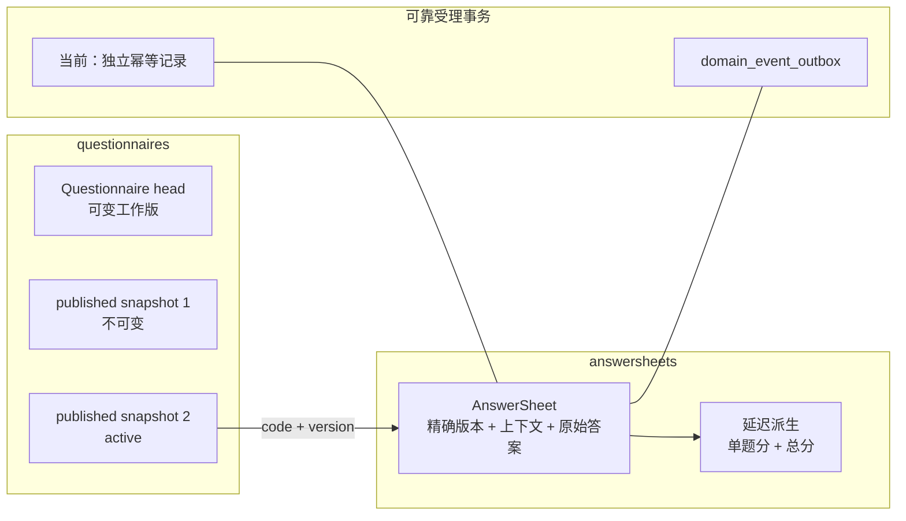

# 核心设计：数据存储与一致性

## 1. 本文回答

本文说明 Survey 为什么使用 MongoDB 保存 Questionnaire 与 AnswerSheet，为什么 Questionnaire head 和 published snapshot 共用一个集合，以及问卷编辑、问卷发布、答卷可靠受理和延迟计分分别使用什么一致性边界。

本文也区分当前已实现的 `answersheet_submit_idempotency` 独立集合与已确认的目标方案：取消独立集合，将受理幂等元数据收入 AnswerSheet MongoDB document。

## 2. 30 秒结论

Survey 选择 MongoDB，不只是因为“问卷看起来像 JSON”，而是因为 Questionnaire 与 AnswerSheet 都具有明确的文档聚合边界：

- Questionnaire 一次完整承载题目、选项、校验规则、计分规则和显示条件；
- AnswerSheet 一次完整承载问卷版本引用、作答上下文和原始答案；
- 两个聚合都以“整体读取、整体校验、整体持久化”为主，不需要为一次作答拼接多张关系表。



核心一致性原则是：

1. 可变 head 不能覆盖已发布快照。
2. 每个 AnswerSheet 必须引用精确 `questionnaire code + version`。
3. `202 Accepted` 只能在 AnswerSheet 和 `answersheet.submitted` Outbox 共同持久化后返回。
4. 幂等约束必须与 AnswerSheet 和 Outbox 保持同一 MongoDB transaction，不能单独迁入 MySQL。
5. 基础题分是提交后的延迟派生属性，计分失败不得推翻原始作答事实。

## 3. 为什么选择 MongoDB

### 3.1 Questionnaire 是天然的聚合文档

一份问卷的业务完整性不在单个题目上，而在整份问卷上：

- question code 在问卷内唯一；
- 选择题的 option code 属于对应题目；
- ShowController 引用同份问卷中的控制题；
- 发布校验需要同时检查问卷基本信息和全部题目；
- published snapshot 需要冻结该版本的全部作答契约。

因此 `questions` 以嵌套数组保存在 Questionnaire document 中。Option、ValidationRule、CalculationRule 和 ShowController 继续嵌套在对应 Question 内部。一次读取即可得到完整提交契约，一次快照复制即可冻结完整版本。

### 3.2 AnswerSheet 是一次完整作答事实

AnswerSheet document 同时保存：

- `QuestionnaireRef(code, version, title)`；
- filler、testee、org 和可选 task 上下文；
- 全部 Answer；
- 每题 AnswerValue 和延迟派生的 score；
- 答卷 total score 与 filled time。

一份答卷不需要将每道答案拆成独立行，也不需要在提交时对题目表、选项表和版本表执行多次 join。答卷列表则使用 MongoDB projection 只返回摘要，不加载完整 `answers`。

### 3.3 取舍

MongoDB 降低了题型扩展、聚合读取和版本快照的建模成本，但没有消除一致性问题：

- 一份问卷的每个发布版都保存完整内容，存在可控的数据重复；
- 长问卷和大量复杂规则会增大 document，需要关注文档体积与查询投影；
- 一个业务操作如果同时修改多个 document，仍然需要 MongoDB transaction；
- 嵌套结构不代表可以忽略索引、唯一性和历史数据迁移。

## 4. `questionnaires`：一个集合保存整个问卷族

### 4.1 为什么 head 与 snapshot 共用集合

Questionnaire head 和所有 published snapshots 放在同一个 `questionnaires` 集合是主动设计，不是版本重构遗留的偶然实现。

这个设计把同一 `code` 下的数据理解为一个问卷族：

```text
questionnaire family: SNAP-IV
  head
    当前可编辑工作版

  published_snapshot@1.0
    历史发布版，archived

  published_snapshot@1.1
    当前发布版，active
```

共用集合的理由是：

1. head 与 snapshot 使用完全相同的问卷文档结构，不需要双份 mapper 和存储协议。
2. 按 code、code/version、active release 和 release history 的查询可在同个存储边界完成。
3. 软删除问卷族时，可以用同一 code 处理 head 和全部 snapshots。
4. Assessment Release 可以在一个 MongoDB transaction 中更新 Questionnaire 和 ModelCatalog 的发布事实。
5. 将 snapshot 拆到另一个集合不会消除版本一致性，只会增加双集合查询、迁移和索引治理成本。

### 4.2 一份 document 的身份维度

| 字段 | 语义 |
| --- | --- |
| `code` | 问卷族稳定标识 |
| `version` | 该记录承载的作答契约版本 |
| `record_role` | `head` 或 `published_snapshot` |
| `status` | head 的 draft/published/archived 生命周期，snapshot 保留发布时状态 |
| `release_status` | snapshot 是 `active` 还是 `archived` |
| `is_active_published` | 旧版本 active 标记，当前仍用于兼容未完全迁移数据 |
| `published_at` | snapshot 首次发布时间 |
| `release_archived_at` | snapshot 退出 active 状态的时间 |

`record_role` 决定记录是否可编辑，`release_status` 决定 published snapshot 是否对新作答生效。两者不能用一个 `status` 替代，否则“工作版状态”和“历史发布版状态”会被混在一起。

### 4.3 head 可变，snapshot 不可变

Repository 对两类记录提供不同写入语义：

- `Create / Update` 始终写入或恢复 head；
- `CreatePublishedSnapshot` 只创建发布快照；
- 同 code/version 快照重复写入时，只有内容完全相同才能幂等成功；
- 同版本内容不同会返回 release version conflict；
- 已 archived 的历史快照不能以同版本重新激活。

`FindByCodeVersion` 优先查找 published snapshot，只在历史快照缺失时回退到同版本 published head。回退是历史数据兼容，不改变“新发布版必须有快照”的设计。

## 5. `answersheets`：原始作答事实与延迟派生属性

### 5.1 持久化结构

| 数据组 | 关键字段 | 语义 |
| --- | --- | --- |
| 问卷引用 | questionnaire code/version/title | 冻结本次作答使用的精确契约 |
| 提交上下文 | filler ID/type、testee ID、org ID、task ID | 记录谁填写、谁是受试者以及作答来源 |
| 原始答案 | question code/type/value | 不可被后续计分和测评流程改写的作答事实 |
| 派生题分 | answer score | 按精确问卷版本计算的单题基础分 |
| 派生总分 | total score | 当前 Survey scoring 对已计分题目求和的结果 |
| 时间 | filled_at | 本次正式作答建立时间 |

AnswerSheet 只复制 Questionnaire 的 code、version 和 title，不复制题干、选项文案或计分规则。这些语义由对应 published snapshot 保留。因此删除或覆盖历史 snapshot 会直接破坏答卷的可解释性。

### 5.2 原始事实与题分的不同可变性

AnswerSheet 不是物理上永不更新的 MongoDB document。Survey scoring 会在提交后调用 `UpdateScores`，更新单题 score 和 total score。

不变的是业务事实边界：

```text
提交后不得更改
  QuestionnaireRef
  SubmissionContext
  Answer.QuestionCode
  Answer.QuestionType
  Answer.Value
  FilledAt

可以受控重建
  Answer.Score
  AnswerSheet.TotalScore
```

当前持久化模型没有 scoring status 和 scored timestamp，因此 `score=0` 不能区分尚未计分与真实零分。这是已识别的当前不足，不应由查询层猜测补齐。

## 6. 四种不同的一致性边界

| 操作 | 主事实 | 当前一致性手段 | 成功语义 |
| --- | --- | --- | --- |
| 编辑问卷 | Questionnaire head | 单 document update/upsert | 工作 head 已保存，不影响 active snapshot |
| 独立问卷发布 | head + snapshot + active switch | 当前为多步顺序写入 | 新 snapshot 成为 active，head 保留发布状态 |
| Assessment Release | Questionnaire + ModelCatalog 发布事实 | 一个 MongoDB transaction | 问卷版本与模型绑定共同生效 |
| 答卷可靠受理 | AnswerSheet + 幂等约束 + Outbox | 一个 MongoDB transaction | 可以安全返回 `202 Accepted` |
| 基础题分计算 | AnswerSheet score projection | 后续单 document update | 题分已按精确问卷版本写回 |

这些操作不应被笼统地描述为“Survey 使用 MongoDB transaction”。是否需要事务，取决于一次业务成功是否跨越多个 document。

### 6.1 独立问卷发布的当前边界

独立问卷发布当前依次执行：

1. 将 head 持久化为 published 状态。
2. 以 archived release 形式创建新 published snapshot。
3. 将原 active snapshots 转为 archived。
4. 将新 snapshot 转为 active。

先以 archived 形式插入新 snapshot，是为了在 active 切换过程中满足“一个 code 只有一个 active snapshot”的约束。但这些步骤当前没有被独立发布入口统一包裹在 transaction 内，中间步骤失败时可能留下 head 已发布、新 snapshot 已创建但未 active 等过渡状态。该问题属于独立发布的一致性不足，而不是 published snapshot 模型本身的错误。

### 6.2 Assessment Release 的联合事务

已绑定测评模型的 Questionnaire 不经过独立发布入口，而由 ModelCatalog `release.Service` 在一个 MongoDB transaction 中完成：

1. 发布或幂等复用 Questionnaire snapshot。
2. 解析服务端实际发布的 questionnaire version。
3. 校验并更新 AssessmentModel 精确 binding。
4. 创建 AssessmentModel published snapshot。
5. 更新 AssessmentModel head。

任一步失败都使问卷与模型发布变更共同回滚。缓存失效和其它发布后效果在 commit 后执行，避免消费者观察到最终回滚的发布版。

### 6.3 AnswerSheet 可靠受理事务

`transactionalSubmissionDurableStore` 当前在一个 MongoDB transaction 中：

1. 写入受理幂等记录（请求提供 idempotency key 时）。
2. 写入 AnswerSheet。
3. 把 `answersheet.submitted` 写入 `domain_event_outbox`。

这个事务解决的不是“尽量少丢数据”，而是确定的成功语义：

```text
可以返回 202
  当且仅当
AnswerSheet 已持久化
  且
同一业务幂等键不会生成第二份有效 AnswerSheet
  且
answersheet.submitted 已可由 Outbox 恢复投递
```

Outbox 的 MQ 发布可以晚于 HTTP 响应，但 Outbox intent 不能晚于可靠受理。

## 7. 受理幂等：当前实现与目标设计

### 7.1 当前已实现：独立 MongoDB 幂等集合

`answersheet_submit_idempotency` 当前保存：

| 字段 | 作用 |
| --- | --- |
| `writer_id + idempotency_key` | 并发竞争的唯一约束 |
| `fingerprint` | 区分同 key 同内容与同 key 不同内容 |
| `answersheet_id` | 幂等命中后返回已有 AnswerSheet |
| questionnaire code/version、testee ID | 当前保存的受理请求摘要 |
| `status` | 当前实际只有 `completed` |
| `error_message` | 已建模，但当前主链路未使用 |

Repository 在启动时为 `(writer_id, idempotency_key)` 创建唯一索引。并发提交时只有一个事务能成功插入；失败方在短窗口内查询 completed 结果，并校验 fingerprint。

该集合属于受理协议的技术事实，不是 Survey 领域聚合，也不表达医疗测评业务。

### 7.2 为什么对独立集合保留疑问

当前数据模型存在明显的重复和未使用状态：

- testee、questionnaire code/version 和 AnswerSheet ID 都可以从 AnswerSheet 直接获得；
- 幂等记录只有 `completed` 状态；
- 事务失败会使幂等记录和 AnswerSheet 一起回滚，不会留下 failed 记录；
- `error_message` 没有进入当前读写语义；
- 幂等记录没有区别于 AnswerSheet 的已实现生命周期。

因此“需要数据库级幂等”并不自动推导出“需要一个独立集合”。

### 7.3 规划改造：幂等元数据收入 AnswerSheet document

> **规划改造。** 取消独立 `answersheet_submit_idempotency` 集合，将受理幂等元数据保存在 AnswerSheet 持久化 document 中。该方案已完成设计口径确认，但当前源码尚未实现。

目标持久化形状可以是：

```text
answersheets
  domain_id
  questionnaire_code
  questionnaire_version
  submission_context
  answers
  total_score

  acceptance
    writer_id
    idempotency_key
    fingerprint
```

目标约束为：

- 对存在 idempotency key 的 AnswerSheet 建立 `(acceptance.writer_id, acceptance.idempotency_key)` 局部唯一索引；
- 命中幂等键时直接返回对应 AnswerSheet；
- fingerprint 相同表示同一业务意图的重试；
- fingerprint 不同表示同 key 被用于不同作答，返回 conflict；
- acceptance 仅存在于 MongoDB PO，不进入 AnswerSheet 领域聚合；
- AnswerSheet 与 Outbox 仍在同一 MongoDB transaction 中提交。

该方案比独立集合更简单，但实施时必须设计老幂等记录的双读、回填、唯一索引切换和回滚方案，不能直接删除旧集合。

### 7.4 为什么不单独迁入 MySQL

如果只把幂等记录放入 MySQL，则一次可靠受理同时跨越 MySQL 和 MongoDB：

| 执行顺序 | 失败窗口 |
| --- | --- |
| 先提交 MySQL | 幂等键已占用，但 AnswerSheet 不存在 |
| 先提交 MongoDB | AnswerSheet 已存在，但幂等键未建立，重试可能再次创建 |
| 异步对账或补偿 | 单事务可靠受理升级为跨库最终一致性协议 |

除非将 AnswerSheet 和其 Outbox 也整体迁入 MySQL，否则单独迁移幂等记录不会使模型更简单，反而会破坏已经建立的成功不变式。

## 8. 读模型与查询投影

### 8.1 Questionnaire 管理查询

管理端的 `GetByCode` 读取 head，用于继续编辑。`List` 的 read model 仅查询 head candidates，并投影 code、title、status、type、version、question count 和审计字段，不加载完整 questions。

### 8.2 Questionnaire 作答查询

面向作答的 `GetPublishedByCode` 优先返回 active published snapshot。指定 version 时优先返回精确 published snapshot。对历史未迁移数据，Repository 保留 published head 回退。

`ListPublished` 按 code 分组，每个问卷族只返回优先级最高的当前发布记录，避免把全部历史 snapshots 暴露为多份当前可用问卷。

### 8.3 AnswerSheet 摘要查询

AnswerSheet 列表通过 aggregation projection 返回 ID、questionnaire code/title、filler、total score、filled time 和 answer count。`answer_count` 在查询管道中由 `answers` 数组长度计算，列表不返回全部答案。

这是文档存储的重要配套原则：聚合按完整 document 存储，但不代表所有查询都要返回完整 document。

## 9. 索引与持久化约束

### 9.1 Questionnaire 的目标约束

数据模型需要保护：

- 一个 code 只有一个未删除 head；
- 一个 code/version 只有一个未删除 published snapshot；
- 一个 code 最多只有一个 active published snapshot；
- 发布历史可以按 code 和 published time 高效查询。

一次性版本归一脚本已按 head、snapshot、active 和 release history 建立局部唯一/查询索引。但当前仓库中同时存在早期 migration、通用 Mongo index manager 和一次性归一脚本三组不完全一致的索引定义。

> **当前不足：索引事实源未完全收敛。** 部署不能只根据某一份 Go 索引列表或早期 migration 判断生产约束，需要以实际 MongoDB `getIndexes()` 结果验证。后续应把目标索引收敛到可重复执行的正式 migration，并让自动校验检查名称、键、unique 和 partial filter。

### 9.2 AnswerSheet 的查询与唯一性

AnswerSheet 主要按以下方向查询：

- domain ID 查询单份答卷；
- filler + filled time 查询用户作答历史；
- questionnaire code + filled time 查询问卷下的答卷；
- 规划中的 writer + idempotency key 唯一约束。

当前独立幂等集合的唯一索引由 AnswerSheet Repository 初始化时显式建立，并会删除早期只按 idempotency key 全局唯一的旧索引。这表明幂等键的命名空间是 writer，不是全系统。

## 10. 失败、重试与恢复

| 故障 | 当前结果 | 恢复方式 |
| --- | --- | --- |
| Questionnaire head update 失败 | 编辑不成功 | 修正依赖后重试 |
| 独立发布中途失败 | 可能留下过渡状态 | 读取 head/snapshot/release status 判定停止步骤，再重试或人工修复 |
| Assessment Release 中任一写入失败 | 问卷和模型发布事务回滚 | 修正校验、数据或存储故障后整体重试 |
| AnswerSheet 写入失败 | 幂等记录和 Outbox 共同回滚 | 不返回 202，调用方使用同一 idempotency key 重试 |
| Outbox stage 失败 | AnswerSheet 事务回滚 | 不返回 202，同 key 重试 |
| Mongo commit 结果未知 | 不能直接宣告失败或成功 | 在短暂的 detached context 中按幂等键查询 completed AnswerSheet；只有查到才可确认成功 |
| commit 后立即 relay 失败 | AnswerSheet 已成立，Outbox 仍为恢复事实 | 常规 relay 扫描继续投递 |
| 基础计分失败 | 原始 AnswerSheet 仍成立 | Worker NACK/retry，按精确 questionnaire version 重算 |

## 11. 替代方案与取舍

### 11.1 head 与 snapshot 拆分集合

可以将可编辑 head 放入 `questionnaire_heads`，将历史快照放入 `questionnaire_releases`。这会让每个集合的记录类型更单一，但会引入双仓储、双 mapper、问卷族跨集合删除和更多迁移路径。

项目已主动选择共用 `questionnaires`，不计划仅为了物理分类而拆分集合。

### 11.2 关系化拆分 Question、Option 与 Answer

在 MySQL 中将问卷、题目、选项、校验规则和答案分表，可以得到更强的行级关系约束。但 Survey 的主要读写单位是完整问卷版本和完整答卷，关系化会将题型扩展、快照复制和答案读取变成多表协作。

因此 MySQL 更适合 Actor、Plan、Evaluation 这类关系和状态约束更强的数据，不是 Survey 聚合的首选存储。

### 11.3 完全不保存幂等元数据

只依靠 Redis guard、HTTP request ID 或客户端禁止重复点击，都不能处理超时后重试、跨实例并发和 commit 结果未知。Redis 可以降低重复压力，但数据库唯一约束才是最终裁决者。

因此可以取消独立幂等集合，但不能取消持久化幂等元数据和唯一约束。

## 12. 当前不足与实现后检查点

| 项目 | 状态 | 影响 |
| --- | --- | --- |
| 幂等元数据收入 AnswerSheet document | 规划改造 | 当前仍有独立技术集合和重复字段 |
| 独立问卷发布事务 | 已实现多步写入，未统一事务化 | 中间失败可留下过渡状态 |
| Questionnaire 索引事实源 | 尚未完全收敛 | migration、index manager 和一次性脚本可能不一致 |
| AnswerSheet scoring status | 未建模 | 无法区分未计分与真实零分 |
| 历史 published-head 回退 | 已实现兼容 | 读路径仍需同时理解 snapshot 与历史 head |

幂等存储改造完成后，至少要验证：

1. 同 writer + key + 同 fingerprint 的并发请求只得到一个 AnswerSheet ID。
2. 同 writer + key + 不同 fingerprint 稳定返回 conflict。
3. Outbox stage 失败时 AnswerSheet 与幂等元数据共同回滚。
4. commit 结果未知时，只有查到已持久化 AnswerSheet 才确认成功。
5. 旧幂等记录在迁移窗口中仍能命中，不会创建第二份 AnswerSheet。
6. 删除旧集合前，已完成数据对账、索引验证和可回滚备份。

## 13. 事实源与验证

| 主题 | 路径 |
| --- | --- |
| Questionnaire PO / Repository | [`infra/mongo/questionnaire`](../../../internal/apiserver/infra/mongo/questionnaire/) |
| AnswerSheet PO / Repository | [`infra/mongo/answersheet`](../../../internal/apiserver/infra/mongo/answersheet/) |
| 可靠受理事务 | [`transactional_durable_store.go`](../../../internal/apiserver/application/survey/answersheet/transactional_durable_store.go) |
| Mongo Outbox | [`infra/mongo/eventoutbox`](../../../internal/apiserver/infra/mongo/eventoutbox/) |
| Assessment Release | [`application/modelcatalog/release`](../../../internal/apiserver/application/modelcatalog/release/) |
| Mongo migrations | [`internal/pkg/migration/migrations/mongodb`](../../../internal/pkg/migration/migrations/mongodb/) |
| 索引管理与脚本 | [`internal/pkg/mongodb/indexes.go`](../../../internal/pkg/mongodb/indexes.go)、[`scripts/mongodb`](../../../scripts/mongodb/) |
| 可靠提交集成测试 | [`durable_submit_integration_test.go`](../../../internal/apiserver/infra/mongo/answersheet/durable_submit_integration_test.go) |

```bash
go test ./internal/apiserver/infra/mongo/questionnaire
go test ./internal/apiserver/application/survey/answersheet
go test ./internal/apiserver/infra/mongo/answersheet
go test ./internal/apiserver/application/modelcatalog/release
make docs-hygiene
make docs-facts
```

MongoDB transaction 集成契约需要 Replica Set 和隔离测试库。未配置真实集成环境时，本地单元测试通过不等于事务能力已在部署环境验收。
