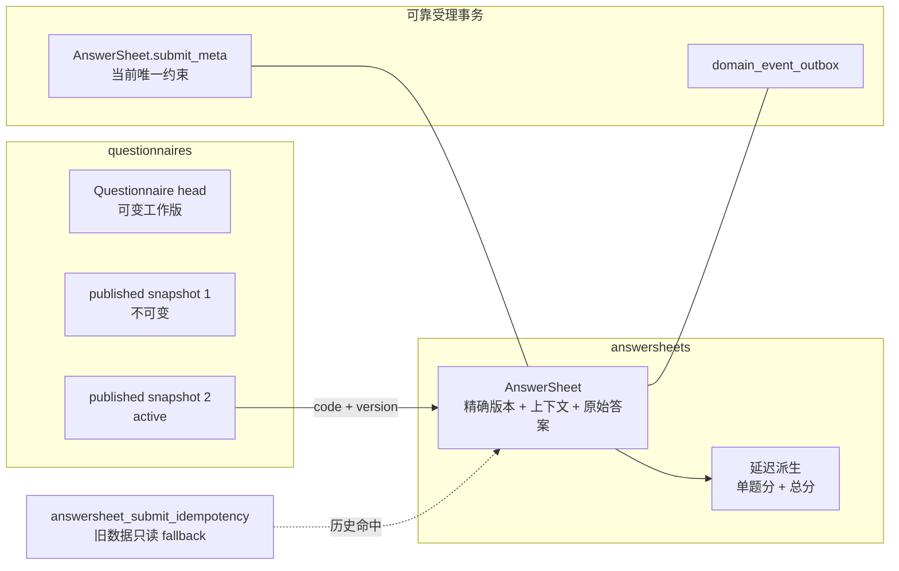

# 核心设计：数据存储与一致性

## 1. 本文回答

本文说明 Survey 为什么使用 MongoDB 保存 Questionnaire 与 AnswerSheet，为什么 Questionnaire head 和 published snapshot 共用一个集合，以及问卷编辑、问卷发布、答卷可靠受理和延迟计分分别使用什么一致性边界。

本文也区分当前主路径与历史兼容：新受理已把幂等元数据收入 AnswerSheet MongoDB document；`answersheet_submit_idempotency` 不再接收新写，只在嵌入元数据未命中时提供旧数据回查。

## 2. 30 秒结论

Survey 选择 MongoDB，不只是因为“问卷看起来像 JSON”，而是因为 Questionnaire 与 AnswerSheet 都具有明确的文档聚合边界：

- Questionnaire 一次完整承载题目、选项、校验规则、计分规则和显示条件；
- AnswerSheet 一次完整承载问卷版本引用、作答上下文和原始答案；
- 两个聚合都以“整体读取、整体校验、整体持久化”为主，不需要为一次作答拼接多张关系表。


```mermaid
flowchart LR
    subgraph QCOLL["questionnaires"]
        QH["Questionnaire head\n可变工作版"]
        QS1["published snapshot 1\n不可变"]
        QS2["published snapshot 2\nactive"]
    end

    subgraph ACOLL["answersheets"]
        AS["AnswerSheet\n精确版本 + 上下文 + 原始答案"]
        SCORE["延迟派生\n单题分 + 总分"]
    end

    subgraph TCOLL["可靠受理事务"]
        IDEM["AnswerSheet.submit_meta\n当前唯一约束"]
        OUTBOX["domain_event_outbox"]
    end

    LEGACY["answersheet_submit_idempotency\n旧数据只读 fallback"]

    QS2 -->|"code + version"| AS
    AS --> SCORE
    IDEM --- AS
    AS --- OUTBOX
    LEGACY -.历史命中.-> AS
```

核心一致性原则是：

1. 可变 head 不能覆盖已发布快照。
2. 每个 AnswerSheet 必须引用精确 `questionnaire code + version`。
3. `202 Accepted` 只能在 AnswerSheet 和 `answersheet.submitted` Outbox 共同持久化后返回。
4. 幂等约束必须与 AnswerSheet 和 Outbox 保持同一 MongoDB transaction，不能单独迁入 MySQL。
5. 基础题分是提交后的延迟派生属性，计分失败不得推翻原始作答事实。

## 3. 为什么选择 MongoDB

### 3.1 Questionnaire 是天然的聚合文档

一份问卷的业务完整性不在单个题目上，而在整份问卷上：

- question code 在问卷内唯一；
- 选择题的 option code 属于对应题目；
- ShowController 引用同份问卷中的控制题；
- 发布校验需要同时检查问卷基本信息和全部题目；
- published snapshot 需要冻结该版本的全部作答契约。

因此 `questions` 以嵌套数组保存在 Questionnaire document 中。Option、ValidationRule、CalculationRule 和 ShowController 继续嵌套在对应 Question 内部。一次读取即可得到完整提交契约，一次快照复制即可冻结完整版本。

### 3.2 AnswerSheet 是一次完整作答事实

AnswerSheet document 同时保存：

- `QuestionnaireRef(code, version, title)`；
- filler、testee、org 和可选 task 上下文；
- 全部 Answer；
- 每题 AnswerValue 和延迟派生的 score；
- 答卷 total score 与 filled time。

一份答卷不需要将每道答案拆成独立行，也不需要在提交时对题目表、选项表和版本表执行多次 join。答卷列表则使用 MongoDB projection 只返回摘要，不加载完整 `answers`。

### 3.3 取舍

MongoDB 降低了题型扩展、聚合读取和版本快照的建模成本，但没有消除一致性问题：

- 一份问卷的每个发布版都保存完整内容，存在可控的数据重复；
- 长问卷和大量复杂规则会增大 document，需要关注文档体积与查询投影；
- 一个业务操作如果同时修改多个 document，仍然需要 MongoDB transaction；
- 嵌套结构不代表可以忽略索引、唯一性和历史数据迁移。

## 4. `questionnaires`：一个集合保存整个问卷族

### 4.1 为什么 head 与 snapshot 共用集合

Questionnaire head 和所有 published snapshots 放在同一个 `questionnaires` 集合是主动设计，不是版本重构遗留的偶然实现。

这个设计把同一 `code` 下的数据理解为一个问卷族：

```text
questionnaire family: SNAP-IV
  head
    当前可编辑工作版

  published_snapshot@1.0
    历史发布版，archived

  published_snapshot@1.1
    当前发布版，active
```

共用集合的理由是：

1. head 与 snapshot 使用完全相同的问卷文档结构，不需要双份 mapper 和存储协议。
2. 按 code、code/version、active release 和 release history 的查询可在同个存储边界完成。
3. 软删除问卷族时，可以用同一 code 处理 head 和全部 snapshots。
4. Assessment Release 可以在一个 MongoDB transaction 中更新 Questionnaire 和 ModelCatalog 的发布事实。
5. 将 snapshot 拆到另一个集合不会消除版本一致性，只会增加双集合查询、迁移和索引治理成本。

### 4.2 一份 document 的身份维度

| 字段 | 语义 |
| --- | --- |
| `code` | 问卷族稳定标识 |
| `version` | 该记录承载的作答契约版本 |
| `record_role` | `head` 或 `published_snapshot` |
| `status` | head 的 draft/published/archived 生命周期，snapshot 保留发布时状态 |
| `release_status` | snapshot 是 `active` 还是 `archived` |
| `is_active_published` | 旧版本 active 标记，当前仍用于兼容未完全迁移数据 |
| `published_at` | snapshot 首次发布时间 |
| `release_archived_at` | snapshot 退出 active 状态的时间 |

`record_role` 决定记录是否可编辑，`release_status` 决定 published snapshot 是否对新作答生效。两者不能用一个 `status` 替代，否则“工作版状态”和“历史发布版状态”会被混在一起。

### 4.3 head 可变，snapshot 不可变

Repository 对两类记录提供不同写入语义：

- `Create / Update` 始终写入或恢复 head；
- `CreatePublishedSnapshot` 只创建发布快照；
- 同 code/version 快照重复写入时，只有内容完全相同才能幂等成功；
- 同版本内容不同会返回 release version conflict；
- 已 archived 的历史快照不能以同版本重新激活。

`FindByCodeVersion` 优先查找 published snapshot，只在历史快照缺失时回退到同版本 published head。回退是历史数据兼容，不改变“新发布版必须有快照”的设计。

## 5. `answersheets`：原始作答事实与延迟派生属性

### 5.1 持久化结构

| 数据组 | 关键字段 | 语义 |
| --- | --- | --- |
| 问卷引用 | questionnaire code/version/title | 冻结本次作答使用的精确契约 |
| 提交上下文 | filler ID/type、testee ID、org ID、task ID | 记录谁填写、谁是受试者以及作答来源 |
| 原始答案 | question code/type/value | 不可被后续计分和测评流程改写的作答事实 |
| 派生题分 | answer score | 按精确问卷版本计算的单题基础分 |
| 派生总分 | total score | 当前 Survey scoring 对已计分题目求和的结果 |
| 时间 | filled_at | 本次正式作答建立时间 |

AnswerSheet 只复制 Questionnaire 的 code、version 和 title，不复制题干、选项文案或计分规则。这些语义由对应 published snapshot 保留。因此删除或覆盖历史 snapshot 会直接破坏答卷的可解释性。

### 5.2 原始事实与题分的不同可变性

AnswerSheet 不是物理上永不更新的 MongoDB document。Survey scoring 会在提交后调用 `UpdateScores`，更新单题 score 和 total score。

不变的是业务事实边界：

```text
提交后不得更改
  QuestionnaireRef
  SubmissionContext
  Answer.QuestionCode
  Answer.QuestionType
  Answer.Value
  FilledAt

可以受控重建
  Answer.Score
  AnswerSheet.TotalScore
```

当前持久化模型没有 scoring status 和 scored timestamp，因此 `score=0` 不能区分尚未计分与真实零分。这是已识别的当前不足，不应由查询层猜测补齐。

## 6. 四种不同的一致性边界

| 操作 | 主事实 | 当前一致性手段 | 成功语义 |
| --- | --- | --- | --- |
| 编辑问卷 | Questionnaire head | 单 document update/upsert | 工作 head 已保存，不影响 active snapshot |
| 独立问卷生命周期 | head + snapshot + active switch/clear | 每个 Publish / Unpublish / Archive 用例使用一个 MongoDB transaction | head 与对外 active snapshot 共同生效或回滚 |
| Assessment Release | Questionnaire + ModelCatalog 发布事实 | 一个 MongoDB transaction | 问卷版本与模型绑定共同生效 |
| 答卷可靠受理 | AnswerSheet + 幂等约束 + Outbox | 一个 MongoDB transaction | 可以安全返回 `202 Accepted` |
| 基础题分计算 | AnswerSheet score projection | 后续单 document update | 题分已按精确问卷版本写回 |

这些操作不应被笼统地描述为“Survey 使用 MongoDB transaction”。是否需要事务，取决于一次业务成功是否跨越多个 document。

### 6.1 独立问卷生命周期事务

独立问卷发布当前依次执行：

1. 将 head 持久化为 published 状态。
2. 以 archived release 形式创建新 published snapshot。
3. 将原 active snapshots 转为 archived。
4. 将新 snapshot 转为 active。

先以 archived 形式插入新 snapshot，是为了在 active 切换过程中满足“一个 code 只有一个 active snapshot”的约束。当前上述步骤位于同一 Mongo transaction；Unpublish 和 Archive 的 head 变更与 active clear 也使用同一事务。Repository 在 session context 中不改写 Redis，本地缓存失效、跨实例信令和领域事件均在 commit 后执行，避免读侧观察到最终回滚的版本。

### 6.2 Assessment Release 的联合事务

已绑定测评模型的 Questionnaire 不经过独立发布入口，而由 ModelCatalog `release.Service` 在一个 MongoDB transaction 中完成：

1. 发布或幂等复用 Questionnaire snapshot。
2. 解析服务端实际发布的 questionnaire version。
3. 校验并更新 AssessmentModel 精确 binding。
4. 创建 AssessmentModel published snapshot。
5. 更新 AssessmentModel head。

任一步失败都使问卷与模型发布变更共同回滚。缓存失效和其它发布后效果在 commit 后执行，避免消费者观察到最终回滚的发布版。

### 6.3 AnswerSheet 可靠受理事务

`transactionalSubmissionDurableStore` 当前在一个 MongoDB transaction 中：

1. 写入带 `submit_meta` 的 AnswerSheet；Repository 的局部唯一索引裁决 writer + key。
2. 把 `answersheet.submitted` 写入 `domain_event_outbox`。

这个事务解决的不是“尽量少丢数据”，而是确定的成功语义：

```text
可以返回 202
  当且仅当
AnswerSheet 已持久化
  且
同一业务幂等键不会生成第二份有效 AnswerSheet
  且
answersheet.submitted 已可由 Outbox 恢复投递
```

Outbox 的 MQ 发布可以晚于 HTTP 响应，但 Outbox intent 不能晚于可靠受理。

## 7. 受理幂等：当前实现与兼容退出

### 7.1 当前主路径：幂等元数据内嵌 AnswerSheet

当前持久化形状是：

```text
answersheets
  domain_id
  questionnaire_code
  questionnaire_version
  submission_context
  answers
  total_score

  submit_meta
    writer_id
    idempotency_key
    fingerprint
    request_id
    accepted_at
```

当前约束为：

- 对存在 idempotency key 的 AnswerSheet 建立 `(submit_meta.writer_id, submit_meta.idempotency_key)` 局部唯一索引；
- 命中幂等键时直接返回对应 AnswerSheet；
- fingerprint 相同表示同一业务意图的重试；
- fingerprint 不同表示同 key 被用于不同作答，返回 conflict；
- `submit_meta` 仅存在于 MongoDB PO，不进入 AnswerSheet 领域聚合；
- AnswerSheet 与 Outbox 仍在同一 MongoDB transaction 中提交。

### 7.2 当前兼容：旧集合只读 fallback

Repository 先按嵌入 `submit_meta` 查询；未命中时才读取 `answersheet_submit_idempotency` 的历史 `completed` 记录，再加载所指向的 AnswerSheet 并校验 fingerprint。新提交不再写该集合。

因此旧集合属于“高置信遗留候选、生产未证实”，而不是已可删除对象。退出前必须完成：

1. 生产文档计数和孤儿引用检查；
2. fallback 命中指标或等价日志观察窗；
3. 旧记录回填、归档或明确保留决策；
4. 删除双读后的重试/并发/commit-unknown 集成验证；
5. 可恢复备份和回滚步骤。

### 7.3 为什么幂等元数据不单独迁入 MySQL

如果只把幂等记录放入 MySQL，则一次可靠受理同时跨越 MySQL 和 MongoDB：

| 执行顺序 | 失败窗口 |
| --- | --- |
| 先提交 MySQL | 幂等键已占用，但 AnswerSheet 不存在 |
| 先提交 MongoDB | AnswerSheet 已存在，但幂等键未建立，重试可能再次创建 |
| 异步对账或补偿 | 单事务可靠受理升级为跨库最终一致性协议 |

除非将 AnswerSheet 和其 Outbox 也整体迁入 MySQL，否则单独迁移幂等记录不会使模型更简单，反而会破坏已经建立的成功不变式。

## 8. 读模型与查询投影

### 8.1 Questionnaire 管理查询

管理端的 `GetByCode` 读取 head，用于继续编辑。`List` 的 read model 仅查询 head candidates，并投影 code、title、status、type、version、question count 和审计字段，不加载完整 questions。

### 8.2 Questionnaire 作答查询

面向作答的 `GetPublishedByCode` 优先返回 active published snapshot。指定 version 时优先返回精确 published snapshot。对历史未迁移数据，Repository 保留 published head 回退。

`ListPublished` 按 code 分组，每个问卷族只返回优先级最高的当前发布记录，避免把全部历史 snapshots 暴露为多份当前可用问卷。

### 8.3 AnswerSheet 摘要查询

AnswerSheet 列表通过 aggregation projection 返回 ID、questionnaire code/title、filler、total score、filled time 和 answer count。`answer_count` 在查询管道中由 `answers` 数组长度计算，列表不返回全部答案。

这是文档存储的重要配套原则：聚合按完整 document 存储，但不代表所有查询都要返回完整 document。

## 9. 索引与持久化约束

### 9.1 Questionnaire 的正式约束

数据模型需要保护：

- 一个 code 只有一个未删除 head；
- 一个 code/version 只有一个未删除 published snapshot；
- 一个 code 最多只有一个 active published snapshot；
- 发布历史可以按 code 和 published time 高效查询。

正式 Mongo migration `000013_unified_modelcatalog_schema` 已按 head、snapshot、active 和 release history 建立局部唯一/查询索引，并有 contract 与 integration tests。部署验收仍必须用生产 `getIndexes()` 核对名称、键、unique 和 partial filter；仓库 migration 存在不等于生产一定已执行。

### 9.2 AnswerSheet 的查询与唯一性

AnswerSheet 主要按以下方向查询：

- domain ID 查询单份答卷；
- filler + filled time 查询用户作答历史；
- questionnaire code + filled time 查询问卷下的答卷；
- `submit_meta.writer_id + submit_meta.idempotency_key` 局部唯一约束。

当前内嵌幂等索引由 AnswerSheet Repository 初始化时显式建立。这表明幂等键的命名空间是 writer，不是全系统。旧独立集合是否仍保留历史索引不影响新写裁决，但属于生产退出盘点范围。

## 10. 失败、重试与恢复

| 故障 | 当前结果 | 恢复方式 |
| --- | --- | --- |
| Questionnaire head update 失败 | 编辑不成功 | 修正依赖后重试 |
| 独立 Publish / Unpublish / Archive 中途失败 | head 与 active snapshot 事务回滚 | 修正存储故障后整体重试；若 commit 结果不确定，先读取 head/snapshot 事实再决定 |
| Assessment Release 中任一写入失败 | 问卷和模型发布事务回滚 | 修正校验、数据或存储故障后整体重试 |
| AnswerSheet 写入失败 | 内嵌幂等元数据和 Outbox 共同回滚 | 不返回 202，调用方使用同一 idempotency key 重试 |
| Outbox stage 失败 | AnswerSheet 事务回滚 | 不返回 202，同 key 重试 |
| Mongo commit 结果未知 | 不能直接宣告失败或成功 | 在短暂的 detached context 中按幂等键查询 completed AnswerSheet；只有查到才可确认成功 |
| commit 后立即 relay 失败 | AnswerSheet 已成立，Outbox 仍为恢复事实 | 常规 relay 扫描继续投递 |
| 基础计分失败 | 原始 AnswerSheet 仍成立 | Worker NACK/retry，按精确 questionnaire version 重算 |

## 11. 替代方案与取舍

### 11.1 head 与 snapshot 拆分集合

可以将可编辑 head 放入 `questionnaire_heads`，将历史快照放入 `questionnaire_releases`。这会让每个集合的记录类型更单一，但会引入双仓储、双 mapper、问卷族跨集合删除和更多迁移路径。

项目已主动选择共用 `questionnaires`，不计划仅为了物理分类而拆分集合。

### 11.2 关系化拆分 Question、Option 与 Answer

在 MySQL 中将问卷、题目、选项、校验规则和答案分表，可以得到更强的行级关系约束。但 Survey 的主要读写单位是完整问卷版本和完整答卷，关系化会将题型扩展、快照复制和答案读取变成多表协作。

因此 MySQL 更适合 Actor、Plan、Evaluation 这类关系和状态约束更强的数据，不是 Survey 聚合的首选存储。

### 11.3 完全不保存幂等元数据

只依靠 Redis guard、HTTP request ID 或客户端禁止重复点击，都不能处理超时后重试、跨实例并发和 commit 结果未知。Redis 可以降低重复压力，但数据库唯一约束才是最终裁决者。

因此可以取消独立幂等集合，但不能取消持久化幂等元数据和唯一约束。

## 12. 当前不足与实现后检查点

| 项目 | 状态 | 影响 |
| --- | --- | --- |
| 幂等元数据收入 AnswerSheet document | 已实现 | 新写使用 `submit_meta`；旧集合只读 fallback 尚待退出 |
| 独立问卷生命周期事务 | 已实现，待当前 SHA 真实 CI | Publish / Unpublish / Archive 中间失败使 head 与 active snapshot 共同回滚 |
| Questionnaire 生产索引复验 | 待生产证据 | 正式 migration 已收敛，生产执行状态仍需 `getIndexes()` |
| AnswerSheet scoring status | 未建模 | 无法区分未计分与真实零分 |
| 历史 published-head 回退 | 已实现兼容 | 读路径仍需同时理解 snapshot 与历史 head |

旧集合兼容退出前，至少要验证：

1. 同 writer + key + 同 fingerprint 的并发请求只得到一个 AnswerSheet ID。
2. 同 writer + key + 不同 fingerprint 稳定返回 conflict。
3. Outbox stage 失败时 AnswerSheet 与幂等元数据共同回滚。
4. commit 结果未知时，只有查到已持久化 AnswerSheet 才确认成功。
5. 旧幂等记录在迁移窗口中仍能命中，不会创建第二份 AnswerSheet。
6. 删除旧集合前，已完成数据对账、索引验证和可回滚备份。

## 13. 事实源与验证

| 主题 | 路径 |
| --- | --- |
| Questionnaire PO / Repository | [`infra/mongo/questionnaire`](../../../internal/apiserver/infra/mongo/questionnaire/) |
| AnswerSheet PO / Repository | [`infra/mongo/answersheet`](../../../internal/apiserver/infra/mongo/answersheet/) |
| 可靠受理事务 | [`transactional_durable_store.go`](../../../internal/apiserver/application/survey/answersheet/transactional_durable_store.go) |
| Mongo Outbox | [`infra/mongo/eventoutbox`](../../../internal/apiserver/infra/mongo/eventoutbox/) |
| Assessment Release | [`application/modelcatalog/release`](../../../internal/apiserver/application/modelcatalog/release/) |
| Mongo migrations | [`internal/pkg/migration/migrations/mongodb`](../../../internal/pkg/migration/migrations/mongodb/) |
| 索引管理与脚本 | [`internal/pkg/mongodb/indexes.go`](../../../internal/pkg/mongodb/indexes.go)、[`scripts/mongodb`](../../../scripts/mongodb/) |
| 可靠提交集成测试 | [`durable_submit_integration_test.go`](../../../internal/apiserver/infra/mongo/answersheet/durable_submit_integration_test.go) |

```bash
go test ./internal/apiserver/infra/mongo/questionnaire
go test ./internal/apiserver/application/survey/answersheet
go test ./internal/apiserver/infra/mongo/answersheet
go test ./internal/apiserver/application/modelcatalog/release
make docs-hygiene
make docs-facts
```

MongoDB transaction 集成契约需要 Replica Set 和隔离测试库。未配置真实集成环境时，本地单元测试通过不等于事务能力已在部署环境验收。
