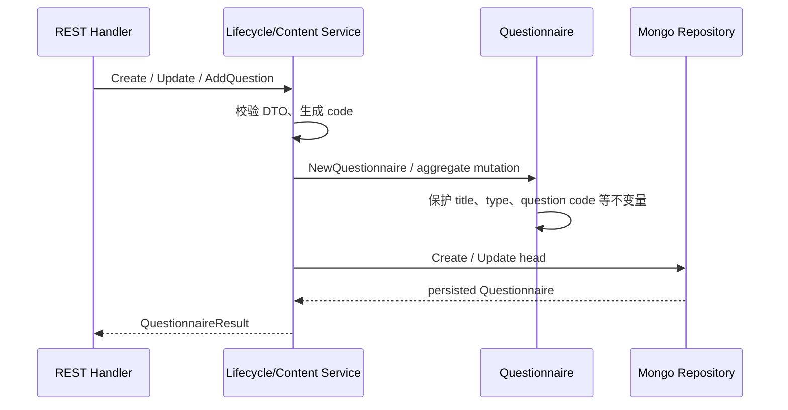
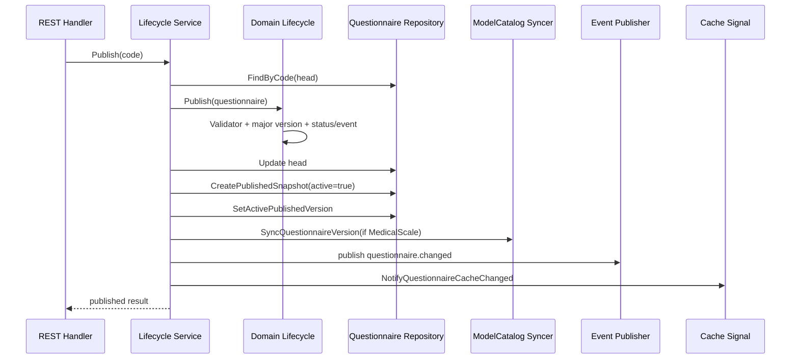

# 关键路径：问卷创建、编辑与发布

## 1. 本文回答

本文从管理 REST 入口开始，说明 Questionnaire head 如何创建、编辑、保存草稿并发布为可提交快照，以及发布后的 ModelCatalog 绑定同步、事件和缓存信令边界。

## 2. 入口与权限

问卷管理路由位于 `/api/v1/questionnaires`，由 `CapabilityManageQuestionnaires` 保护：

| 动作 | REST |
| --- | --- |
| 创建 | `POST /api/v1/questionnaires` |
| 更新基本信息 | `PUT /api/v1/questionnaires/:code/basic-info` |
| 保存草稿 | `POST /api/v1/questionnaires/:code/draft` |
| 发布 / 下架 / 归档 | `POST /:code/publish /:code/unpublish /:code/archive` |
| 编辑题目 | `POST/PUT/DELETE /:code/questions...` |

机器契约以 [`api/rest/apiserver.yaml`](../../../api/rest/apiserver.yaml) 为准；本文只解释实现路径。

## 3. 创建与编辑 head



### 3.1 创建

`lifecycleService.Create` 调用 `createQuestionnaire`：

1. 使用外部 code，或通过 `meta.GenerateCode` 生成。
2. 默认版本为 `1.0`，允许 DTO 指定版本。
3. 归一化 QuestionnaireType。
4. 创建 `draft + head` 聚合。
5. `Repository.Create` 写入 Mongo。

### 3.2 编辑

`QuestionnaireContentService` 负责添加、更新、删除、排序和批量替换题目。所有写操作先调用 `loadEditableHead`：

- archived 记录不可编辑；
- 如果当前记录来自发布态，`ensureEditableHead` 派生工作 head；
- 变更通过 Questionnaire 聚合方法执行；
- 最后由 Repository 更新 head。

传输层只负责 DTO 转换，题型构造由 domain 的 Question factory 完成。

### 3.3 保存草稿

`SaveDraft` 只接受 draft，调用 `Versioning.IncrementMinorVersion` 后保存 head。它不会创建 published snapshot，也不会发送发布事件。

## 4. 发布路径



实际顺序是：

1. 校验 code、加载 head、拒绝 archived 或已 published。
2. 拒绝无题问卷。
3. `Lifecycle.Publish` 执行 Validator、递增大版本、切换状态并收集事件。
4. 更新 head。
5. upsert `published_snapshot`。
6. 切换该 code 的 active published version。
7. 对 `MedicalScale` 调用 `QuestionnaireBindingVersionSyncer`，同步 ModelCatalog binding version。
8. 发布 `questionnaire.changed`。
9. 发送 best-effort 缓存失效信令。

## 5. 下架、归档和删除

| 动作 | 当前行为 |
| --- | --- |
| Unpublish | published → draft，清理 active published version，发布 changed event |
| Archive | 任意非 archived 状态 → archived，清理 active published version，发布 changed event |
| Delete | 按当前 head/快照情况删除草稿或整个 family；应用 workflow 决定是否恢复最近发布版本 |

历史 published snapshot 的读取和删除规则以 Repository 实现为准，不应从状态名推测。

## 6. 一致性与失败边界

发布过程包含多个顺序写操作，当前应用层没有把“更新 head、创建快照、切 active、同步 ModelCatalog”包进一个跨步骤事务。

因此当前实现存在明确的阶段边界：

- head 更新成功但快照失败：API 返回失败，head 可能已经是 published。
- 快照成功但 active 切换失败：发布版本存在，但未必成为默认提交版本。
- ModelCatalog 同步失败：前述 Questionnaire 持久化可能已完成，changed event 和缓存信令尚未执行。
- changed event 是 best-effort；失败不能反向证明快照不存在。
- 缓存信令不是领域事件，也不是恢复发布状态的依据。

排障必须先查 Mongo head/snapshot/active 状态，再查绑定、事件和缓存，不应只看 API 返回值。

## 7. 代码事实源

| 环节 | 路径 |
| --- | --- |
| 路由与 Handler | [`routes_survey.go`](../../../internal/apiserver/transport/rest/routes_survey.go)、[`handler/questionnaire.go`](../../../internal/apiserver/transport/rest/handler/questionnaire.go) |
| 生命周期应用服务 | [`application/survey/questionnaire`](../../../internal/apiserver/application/survey/questionnaire/) |
| 领域生命周期 | [`domain/survey/questionnaire/lifecycle.go`](../../../internal/apiserver/domain/survey/questionnaire/lifecycle.go) |
| 发布快照仓储 | [`infra/mongo/questionnaire`](../../../internal/apiserver/infra/mongo/questionnaire/) |
| ModelCatalog 同步 adapter | [`catalog_binding_syncer.go`](../../../internal/apiserver/container/modules/survey/catalog_binding_syncer.go) |

## 8. Verify

```bash
go test ./internal/apiserver/domain/survey/questionnaire
go test ./internal/apiserver/application/survey/questionnaire
go test ./internal/apiserver/container/modules/survey
```
