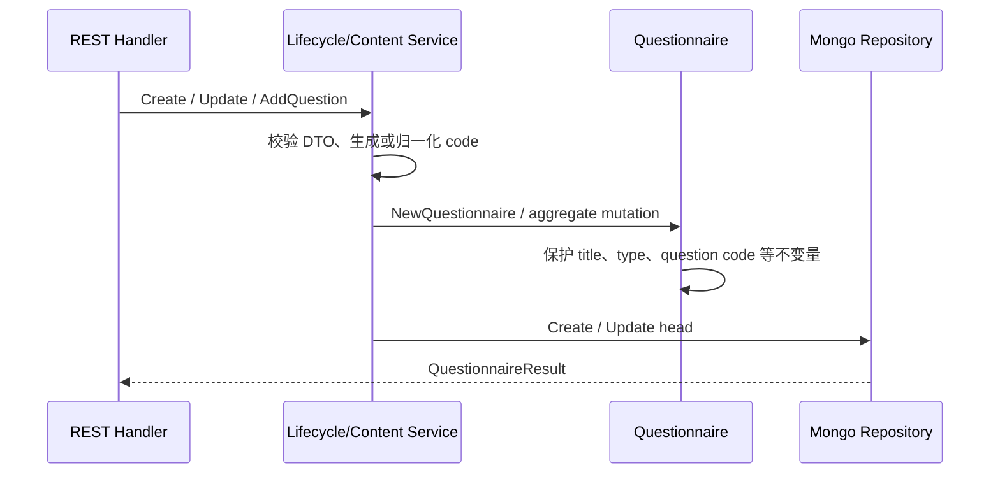
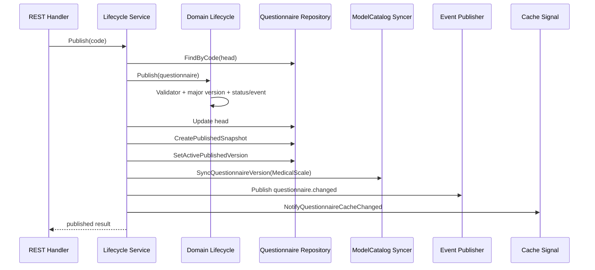

# 关键链路：问卷创建与发布

## 1. 本文回答

本文说明 Questionnaire 如何从管理端命令变成可编辑 head，再发布为可提交的历史快照；同时明确发布过程与 ModelCatalog binding、领域事件和缓存信令之间的执行顺序与失败边界。

## 2. 30 秒结论

```text
创建 / 编辑
  -> 持久化可变的 Questionnaire head

发布
  -> 校验 head
  -> 递增大版本并切换状态
  -> 保存 published snapshot
  -> 切换 active published version
  -> 同步 MedicalScale binding version
  -> 发布 questionnaire.changed
  -> 通知缓存失效
```

发布不是单个 Mongo 写操作。当前实现按顺序执行多个步骤，没有把 head、snapshot、active version 与跨模块 binding 同步放进同一事务。因此 API 失败时必须按阶段核对事实，不能仅根据返回值推断所有步骤都已回滚。

## 3. 入口与能力边界

问卷管理路由位于 `/api/v1/questionnaires`，由 `CapabilityManageQuestionnaires` 保护：

| 动作 | REST 入口 |
| --- | --- |
| 创建 | `POST /api/v1/questionnaires` |
| 更新基本信息 | `PUT /api/v1/questionnaires/:code/basic-info` |
| 保存草稿 | `POST /api/v1/questionnaires/:code/draft` |
| 编辑题目 | `POST / PUT / DELETE /api/v1/questionnaires/:code/questions...` |
| 发布、下架、归档 | `POST /api/v1/questionnaires/:code/{publish|unpublish|archive}` |

路径、请求体和响应体以 [`api/rest/apiserver.yaml`](../../../api/rest/apiserver.yaml) 为机器契约。Transport 负责鉴权、DTO 和错误映射，不直接修改聚合或 Repository。

## 4. 创建、编辑与保存草稿



### 4.1 创建 head

`lifecycleService.Create`：

1. 使用外部 code；未提供时由 `meta.GenerateCode` 生成。
2. 使用请求版本；未提供时默认为 `1.0`。
3. 归一化 QuestionnaireType。
4. 创建 `draft + head` 聚合。
5. 调用 Repository 写入 Mongo。

### 4.2 编辑内容

`QuestionnaireContentService` 负责题目的增、改、删、排序和批量替换。写操作统一先执行 `loadEditableHead`：

- archived 问卷不可编辑；
- 若当前 family 处于发布态，`ensureEditableHead` 准备可继续演进的工作 head；
- 题型构造由 domain Question factory 完成；
- 题目唯一性和题型自身规则由聚合保护。

### 4.3 保存草稿

`SaveDraft` 只接受 draft，调用 `Versioning.IncrementMinorVersion` 后更新 head。它不创建 published snapshot，也不发布 `questionnaire.changed`。

## 5. 发布链路



实际执行顺序：

1. 校验 code 并加载 head；拒绝 archived、已 published 或无题问卷。
2. `Lifecycle.Publish` 调用发布 Validator，递增大版本，切换状态并收集领域事件。
3. 更新 Questionnaire head。
4. upsert 当前 `code + version` 的 published snapshot。
5. 将该版本设置为 active published version。
6. 若 QuestionnaireType 为 `MedicalScale`，同步 ModelCatalog binding version。
7. best-effort 发布 `questionnaire.changed`。
8. 发送 best-effort 缓存失效信令。

发布成功后，未指定 version 的提交解析 active snapshot；指定 version 的提交解析对应历史 snapshot。两者都不能直接使用可变 head。

## 6. 下架、归档与删除

| 动作 | 当前语义 |
| --- | --- |
| Unpublish | `published -> draft`，清理 active version，发布 changed event |
| Archive | 任意非 archived 状态进入 archived，清理 active version，发布 changed event |
| Delete | 应用 workflow 根据 head/snapshot 情况删除草稿或 family，并决定是否恢复最近发布版本 |

历史 snapshot 的保留和读取以 Repository 实现为准，不能仅从 head 的 status 推测。

## 7. 一致性与失败边界

| 失败位置 | 已可能成立的事实 | 排查重点 |
| --- | --- | --- |
| 更新 head 之后、创建 snapshot 之前 | head 可能已是 published | head 的 role/status/version |
| 创建 snapshot 之后、切 active 之前 | 历史版本存在，但未成为默认版本 | snapshot 与 active flag |
| binding 同步失败 | Questionnaire 持久化步骤可能已完成 | Questionnaire 之后再查 ModelCatalog binding |
| changed event 发布失败 | 快照事实不因此回滚 | Mongo 事实与事件日志分别核对 |
| 缓存信令失败 | 数据库事实仍可能正确 | 先查 Repository，再处理缓存 |

`questionnaire.changed` 用于传播状态变化，缓存信令用于加速读侧收敛；二者都不是发布事实源。恢复或补偿必须以 Questionnaire head、published snapshot 和 active version 为依据。

## 8. 事实源与验证

| 环节 | 路径 |
| --- | --- |
| 路由与 Handler | [`routes_survey.go`](../../../internal/apiserver/transport/rest/routes_survey.go)、[`handler/questionnaire.go`](../../../internal/apiserver/transport/rest/handler/questionnaire.go) |
| 生命周期与内容应用服务 | [`application/survey/questionnaire`](../../../internal/apiserver/application/survey/questionnaire/) |
| 领域生命周期 | [`lifecycle.go`](../../../internal/apiserver/domain/survey/questionnaire/lifecycle.go)、[`versioning.go`](../../../internal/apiserver/domain/survey/questionnaire/versioning.go) |
| head / snapshot Repository | [`infra/mongo/questionnaire`](../../../internal/apiserver/infra/mongo/questionnaire/) |
| ModelCatalog 同步 adapter | [`catalog_binding_syncer.go`](../../../internal/apiserver/container/modules/survey/catalog_binding_syncer.go) |

```bash
go test ./internal/apiserver/domain/survey/questionnaire
go test ./internal/apiserver/application/survey/questionnaire
go test ./internal/apiserver/infra/mongo/questionnaire
go test ./internal/apiserver/container/modules/survey/...
```
