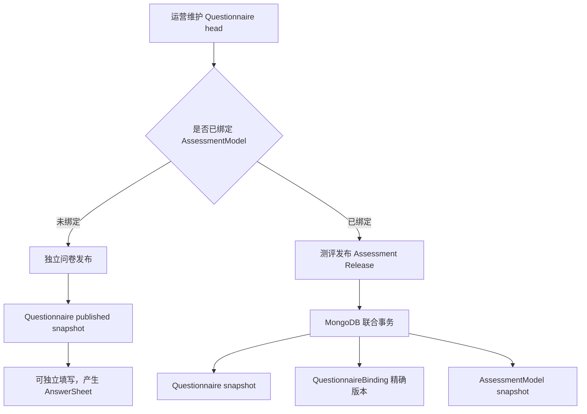
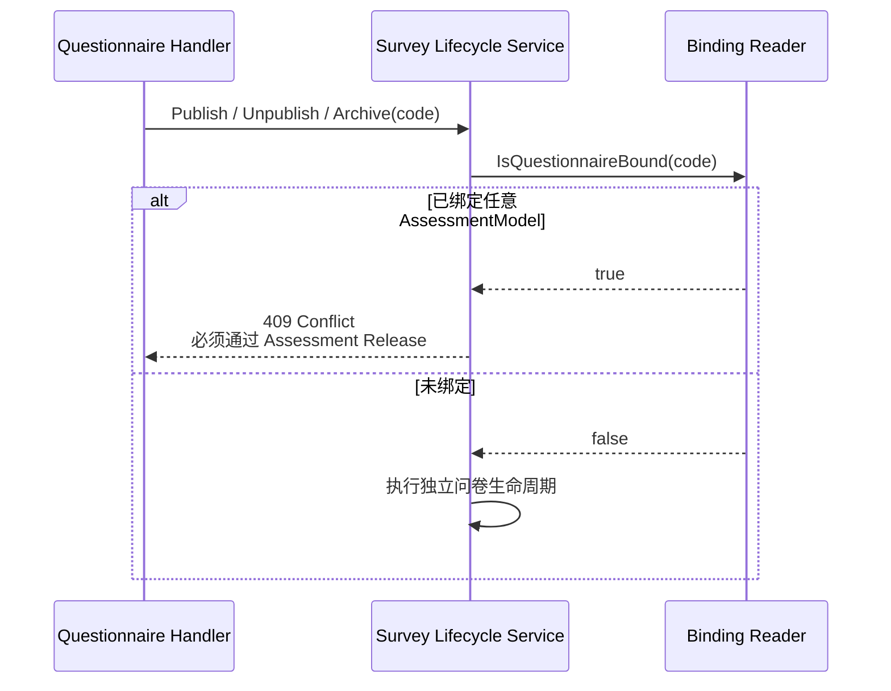
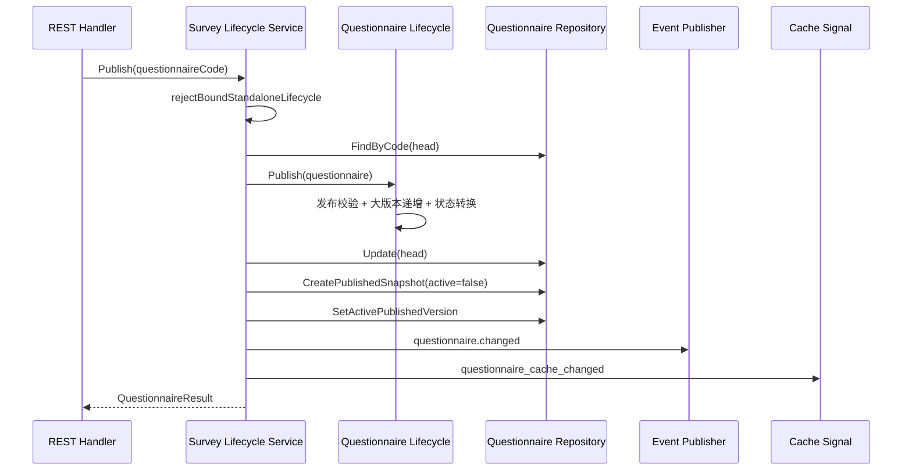
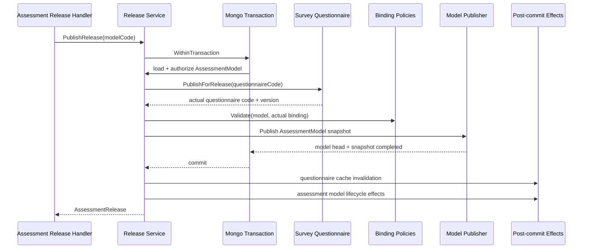

# 关键链路：问卷维护与发布

## 1. 本文回答

本文从运营维护问卷的视角，说明 Questionnaire 如何创建、编辑、派生工作草稿并形成不可变发布快照；同时重点回答一个架构问题：

> 问卷既可以独立作为信息收集器，也可以成为测评的一部分，系统怎样确定它应该独立发布，还是与 AssessmentModel 共同发布？

本文讲解的是问卷维护和发布链路，不展开 AnswerSheet 提交、Evaluation 执行和报告生成。

## 2. 30 秒结论

Questionnaire 是可以独立维护和发布的业务资产。发布边界不由 `QuestionnaireType` 决定，而由它是否已经绑定 AssessmentModel 决定：

- **未绑定测评模型**：Questionnaire 是完整的发布单元，可以独立发布为信息收集问卷。
- **已绑定测评模型**：Questionnaire 只是可执行测评的一部分，必须通过测评发布（Assessment Release）与 AssessmentModel 共同发布。



最重要的设计语言是：

> Survey 拥有问卷的创建、编辑、校验、版本演进和快照生成规则；当问卷已绑定测评模型时，发布一致性边界上移到 Assessment Release，由它保证问卷版本和测评模型版本共同生效或共同回滚。

Assessment Release 是跨 Survey 与 ModelCatalog 的**应用一致性边界**，不是新的微服务，也不需要把 Questionnaire 和 AssessmentModel 合并成一个领域聚合。

## 3. 核心概念速查

| 概念 | 当前语义 | 不应误解为 |
| --- | --- | --- |
| Questionnaire family | 由稳定 `code` 标识的一组工作版本和历史版本 | 某一条 Mongo 记录 |
| head | 运营当前维护的可变工作记录 | 线上一定正在使用的版本 |
| published snapshot | `code + version` 标识的不可变发布快照 | 可以随 head 继续就地修改的草稿 |
| active published version | 未指定版本时默认返回的当前发布快照 | 唯一需要保留的历史版本 |
| 独立问卷发布 | 未绑定模型的 Questionnaire 自己成为发布单元 | 兼容代码才允许的临时能力 |
| 测评发布 | Questionnaire 与 AssessmentModel 共同构成发布单元 | 两个独立发布接口的顺序调用 |

`status`、`record_role`、`release_status`、`is_active_published` 表达不同维度，不能用一个字段推断完整发布状态。具体版本化作答契约见 [核心设计：版本化与作答契约](./21-核心设计-版本化与作答契约.md)。

## 4. 为什么必须有两种发布方式

### 4.1 独立问卷是完整业务能力

问卷不一定要参与计分、因子计算、常模转换和报告生成。它可以只回答“要收集哪些信息、每个问题允许怎样回答”，并在用户提交后生成 AnswerSheet。

因此，如果所有问卷都被强制纳入 Assessment Release，会迫使纯信息收集问卷建立无意义的测评模型，破坏 Survey 的独立边界。

### 4.2 已绑定问卷不能单独决定生效时点

一旦 Questionnaire 与 AssessmentModel 绑定，一次可重放的测评必须同时知道：

- 当时问了哪些题；
- 使用了哪个精确问卷版本；
- 该版本应按哪份 Definition 计分和解释。

如果先独立发布问卷，再尝试同步 ModelCatalog binding，第二步失败时就会出现“新问卷已经对外可见，但测评模型仍指向旧版本”的部分成功。因此已绑定问卷的发布时点必须由 Assessment Release 统一管理。

### 4.3 类型不等于发布所有权

`QuestionnaireType` 只表示问卷的业务分类。当前发布守卫会查询问卷是否实际绑定 Scale、Typology、Cognitive 或 BehavioralRating 模型：

| 问卷情况 | 发布方式 |
| --- | --- |
| `MedicalScale` 但尚未绑定模型 | 可独立发布 |
| `Survey` 并且未绑定模型 | 可独立发布 |
| 任意类型且已绑定模型 | 必须通过 Assessment Release |

这使“问卷是什么”与“问卷如何发布”保持解耦。

## 5. 维护阶段：创建、编辑与保存草稿

### 5.1 REST 入口与权限边界

问卷维护路由位于 `/api/v1/questionnaires`，由 `CapabilityManageQuestionnaires` 保护：

| 用例 | REST 入口 |
| --- | --- |
| 创建问卷 | `POST /api/v1/questionnaires` |
| 更新基本信息 | `PUT /api/v1/questionnaires/:code/basic-info` |
| 显式保存草稿版本 | `POST /api/v1/questionnaires/:code/draft` |
| 题目增、改、删、排序和批量更新 | `/api/v1/questionnaires/:code/questions...` |
| 独立发布、下架和归档 | `POST /api/v1/questionnaires/:code/{publish\|unpublish\|archive}` |
| 删除工作草稿 | `DELETE /api/v1/questionnaires/:code` |
| 查询历史发布版本 | `GET /api/v1/questionnaires/:code/versions` |

REST 路径、请求体和响应体以 [`api/rest/apiserver.yaml`](../../../api/rest/apiserver.yaml) 为机器契约。Transport 负责身份、权限、DTO 与错误映射，不直接修改 Questionnaire 或 Repository。

### 5.2 创建工作 head

`lifecycleService.Create` 的当前运行时行为是：

1. 优先使用外部传入的 code，未传时由 `meta.GenerateCode` 生成。
2. 优先使用外部版本，未传时默认为 `1.0`。
3. 将空值或非法 QuestionnaireType 归一为 `Survey`。
4. 创建 `draft + head` Questionnaire。
5. 通过 Repository 写入 MongoDB。

> **当前不足：初始版本规则未统一。** Application 创建流程实际默认为 `1.0`，但领域 `Versioning.InitializeVersion` 的注释和实现仍以 `0.0.1` 为初始值。本文以当前运行时创建路径为准，不将两套规则拼成一个看似统一的答案。

### 5.3 编辑已发布问卷时派生新 head

基本信息和题目内容的写操作都会先加载可编辑 head。如果当前 head 还是 `published`，`ensureEditableHead` 会：

1. 确保当前发布内容已经存在于 published snapshot；
2. 调用 `ForkDraftFromPublished` 递增工作版本；
3. 将 head 切换为 `draft`；
4. 保持 active published snapshot 继续对外服务。

```text
published head v1
  + active snapshot v1

第一次编辑
  -> draft head v1.0.1
  + active snapshot v1 仍可填写
```

因此，“开始编辑新版本”不等于“下架旧版本”。head 表示工作状态，active snapshot 表示对外服务状态，两者必须分开理解。

### 5.4 内容保存与 `SaveDraft`

题目增删改、重排和批量更新会在对应用例中直接保存 head。`SaveDraft` 并不承担“把所有尚未保存的编辑一次性入库”的会话语义；它只允许 draft 执行，递增小版本后更新 head。

Questionnaire 不建模运营编辑会话，也不把工作 head 当作用户作答草稿。这里的 draft 是**问卷资产的编辑状态**，与 AnswerSheet 的最终提交语义无关。

## 6. 发布所有权判定

所有问卷都由 Survey 维护，但不是所有问卷都由 Survey 单独决定发布。



当前绑定查询遍历 ModelCatalog 中的 Scale、Typology、Cognitive 和 BehavioralRating 模型。这个守卫保护 `Publish`、`Unpublish` 和 `Archive`，但不阻止已绑定问卷继续编辑：运营可以准备新草稿，但新版本只能在测评发布时生效。

> **当前不足：删除尚未纳入绑定守卫。** `Delete` 当前只检查 Questionnaire head 是否为 draft 及是否存在历史快照，没有像发布、下架和归档一样先检查 AssessmentModel binding。在绑定删除策略未明确前，不应把“已绑定问卷必然无法删除”写成已实现保证。

## 7. 独立问卷发布

### 7.1 执行链路



实际步骤是：

1. 校验 code，并确认问卷未绑定任何 AssessmentModel。
2. 加载 Questionnaire head，拒绝 archived、已经 published 或没有题目的问卷。
3. `Lifecycle.Publish` 执行完整发布校验，递增大版本，切换聚合状态并收集领域事件。
4. 更新可变 head。
5. 以归档态插入当前 `code + version` 的不可变 published snapshot。
6. 将同 family 的旧 active snapshot 标记为 archived，再激活新快照。
7. best-effort 发布 `questionnaire.changed`。
8. 发送 ephemeral `questionnaire_cache_changed` 信令，加速 apiserver 和 collection-server 缓存收敛。

Repository 对同一 `code + version` 的重复快照做内容比较：内容完全相同时可幂等返回，同版本内容不同时拒绝。active version 切换是后续的独立 Repository 操作，不应与“快照内容幂等”混为一个保证。

### 7.2 一致性边界

**已实现：** 独立问卷发布会完成 head、published snapshot 和 active version 切换，事件与缓存信令不是发布事实源。

**当前局限：** 这三个 Mongo 写操作没有被独立发布用例包在一个外层事务中。例如：

| 失败位置 | 可能已经成立的事实 |
| --- | --- |
| 更新 head 后、创建快照前 | head 可能已是新的 published 版本，但新快照不存在 |
| 创建新快照后、激活前 | 新历史版本存在，但默认读仍不指向它 |
| 旧 active 被归档后、新版本激活前 | 短暂或故障后可能没有 active snapshot |
| 事件或缓存信令失败 | Mongo 发布事实仍可能已成立 |

所以独立发布排障不能只看 API 返回值或事件日志，必须分别检查 head、snapshot 和 active flag。

### 7.3 尚存在的兼容逻辑

独立 `Publish` 在发布快照后仍会调用 `SyncQuestionnaireVersion`，但该入口在此之前已经拒绝了实际存在 AssessmentModel binding 的问卷。因此这个同步调用属于顺序发布时期留下的兼容路径，不应被理解为当前正常架构中的跨模块发布方式。

## 8. 已绑定问卷的测评发布

### 8.1 公开入口与边界归属

已绑定问卷必须通过：

```http
POST /api/v1/assessment-releases/:modelCode/publish
```

该入口由 `CapabilityPublishAssessmentModels` 保护，以 `modelCode` 而不是 `questionnaireCode` 作为用例入口。原因是运营此时要发布的已经不是一份孤立问卷，而是一份可执行测评。

Assessment Release 依赖 Survey 的 `PublishForRelease`，但不复制 Questionnaire 领域规则：

- Survey 仍然校验问卷状态、内容和版本；
- Survey 仍然生成 head 变更和 published snapshot；
- ModelCatalog 不直接写 Questionnaire Repository；
- Assessment Release 只负责将两个模块的发布操作放入一个业务事务。

### 8.2 联合发布事务



事务内的关键步骤是：

1. 按 model code 加载 AssessmentModel，并校验 `publish_catalog` 权限。
2. 要求 AssessmentModel 已绑定 questionnaire code。
3. 调用 Survey `PublishForRelease`，得到服务端实际发布的 questionnaire code/version；如 Questionnaire head 已是 published，该步幂等复用当前版本，不重复生成快照。
4. 使用 Binding Policies 重新校验这个精确版本。
5. 如果发布版本与当前 binding 不同，更新 QuestionnaireBinding；Scale 模型同时刷新 draft projection。
6. 根据 Definition 构建并持久化 AssessmentModel published snapshot，切换模型 active version。
7. 提交 MongoDB transaction。
8. 提交成功后再执行问卷缓存删除和模型生命周期 effects。

客户端不能把某个 questionnaire version 作为测评发布结果直接塞给服务端。精确版本必须来自同一事务中 Survey 真正生成的发布快照，否则服务端无法保证 binding 与 Questionnaire 事实一致。

Assessment Release 是模型中心的发布入口。当 AssessmentModel head 已是 published 时，`PublishRelease` 会直接幂等返回当前 release，不会继续发布单独准备的 Questionnaire draft。要形成新的联合发布版本，AssessmentModel head 也必须先进入可编辑的 draft；当前模型基本信息、binding 或 Definition 编辑用例会从 published head 派生该 draft。

### 8.3 事务保证了什么

| 场景 | 当前保证 |
| --- | --- |
| 问卷发布失败 | AssessmentModel binding 和发布快照不提交 |
| binding 校验失败 | 问卷 head/snapshot/active 切换随事务回滚 |
| 模型 Definition 或发布校验失败 | 问卷与模型的本次变更共同回滚 |
| 事务提交失败 | 不执行提交后缓存和生命周期 effects |
| 模型已是 published | 按幂等命中返回当前 release，不重复执行 effects |

这个事务不意味着 Survey 与 ModelCatalog 已经合并。它只表示两个聚合的变更在这个用例中共享一个一致性要求。Mongo session transaction 是这项保证的实现手段，部署环境必须提供支持 transaction 的 Replica Set 或分片集群。

### 8.4 提交后副作用

事务内只写发布事实，缓存删除、事件和一次性信令在提交成功后执行，避免读侧观察到最终回滚的版本。

| 发布方式 | 当前提交后行为 |
| --- | --- |
| 独立问卷发布 | `questionnaire.changed` + `questionnaire_cache_changed` |
| 测评联合发布 | 在 cached repository 已装配时删除 Questionnaire 查询缓存 + `assessment_model.changed` + 模型类型对应的缓存信令 |

`questionnaire.changed` 和 `assessment_model.changed` 在 [`configs/events.yaml`](../../../configs/events.yaml) 中都是 `best_effort`；缓存失效信令在 [`configs/signals.yaml`](../../../configs/signals.yaml) 中是 `ephemeral_signal`。它们可以失败或丢失，但不得反转已经提交的 Mongo 发布事实。

> **当前实现差异：** Assessment Release 会调用 Questionnaire Repository 的提交后缓存删除，但当前不发送 `questionnaire_cache_changed`，也不单独发布 `questionnaire.changed`。本文只记录当前语义；跨进程问卷缓存应如何收敛，需在 `03-基础设施` 的缓存专题中继续评估。

## 9. 下架、归档与删除

### 9.1 独立问卷

| 动作 | 当前语义 |
| --- | --- |
| Unpublish | 将 published head 转为 draft，并清理 active published version；如果 head 已是编辑中的 draft 但仍有 active snapshot，也可直接清理对外版本 |
| Archive | 将 head 转为 archived，清理 active published version，保留历史发布快照 |
| Delete without snapshots | 只允许 draft，物理删除整个尚未发布的 family |
| Delete with snapshots | 删除当前 draft head，然后以最新历史快照恢复 head，不删除历史快照 |

“删除草稿”和“删除历史问卷”是两个不同操作。当已经存在发布历史时，当前 Delete 更接近“放弃未发布修改并恢复最新历史 head”。

### 9.2 已绑定问卷

已绑定问卷的下架和归档必须通过：

```text
POST /api/v1/assessment-releases/:modelCode/unpublish
POST /api/v1/assessment-releases/:modelCode/archive
```

Assessment Release 在同一 Mongo transaction 中清理 Questionnaire active snapshot、处理 AssessmentModel published snapshot，并更新两边 head 状态。下架和归档不删除旧 snapshot；已经完成的历史测评仍可以按当时的精确版本读取问卷和模型定义。

## 10. 为什么选择当前设计

| 方案 | 优点 | 主要代价 | 结论 |
| --- | --- | --- | --- |
| 问卷和模型分别发布，再顺序同步 binding | 接口和实现直接 | 第二步失败会产生部分发布 | 不适合已绑定测评 |
| 所有问卷都强制创建模型后发布 | 只有一个发布入口 | 纯信息收集问卷被无意义地耦合到 ModelCatalog | 不采用 |
| 把 Questionnaire 嵌入 AssessmentModel 聚合 | 单聚合内容易做事务 | 问卷无法独立复用，题型边界与模型规则混合 | 不采用 |
| 未绑定时独立发布，绑定后由 Assessment Release 联合发布 | 保留 Survey 独立性，又保护完整测评的一致性 | 需要明确发布所有权，并维护跨模块事务编排 | **当前方案** |

当前方案体现了一个比“要不要使用事务”更重要的判断：

> 事务边界应该跟随业务上必须共同成立的事实，而不是机械地跟随模块目录。跨模块事务不等于模块失去边界；关键在于由一个明确的应用服务负责编排，各模块仍保留自己的规则所有权。

## 11. 从顺序发布到联合发布的演进

项目早期的发布方式是：

```text
先发布 Questionnaire
  -> 再同步 ModelCatalog binding version
  -> 再发布模型快照和生命周期通知
```

这套设计已经识别出 Survey 与 ModelCatalog 是两个模块，但没有把“可执行测评必须共同发布”提升为一个明确事务边界。重构后的 Assessment Release 把这个隐含约束固化到代码中：

```text
Questionnaire snapshot
  + exact QuestionnaireBinding
  + AssessmentModel snapshot
  = 一个测评发布单元
```

这段历史不是当前运行流程的备用说明，而是为了解释架构决策的来源。当前代码中的独立 binding 同步器和部分“legacy”注释是该历史的痕迹，不应反向定义现在的业务边界。

## 12. 排障与事实判定

### 12.1 独立问卷发布失败

1. 检查 Questionnaire head 的 code、version、status 和题目内容。
2. 检查是否存在同 `code + version` 的 published snapshot。
3. 检查哪个 snapshot 处于 active release status。
4. 检查该问卷是否已绑定 AssessmentModel；如已绑定，应改用 Assessment Release。
5. 只在 Mongo 事实正确后继续排查 `questionnaire.changed` 和缓存信令。

### 12.2 测评联合发布失败

1. 根据 `model_code`、`questionnaire_code`、`questionnaire_version` 和 `transaction_result` 查看发布日志。
2. 检查 AssessmentModel 是否已建立 QuestionnaireBinding。
3. 检查 Questionnaire 和 AssessmentModel 的发布校验是否通过。
4. 事务返回失败时，验证两边本次变更都没有成为新 active release。
5. 事务已提交但事件或缓存行为异常时，不要回滚或重写已成立的发布事实。

API 返回、事件日志或缓存命中都不能单独证明发布事实完整。独立发布以 Questionnaire head/snapshot/active 为准；联合发布还必须同时核对 AssessmentModel binding 和 active snapshot。

## 13. 事实源与验证

| 环节 | 事实源 |
| --- | --- |
| 问卷 REST 入口 | [`routes_survey.go`](../../../internal/apiserver/transport/rest/routes_survey.go)、[`handler/questionnaire.go`](../../../internal/apiserver/transport/rest/handler/questionnaire.go) |
| 测评发布 REST 入口 | [`routes_assessment_model.go`](../../../internal/apiserver/transport/rest/routes_assessment_model.go)、[`handler/assessment_release.go`](../../../internal/apiserver/transport/rest/handler/assessment_release.go) |
| 问卷维护应用服务 | [`application/survey/questionnaire`](../../../internal/apiserver/application/survey/questionnaire/) |
| 问卷生命周期与版本 | [`lifecycle.go`](../../../internal/apiserver/domain/survey/questionnaire/lifecycle.go)、[`versioning.go`](../../../internal/apiserver/domain/survey/questionnaire/versioning.go) |
| 问卷 head/snapshot Repository | [`infra/mongo/questionnaire`](../../../internal/apiserver/infra/mongo/questionnaire/) |
| Assessment Release 事务编排 | [`application/modelcatalog/release`](../../../internal/apiserver/application/modelcatalog/release/) |
| Mongo transaction runner | [`container/internal/transaction/runner.go`](../../../internal/apiserver/container/internal/transaction/runner.go) |
| 事件与信令契约 | [`configs/events.yaml`](../../../configs/events.yaml)、[`configs/signals.yaml`](../../../configs/signals.yaml) |

```bash
go test ./internal/apiserver/domain/survey/questionnaire
go test ./internal/apiserver/application/survey/questionnaire
go test ./internal/apiserver/application/modelcatalog/release
go test ./internal/apiserver/infra/mongo/questionnaire
go test ./internal/apiserver/transport/rest
make docs-hygiene
make docs-facts
```
