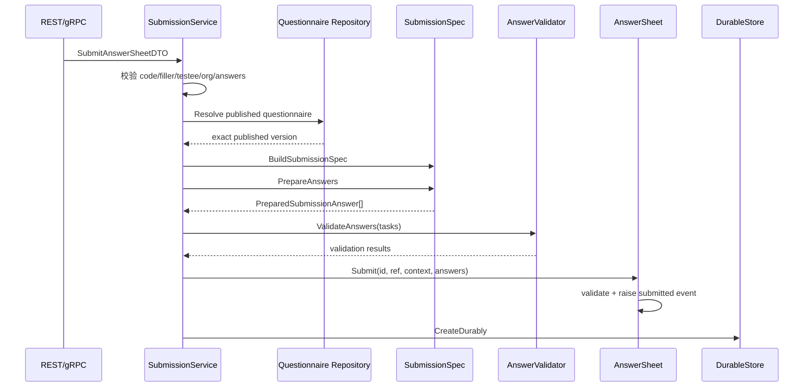

# 关键路径：答卷提交与校验

## 1. 本文回答

本文说明外部提交如何选择准确的问卷发布版本，经过提交规格和规则引擎校验，最终构造包含完整业务上下文的 AnswerSheet。

可靠落库和 Outbox 见 [32-关键路径-答卷可靠落库与出站.md](./32-关键路径-答卷可靠落库与出站.md)。

## 2. 提交入口

| 调用方 | 入口 | 说明 |
| --- | --- | --- |
| collection / C 端 | `AnswerSheetService.SaveAnswerSheet` gRPC | 主提交契约，接收 writer/testee/org/task/idempotency key |
| apiserver 管理端 | `POST /api/v1/answersheets/admin-submit` | 组织管理员提交，受能力与限流保护 |

gRPC 值解码在 transport 完成，业务校验统一进入 `AnswerSheetSubmissionService.Submit`。

## 3. 端到端流程



## 4. 第一道校验：请求完整性

应用服务拒绝：

- 空 questionnaire code；
- 空 filler ID、testee ID 或 org ID；
- 空答案列表；
- 缺少 question code 或客户端 question type 的答案项。

这些是用例输入校验，还没有证明答案属于某个发布问卷。

## 5. 第二道校验：选择发布版本

`resolveSubmittableQuestionnaire` 的规则：

```text
未指定 version
  -> FindPublishedByCode
  -> 使用 active published version

指定 version
  -> FindByCodeVersion
  -> 必须是 published snapshot
```

随后调用 `EnsureSubmittable`，要求 status=published、code/version 非空。客户端不能提交 draft、archived 或不存在的历史版本。

## 6. 第三道校验：SubmissionSpec

`BuildSubmissionSpec` 从服务端发布问卷派生只读规格；`PrepareAnswers` 负责：

1. question code 必须属于该问卷版本。
2. 客户端 question type 必须与服务端一致。
3. Radio/Checkbox 选项必须出现在题目允许集合中。
4. 根据 ShowController 和当前答案判断题目是否可见。
5. 可见且 required 的题必须存在且非空。
6. Section 不参与作答要求。

这一步阻止客户端用伪造题型、未知题目或隐藏题缺失污染 AnswerSheet。

## 7. 第四道校验：规则引擎

应用层把 PreparedSubmissionAnswer 转换为：

- 结构化 `AnswerValue`；
- `AnswerValidationTask`，携带服务端 ValidationRule。

`ruleengine.AnswerValidator` 批量执行 required、长度和数值等规则。任一题失败时，应用服务收集 question code 和错误详情并拒绝整次提交。

## 8. 构造 AnswerSheet

校验通过后：

1. 为每个答案创建 `Answer`，初始 score 为 0。
2. 构造 `QuestionnaireRef(code, version, title)`。
3. 将 filler、testee、org 和 task 组成 `SubmissionContext`。
4. 预分配 AnswerSheet ID。
5. 调用 `answersheet.Submit`，再次校验答案非空、单题唯一和上下文完整性。
6. 聚合产生 `AnswerSheetSubmittedEvent`。

领域构造成功不等于数据库已提交；应用服务只有在 DurableStore 成功后才返回提交成功。

## 9. 失败语义

| 失败位置 | 对外语义 | 是否产生主事实 |
| --- | --- | --- |
| DTO / version / SubmissionSpec | invalid answer sheet | 否 |
| ruleengine validation | invalid answer | 否 |
| Answer / SubmissionContext 构造 | invalid answer sheet | 否 |
| DurableStore | database error | 取决于事务结果和幂等恢复，见可靠落库文档 |

Survey 不在提交请求中等待 Assessment、Evaluation 或 Report。

## 10. 代码事实源与 Verify

| 环节 | 路径 |
| --- | --- |
| gRPC | [`transport/grpc/service/answersheet.go`](../../../internal/apiserver/transport/grpc/service/answersheet.go) |
| REST | [`transport/rest/handler/answersheet.go`](../../../internal/apiserver/transport/rest/handler/answersheet.go) |
| 提交用例 | [`application/survey/answersheet/submission_service.go`](../../../internal/apiserver/application/survey/answersheet/submission_service.go) |
| 提交规格 | [`domain/survey/questionnaire/submission_spec.go`](../../../internal/apiserver/domain/survey/questionnaire/submission_spec.go) |
| 可见性与 required | [`submission_validation.go`](../../../internal/apiserver/domain/survey/questionnaire/submission_validation.go) |
| 聚合提交 | [`domain/survey/answersheet/answersheet.go`](../../../internal/apiserver/domain/survey/answersheet/answersheet.go) |

```bash
go test ./internal/apiserver/domain/survey/...
go test ./internal/apiserver/application/survey/answersheet
go test ./internal/apiserver/transport/grpc/service -run AnswerSheet
```
