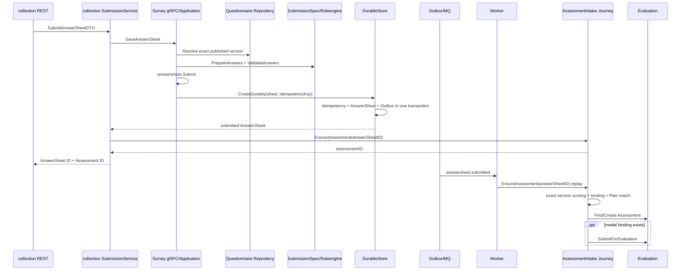

# 关键链路：答卷提交、校验与测评驱动

## 1. 本文回答

本文从 REST/gRPC 提交入口开始，说明服务端如何选择精确问卷版本、校验原始答案、可靠提交 AnswerSheet 与 Outbox，并通过 collection 同步调用和 worker 事件重放共同确保 Assessment intake。重点是每一阶段的成功含义、幂等依据和失败恢复边界。

## 2. 30 秒结论

```text
提交请求
  -> 解析 published questionnaire version
  -> SubmissionSpec + ruleengine 校验
  -> 构造 AnswerSheet
  -> AnswerSheet + idempotency + Outbox 同事务提交
  -> collection 同步 EnsureAssessment
  -> answersheet.submitted worker 幂等重放
  -> 同一 assessment intake journey
  -> 精确版本计分 + binding + Plan + Assessment
```

Survey 主写事实的成功点是 `AnswerSheet + answersheet.submitted Outbox` 已可靠提交。当前 collection 对外成功响应还要求同步 `EnsureAssessment` 返回 Assessment ID，但仍不表示 Evaluation 或报告已完成。Survey 只拥有 AnswerSheet 和基础题分；跨 ModelCatalog、Plan、Evaluation 的编排属于 `application/journey/assessmentintake`。

## 3. 全链路



## 4. 阶段一：入口与请求完整性

| 调用方 | 入口 | 主要责任 |
| --- | --- | --- |
| collection / C 端 | gRPC `AnswerSheetService.SaveAnswerSheet` | 解码 AnswerValue，提交 writer/testee/org/task/idempotency key |
| apiserver 管理端 | `POST /api/v1/answersheets/admin-submit` | 能力校验、限流与 DTO 转换 |

Transport 解码后统一进入 `AnswerSheetSubmissionService.Submit`。应用服务先拒绝空 questionnaire code、filler/testee/org、答案列表、question code 或客户端 question type。此时只证明请求结构完整，不证明题目属于某个可提交问卷。

## 5. 阶段二：版本契约与答案校验

### 5.1 解析发布版本

```text
未指定 version
  -> FindPublishedByCode
  -> active published snapshot

指定 version
  -> FindByCodeVersion
  -> 必须是该 code + version 的 published snapshot
```

`EnsureSubmittable` 要求 status=published 且 code/version 完整。随后从该快照构造 `SubmissionSpec`，禁止用 draft、archived 或可变 head 接受提交。

### 5.2 准备与校验答案

`SubmissionSpec.PrepareAnswers` 负责：

1. question code 必须属于该问卷版本。
2. 客户端 question type 必须与服务端题型完全一致。
3. Radio/Checkbox 值必须来自当前题目的 option code 集。
4. 根据全部原始答案计算 ShowController。
5. 可见、可作答且 required 的题必须存在且非空。

Prepared answer 随后转换为结构化 `AnswerValue` 和 `AnswerValidationTask`，由 `ruleengine.AnswerValidator` 执行 required、长度、数值范围和选择数量等规则。任一题失败都会拒绝整次提交。

### 5.3 建立 AnswerSheet

校验通过后，应用服务构造 Answer、精确 `QuestionnaireRef(code, version, title)` 和完整 `SubmissionContext`，再调用 `answersheet.Submit`。聚合再次保护 ID、版本、上下文、非空答案和 question code 唯一性，并产生 `AnswerSheetSubmittedEvent`。

领域构造成功不等于提交成功；只有 DurableStore 成功后才能向调用方返回。

## 6. 阶段三：可靠落库与 Outbox

### 6.1 事务成功点

`transactionalSubmissionDurableStore` 在同一个 Mongo transaction 中提交：

1. idempotency document（请求提供 key 时）；
2. AnswerSheet document；
3. `answersheet.submitted` domain Outbox record。

任一步失败则事务回滚。commit 成功后才清空聚合事件，并调用 post-commit dispatcher 唤醒 immediate relay。post-commit 失败不会撤销主事实，常规 Outbox 扫描仍可恢复发送。

### 6.2 幂等与并发

- 事务前按 idempotency key 查询 completed submission，命中后返回既有 AnswerSheet。
- 幂等集合的唯一约束处理并发竞争。
- 竞争失败后，DurableStore 会在约 2 秒窗口内轮询获胜请求的 completed result。
- Redis 不参与提交事务，也不是 AnswerSheet 幂等的事实源。

`answersheet.submitted` 使用 durable Outbox；MQ 发布失败由 relay 重试。collection 当前同步等待 Assessment intake，但不等待 Evaluation Outcome 或 Report；事件路径作为幂等重放与失败恢复。

## 7. 阶段四：同步调用、worker 重放与 Assessment intake

### 7.1 collection 同步 intake

collection `SubmissionService.submitSync` 在 AnswerSheet 落库后调用 `AssessmentIntakeService.EnsureAssessment`。提交成功回执必须同时携带 AnswerSheet ID 和 Assessment ID；intake 失败时，AnswerSheet 与 Outbox 已经存在，本次 collection 请求返回失败，后续仍可由事件路径补齐 Assessment。

### 7.2 Worker 重复抑制

`answersheet_submitted_handler` 解析事件后，以 AnswerSheet ID 获取 Redis lease，再调用内部 gRPC `EnsureAssessment`。Redis 不可用或 acquire 失败时采用 degraded-open：继续执行，由下游 AnswerSheet ID 幂等保证正确性。handler 返回错误时消息 NACK，等待重投。

### 7.3 精确版本基础计分

`assessmentintake.Service.Ensure` 首先调用 Survey scoring：

1. 加载 AnswerSheet。
2. 按冻结的 questionnaire code/version 加载精确快照。
3. 将 Answer 与题目 option score / calculation rule 转为计分任务。
4. 调用 `ruleengine.AnswerScorer`。
5. 通过 `AnswerSheet.UpdateScores` 更新单题分和总分。

计分失败是硬失败：journey 不继续创建 Assessment。同步入口向 collection 返错，Worker 入口通过 NACK 等待重试。读取 active version 代替历史版本会破坏重放一致性，因此禁止。

### 7.4 Binding、Plan 与 Assessment

journey 随后：

1. 按 questionnaire code/version 解析 ModelCatalog Assessment binding。
2. 有 task ID 时精确匹配 Plan task；否则可按 model code 尝试匹配 opened task。
3. 先按 AnswerSheet ID 查找 Assessment；不存在时创建，duplicate 时重新查询。
4. 只有存在 model binding 时才自动 `SubmitForEvaluation`。
5. Plan task 完成采用 best-effort，不回滚已经创建的 Assessment。

未找到 binding 时仍可建立未绑定 Assessment，但不会自动提交执行。自动提交失败当前不会让 `Ensure` 整体失败，结果中的 `AutoSubmitted` 保持 false；后续执行恢复属于 Evaluation。

## 8. 成功、失败与恢复边界

| 阶段 | 成功含义 | 失败或重复时的保护 |
| --- | --- | --- |
| 请求校验 | 输入符合精确发布版本契约 | 无主事实，修正请求后重试 |
| Survey commit | AnswerSheet、可选幂等记录和 Outbox 已提交 | Mongo transaction + idempotency unique key |
| collection intake | Assessment ID 已同步返回 | 失败不回滚 Survey 事实，由 answersheet 事件重放补齐 |
| MQ 交付 | worker 收到 `answersheet.submitted` | Outbox relay 重试，handler error → NACK |
| Assessment intake | Assessment 已存在或已创建；可能已自动提交 | Redis lease 只降噪，AnswerSheet ID 是最终幂等键 |
| Evaluation requested | Evaluation 已接收执行请求 | 不代表 Outcome 已完成 |
| Outcome / Report | 下游结果或报告各自完成 | 分属 Evaluation / Interpretation |

关键故障语义：

- AnswerSheet 写失败或 Outbox stage 失败：整个 Survey transaction 回滚。
- post-commit 或 MQ 发布失败：AnswerSheet 已提交，依赖 Outbox 恢复。
- Survey 计分失败：不创建新 Assessment；同步调用返错，消息重投后按精确版本重试。
- Plan 完成失败：不回滚 Assessment。
- worker 重复消费：`EnsureAssessment` 按 AnswerSheet ID 查找或复用既有 Assessment。

## 9. 模块边界

| Survey 到此为止 | 后续所有者 |
| --- | --- |
| 发布版本解析、答案校验、AnswerSheet 与基础题分 | Survey |
| AssessmentModel Definition 与 questionnaire binding | ModelCatalog |
| 作答到模型、Plan、Assessment 的跨模块编排 | `application/journey/assessmentintake` |
| Assessment 状态机与 Outcome | Evaluation |
| InterpretReport | Interpretation |

`answersheet.submitted` 还可被 ModelCatalog hot-rank 投影独立消费；该读侧消费者不参与 AnswerSheet 或 Assessment 的提交事务。

## 10. 事实源与验证

| 环节 | 路径 |
| --- | --- |
| gRPC / REST 入口 | [`grpc/service/answersheet.go`](../../../internal/apiserver/transport/grpc/service/answersheet.go)、[`rest/handler/answersheet.go`](../../../internal/apiserver/transport/rest/handler/answersheet.go) |
| 提交用例 | [`submission_service.go`](../../../internal/apiserver/application/survey/answersheet/submission_service.go) |
| SubmissionSpec | [`submission_spec.go`](../../../internal/apiserver/domain/survey/questionnaire/submission_spec.go)、[`submission_validation.go`](../../../internal/apiserver/domain/survey/questionnaire/submission_validation.go) |
| AnswerSheet 聚合 | [`domain/survey/answersheet`](../../../internal/apiserver/domain/survey/answersheet/) |
| 事务与 Outbox | [`transactional_durable_store.go`](../../../internal/apiserver/application/survey/answersheet/transactional_durable_store.go)、[`durable_submit.go`](../../../internal/apiserver/infra/mongo/answersheet/durable_submit.go) |
| collection 同步 intake | [`collection-server/application/answersheet/submission_service.go`](../../../internal/collection-server/application/answersheet/submission_service.go) |
| Worker handler | [`worker/handlers/answersheet_handler.go`](../../../internal/worker/handlers/answersheet_handler.go) |
| 跨模块 journey | [`application/journey/assessmentintake/service.go`](../../../internal/apiserver/application/journey/assessmentintake/service.go) |
| 跨模块表征测试 | [`pipeline_cross_module_answersheet_v1_test.go`](../../../internal/apiserver/characterization/pipeline_cross_module_answersheet_v1_test.go) |

```bash
go test ./internal/apiserver/domain/survey/...
go test ./internal/apiserver/application/survey/answersheet
go test ./internal/apiserver/infra/mongo/answersheet/...
go test ./internal/worker/handlers -run AnswerSheetSubmitted
go test ./internal/apiserver/application/journey/assessmentintake
go test ./internal/apiserver/characterization -run CrossModuleAnswerSheet
```
