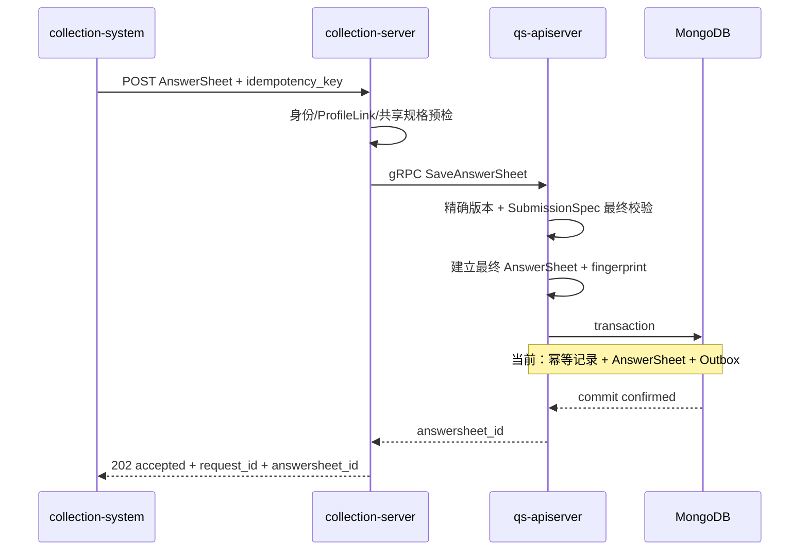

# 关键链路：答卷校验与可靠受理

## 1. 本文回答

本文说明一次正式答卷提交如何从 collection-server 或管理端进入 Survey，如何按精确问卷版本校验题型、答案值、选项、显示条件和 validation rules，以及如何将 AnswerSheet、幂等约束与 `answersheet.submitted` Outbox 原子提交。

本文终点是“答卷已可靠受理”。Worker、基础题分、AssessmentModel binding、Assessment 与 Evaluation 属于下一篇《从作答事实到测评执行》，不属于 `202 Accepted` 的成功条件。

## 2. 30 秒结论



这条链路有四个不能混淆的结论：

1. **客户端提交是最终提交。** Survey 不提供 AnswerSheet 服务端草稿、部分保存或提交后编辑。
2. **collection-server 预检不是最终裁决。** apiserver 作为 Survey 事实拥有者，必须重新读取发布版并执行最终校验。
3. **答卷提交成功是“已保存”，不是“已收到请求”。** 只在 MongoDB commit 已确认时返回 `202`。
4. **可靠受理不等于测评完成。** `202` 不携带 Assessment ID，也不证明计分、Evaluation 或报告已完成。

## 3. 为什么要把链路停在“可靠受理”

提交答卷和执行测评不是一个工作单元：

| 阶段 | 核心责任 | 失败时能否否定 AnswerSheet |
| --- | --- | --- |
| 提交校验 | 判断请求是否符合某个发布问卷版本 | 可以，此时还没有作答事实 |
| 可靠受理 | 保存 AnswerSheet 并保证后续事件可恢复投递 | 是最后可以否定提交的边界 |
| 基础题分 | 按精确问卷版本派生单题分与总分 | 不能 |
| 测评执行 | 解析模型、创建 Assessment、运行 Evaluation | 不能 |
| 报告生成 | 从 Outcome 产生解读报告 | 不能 |

如果把计分、Assessment 和报告纳入 HTTP 提交事务，会使用户请求承担跨 Survey、ModelCatalog、Evaluation 和 Interpretation 的全链路耗时与失败率。当前设计只要求 HTTP 等待不可再放弃的作答事实提交，将后续过程交给可恢复异步链路。

## 4. 两类提交入口

### 4.1 C 端：collection-server BFF

collection-system 调用 collection-server 答卷提交 REST 入口。collection-server 负责：

1. 取得或生成 request ID。
2. 要求 8–128 个安全字符的 idempotency key。
3. 校验填写人身份。
4. 通过 ProfileLink 解析受试者与 org。
5. 读取请求指定的精确发布问卷版本，执行共享规格预检。
6. 在有限接受超时内同步调用 apiserver gRPC。
7. 只在 gRPC 返回已持久化 AnswerSheet ID 时响应 `202`。

`acceptTimeout` 缺省为 2 秒。它是请求最长等待边界，不是目标延迟；项目对提交接口的容量目标仍是 p95 < 500ms。

collection-server 的 Redis submit guard 仅用于抑制同 writer + key 的同时请求。未抢到 lease 时，代码仍会调用 apiserver，由 MongoDB 唯一约束给出最终幂等结果。Redis 不是提交事实源。

### 4.2 B 端：apiserver 管理提交

`POST /api/v1/answersheets/admin-submit` 直接进入 apiserver，用于管理或内部场景：

- 需要受保护组织上下文；
- 可以显式传 filler ID/writer ID，否则使用当前登录用户；
- 不经过 C 端 ProfileLink 校验；
- idempotency key 当前可选，但提供时仍必须符合 8–128 字符格式；
- 它返回通用成功响应，而不是 HTTP 202，但底层仍要等待同一可靠持久化边界。

两类入口最终都进入 `AnswerSheetSubmissionService.Submit`。

## 5. 第一阶段：请求结构与身份完整性

### 5.1 Transport 解码

collection-server 传输的 Answer value 是字符串编码，apiserver gRPC 使用 `surveyvalidation.DecodeAnswerValue` 按 question type 转换：

| 题型 | 解码后形状 |
| --- | --- |
| Radio | 归一化的单 option code |
| Checkbox | `[]string` |
| Number | `float64` |
| Text / Textarea | string |

解码只证明值可以被表示，不证明 option 属于当前问卷，也不证明数值满足题目规则。

### 5.2 应用层基本校验

`Submit` 先拒绝：

- 空 questionnaire code；
- 空 filler、testee 或 org；
- 空答案列表；
- 空 question code；
- 空客户端 question type。

这些检查只确定请求结构完整。客户端携带的 question type 仍然是不可信输入，必须在后续与服务端问卷版本比较。

## 6. 第二阶段：解析精确发布版本

### 6.1 版本解析规则

```text
未指定 questionnaire version
  -> FindPublishedByCode
  -> 使用当前 active published version

已指定 questionnaire version
  -> FindByCodeVersion
  -> 使用精确 published version
```

C 端 collection-server 请求当前必须携带 version，因此其预检与最终提交使用同一个精确版本。管理入口可以不指定 version，由 apiserver 解析当前发布版并回写 DTO。

`EnsureSubmittable` 要求 Questionnaire 为 published 且 code/version 完整。精确版本查询当前允许读取仍保留的历史 published snapshot，不要求它必须是当前 active release。这保证了已领取精确版本的作答会话不会因新版发布而语义漂移。

对历史未迁移数据，Repository 仍可回退到同版本 published head。这是兼容逻辑，不是新数据发布模型。

### 6.2 为什么必须在 apiserver 再次校验

collection-server 预检的价值是尽早拒绝明显无效提交，减少 IAM/ProfileLink 下游与写链路压力。但 collection-server：

- 不拥有 Questionnaire 持久化事实；
- 可能使用缓存投影；
- 不拥有 AnswerSheet 聚合和 MongoDB transaction；
- 不能决定一份作答是否最终可持久化。

因此 apiserver 必须基于自己读取的 Questionnaire 再次执行最终校验。两端将题目投影为同一 `surveyvalidation.Spec`，用一份确定性规则实现预检和最终裁决，避免两套校验逻辑演化出不同契约。

## 7. 第三阶段：`SubmissionSpec` 校验与答案归一化

### 7.1 服务端契约投影

Questionnaire 通过 `BuildSubmissionSpec` 投影出提交所需的最小规格：

- questionnaire code/version/title；
- question code/type；
- option code 集合；
- validation rules；
- ShowController。

SubmissionSpec 不包含 AssessmentModel、因子、常模或报告规则。一份未绑定测评模型的独立问卷，仍然可以构建完整提交契约并保存 AnswerSheet。

### 7.2 当前已实现的校验

`surveyvalidation.Spec.Validate` 会执行：

1. question code 必须存在于当前问卷版本。
2. 客户端 question type 必须与服务端题型完全一致。
3. Radio 必须是单个合法 option code。
4. Checkbox 的每个 option code 都必须属于当前题目。
5. 根据全部原始答案计算 ShowController 可见性。
6. 当前可见且带 required rule 的可作答题必须存在且非空。
7. 执行 `min_length`、`max_length`、`min_value`、`max_value`、`min_selections`、`max_selections` 和 `pattern`。
8. 已发布问卷如果携带两端不支持的校验规则，将被视为发布配置不可执行，而不是用户答案错误。

可选题可以不出现在最终提交中。但只要客户端提交了某道题，它的题型、选项和规则就必须全部合法；服务端不做“忽略错误题、保存其它题”的部分接受。

### 7.3 当前未完成的严格契约

> **规划改造：严格拒绝不可见题答案。** 已确认的目标行为是：服务端按本次最终提交重新计算 ShowController；只要提交中包含当前不可见题目的答案，就视为客户端状态过期、实现错误或请求被篡改，拒绝整份提交。当前共享校验器只在 required 缺失检查中使用可见性，未拒绝已提交的隐藏题答案。

> **规划改造：严格拒绝 Section 答案。** Section 是问卷结构和说明，不是可作答题。当前共享校验器会在 required 检查时跳过 Section，但没有直接拒绝客户端为 Section 提交值。

### 7.4 从 raw value 到 AnswerValue

共享规格接受后，apiserver 将 prepared answer 转换为 Survey 值对象：

| 题型 | AnswerValue |
| --- | --- |
| Radio | `OptionValue` |
| Checkbox | `OptionsValue` |
| Text / Textarea | `StringValue` |
| Number | `NumberValue` |

每个 Answer 的初始 score 为 `0`。客户端携带的 score 不是信任输入，不会成为 Survey 基础题分；题分由后续基于精确问卷版本重新计算。

## 8. 第四阶段：建立最终 AnswerSheet

### 8.1 冻结问卷引用

`QuestionnaireRef` 保存：

- questionnaire code；
- 已解析的精确 version；
- 提交时问卷 title。

它不保存“最新版”这种动态引用。后续计分或重放只能使用该 code/version 对应的 published snapshot。

### 8.2 冻结作答上下文

`SubmissionContext` 冻结：

- `FillerRef`：实际填写人；
- `TesteeRef`：受试者；
- OrgID；
- 可选 TaskID。

Survey 当前只保存“填写人是谁”和“受试者是谁”，不进一步区分家长代填与家长观察量表。TaskID 是来源关联，不把 Plan 生命周期收入 Survey。

### 8.3 领域聚合再次保护不变式

`answersheet.Submit` 要求：

- AnswerSheet ID 已分配；
- QuestionnaireRef code/version 完整；
- filler、testee 和 org 完整；
- 至少一条 Answer；
- Answer question code/value 合法；
- 同一 question code 不得重复。

Submit 成功后聚合产生 `AnswerSheetSubmittedEvent`。但此时事件仍只在内存中，不能返回 `202`。

## 9. 第五阶段：幂等语义与并发裁决

### 9.1 request ID 与 idempotency key

| 字段 | 语义 | 能否去重 |
| --- | --- | --- |
| request ID | 追踪一次网络请求，贯穿日志和事件 | 不能 |
| idempotency key | 识别一次跨超时、重试和并发的业务提交意图 | 能 |

同一次用户提交的网络重试应使用同一 idempotency key，但每次 HTTP 请求可以有不同 request ID。不能用 request ID 替代业务幂等键。

### 9.2 fingerprint

apiserver 在 AnswerSheet 建立后对业务内容计算 SHA-256 fingerprint。fingerprint 包含：

- writer/testee/org/task；
- questionnaire code/version；
- question code/type/value；
- 按稳定顺序排序后的全部答案。

它不包含生成的 AnswerSheet ID、时间戳和延迟计算分数。因此同一业务内容的重试会得到同一 fingerprint，而复用同一 key 提交不同答案会被检测为 conflict。

### 9.3 并发结果

| 情况 | 最终结果 |
| --- | --- |
| 首次 writer + key | 创建 AnswerSheet |
| 同 writer + key + 同 fingerprint | 返回首次成功的 AnswerSheet ID |
| 同 writer + key + 不同 fingerprint | 返回 conflict，不覆盖原 AnswerSheet |
| 不同 writer + 同 key | 属于不同幂等命名空间，可分别提交 |

当前最终裁决来自 `answersheet_submit_idempotency` 的 `(writer_id, idempotency_key)` 唯一索引。Redis guard 、事务前查询和客户端禁止重复点击都只能降低竞争，不是最终一致性来源。

## 10. 第六阶段：AnswerSheet 与 Outbox 原子提交

### 10.1 当前事务内容

`transactionalSubmissionDurableStore.CreateDurably` 依次：

1. 事务前按 writer + key 查询已完成提交，命中后校验 fingerprint 并返回旧 AnswerSheet。
2. 开启 MongoDB transaction。
3. 插入独立幂等记录（提供 key 时）。
4. 插入 AnswerSheet document。
5. 将聚合事件 stage 到 `domain_event_outbox`，并携带 request ID。
6. 提交 MongoDB transaction。
7. commit 成功后才清空聚合内存事件。
8. 调用 post-commit dispatcher 尝试立即唤醒 relay。

幂等记录、AnswerSheet 或 Outbox stage 任一步失败，事务都回滚。post-commit dispatcher 失败不能回滚已经 commit 的 AnswerSheet；常规 Outbox relay 扫描仍可恢复投递。

### 10.2 commit 结果未知

网络超时或 context 取消可能发生在 MongoDB 已提交、但应用未收到明确确认的窗口。此时不能立即宣告提交失败，否则调用方重试时会误判。

当前实现使用最长 500ms 的 detached read-only recovery context，按幂等键查询 completed 记录：

- 查到相同 fingerprint 的 AnswerSheet：可以按幂等命中返回成功；
- 查到不同 fingerprint：返回 conflict；
- 未查到或查询也失败：不返回 `202`，保留原事务错误。

只有实际查到已提交事实才能将不确定提交结果收敛为成功。

### 10.3 规划改造：幂等元数据收入 AnswerSheet

> **规划改造。** 已确认目标方案是取消独立幂等集合，将 writer ID、idempotency key 和 fingerprint 收入 AnswerSheet MongoDB document，并建立局部唯一索引。

改造只简化物理存储，不改变本文中的可靠受理契约：

- writer + key 仍是幂等命名空间；
- fingerprint 仍用于检测内容冲突；
- 数据库唯一约束仍是最终裁决；
- AnswerSheet 与 Outbox 仍在同一 MongoDB transaction 中；
- commit 结果未知时改为直接按幂等元数据查询 AnswerSheet。

详细数据模型与迁移检查点见 [数据存储与一致性](./22-核心设计-数据存储与一致性.md)。

## 11. `202 Accepted` 精确表示什么

collection-server 返回：

```text
202 accepted + request_id + answersheet_id
```

```json
{
  "status": "accepted",
  "request_id": "...",
  "answersheet_id": "..."
}
```

它证明：

- AnswerSheet 已持久化；
- 原始作答事实已冻结；
- 幂等重试不会生成第二份有效 AnswerSheet；
- `answersheet.submitted` 已进入 durable Outbox；
- 即使立即 MQ 发布失败，事件仍可恢复投递。

它不证明：

- 基础题分已计算；
- Assessment 已创建；
- Evaluation 已开始或完成；
- InterpretReport 已生成；
- 本次问卷一定绑定了 AssessmentModel。

因此 `202` 响应只返回 AnswerSheet ID，不返回 Assessment ID。客户端如果需要等待测评，应在后续使用 AnswerSheet ID 查询 assessment readiness。

## 12. 失败语义与 HTTP 响应

| 失败类型 | 主要原因 | collection-server 响应 | 是否可换 key 盲目重试 |
| --- | --- | --- | --- |
| 请求/答案无效 | 版本、题型、选项或校验规则不匹配 | 400 | 否，先修正请求 |
| 未认证 | 无有效填写人身份 | 401 | 否，先恢复身份 |
| 无权访问受试者 | ProfileLink 或组织边界不成立 | 403 | 否 |
| 资源不存在 | 问卷或受试者不存在 | 404 | 否，先修正资源 |
| 幂等冲突 | 同 writer + key 提交了不同 fingerprint | 409 | 否，必须先确认用户的真实业务意图 |
| 依赖或受理超时 | Questionnaire、IAM/ProfileLink、gRPC 或 MongoDB 不可用 | 503 + Retry-After | 使用原 key 重试 |
| 事务失败 | AnswerSheet/Outbox 未共同 commit | 503 | 使用原 key 重试 |
| 可靠提交成功 | 已得到 durable AnswerSheet ID | 202 | 无需换 key；原 key 重试会返回同一 AnswerSheet |

“换一个 idempotency key 再试”不是通用故障恢复策略。对超时和 503，调用方必须保留原 key，否则无法与可能已 commit 的首次请求收敛为同一业务结果。

## 13. 可观测性与排查顺序

### 13.1 关联字段

| 字段 | 用途 |
| --- | --- |
| request ID | 串联 collection-server、gRPC、apiserver 和 Outbox event |
| idempotency key | 查找同一业务提交意图的重试与冲突 |
| AnswerSheet ID | 定位已持久化作答事实和后续异步链路 |
| questionnaire code/version | 定位校验使用的精确契约 |
| writer/testee/org | 定位身份和组织边界 |

### 13.2 推荐排查顺序

1. 先确认 collection-server 是返回 400/401/403/404/409/503 还是 202。
2. 按 request ID 查看停在 preflight、identity、profile_link、grpc_save 还是 durable transaction。
3. 如果是规格错误，核对 questionnaire code/version、question code/type、raw value 和发布选项。
4. 如果是 409，查看 writer + key 对应 AnswerSheet 和 fingerprint，不要直接更换 key。
5. 如果是 503 或超时，用原 key 重试，并检查 MongoDB transaction 与 Outbox stage 日志。
6. 只有拿到 AnswerSheet ID 后，才进入下一篇文档的 Worker/Assessment 排查路径。

## 14. 事实源与验证

| 环节 | 路径 |
| --- | --- |
| collection REST 入口 | [`collection-server/transport/rest/handler/answersheet_handler.go`](../../../internal/collection-server/transport/rest/handler/answersheet_handler.go) |
| collection 可靠受理 | [`collection-server/application/answersheet/submission_service.go`](../../../internal/collection-server/application/answersheet/submission_service.go) |
| apiserver gRPC | [`transport/grpc/service/answersheet.go`](../../../internal/apiserver/transport/grpc/service/answersheet.go) |
| apiserver 提交用例 | [`application/survey/answersheet`](../../../internal/apiserver/application/survey/answersheet/) |
| SubmissionSpec | [`domain/survey/questionnaire/submission_spec.go`](../../../internal/apiserver/domain/survey/questionnaire/submission_spec.go) |
| 共享校验契约 | [`internal/pkg/surveyvalidation`](../../../internal/pkg/surveyvalidation/) |
| AnswerSheet 聚合 | [`domain/survey/answersheet`](../../../internal/apiserver/domain/survey/answersheet/) |
| MongoDB 可靠写入 | [`infra/mongo/answersheet/durable_submit.go`](../../../internal/apiserver/infra/mongo/answersheet/durable_submit.go) |
| MongoDB Outbox | [`infra/mongo/eventoutbox`](../../../internal/apiserver/infra/mongo/eventoutbox/) |

```bash
go test ./internal/pkg/surveyvalidation
go test ./internal/apiserver/domain/survey/questionnaire -run Submission
go test ./internal/apiserver/application/survey/answersheet
go test ./internal/apiserver/infra/mongo/answersheet
go test ./internal/apiserver/transport/grpc/service -run AnswerSheet
go test ./internal/collection-server/application/answersheet
go test ./internal/collection-server/transport/rest/handler -run AnswerSheet
```

MongoDB 事务和并发幂等集成测试需要 Replica Set 与独立测试库。未执行该集成测试时，只能证明本地分层契约通过，不能代替部署环境事务验收。
