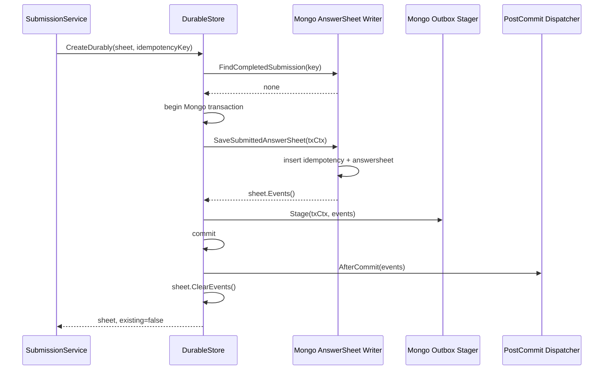

# 关键路径：答卷可靠落库与出站

## 1. 本文回答

本文说明 AnswerSheet、业务幂等结果和 `answersheet.submitted` Outbox 如何在同一 Mongo 事务中提交，以及并发重试和 post-commit 唤醒如何处理。

## 2. 30 秒结论

Survey 的提交成功点不是“调用 Repository.Create 成功”，而是：

```text
idempotency record（可选）
  + AnswerSheet document
  + domain_event_outbox
在同一 Mongo transaction 成功提交
```

事务提交后再执行 post-commit dispatcher，推动 immediate outbox relay。MQ 发布或下游处理失败不会回滚 AnswerSheet；Outbox 负责重试。

## 3. 参与者

| 组件 | 责任 |
| --- | --- |
| `SubmissionDurableStore` | 应用层可靠提交抽象 |
| `transactionalSubmissionDurableStore` | 编排幂等检查、Mongo transaction、event staging 和 post-commit |
| `SubmissionDurableWriter` | 写 AnswerSheet 和幂等记录，返回待 stage 事件 |
| `EventStager` | 在同一 transaction context 写 Outbox |
| `PostCommitDispatcher` | commit 后通知 relay，不参与主事务 |
| Mongo Runner | 提供 `WithinTransaction` |

## 4. 正常流程



`answersheet.submitted` 的 EventSpec 使用 Mongo domain Outbox profile、`Immediate=true`、P0 priority。Outbox 是可靠出站事实，post-commit 只是加速 relay 的提示。

## 5. 幂等模型

请求可以携带 `idempotency_key`。Mongo 幂等集合建立唯一索引，并保存：

- idempotency key；
- writer/testee；
- questionnaire code/version；
- AnswerSheet ID；
- completed status 和时间。

处理顺序：

1. 事务前先查询 completed submission；命中则直接返回已有 AnswerSheet。
2. 未命中则尝试事务写入。
3. 并发请求可能在唯一索引处失败。
4. 事务失败后，DurableStore 最多等待约 2 秒轮询 completed result；若另一个请求已完成，则返回既有 AnswerSheet。

因此 Redis 锁不是提交幂等的事实源，Mongo 唯一约束和 AnswerSheet 关联才是最终保护。

## 6. 事务边界

`SaveSubmittedAnswerSheet` 在同一个 `txCtx` 中按顺序写：

1. idempotency document（有 key 时）；
2. AnswerSheet document；
3. 返回聚合事件给 EventStager；
4. EventStager 写 Mongo `domain_event_outbox`。

任一步返回错误，Mongo transaction 回滚。只有 commit 成功后才清空聚合事件。

## 7. Post-commit 与 Relay

`PostCommitDispatcher.AfterCommit` 在事务完成后调用。它可以：

- 记录 immediate outbox ready 信息；
- 唤醒或加速 relay；
- 记录提交后的观测数据。

它不是主事务的一部分。即使即时提示失败，Outbox 记录仍可由常规扫描 relay 发现。

## 8. 下游交付语义

[`configs/events.yaml`](../../../configs/events.yaml) 将 `answersheet.submitted` 配置为：

| 属性 | 值 |
| --- | --- |
| topic | `assessment-lifecycle` |
| delivery | `durable_outbox` |
| primary handler | `answersheet_submitted_handler` |
| settlement | handler error → NACK |
| primary idempotency | answer-sheet ID lease + ensure assessment |

此外 apiserver 还有 ModelCatalog hot-rank 投影消费者；它不改变 Survey 主事实。

## 9. 失败与恢复

| 场景 | 当前处理 |
| --- | --- |
| 事务内 AnswerSheet 写失败 | 整体回滚，不返回成功 |
| 事务内 Outbox stage 失败 | 整体回滚，不留下“有答卷无事件” |
| 并发幂等冲突 | 等待并读取获胜请求的 completed result |
| post-commit 失败 | 主事实已提交，依赖常规 Outbox relay 恢复 |
| MQ 发布失败 | Outbox relay 重试 |
| worker handler 失败 | 消息 NACK，后续重投 |

## 10. 代码事实源与 Verify

| 内容 | 路径 |
| --- | --- |
| 应用事务编排 | [`transactional_durable_store.go`](../../../internal/apiserver/application/survey/answersheet/transactional_durable_store.go) |
| Mongo durable writer | [`infra/mongo/answersheet/durable_submit.go`](../../../internal/apiserver/infra/mongo/answersheet/durable_submit.go) |
| Outbox profile 装配 | [`container/modules/survey/assemble.go`](../../../internal/apiserver/container/modules/survey/assemble.go) |
| EventSpec | [`internal/pkg/eventcatalog/spec.go`](../../../internal/pkg/eventcatalog/spec.go) |

```bash
go test ./internal/apiserver/application/survey/answersheet -run Transactional
go test ./internal/apiserver/infra/mongo/answersheet/...
go test ./internal/pkg/eventcatalog
```
