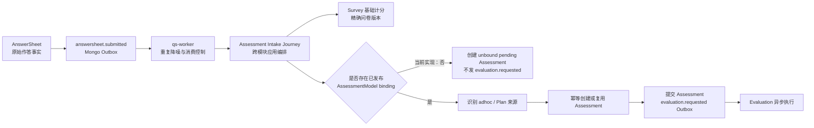

# 关键链路：从作答事实到测评执行

> 状态：主体已实现；“独立问卷在 Survey 结束、不创建 Assessment”和“显式记录基础计分状态”仍是规划改造。

## 1. 本文回答

本文从一份已经可靠受理的 AnswerSheet 出发，说明它如何经由 `answersheet.submitted`、Outbox relay、qs-worker 和 Assessment Intake Journey，完成基础题分派生、测评模型绑定解析、Plan 来源识别、Assessment 幂等创建，并在满足条件时发出 `evaluation.requested`。

本文重点回答六个问题：

1. HTTP 已经返回 `202 Accepted` 后，是什么机制保证后续处理不会只停留在内存里？
2. Worker 为什么可以重复消费同一事件，而不会重复创建测评？
3. Survey 的基础题分和 Evaluation 的因子、常模、结论计算怎样划界？
4. Questionnaire 与 AssessmentModel 的绑定在什么时候解析？
5. 一次性门诊测评和 Plan 周期测评怎样汇入同一执行入口？
6. 独立问卷与完整测评应该在什么位置分流？

上一篇 [答卷校验与可靠受理](./31-关键链路-答卷校验与可靠受理.md) 以 AnswerSheet 与 Outbox 共同提交为终点；本文从这个持久化事实继续展开。Evaluation 内部怎样执行模型、保存 Outcome 和驱动报告，不在本文重复，见 Evaluation 的 [答卷入站与测评请求](../30-evaluation/30-关键链路-答卷入站与测评请求.md) 与 [Worker 执行与报告驱动](../30-evaluation/31-关键链路-Worker执行与报告驱动.md)。

## 2. 30 秒结论



这条链路最重要的结论是：

1. **AnswerSheet 是已经成立的业务事实。** 后续计分、模型配置或 Evaluation 失败，不能撤销已经返回的 `202`。
2. **Worker 是正常创建与恢复 Assessment 的唯一入口。** collection-server 不同步创建 Assessment，也不等待 Evaluation。
3. **Redis lease 只降噪，不保证最终幂等。** Redis 不可用时链路降级放行，最终由 Journey 和 MySQL 唯一约束裁决。
4. **基础题分属于 Survey。** 它按 AnswerSheet 冻结的精确问卷版本计算，是可重建的延迟派生属性。
5. **模型绑定决定是否进入 Evaluation。** 只有 Questionnaire code/version 找到已发布 binding，Assessment 才会自动提交并产生 `evaluation.requested`。
6. **独立问卷的目标终点是 AnswerSheet。** 当前代码仍会创建 unbound pending Assessment，这是已确认的实现偏差，而不是目标业务语义。

## 3. 链路边界：可靠受理与测评执行不是一个事务

### 3.1 起点已经不可回滚

本文起点满足以下事实：

- AnswerSheet 已写入 MongoDB；
- Questionnaire code/version、填写人、受试者、org、TaskID 和原始答案已经冻结；
- `answersheet.submitted` 已写入同一 MongoDB transaction 内的 durable Outbox；
- 客户端已经取得 AnswerSheet ID；
- 相同业务提交的重试受幂等约束保护。

因此后续任何失败都只能表现为“测评尚未就绪”或“测评执行失败”，不能再告诉用户“答卷没有提交”。

### 3.2 本文终点

对绑定了测评模型的问卷，本文的成功终点是：

```text
Assessment 状态已经从 pending 进入 submitted
+ evaluation.requested 已进入 MySQL Outbox
```

从这里开始，Evaluation Worker 根据 Assessment 持久化状态执行具体测评模型。本文不把 Evaluation 的算法执行纳入 Survey，也不把跨模块 Journey 伪装成一个大聚合。

### 3.3 为什么不能做成一个跨库大事务

链路同时涉及：

- MongoDB 中的 AnswerSheet、Questionnaire snapshot 和 Survey Outbox；
- MySQL 中的 Plan Task、Assessment 和 Evaluation Outbox；
- Redis 中的 lease、报告状态和缓存投影；
- MQ 中的异步消息。

项目没有使用 MongoDB 与 MySQL 的分布式事务。它通过两个本地可靠边界连接链路：

| 本地事务 | 原子保护的事实 | 事务后允许发生什么 |
| --- | --- | --- |
| Survey Mongo transaction | AnswerSheet + `answersheet.submitted` Outbox | relay 重试、Worker 重放 |
| Evaluation MySQL transaction | Assessment 状态变更 + `evaluation.requested` Outbox | Evaluation Worker 重试执行 |

两个事务之间通过可重放的 `EnsureAssessment` 收敛，而不是要求一次调用恰好只执行一次。

## 4. 第一阶段：Outbox 把持久化事实交给 Worker

### 4.1 事件契约

`configs/events.yaml` 将 `answersheet.submitted` 定义为：

| 属性 | 值 | 含义 |
| --- | --- | --- |
| domain | `survey/answersheet` | 事件事实由 Survey 拥有 |
| aggregate | `AnswerSheet` | 事件描述一次 AnswerSheet 正式提交 |
| topic | `assessment-lifecycle` | 进入测评生命周期异步通道 |
| delivery | `durable_outbox` | 不能只做内存发布或 best-effort 通知 |
| handler | `answersheet_submitted_handler` | qs-worker 的处理入口 |

事件携带 AnswerSheet ID、Questionnaire code/version、testee、filler、org、TaskID、request ID 和提交时间等路由上下文。它不是 AnswerSheet 的完整副本，也不是 Evaluation 的执行快照；后续业务仍以持久化对象和精确身份为事实源。

### 4.2 Outbox 解决的不是“消息绝不重复”

Outbox 解决的是：

> AnswerSheet 已经提交，但推动后续处理的事件不会因为进程崩溃或 MQ 短暂不可用而永久消失。

它不承诺端到端 exactly-once。relay 重发、MQ redelivery、Worker 超时后的再次投递都可能让同一 AnswerSheet 被处理多次。因此下游必须可重入，不能依赖“消息只来一次”。

## 5. 第二阶段：Worker 负责消费控制，不拥有业务规则

### 5.1 事件入口

`handleAnswerSheetSubmitted` 的职责很窄：

1. 解析事件 envelope 和 `AnswerSheetSubmittedData`；
2. 校验 AnswerSheet ID 可以转换为有效 uint64；
3. 把 request ID 写入 internal gRPC metadata；
4. 通过 AnswerSheet ID 级 duplicate suppression gate 执行处理；
5. 调用 apiserver `EnsureAssessment`；
6. 根据结果返回成功或错误，由通用消息运行时 ACK/NACK。

Worker 不计算题分，不解析模型 binding，不创建 Evaluation 领域对象，也不决定 Plan 来源。这些规则仍由 apiserver 内的 Survey、ModelCatalog、Plan、Evaluation 和 Journey 拥有。

### 5.2 Redis lease 的真实语义

Worker 尝试以 AnswerSheet ID 获取 Redis lease：

| lease 结果 | Worker 行为 | 设计意图 |
| --- | --- | --- |
| 获取成功 | 执行 `EnsureAssessment`，结束后释放 | 降低同一答卷并发重放 |
| 未获取到 | 视为另一消费者正在处理，当前消息跳过并成功返回 | 避免重复并行工作 |
| Redis 不可用 | degraded-open，继续执行 Journey | 缓存/锁故障不能阻断可靠事件 |
| 获取 lease 报错 | degraded-open，继续执行 Journey | 正确性不能依赖 Redis |

这里选择 degraded-open 的前提是：数据库和应用服务已经有最终幂等约束。如果没有后面的唯一约束，Redis 故障时直接放行会制造重复 Assessment。

### 5.3 ACK、NACK 与恢复

通用消息运行时的主要语义是：

- handler 成功：ACK；
- handler 返回错误：NACK，由消息系统的重投机制继续处理；
- 事件解码失败：按无效消息失败路径处理，不进入业务 Journey。

`answersheet.submitted` 的恢复基础不是“在 Worker 内写一个无限循环”，而是：持久 Outbox 保留发布意图、MQ 提供重投、Journey 可重入。具体 transport attempt、dead-letter 与治理策略属于 Event 基础设施文档。

## 6. 第三阶段：internal gRPC 进入跨模块 Journey

Worker 调用 `AssessmentIntakeService.EnsureAssessment`，请求包含：

- AnswerSheet ID；
- Questionnaire code/version；
- testee ID；
- filler ID；
- org ID；
- 可选 TaskID；
- 无 TaskID 时的 `adhoc` 来源提示。

gRPC service 只负责 transport 参数、org 上下文、日志和错误翻译，真正的编排在 `application/journey/assessmentintake.Service.Ensure`。

Journey 存在的原因是这条链路需要协调多个模块，但没有任何一个领域模块应该吞并其它模块：

| 模块 | 在 Journey 中提供的能力 |
| --- | --- |
| Survey | 按精确问卷版本计算并保存基础题分 |
| ModelCatalog | 解析 Questionnaire 与 AssessmentModel 的发布 binding |
| Plan | 识别 Task/Plan 来源，并在成功后 best-effort 完成 Task |
| Evaluation | 幂等创建、查询和提交 Assessment |
| report-status projection | 写入 queued 状态，供客户端观察 |

Journey 是应用层流程编排，不是新的领域聚合，也不是 Survey、ModelCatalog、Plan 与 Evaluation 之间的共享领域模型。

## 7. 第四阶段：Survey 派生基础题分

### 7.1 为什么计分先于模型绑定

`Ensure` 当前首先调用 `AnswerSheetScoringService.CalculateAndSave`，然后才解析模型 binding。这表达了一个清晰边界：

> 单题基础分由问卷题目自身的答案和值转换决定；即使问卷没有绑定测评模型，Survey 仍然能够派生基础题分。

它不包括：

- 跨题聚合；
- 因子分计算；
- 常模转换；
- 风险等级和结论；
- Interpretation 报告。

这些属于 Evaluation 或 Interpretation。

### 7.2 精确版本回读

计分服务不会读取“当前最新问卷”，而是：

1. 按 AnswerSheet ID 读取已提交答卷；
2. 从 AnswerSheet 的 `QuestionnaireRef` 取得 code/version；
3. 通过 `FindByCodeVersion` 读取精确 published snapshot；
4. 将 Answer 与同版本 Question/Option 对齐；
5. 计算各题 score、max score 和 total score；
6. 调用 `UpdateScores` 覆盖 AnswerSheet 的派生分数并保存。

因此运营发布新版本不能改变历史 AnswerSheet 的基础题分语义。

### 7.3 重放语义

基础计分发生在“查询既有 Assessment”之前，所以每次 Worker 重放都会再次计算并写回分数。当前计算基于不可变原始答案和精确问卷版本，结果应保持确定；重复执行用于恢复“答卷已受理、但上次还没完成计分”的中间状态。

这不是一个显式的 scoring state machine。AnswerSheet 当前没有 `scoring_status`、`scored_at` 或派生规则版本，也不能区分“还未计分的 0”和“真实得分为 0”。这是当前可观测性与状态表达上的不足。

### 7.4 当前题分装配边界

当前 scoring task assembler 向 `AnswerScorer` 提供原始 AnswerValue 和 option score 映射。若题目没有被精确版本索引到，该 Answer 不会形成计分任务；正常提交契约和精确版本冻结应当使这种不一致不会发生。

> **当前不足。** 通用题目 `CalculationRule` 当前没有进入这条 scoring task 装配链路。文档不能把所有题级转换都描述成已经被异步基础计分实现；新增反向题或其它题级计算规则时，需要先核对其究竟编码在 option score 中，还是需要扩展 scoring task 契约。

计分任一步失败，Journey 立即返回错误，Assessment 不会在本次调用中创建；Worker 随后 NACK，等待事件重放。

## 8. 第五阶段：解析已发布测评模型 Binding

### 8.1 Binding 的键

Journey 使用：

```text
Questionnaire code + Questionnaire version
```

调用 `ResolveAssessmentBinding`。解析的是这份 AnswerSheet 对应精确问卷版本的发布 binding，而不是仅按问卷 code 猜测当前模型。

Binding 命中后，Journey 把以下模型身份放入 Evaluation `CreateCommand`：

- kind；
- subKind；
- algorithm；
- model code/version/title。

legacy kind 会先归一为当前 canonical kind/subKind/algorithm。Evaluation 创建有模型引用的 Assessment 时，还会通过 `EvaluationModelValidator` 重新验证模型与 QuestionnaireRef 是否可执行。

### 8.2 Binding 不是 AnswerSheet 的一部分

AnswerSheet 固化的是 QuestionnaireRef，而不是 AssessmentModel 的完整快照。这意味着 `202` 事务与模型 binding 解析之间存在异步时间窗口。

项目当前通过“发布版本的 Questionnaire 与 Model 共同构成独立测评发布版本”来约束正常测评入口；Plan 和门诊入口只保存编码，用户实际开始任务或扫码时选择最新发布版本。历史执行仍依赖 AnswerSheet 已冻结的精确 Questionnaire code/version。

如果 binding 查询本身报错，Journey 失败并等待重放；如果明确查不到 binding，则进入独立问卷分支。

## 9. 第六阶段：识别一次性测评与 Plan 测评

Journey 在 binding 解析后匹配 Plan：

1. 事件带 TaskID 时，优先按 TaskID、org、testee、模型编码和问卷编码解析任务上下文；
2. 没有 TaskID、但存在模型 binding 时，可以按 org、testee 和模型编码匹配 opened task；
3. 匹配成功后，将 Evaluation origin 改为 `plan`，OriginID 记录 Plan ID；
4. 未匹配时保持 `adhoc`，用于门诊二维码、医生临时发起等一次性测评。

这使两种入口共享后续 Evaluation：

```text
门诊扫码 / 医生临时发起 -> adhoc Assessment
Plan 生成 Task 后提交      -> plan Assessment
```

Plan Task 完成发生在 Assessment 创建或复用之后，并采用 best-effort：Plan 更新失败不会回滚已经建立的 Assessment。这个选择说明 Task 生命周期记录不是 Assessment 成立的强一致前提，但失败仍需要日志、状态巡检或后续补偿。

## 10. 第七阶段：Assessment 幂等创建与恢复

### 10.1 先查再建

Journey 先调用 `FindByAnswerSheetID`：

- 已存在 Assessment：复用它；
- 已存在且为 bound + pending：再次尝试 `SubmitForEvaluation`；
- 已存在且已经 submitted 或进入终态：不重复提交；
- 不存在：调用 `CreateForAnswerSheet`。

这使 Worker 重放不仅能处理“完全没创建”的情况，也能恢复“Assessment 已经创建，但上次自动提交失败”的部分完成状态。

### 10.2 数据库最终约束

MySQL Assessment persistence 在 `answer_sheet_id` 上建立唯一索引 `uk_answer_sheet_id`。并发消费者都在前置查询中看不到记录时，仍然只有一个创建能成功：

```text
消费者 A：Find -> not found -> Create 成功
消费者 B：Find -> not found -> Create duplicate
消费者 B：按 AnswerSheet ID 重读 -> 复用 A 创建的 Assessment
```

因此：

- Redis lease 是性能与并发保护；
- Journey 的 find/create/re-read 是应用层可重入协议；
- MySQL unique index 是最终正确性事实。

### 10.3 创建与提交为什么分成两步

`CreateForAnswerSheet` 只建立 pending Assessment。`SubmitForEvaluation` 再执行：

1. 读取 Assessment；
2. 执行领域状态转换 `pending -> submitted`；
3. 产生 `evaluation.requested`；
4. 在 MySQL transaction 中保存 Assessment 并 stage Outbox；
5. commit 后触发 post-commit dispatch 和列表缓存失效。

分成两步后，系统可以明确识别和恢复“Assessment 已创建、尚未成功提交”的状态，而不需要通过是否存在一条模糊记录来猜测。

自动提交失败会从 Journey 返回错误，Worker NACK；下一次重放看到既有 pending Assessment 后再次提交。成功之后，重复事件看到非 pending 状态，不再产生第二个 `evaluation.requested`。

## 11. 关键分流：独立问卷与完整测评

### 11.1 已确认的目标语义

Questionnaire 可以独立发布，作为信息收集器使用。此时业务链路应当是：

```text
AnswerSheet 可靠受理
  -> Survey 基础题分派生（如果题目定义了基础分）
  -> 结束
```

它不应该因为缺少 AssessmentModel binding 而提交失败，也不应该创建 Assessment。客户端也不应该对独立问卷轮询 `assessment-readiness`；AnswerSheet 成功就是该业务的终态。

绑定了已发布 AssessmentModel 的问卷才进入：

```text
AnswerSheet
  -> Assessment
  -> evaluation.requested
  -> Evaluation Outcome
  -> Interpretation Report
```

### 11.2 当前实现偏差

当前 `assessmentintake.Service.Ensure` 在 binding 缺失时仍然执行 `CreateForAnswerSheet`，得到一个没有 ModelRef、不会自动提交的 pending Assessment。测试 `TestEnsureUnboundAnswerSheetCreatesWithoutAutoSubmit` 固化了这一现状。

| 场景 | 当前实现 | 目标语义 |
| --- | --- | --- |
| 有 binding | 创建/复用 Assessment，并自动提交 | 保持 |
| 无 binding | 创建 unbound pending Assessment | 基础计分后结束，不创建 Assessment |
| 客户端 readiness | 无 binding 也可能得到 ready + Assessment ID | 独立问卷不进入 readiness |

后续改造不能只删除一行 `CreateForAnswerSheet`，还需要同步：

- Journey Result 对“无需 Assessment”的表达；
- Worker 将“独立问卷正常结束”识别为成功；
- internal gRPC response 契约；
- collection-system 是否只对测评型提交轮询 readiness；
- 当前固化旧行为的测试；
- 监控中 pending 是“尚未处理”还是“无需测评”的区分。

## 12. 客户端怎样观察异步就绪

`202` 只返回 AnswerSheet ID。对于已知是完整测评的提交，客户端轮询：

```text
GET /api/v1/answersheets/{answersheet_id}/assessment-readiness?testee_id=...
```

collection-server 会：

1. 读取 AnswerSheet 并确认其受试者；
2. 通过 ProfileLink 确认当前 writer 有权访问该 testee；
3. 按 AnswerSheet ID 查询 Assessment；
4. 未找到时返回 `pending`，建议 2000ms 后再轮询；
5. 找到且身份一致时返回 `ready + assessment_id`；
6. 记录 submit-to-assessment-ready 时延。

`ready` 只表示 Assessment 已经建立，不表示 Evaluation 或 Interpretation 已完成。报告仍需使用 report-status、事件订阅或报告查询接口继续观察。

## 13. 失败、重放与补偿矩阵

| 失败位置 | 已经成立的事实 | 当前处理 | 重放后的收敛点 |
| --- | --- | --- | --- |
| Outbox 暂未发布到 MQ | AnswerSheet + Outbox | relay 后续扫描重试 | Worker 最终收到事件 |
| Worker Redis 不可用 | AnswerSheet + Outbox | degraded-open | 数据库幂等保护执行 |
| Worker 同时收到重复事件 | AnswerSheet + Outbox | lease 降噪；必要时并发执行 | unique index 收敛为一个 Assessment |
| 基础计分失败 | AnswerSheet | handler 返回错误、消息 NACK | 重算并覆盖派生分数 |
| Binding 查询暂时失败 | AnswerSheet，基础分可能已写入 | handler 返回错误、消息 NACK | 重新解析 binding |
| Assessment 创建前失败 | AnswerSheet | readiness 保持 pending | 再次创建 |
| 并发创建 duplicate | 一个 Assessment 已由其它消费者创建 | duplicate 后重读 | 复用胜出记录 |
| Assessment 已创建、自动提交失败 | pending Assessment | handler 返回错误、消息 NACK | 复用 pending 并再次提交 |
| `evaluation.requested` 已提交、ACK 丢失 | submitted Assessment + Evaluation Outbox | 事件可能再次到达 | 非 pending，不重复提交 |
| Plan Task 完成失败 | Assessment 已创建或复用 | best-effort，不回滚 | 依赖 Plan 补偿或人工治理 |
| report-status 写失败 | Assessment 已创建 | 不改变 Evaluation 事实 | 查询持久化状态或后续投影恢复 |

这张表体现了链路的核心恢复原则：**可重放的是应用动作，不可撤销的是已经提交的业务事实。**

## 14. 设计取舍

### 14.1 为什么不让 collection-server 直接创建 Assessment

如果 HTTP 链路同步创建 Assessment：

- `202` 会重新混入 ModelCatalog、Plan、MySQL 和 Evaluation 的耗时；
- Assessment 创建失败会让已经可以可靠保存的 AnswerSheet 被误报为提交失败；
- 突发流量会同时压向 Survey 写入和 Evaluation 执行；
- 客户端超时重试会放大跨模块调用。

当前设计让 collection-server 只等待最小可靠受理边界，把后续恢复责任放在 durable event 与可重入 Journey。

### 14.2 为什么 Worker 不直接实现所有步骤

把基础计分、binding、Plan 和 Assessment 逻辑写进 Worker handler，会让部署进程成为业务规则拥有者，并导致同一规则难以在测试、运维恢复和其它入口复用。当前 Worker 只拥有异步消费与执行控制，核心业务规则仍由模块应用服务提供。

### 14.3 为什么不追求 exactly-once 消息

跨 Outbox、MQ、Worker、gRPC 和两个数据库实现严格 exactly-once 成本很高，也无法消除网络结果未知。项目选择更现实的组合：

```text
at-least-once delivery
+ deterministic replay
+ application idempotency
+ database uniqueness
+ observable intermediate state
```

它接受重复动作，但拒绝重复业务结果。

## 15. 当前不足与后续代码改造边界

### 15.1 独立问卷仍创建 Assessment

这是当前最明确的业务语义偏差。目标是 binding 缺失时基础计分后成功结束，而不是创建一个永远 pending 的 Evaluation 对象。

### 15.2 基础计分缺少显式状态

当前只能看到 score 值，不能直接判断计分是否完成、何时完成、基于哪一版题级计算规则完成。增加状态时需要保证它仍是 AnswerSheet 的派生元数据，不污染原始答案事实。

### 15.3 基础计分重放每次都会写 MongoDB

这种实现简单且可恢复，但会产生重复计算和写入。只有在压测证明它成为瓶颈后，才值得引入 scoring status/CAS；不能为了少一次写入而牺牲失败恢复。

### 15.4 题级 CalculationRule 尚未进入当前装配链路

新增反向题或更复杂题级转换时，需要先扩展 `AnswerScoreTask` 或装配器，并用精确问卷版本的回归测试证明历史语义稳定。

### 15.5 gRPC 错误分类较粗

`EnsureAssessment` 当前把多数 Journey 错误统一翻译为 gRPC Internal。Worker 可以据此失败重投，但运维侧不易区分配置错误、暂时依赖错误和不可重试数据错误。具体错误分类和 retry governance 应在 Event 基础设施文档中设计，不能由 Survey 文档擅自承诺已经实现。

## 16. 排查路径与可观测性

当客户端长期停在 assessment pending 时，按以下顺序排查：

1. 用 AnswerSheet ID 确认 AnswerSheet 与 `answersheet.submitted` Outbox 是否已持久化；
2. 检查 Outbox relay 是否已发布事件；
3. 按 event ID、request ID、AnswerSheet ID 检查 Worker 接收、lease 模式和 ACK/NACK；
4. 查看基础计分日志，确认精确 Questionnaire code/version 可以读取；
5. 查看 binding 解析日志中的 `bound`、model kind/code/version；
6. 按 AnswerSheet ID 查询 Assessment，区分“不存在”“pending”“submitted”；
7. 若为 pending 且有 binding，检查自动提交错误和 `evaluation.requested` Outbox；
8. 若 Assessment 已 submitted，则转入 Evaluation Worker 和报告链路排查。

关键关联字段包括：

- `request_id`：关联最初 HTTP、Outbox payload、Worker 和 internal gRPC；
- `event_id`：定位某次事件投递与消费；
- `answersheet_id`：贯穿 Survey、Worker、Journey 和 Assessment 唯一关联；
- `assessment_id`：进入 Evaluation 后的业务实例身份；
- `questionnaire_code/version`：定位精确作答与计分契约；
- `org_id/testee_id/task_id`：定位组织、患者和 Plan 来源。

## 17. 事实源与验证

| 环节 | 事实源 |
| --- | --- |
| 事件目录 | [`configs/events.yaml`](../../../configs/events.yaml) |
| AnswerSheet Worker | [`internal/worker/handlers/answersheet_handler.go`](../../../internal/worker/handlers/answersheet_handler.go) |
| 消息 ACK/NACK | [`internal/worker/integration/messaging/runtime.go`](../../../internal/worker/integration/messaging/runtime.go) |
| Assessment Intake gRPC | [`internal/apiserver/transport/grpc/service/assessment_intake.go`](../../../internal/apiserver/transport/grpc/service/assessment_intake.go) |
| 跨模块 Journey | [`internal/apiserver/application/journey/assessmentintake/service.go`](../../../internal/apiserver/application/journey/assessmentintake/service.go) |
| Survey 基础计分 | [`internal/apiserver/application/survey/answersheet/scoring_app_service.go`](../../../internal/apiserver/application/survey/answersheet/scoring_app_service.go) |
| 计分任务装配 | [`internal/apiserver/application/survey/answersheet/scoring_task_assembler.go`](../../../internal/apiserver/application/survey/answersheet/scoring_task_assembler.go) |
| Evaluation intake | [`internal/apiserver/application/evaluation/intake/service.go`](../../../internal/apiserver/application/evaluation/intake/service.go) |
| Assessment 唯一约束 | [`internal/apiserver/infra/mysql/evaluation/po.go`](../../../internal/apiserver/infra/mysql/evaluation/po.go) |
| readiness 查询 | [`internal/collection-server/application/answersheet/submission_service.go`](../../../internal/collection-server/application/answersheet/submission_service.go) |

```bash
go test ./internal/worker/handlers
go test ./internal/worker/integration/messaging
go test ./internal/apiserver/application/survey/answersheet
go test ./internal/apiserver/application/journey/assessmentintake
go test ./internal/apiserver/application/evaluation/intake
go test ./internal/apiserver/infra/mysql/evaluation
go test ./internal/collection-server/application/answersheet
make docs-hygiene
make docs-facts
```
