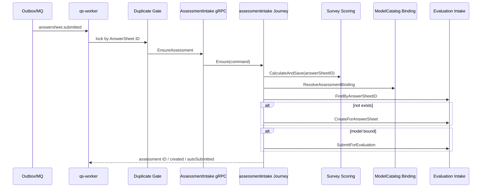

# 关键路径：答卷计分与测评交接

## 1. 本文回答

本文从 `answersheet.submitted` 开始，说明 worker 如何抑制重复处理，并通过 assessment intake 完成答卷基础计分、模型绑定、Plan 匹配、Assessment 创建和可选自动提交。

这是一条跨模块 journey；Survey 只拥有 AnswerSheet 与基础计分能力，不拥有 Assessment 状态机。

## 2. 总体流程



## 3. Worker 重复抑制

`answersheet_submitted_handler`：

1. 解析事件 envelope 和 payload。
2. 校验 AnswerSheet ID。
3. 使用 AnswerSheet ID 获取 Redis lease。
4. 获得 lease 后调用 AssessmentIntakeClient。
5. handler 返回错误时由 MQ settlement 执行 NACK。

Redis 不可用或 acquire 失败时，gate 选择 degraded-open，继续执行。正确性最终依赖 assessment intake 按 AnswerSheet ID 幂等，而不是依赖锁永远可用。

## 4. Survey 基础计分

`application/journey/assessmentintake.Service.Ensure` 首先调用 `AnswerSheetScoringService.CalculateAndSave`：

1. 按 AnswerSheet ID 加载答卷。
2. 按答卷冻结的 questionnaire code/version 加载精确问卷快照。
3. 将 Answer 和题目 Option score 转换为 `AnswerScoreTask`。
4. 调用 `ruleengine.AnswerScorer`。
5. 生成 `ScoredAnswerSheet`。
6. 调用聚合 `UpdateScores` 并更新 Mongo AnswerSheet。

计分失败是硬失败：journey 不继续创建 Assessment，worker handler 返回错误并等待消息重试。

## 5. ModelCatalog 绑定

journey 使用 questionnaire code/version 解析 Assessment binding：

- 找到 binding 时，将 model kind/sub-kind/algorithm/code/version/title 写入 Evaluation create command；
- legacy kind 通过 canonical mapping 归一化；
- 未找到 binding 时仍可创建未绑定 Assessment，但不会自动提交执行。

Survey 不读取或解释 DefinitionV2；它只提供 questionnaire version 和已计分 AnswerSheet。

## 6. Plan 匹配

存在 task ID 时按 task 精确匹配；没有 task ID 但有 model code 时尝试匹配 opened task。匹配成功后：

- Assessment origin 变为 `plan`；
- 创建或复用 Assessment 后 best-effort 完成任务；
- Plan 完成失败不回滚已经创建的 Assessment。

## 7. Assessment 幂等与自动提交

journey 先调用 `FindByAnswerSheetID`：

- 已存在：返回既有 Assessment ID，不重复创建；
- 不存在：`CreateForAnswerSheet`；
- 创建遇到 duplicate：再次查询并返回既有记录。

仅当解析到 ModelCatalog binding 时，journey 调用 `SubmitForEvaluation`。提交失败当前不会让 Ensure 整体失败，返回结果中的 `AutoSubmitted` 保持 false；后续恢复属于 Evaluation 责任。

## 8. 成功边界

| 阶段 | 成功含义 |
| --- | --- |
| Survey submit | AnswerSheet + Outbox 已提交 |
| Worker handler | Assessment 已创建或已存在；可能已自动提交 |
| Evaluation requested | Evaluation 获得异步执行请求 |
| Outcome committed | 评分结果已可靠提交，等待 Interpretation |
| Report generated | 最终报告已生成 |

禁止把任何前一阶段的成功描述为后一阶段已经完成。

## 9. 其它消费者

`answersheet.submitted` 还配置了 ModelCatalog hot-rank projection 消费者，用于模型热度读侧投影。该消费者与 primary worker 独立结算，不参与 Assessment 创建事务。

## 10. 代码事实源与 Verify

| 环节 | 路径 |
| --- | --- |
| Worker handler | [`internal/worker/handlers/answersheet_handler.go`](../../../internal/worker/handlers/answersheet_handler.go) |
| gRPC intake | [`transport/grpc/service/assessment_intake.go`](../../../internal/apiserver/transport/grpc/service/assessment_intake.go) |
| 跨模块 journey | [`application/journey/assessmentintake/service.go`](../../../internal/apiserver/application/journey/assessmentintake/service.go) |
| Survey scoring | [`application/survey/answersheet/scoring_app_service.go`](../../../internal/apiserver/application/survey/answersheet/scoring_app_service.go) |
| 跨模块表征测试 | [`characterization/pipeline_cross_module_answersheet_v1_test.go`](../../../internal/apiserver/characterization/pipeline_cross_module_answersheet_v1_test.go) |

```bash
go test ./internal/worker/handlers -run AnswerSheetSubmitted
go test ./internal/apiserver/application/journey/assessmentintake
go test ./internal/apiserver/characterization -run CrossModuleAnswerSheet
```
