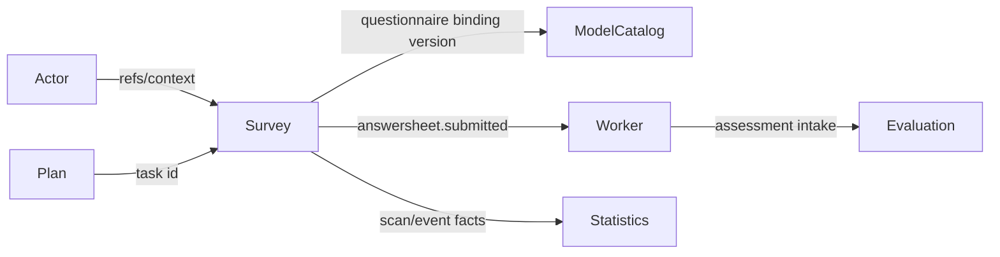

# Survey 模块边界与协作

## 1. 结论

Survey 拥有问卷结构和答卷提交事实。跨模块只通过引用、Port、事件或 journey 协作；`domain/survey` 和 `application/survey` 不应直接编排 Evaluation 或 Interpretation。

## 2. 对象所有权

| 对象 / 规则 | 所有者 | Survey 如何使用 |
| --- | --- | --- |
| Questionnaire、Question、SubmissionSpec | Survey | 主写事实 |
| AnswerSheet、Answer、SubmissionContext | Survey | 主写事实 |
| Testee、Filler、Operator | Actor | 保存最小引用，不复制 Actor 聚合 |
| AssessmentModel、Definition、Binding | ModelCatalog | 发布医学量表问卷时同步 binding version；intake 时按问卷引用解析 binding |
| Assessment、EvaluationRun、Outcome | Evaluation | 通过跨模块 journey 创建，不进入 Survey 聚合 |
| Report、InterpretationRun | Interpretation | 不由 Survey 读取或写入 |
| AssessmentTask、Plan | Plan | SubmissionContext 只保存 task ID；journey 负责匹配和完成 |
| Journey / Statistics read model | Statistics | 从扫描或事件投影，不反写 Survey 主事实 |

## 3. 允许的协作方向



### 3.1 Actor → Survey

Transport 或上游用例解析 filler、testee 和 org scope；Survey 将它们冻结为 SubmissionContext。Survey 不查询或修改 IAM 主身份。

### 3.2 Survey → ModelCatalog

只有两个窄边界：

- 医学量表 Questionnaire 发布后同步 binding version；
- assessment intake 按 questionnaire code/version 解析模型 binding。

Questionnaire 不是模型资产，Survey 不能写 Definition 或决定 evaluator。

### 3.3 Survey → Evaluation

可靠事件只声明 AnswerSheet 已提交。worker 调用 `AssessmentIntakeService`，由 `application/journey/assessmentintake` 编排 Survey scoring、ModelCatalog、Plan 和 Evaluation。

这条跨模块编排不能放回 `application/survey`；架构测试禁止 survey 直接依赖 evaluation/interpretation。

### 3.4 Survey → Statistics

Statistics 可以扫描 AnswerSheet 或消费行为事实建立读模型。统计延迟、缓存和重建不影响 AnswerSheet 的提交成功。

## 4. 一致性边界

| 边界 | 一致性 |
| --- | --- |
| AnswerSheet + Outbox | 同一 Mongo transaction |
| Questionnaire head + published snapshot + active version | 顺序持久化步骤，当前非单个应用事务 |
| Questionnaire → ModelCatalog binding sync | 同步调用，但不与 Mongo 发布步骤构成跨模块事务 |
| AnswerSheet → Assessment | durable event + 幂等 Ensure，最终一致 |
| AnswerSheet → Statistics | 事件或扫描投影，最终一致 |
| AnswerSheet → Plan completion | intake 中 best-effort |

## 5. 禁止方向

- `domain/survey` import application、infra、transport、worker。
- `application/survey` import evaluation 或 interpretation 具体服务。
- Survey Repository 写 Assessment、Report、Plan 或 Statistics 表。
- Worker 直接操作 Survey/Evaluation 数据库；应调用内部 gRPC/application contract。
- 接口层重复实现 SubmissionSpec、题型或 required 规则。
- 用 Redis lock、缓存或信令替代 Mongo 主事实和业务幂等。

## 6. 兼容边界

- `NewAnswerSheet` 只为旧调用保留；新提交使用 `Submit`。
- `ReconstructSubmissionContext` 允许历史字段缺失；新提交必须使用 `NewSubmissionContext`。
- QuestionnaireType `MedicalScale` 是历史/业务分类，不恢复独立 Scale 聚合。
- 版本格式兼容历史值，不应在外围强制成另一套 SemVer。

## 7. Verify

```bash
go test ./internal/apiserver/application -run ForbiddenCrossModuleImports
go test ./internal/apiserver/container/modules/survey/...
go test ./internal/apiserver/characterization -run CrossModuleAnswerSheet
```
