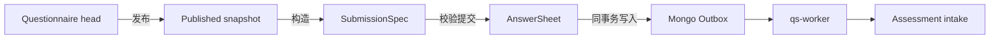

# Survey 模块

> 状态：已实现。本文是 Survey 的阅读入口，只维护模块定位、文档地图和事实源，不复制各专题正文。

## 1. 30 秒结论

Survey 是 qs-server 的作答事实层，由两个聚合组成：

```text
Questionnaire
  定义“问什么”：题目、选项、校验、显示条件、版本和发布快照

AnswerSheet
  记录“答了什么”：问卷版本引用、提交上下文、答案和提交事件
```

Survey 保证提交事实可校验、可追溯并可靠送入后续测评链路；它不拥有 Assessment、模型规则、解释报告或统计读模型。

## 2. 模块边界

| Survey 负责 | Survey 不负责 |
| --- | --- |
| 问卷 head、发布快照和 active version | Assessment Model 的 Definition、Binding 和 Published Snapshot |
| 题型、选项、提交校验和显示条件 | 评估机制、因子计算、常模和结论规则 |
| AnswerSheet、AnswerValue 和提交上下文 | Assessment / EvaluationRun / Outcome |
| 答卷持久化、业务幂等和 `answersheet.submitted` 出站 | 报告生成、解释策略和最终展示 |
| 问卷变更事件和缓存失效信令 | Plan 任务生命周期与 Statistics 聚合 |

最重要的反例：

- `Questionnaire` 不是 `AssessmentModel`。
- `Questionnaire` 发布不等于测评模型发布。
- `AnswerSheet` 不是评估结果；提交成功也不等于评估或报告完成。
- 题目选项分值是基础答卷计分输入，不是模型执行与解释规则的全部事实源。
- `questionnaire.changed`、缓存失效信令和 `answersheet.submitted` 分别属于不同可靠性等级，不能互相替代。

## 3. 文档地图

| 顺序 | 文档 | 回答的问题 |
| --- | --- | --- |
| 10 | [领域模型：Questionnaire](./10-领域模型-Questionnaire.md) | 问卷、题目、版本、head/发布快照如何建模 |
| 11 | [领域模型：AnswerSheet](./11-领域模型-AnswerSheet.md) | 提交上下文、答案值和答卷事实如何建模 |
| 20 | [领域服务与策略](./20-领域服务与策略.md) | 哪些规则属于领域服务，哪些属于应用编排 |
| 30 | [关键路径：问卷创建编辑与发布](./30-关键路径-问卷创建编辑与发布.md) | 从管理接口到发布快照、绑定同步和事件的完整路径 |
| 31 | [关键路径：答卷提交与校验](./31-关键路径-答卷提交与校验.md) | 从提交请求到构造 AnswerSheet 的完整校验路径 |
| 32 | [关键路径：答卷可靠落库与出站](./32-关键路径-答卷可靠落库与出站.md) | 幂等、Mongo 事务、Outbox 和 post-commit 如何协作 |
| 33 | [关键路径：答卷计分与测评交接](./33-关键路径-答卷计分与测评交接.md) | worker 如何把答卷交给跨模块 assessment intake |
| 80 | [模块边界与协作](./80-模块边界与协作.md) | Survey 与 Actor、ModelCatalog、Evaluation、Plan、Statistics 的边界 |
| 90 | [分层架构与代码索引](./90-分层架构与代码索引.md) | domain/application/infra/transport/container 从哪里进入 |

推荐按表中顺序阅读。修改具体能力时，可直接进入对应关键路径和代码索引。

## 4. 核心主链路



这条链路的成功边界分三段：

1. 问卷发布成功：head、发布快照和 active version 已更新。
2. 答卷提交成功：AnswerSheet 与 `answersheet.submitted` Outbox 已可靠落库。
3. 后续测评成功：worker 调用 assessment intake 后创建或复用 Assessment；该阶段不属于 Survey 提交事务。

## 5. 当前事实源

| 事实 | 源码 / 契约 |
| --- | --- |
| 模块装配 | [`internal/apiserver/container/modules/survey`](../../../internal/apiserver/container/modules/survey/) |
| Questionnaire 聚合 | [`internal/apiserver/domain/survey/questionnaire`](../../../internal/apiserver/domain/survey/questionnaire/) |
| AnswerSheet 聚合 | [`internal/apiserver/domain/survey/answersheet`](../../../internal/apiserver/domain/survey/answersheet/) |
| 应用用例 | [`internal/apiserver/application/survey`](../../../internal/apiserver/application/survey/) |
| Mongo 持久化 | [`internal/apiserver/infra/mongo/questionnaire`](../../../internal/apiserver/infra/mongo/questionnaire/)、[`internal/apiserver/infra/mongo/answersheet`](../../../internal/apiserver/infra/mongo/answersheet/) |
| REST / gRPC | [`internal/apiserver/transport/rest/routes_survey.go`](../../../internal/apiserver/transport/rest/routes_survey.go)、[`api/grpc/proto`](../../../api/grpc/proto/) |
| 事件可靠性 | [`configs/events.yaml`](../../../configs/events.yaml)、[`internal/pkg/eventcatalog/spec.go`](../../../internal/pkg/eventcatalog/spec.go) |

## 6. Verify

```bash
go test ./internal/apiserver/domain/survey/...
go test ./internal/apiserver/application/survey/...
go test ./internal/apiserver/container/modules/survey/...
make docs-hygiene
```
