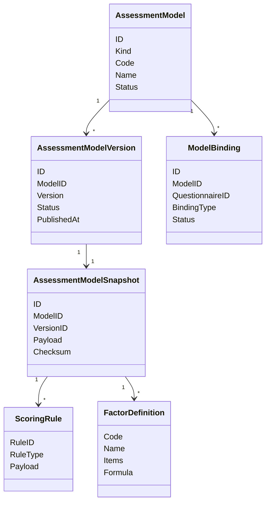

# Assessment Model 领域模型

## 1. 模块核心概念

Assessment Model 表达“可执行、可发布、可追溯的测评模型资产”。它不是问卷，也不是一次测评执行。

---

## 2. 领域模型图

---

## 3. 聚合根与实体

| 类型 | 对象 | 说明 |
| ---- | ---- | ---- |
| 聚合根 | `AssessmentModel` | 管理模型资产身份、状态和发布 |
| 实体 | `AssessmentModelVersion` | 模型版本 |
| 实体 | `AssessmentModelSnapshot` | 发布后冻结的执行快照 |
| 实体 | `ModelBinding` | 模型与问卷、执行或解释能力的绑定 |

---

## 4. 值对象

| 值对象 | 说明 |
| ------ | ---- |
| `AssessmentKind` | 医学量表、人格模型等分类 |
| `ModelPayload` | 模型规则资产内容 |
| `EvaluatorKey` | 执行器识别所需键 |
| `SnapshotChecksum` | 快照追溯和一致性校验 |

---

## 5. 领域服务

| 服务 | 职责 |
| ---- | ---- |
| 模型完整性校验 | 发布前检查 Kind、Payload、规则和绑定 |
| 快照发布 | 把可变配置冻结成发布态快照 |
| 模型绑定 | 维护问卷、执行器、解释资产关系 |
| 兼容适配 | 将旧 `scale/personalitymodel` 能力收口到统一模型资产层 |

---

## 6. 领域事件

| 事件 | 语义 |
| ---- | ---- |
| `scale.changed` | 历史事件名保留，当前语义是量表类模型资产变化 |

当前通用模型发布事件尚未完全统一，文档不假装存在未实现事件。

---

## 7. 模型边界与反例

| 反例 | 说明 |
| ---- | ---- |
| `AssessmentModel` 不是 `Questionnaire` | 模型管规则资产，问卷管采集结构 |
| `AssessmentModelSnapshot` 不是草稿配置 | Snapshot 是发布冻结结果 |
| `Scale` 不是平台核心轴 | Scale 是一种模型资产 |
| `AssessmentModel` 不是 `Evaluation` | 前者是资产，后者是一次执行 |
