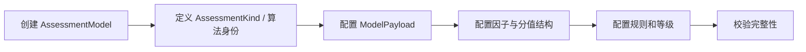

# 测评模型创建链路

## 1. 业务目标

创建一套可维护、可发布、可由 Evaluation 执行的测评模型资产。

---

## 2. 参与对象

| 对象 | 角色 |
| ---- | ---- |
| `AssessmentModel` | 模型资产聚合 |
| `AssessmentKind` | 模型类型 |
| `ModelPayload` | 规则资产内容 |
| `FactorDefinition` | 因子定义 |
| `ScoringRule` | 计分规则 |

---

## 3. 前置条件

- 明确模型类型和执行算法。
- 明确模型是否绑定问卷。
- 明确模型结果是否需要解释模型或报告模板。

---

## 4. 流程图

---

## 5. 关键规则

- 模型创建只形成草稿资产，不代表可执行。
- 规则 payload 必须能被执行器识别。
- 医学量表、MBTI、BigFive 等都应作为模型资产类型治理。
- 旧 Scale 能力进入本层，不再作为独立核心模块。

---

## 6. 幂等与异常处理

| 场景 | 处理 |
| ---- | ---- |
| 模型编码重复 | 拒绝或进入更新路径 |
| Kind 不受支持 | 拒绝发布，避免执行期失败 |
| Payload 不完整 | 保持草稿，不允许发布 |

---

## 7. 产出结果

- 草稿态 `AssessmentModel`。
- 可校验的模型 payload。
- 后续发布快照的输入。
