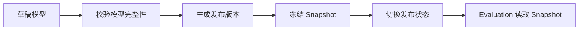

# 模型发布与快照链路

## 1. 业务目标

把可变模型配置冻结为执行期可追溯的 `AssessmentModelSnapshot`。

---

## 2. 参与对象

| 对象 | 角色 |
| ---- | ---- |
| `AssessmentModel` | 模型资产 |
| `AssessmentModelVersion` | 发布版本 |
| `AssessmentModelSnapshot` | 执行快照 |
| `SnapshotChecksum` | 快照一致性标识 |

---

## 3. 前置条件

- 草稿模型已完成完整性校验。
- Payload、因子、规则和绑定达到发布要求。
- 发布者有维护模型资产的权限。

---

## 4. 流程图

---

## 5. 关键规则

- Evaluation 执行必须引用快照，不直接读取可变草稿。
- 历史报告必须能回溯到当时使用的模型身份和快照。
- 发布后的快照不应被静默改写。
- 新规则通过新版本发布，而不是修改旧快照。

---

## 6. 幂等与异常处理

| 场景 | 处理 |
| ---- | ---- |
| 重复发布同一内容 | 可复用 checksum 或拒绝重复版本 |
| 发布校验失败 | 停留草稿 |
| 执行期快照缺失 | Evaluation 记录失败，不由 Survey 补救 |

---

## 7. 产出结果

- 发布态模型版本。
- 冻结的 `AssessmentModelSnapshot`。
- 可被 Evaluation 和报告层引用的模型身份。
