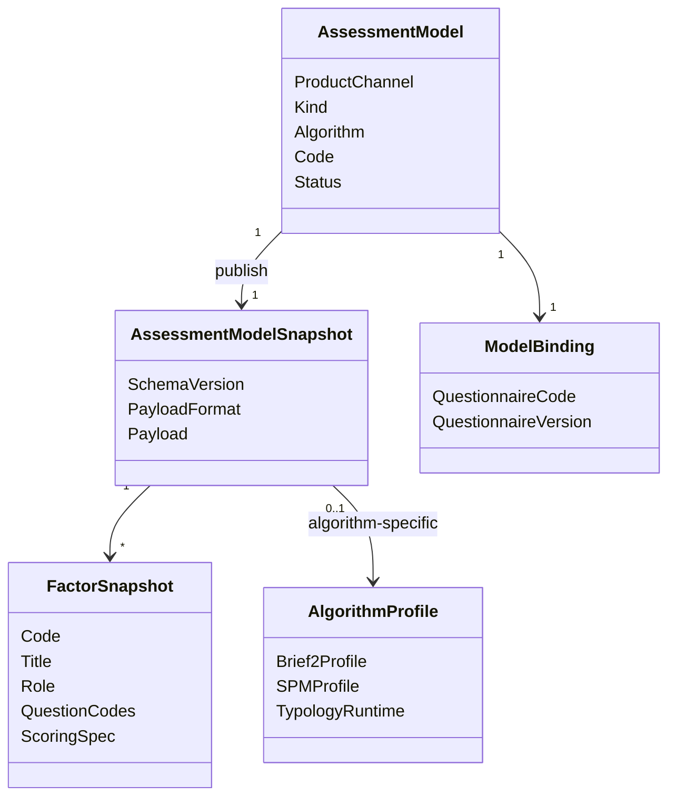

# Assessment Model 领域模型

## 1. 模块核心概念

Assessment Model 表达“可执行、可发布、可追溯的测评模型资产”。它不是问卷，也不是一次测评执行。

模型资产由两层正交结构组成：

- **身份层**：`ProductChannel`（产品分类）、`Kind`/`Algorithm`（模型族与具体算法）、派生 `AlgorithmFamily`（执行算法族）。
- **结构层**：`Factor`（通用维度构件），描述题目归属、计分与规则引用。

详见 [08-Factor通用构件.md](./08-Factor通用构件.md)。

---

## 2. 领域模型图

说明：图中 `FactorSnapshot` 为**目标抽象**；当前代码在 `scale/snapshot`、`behavioral_rating/snapshot`、`cognitive/snapshot` 各有同构定义，尚未收敛到 `modelcatalog/factor` 包。

---

## 3. 聚合根与实体

| 类型 | 对象 | 说明 |
| ---- | ---- | ---- |
| 聚合根 | `AssessmentModel` | 管理模型资产身份、状态和发布 |
| 实体 | `AssessmentModelSnapshot` | 发布后冻结的执行快照（含 payload 中的 Factor 列表） |
| 实体 | `ModelBinding` | 模型与问卷的绑定 |

---

## 4. 值对象

| 值对象 | 说明 |
| ------ | ---- |
| `ProductChannel` | 产品分类：`medical_scale`、`personality`、`behavior_ability`、`cognitive` 等 |
| `AlgorithmFamily` | 执行算法族（派生，只读）。枚举：`factor_scoring` 等；包名：`scoring` 等 — [对照表](../mechanism-oriented-migration.md#包名与-algorithmfamily-对照表) |
| `Kind` / `Algorithm` | 模型族与具体算法（兼容字段，短期保留） |
| `FactorSnapshot` | 发布态维度定义；服务多算法族的通用构件 |
| `ModelPayload` | 模型规则资产内容（JSON payload） |
| `PayloadFormat` | 发布态 payload 版本标识 |
| `EvaluatorKey` | 执行器识别所需键 |

---

## 5. 领域服务

| 服务 | 职责 |
| ---- | ---- |
| 模型完整性校验 | 发布前检查 Kind、Payload、Factor 与绑定 |
| 快照发布 | 把可变配置冻结成发布态快照 |
| 模型绑定 | 维护问卷、执行器、解释资产关系 |
| Factor 投影 | 将 behavioral_rating / cognitive 快照投影为 scale 执行视图（`ToScaleSnapshot`，待收敛到 shared factor） |
| 兼容适配 | 将旧 `scale/typologymodel` 能力收口到统一模型资产层 |

---

## 6. 领域事件

| 事件 | 语义 |
| ---- | ---- |
| `scale.changed` | 历史事件名保留，当前语义是量表类模型资产变化 |

当前通用模型发布事件尚未完全统一，文档不假装存在未实现事件。

---

## 7. 模型边界与反例

| 反例 | 说明 |
| ---- | ---- |
| `AssessmentModel` 不是 `Questionnaire` | 模型管规则资产，问卷管采集结构 |
| `AssessmentModelSnapshot` 不是草稿配置 | Snapshot 是发布冻结结果 |
| `Factor` 不是 `scale` 私有概念 | Factor 是 ModelCatalog 通用构件；scale 是早期主链路 |
| `Factor` 不是 `DimensionResult` | Factor 在 catalog 快照；Dimension 在 Evaluation 输出 |
| `Scale` 不是平台核心轴 | Scale 是一种模型资产族 |
| `AssessmentModel` 不是 `Evaluation` | 前者是资产，后者是一次执行 |
