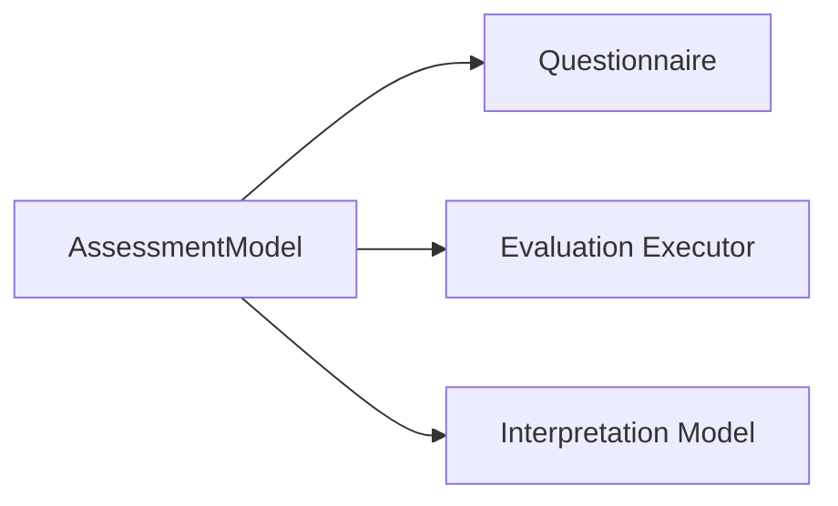

# 模型绑定与适配机制

## 1. 业务目标

建立模型资产与问卷、执行器、解释模型之间的明确关系，让同一问卷或同一模型可以在受控规则下复用。

---

## 2. 绑定类型

| 绑定 | 含义 |
| ---- | ---- |
| 模型绑定问卷 | 指定某份问卷提交后可使用哪个模型执行 |
| 模型绑定执行器 | 指定 Kind / 算法身份到执行能力 |
| 模型绑定解释模型 | 指定执行结果如何进入报告层解释 |
| 多问卷复用模型 | 不同问卷版本可复用同一模型资产 |

---

## 3. 流程图

---

## 4. 关键规则

- 绑定是模型资产治理的一部分，不是答卷事实。
- 一个问卷切换模型版本必须可追溯。
- 执行器适配应基于模型身份和快照，不基于旧目录名。
- 报告适配应读取模型身份和 EvaluationResult，不修改模型资产。

---

## 5. 旧能力兼容

| 旧能力 | 现行解释 |
| ------ | -------- |
| `scale` | 医学量表类模型资产或 legacy register name |
| `typologymodel` | 人格模型资产或 legacy register name |
| Scale 查询入口 | 应逐步收口到 Assessment Model 的发布模型读侧 |
